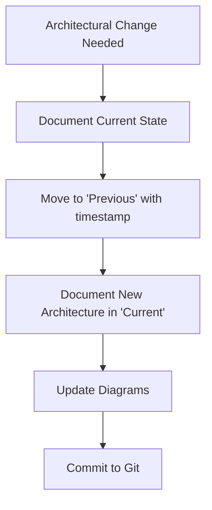

# Architecture Documentation Workflow
Architecture and Technical Analysis Protocol

## Purpose
Maintain living architecture documentation aligned with **Project Constitution** principles, with clear history of decisions.

## File Structure
- `/docs/ARCHITECTURE.md` - Single source of truth for architectural decisions
  - **Current Architecture and Analysis** - Active state
  - **Previous Architecture and Analysis** - Historical decisions (chronological)

## Workflow Steps

### 1. When Making Architectural Changes



### 2. Documentation Template

```markdown
## [Architecture Topic Name]
**Status**: 🟢 Current | 🟡 Superseded | 🔴 Deprecated
**Date**: YYYY-MM-DD HH:MM
**Author**: [Who made decision]
**Related Issues**: #123, #456

### Problem Statement
[What problem this solves]

### Decision
[What was decided]

### Rationale
[Why this decision was made]
**Principle Alignment**: [Which Constitution Principle this supports, e.g. User-Centric Quality]

### Diagrams
[Mermaid diagrams, data flow, etc.]

### Consequences
- ✅ Benefits
- ⚠️ Trade-offs
- 🔴 Risks

### Implementation Status
- [ ] Design approved
- [ ] Implementation started
- [ ] Testing complete
- [ ] Deployed
```

### 3. Moving to Previous

When updating architecture:

1. Copy entire section from `Current` to `Previous`
2. Add timestamp: `**Superseded**: YYYY-MM-DD HH:MM`
3. Add link to new version: `**See**: [New Architecture](#new-topic-name)`
4. Keep original content intact (no deletion)

### 4. Maintenance Triggers

Update `ARCHITECTURE.md` when:
- ✅ New architectural pattern adopted
- ✅ Data flow changes
- ✅ Store/State management changes
- ✅ API integration decisions
- ✅ Performance optimizations affecting structure
- ✅ Security/auth changes

**DO NOT** update for:
- ❌ Bug fixes (unless they change architecture)
- ❌ UI-only changes
- ❌ Minor refactorings

## Integration with Existing Workflows

### With Debugging Workflow
When debugging reveals architectural issues:
1. Log in `debug_log.md`
2. If fix requires arch change → Update ARCHITECTURE.md
3. Reference arch section in debug log

### With Implementation Planning
1. Check `ARCHITECTURE.md` → Current state
2. Propose changes in `implementation_plan.md`
3. After approval → Update ARCHITECTURE.md
4. Archive `implementation_plan.md` or mark as completed (historically preserved in task context)

### With Task Management
Mark in `task.md`:
```markdown
- [x] Architecture decision documented in ARCHITECTURE.md
```

## Commit Message Convention

```
docs(arch): [brief description]

- Moved [old topic] to Previous (superseded YYYY-MM-DD)
- Added [new topic] to Current
- Related: #issue-number
```

## Example Timeline

```
2025-11-29 17:00 - Store State Management
  ↓
2025-11-28 04:00 - Sprint 5 Persistence (Repository Pattern)
  ↓
2025-11-25 - Routing Decision (History API)
  ↓
2025-11-20 - Caching Strategy (L1/L2)
```

## Review Cycle

- **Weekly**: Review Current section for accuracy
- **Sprint End**: Move implemented items to Previous if superseded
- **Major Release**: Archive old Previous items (>6 months) to separate file
