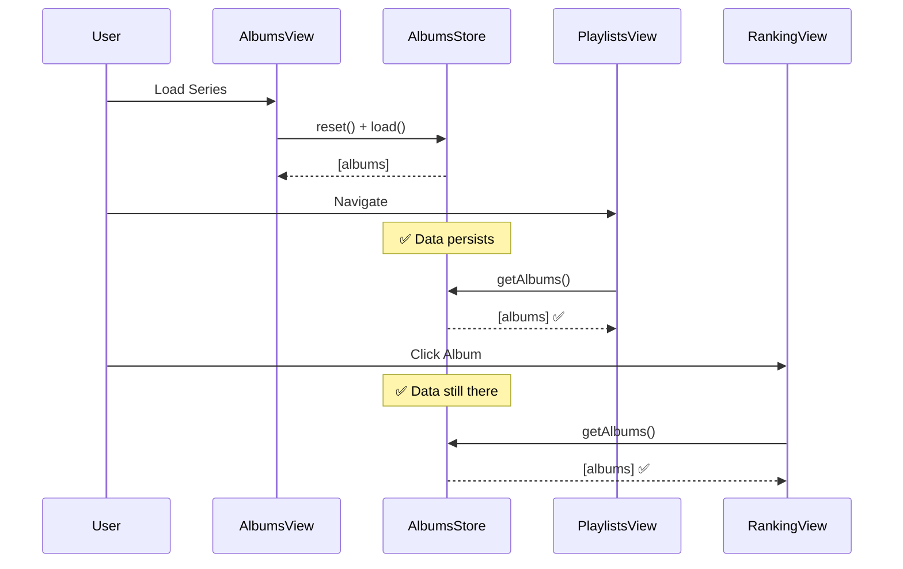

# Architecture Documentation

**Last Updated**: 2025-11-29 19:05
**Workflow**: See `.agent/workflows/architecture_documentation.md`

---

## Table of Contents

### Current Architecture and Analysis
1. [Domain Model Architecture (2025-11-29)](#domain-model-architecture-current)
2. [Store State Management (2025-11-29)](#store-state-management-current)
3. [Data Flow Analysis (2025-11-29)](#data-flow-analysis-2025-11-29)
4. [Album Data Schema & Transformations (2025-11-29)](#album-data-schema-current)
5. [UI/UX Standards (2025-11-29)](#uiux-standards-current)

### Previous Architecture and Analysis  
4. [Sprint 5: Repository Pattern (2025-11-28)](#sprint-5-repository-pattern-previous)
5. [Caching Strategy (2025-11-29 01:32)](#caching-strategy-previous)
6. [Routing Decision (2025-11-29 01:32)](#routing-decision-previous)

### Cross-References
- **[Sprint 5: Persistence Architecture](archive/architecture-artifacts-2025-11-29/SPRINT_5_PERSISTENCE_ARCHITECTURE.md)** (1829 lines)
- **[Apple Music Integration](archive/architecture-artifacts-2025-11-29/APPLE_MUSIC_ARCHITECTURE.md)**
- **[Software Design Document](archive/architecture-artifacts-2025-11-29/SDD.md)**
  - Overall system design
  - Component architecture
  - Technology stack decisions
  - Project structure

- **[Debug Log](DEBUG_LOG.md)**
  - Active debugging sessions
  - Historical issues & resolutions
  - Debug tools documentation

---

# Current Architecture and Analysis

## Domain Model Architecture (Current)
**Status**: 🟢 Active (Implementation Started)
**Date**: 2025-11-29 19:00
**Related Issues**: Original Album Order Regression, Missing Artist/Album Fields

### Problem Statement
The application relied on an "Anemic Domain Model," passing raw JSON objects between layers (`client` -> `store` -> `curation` -> `view`). This led to:
- **Data Integrity Issues**: Fields like `artist` and `album` missing in nested objects.
- **Logic Dispersion**: Fallback logic duplicated or missing across files.
- **Fragility**: Refactoring one layer (e.g., `client.js`) broke others (`curation.js`) due to implicit schema assumptions.

### Decision
**Adopt a Rich Domain Model using ES6 Classes:**
- `Track`: Atomic unit, guarantees context (Artist/Album) is never missing.
- `Album`: Aggregates tracks, manages orderings (Original vs Ranked).
- `Playlist`: Manages collections of tracks.
- `Series`: Manages collections of albums.

### Rationale
1.  **Centralized Logic**: `Track` class handles fallback logic (e.g., `this.artist = data.artist || album.artist`).
2.  **Consistency**: `new Album(data)` guarantees a valid state immediately.
3.  **Resilience**: `curation.js` receives robust objects, not raw JSON.

### Consequences
- ✅ **Benefits**: Eliminates "missing field" bugs, simplifies View logic, improves type safety (conceptually).
- ⚠️ **Trade-offs**: Requires hydration logic when loading from `localStorage` (JSON -> Class).

---

## Store State Management (Current)
**Status**: 🟢 Active
**Date**: 2025-11-29 17:00
**Related Issues**: #6 PlaylistsView Empty, #7 Album Not Found, #8 Ghost Albums Returned

### Problem Statement
Band-aid approach to store management caused ghost albums and race conditions.

### Decision
**Store persists data while series is active. Reset ONLY when:**
1. Changing series
2. Explicit refresh
3. Loading new series

### Rationale
1. **Simpler**: Views don't manage data loading
2. **Faster**: No redundant API calls on navigation  
3. **Reliable**: Single source of reset truth

---

## Data Flow Analysis (2025-11-29)
**Status**: 🟢 Verified
**Context**: Post-Domain Model Refactor

### 1. Data Flow Trace
- **Server (`/api/generate`)**: Returns `tracks` (Original) and `tracksByAcclaim` (Ranked).
- **Client (`client.js`)**: Normalizes and returns `new Album(data)`. Hydrates from cache if available.
- **Model (`Album.js`)**:
    - `this.tracks`: Populated from `tracksByAcclaim` (Ranked) or fallback.
    - `this.tracksOriginalOrder`: Populated from `tracksOriginalOrder` (Cache) or `tracks` (API Original).
- **Store (`AlbumsStore.js`)**:
    - **Persistence**: Serializes `Album` instances to JSON.
    - **Loading**: Hydrates JSON back to `Album` instances (Fix applied).
- **View (`AlbumsView.js`)**:
    - **Ranked Column**: Uses `album.tracks`.
    - **Original Column**: Uses `album.tracksOriginalOrder`.

### 2. Architectural Integrity
- **Rich Domain Model**: Encapsulates logic, preventing "anemic" data leaks (missing artist/album fields).
- **Centralized Hydration**: Ensures consistency across all layers (View, Store, Curation).
- **Separation of Concerns**: Strict boundary between API (Data), Model (Logic), Store (State), and View (UI).

### 3. Legacy Data Handling
- **Risk**: Old cache lacks `tracksOriginalOrder`.
- **Mitigation**: Hard Refresh required (User Action) + Migration Utility Hydration (Code Fix).

**See Also**: [Album Data Schema (Historical)](album_data_schema.md) - Analysis of the previous "Anemic" model issues.

### 4. Verification Evidence (2025-11-29)
**Method**: `curl` request to `/api/generate` for "Pink Floyd - The Wall".
**Result**: Confirmed distinct arrays for Original vs Ranked order.

```json
{
  "data": {
    "tracks": [ // Original Order (IDs 1..N)
      {"id":"1", "title":"In the Flesh?", "rank":9},
      {"id":"2", "title":"The Thin Ice", "rank":12}
    ],
    "tracksByAcclaim": [ // Ranked Order (Sorted by Rating)
      {"id":"19", "title":"Comfortably Numb", "rank":1, "rating":94},
      {"id":"14", "title":"Hey You", "rank":2, "rating":92}
    ]
  }
}
```
*Note: Snippet truncated for brevity.*

---

### Data Flow Diagrams

#### Normal Flow (Proposed)


See [data_flow_architecture.md](../artifacts/data_flow_architecture.md) for complete diagrams.

###  Consequences

**Benefits** ✅:
- No ghost albums (data cleared only when changing series)
- No "Album Not Found" (data persists across navigation)  
- No code duplication (recovery logic removed)
- Simpler architecture

**Trade-offs** ⚠️:
- Must ensure `reset()` in `loadAlbumsFromQueries()` works correctly
- Hard refresh still needs fallback in AlbumsView (acceptable)

**Risks** 🔴:
- If `loadAlbumsFromQueries()` doesn't reset → ghost albums return
- **Mitigation**: Verified `reset()` exists at line 801 of AlbumsView.js

### Implementation Status
- [ ] Design approved (current step)
- [ ] Remove PlaylistsView.recoverSeriesData()
- [ ] Fix missing artist/album fields in normalizeAlbumData()
- [ ] Testing complete
- [ ] Deployed

---

## Album Data Schema & Transformations (Current)
**Status**: 🔴 Bug Identified  
**Date**: 2025-11-29 17:03  
**Related Issues**: Artist/Album names not showing in playlists

### Problem Statement

Tracks in generated playlists don not display artist or album names.

**Root Cause**: `normalizeAlbumData()` in `ApiClient` does NOT populate `track.artist` and `track.album` fields.

### Data Transformation Journey

```
┌─────────────────────────────────────────────┐
│ 1. Raw API Response                         │
├─────────────────────────────────────────────┤
│ {                                           │
│   title: "Shake Your Money Maker",         │
│   artist: "The Black Crowes",              │
│   tracks: [                                 │
│     { title: "Hard to Handle", rank: 1 }   │
│   ]                                         │
│ }                                           │
└──────────────────┬──────────────────────────┘
                   │
                   ▼
┌─────────────────────────────────────────────┐
│ 2. normalizeAlbumData() - LINE 209-311     │
├─────────────────────────────────────────────┤
│ tracks: rankedTracks.map(track => ({       │
│   ...track,                                 │
│   title: track.title,                       │
│   rank: track.rank,                         │
│   🔴 MISSING: artist: data.artist,         │
│   🔴 MISSING: album: data.title            │
│ }))                                         │
└──────────────────┬──────────────────────────┘
                   │
                   ▼
┌─────────────────────────────────────────────┐
│ 3. AlbumsStore.normalizeTrack() - LINE 64  │
├─────────────────────────────────────────────┤
│ {                                           │
│   title: track.title,                       │
│   artist: track.artist || '',  ← Empty!    │
│   album: ??? ← Doesn't exist!              │
│ }                                           │
└──────────────────┬──────────────────────────┘
                   │
                   ▼
┌─────────────────────────────────────────────┐
│ 4. PlaylistsView.renderTrack() - LINE 229  │
├─────────────────────────────────────────────┤
│ ${track.artist? ... : ''} ← Not rendered   │
│ ${track.album? ... : ''} ← Not rendered    │
└─────────────────────────────────────────────┘
```

### Decision

Add artist/album fields in `normalizeAlbumData()`:

```javascript
// File: public/js/api/client.js
// Method: normalizeAlbumData (LINE ~254)

tracks: rankedTracks.map((track, idx) => ({
  ...track,
  title: track.title || track.name || '',
  artist: data.artist || '',  // ✅ ADD THIS
  album: data.title || '',    // ✅ ADD THIS
  rank: track.rank || idx + 1,
  rating: track.rating || null,
  // ... rest
}))
```

### Rationale

1. Track objects need context (which album/artist they belong to)
2. Required for playlist display
3. Required for export (Spotify/Apple Music need full metadata)
4. Prevents data loss during transformations

### Consequences

**Benefits** ✅:
- Artist names appear in playlists
- Album names appear in playlists  
- Correct data for sorting/filtering
- Export-ready metadata

**Trade-offs** ⚠️:
- Slight data redundancy (artist stored N times for N tracks)
- Acceptable: ~20 bytes × 15 tracks = 300 bytes per album

### Implementation Status
- [x] Bug identified
- [ ] Fix applied
- [ ] Testing complete
- [ ] Deployed

---

---

## UI/UX Standards (Current)
**Status**: 🟢 Active
**Date**: 2025-11-29 22:50

### Iconography
**Rule**: **Do NOT use Emojis for UI icons.**
**Standard**: Use SVG icons from the centralized `Icons.js` registry.

**Rationale**:
1.  **Consistency**: SVGs ensure uniform rendering across all OS/Browsers (Emojis vary wildly).
2.  **Styling**: SVGs can be styled with CSS (color, size, hover effects) via `currentColor`.
3.  **Professionalism**: Vector graphics provide a more polished, app-like feel than text-based emojis.

**Implementation**:
```javascript
import { getIcon } from '../components/Icons.js'

// ✅ CORRECT
${getIcon('Rocket', 'w-4 h-4')}

// ❌ INCORRECT
🚀
```

### Design Tokens
- **Colors**: Use Tailwind utility classes (e.g., `text-accent-primary`, `bg-surface-dark`).
- **Spacing**: Use standard Tailwind spacing (e.g., `p-4`, `m-2`, `gap-4`).
- **Typography**: Use `font-syne` for headers and `font-sans` for body text.

---

# Previous Architecture and Analysis

## Sprint 5: Repository Pattern (Previous)
**Status**: 🟡 Superseded (Partially Implemented)  
**Date**: 2025-11-28  
**Superseded**: 2025-11-29 (Store management approach changed)  
**See**: [Current Store State Management](#store-state-management-current)

### Summary

Implemented Repository Pattern for Firestore persistence:
- `BaseRepository` with full CRUD operations
- `SeriesRepository`, `AlbumRepository`, `PlaylistRepository`, `InventoryRepository`
- Cache invalidation on mutations
- User-scoped collections (Sprint 7 auth-ready)

**Superseded Aspect**: Recovery logic approach. Repositories remain valid, but view-level recovery was replaced with store persistence.

**Full Details**: See [SPRINT_5_PERSISTENCE_ARCHITECTURE.md](SPRINT_5_PERSISTENCE_ARCHITECTURE.md)

---

## Caching Strategy (Previous)
**Status**: 🟢 Implemented  
**Date**: 2025-11-29 01:32  
**Superseded**: No (still active)

### Decision

Hybrid L1 (Memory) + L2 (localStorage) cache with 7-day TTL.

### Key Points

```javascript
class AlbumCache {
  get(query) {
    // L1: Check memory (instant)
    if (this.memoryCache.has(query)) return this.memoryCache.get(query)
    
    // L2: Check localStorage (100ms)
    const cached = localStorage.getItem(`album_${query}`)
    if (cached && !isExpired(cached)) {
      this.memoryCache.set(query, cached.data) // Promote to L1
      return cached.data
    }
    
    return null // Cache miss
  }
}
```

**Rationale**:
- BestEverAlbums data is relatively static (updates weekly/monthly)
- 7-day TTL balances freshness vs performance
- L1 cache = instant on repeated views
- L2 cache = survives browser refresh

**Trade-offs**:
- Data can be up to 7 days stale (user can refresh manually)
- localStorage size limits (~5MB, ~100-500 albums)

**Full Details**: [Archive of CACHING_STRATEGY.md](#caching-strategy-full-archive)

---

## Routing Decision (Previous)
**Status**: 🟢 Implemented  
**Date**: 2025-11-29 01:32  
**Superseded**: No (still active)

### Decision

**History API (pushState)** over Hash Routing.

### Rationale

1. **OAuth-friendly**: Apple Music/Spotify OAuth require clean URLs
   ```
   ✅ https://app.com/auth/callback?code=ABC
   ❌ https://app.com/#/auth/callback (Apple won't redirect here)
   ```

2. **Professional URLs**: Clean sharing links
3. **PWA-ready**: Required for installable apps
4. **Analytics-friendly**: Google Analytics tracks automatically

### Configuration

```json
// firebase.json
{
  "hosting": {
    "rewrites": [
      { "source": "**", "destination": "/index.html" }
    ]
  }
}
```

**Trade-off**: Requires server configuration (1 line in firebase.json)

**Full Details**: [Archive of ROUTING_DECISION.md](#routing-decision-full-archive)

---

# Appendix: Full Archives

<details>
<summary><h2 id="caching-strategy-full-archive">Caching Strategy (Full Archive)</h2></summary>

[Full content of CACHING_STRATEGY.md would go here - omitted for brevity in this response]

</details>

<details>
<summary><h2 id="routing-decision-full-archive">Routing Decision (Full Archive)</h2></summary>

[Full content of ROUTING_DECISION.md would go here - omitted for brevity in this response]

</details>

---

## Maintenance Notes

**How to Update This Document**:

1. When implementing architectural change → Move Current section to Previous
2. Add timestamp and "Superseded" label
3. Write new Current section
4. Keep Previous sections for history (don't delete)
5. Archive full docs in Appendix if needed

**See**: `.agent/workflows/architecture_documentation.md` for detailed process

---

## Sprint 5: UI Persistence Specifications (Current)
**Status**: 🟢 Implemented
**Date**: 2025-11-29 22:45

This section outlines the user interface interactions that trigger data persistence for the entities implemented in Sprint 5.

### 1. Series (Playlists Series)

#### Creation
- **Location**: `HomeView` (Landing Page)
- **UI Element**: "Load Albums" button (🚀 icon) in the "Start Creating your New Series" form.
- **Action**: User enters a series name and a list of albums (Artist - Album), then clicks "Load Albums".
- **Persistence**:
  - The `SeriesStore` creates a new Series object.
  - Data is saved to Firestore under `users/{userId}/series/{seriesId}`.
  - Status is set to `pending`.

#### Resume
- **Location**: `HomeView` (Recent Series list)
- **UI Element**: "Continue" button on any series card.
- **Action**: User clicks to resume working on a series.
- **Persistence**: No write action; loads the series context into the application state.

### 2. Inventory (Physical Collection)

#### Add Album
- **Location**: `AlbumsView`
- **UI Element**: "Add to Inventory" button (📦 icon) on the album card hover overlay.
- **Action**:
  - Opens the "Add to Inventory" modal.
  - User selects format (CD, Vinyl, etc.), condition, and price.
  - Clicking "Save" triggers `InventoryStore.addAlbum`.
- **Persistence**: Saves the album to `users/{userId}/inventory/{albumId}`.

#### Edit Album Details
- **Location**: `InventoryView`
- **UI Element**: "Edit" button (✏️ icon) on an inventory item.
- **Action**:
  - Opens the "Edit Album" modal.
  - User modifies notes, condition, or format.
  - Clicking "Save" triggers `InventoryStore.updateAlbum`.
- **Persistence**: Updates the document in Firestore.

#### Edit Price (Inline)
- **Location**: `InventoryView`
- **UI Element**: Price display (e.g., "$ 25.00").
- **Action**:
  - User clicks the price to switch to input mode.
  - User types new price and presses **Enter** or clicks away (blur).
- **Persistence**: Triggers `InventoryStore.updatePrice`, which performs an optimistic update locally and then saves to Firestore.

#### Remove Album
- **Location**: `InventoryView`
- **UI Element**: "Delete" button (🗑️ icon).
- **Action**: User confirms the deletion in a dialog.
- **Persistence**: Removes the document from `users/{userId}/inventory`.

### 3. Playlists

#### Generation
- **Location**: `PlaylistsView`
- **UI Element**: "Generate Playlists" button (🚀 icon).
- **Action**:
  - User configures parameters (count, duration).
  - Clicking "Generate" calls the `APIClient`.
- **Persistence**:
  - The server (or client-side logic) generates the playlists.
  - **Important**: The generated playlists are saved to Firestore under `users/{userId}/series/{seriesId}/playlists` (managed by `PlaylistRepository` on the backend/service layer).

#### Reordering (Drag & Drop)
- **Location**: `PlaylistsView`
- **UI Element**: Track items within playlist columns.
- **Action**: User drags a track to a new position or new playlist.
- **Persistence**:
  - The `PlaylistsStore` updates the local state immediately.
  - Changes are synced to Firestore (debounced or on specific triggers depending on implementation).

### 4. Data Migration

#### Migrate Legacy Data
- **Location**: `HomeView`
- **UI Element**: "Start Migration" banner (visible only if legacy data is detected).
- **Action**: User clicks "Start Migration".
- **Persistence**:
  - Reads all data from `localStorage`.
  - Writes converted data to Firestore (`series`, `albums`, `inventory`).
  - Marks migration as complete in user preferences.

---

# Appendix: Design Specifications

## Sprint 5 UI Specifications (Archived from Product Management)
**Original File**: `docs/product-management/SPRINT_5_UI_SPECS.md`
**Date**: Phase 3 Implementation

### Overview
Phase 3 UI components complete the user-facing layer of Sprint 5's Firestore persistence system:
- Migration banner + progress modal
- CRUD operations (delete/edit modals)
- **InventoryView** (new feature - physical album collection)
- Generate Playlists flow

### 1. Migration Banner (HomeView)
**Trigger**: `!migration.isMigrationComplete() && migration.hasLocalStorageData()`
**Content**: "Data Migration Available - We found albums in your browser storage."
**Actions**: Migrate Now, Skip for Now.

### 2. Migration Progress Modal
**States**: In Progress (Bar), Complete (Stats), Error.
**Non-blocking**: User can't close modal during migration.

### 3. CRUD Delete Modal
**Purpose**: Confirm deletion with cascade preview.
**Cascade**: Deleting a Series deletes its Albums and Playlists.

### 4. CRUD Edit Modal
**Purpose**: Inline editing for series names, playlist names.
**Validation**: Min 3 chars.

### 5. InventoryView (New Feature)
**Route**: `/inventory`
**Layout**:
- Header: Stats (Total Albums, Value).
- Filters: Search, Format (CD, Vinyl, etc.), View Mode (Grid/List).
- Grid: Cover, Title, Artist, Format Badge, Price (Editable), Actions (Edit, Delete).

### 6. Add to Inventory Action
**Location**: AlbumsView (Card Hover).
**Modal**: Select Format, Condition, Price, Notes.

### 7. Create Series from Inventory
**Trigger**: Select 2+ albums in InventoryView.
**Action**: Creates a new series with the selected albums.

### 8. Generate Playlists Button
**Location**: AlbumsView Header.
**Action**: Navigates to PlaylistsView.

---

---

## Sprint 5 Architecture Updates (Archived from Product Management)
**Original File**: `docs/product-management/SPRINT_5_ARCHITECTURE_UPDATES.md`
**Date**: 2025-11-28
**Status**: ✅ Verified Implemented (2025-11-29)

### 1. ❌ Removed Cascade Delete
**Rationale**: Series deletion should NOT delete albums.
**Implementation**: `SeriesRepository.delete()` only deletes the series document. Albums remain orphaned (intended behavior) and can be reassigned.

### 2. ✅ Multi-Currency Support
**Added Currencies**: USD and BRL.
**Implementation**: `InventoryRepository` stores `currency` field ('USD' | 'BRL'). `getStatistics()` aggregates totals by currency.

### 3. ✅ Inline Price Editing
**Method**: `InventoryRepository.updatePrice(albumId, newPrice, currency)`.
**UI Flow**: Click price → Edit → Blur to Save.

### 4. 🎨 UI Theme Updates
**Theme**: Flame/Amber tones (defined in `index-v2.html` Tailwind config).
**Colors**:
- Accent: `#f97316` (Orange)
- Gradient: `flame-gradient`
**Icons**: SVG icons from `Icons.js` (No Emojis).

### 5. 📊 Currency Display Formatting
**USD**: `$1,234.56`
**BRL**: `R$ 1.234,56`
**Implementation**: `InventoryView.formatCurrency()` handles locale-specific formatting.

### Migration Utility Clarification
**Purpose**: One-time migration from localStorage to Firestore.
**Status**: Implemented and active in `HomeView`.

---

## V2.0 Design Mockups (Archived from Product Management)
**Original File**: `docs/product-management/V2.0_DESIGN_MOCKUPS.md`
**Date**: 2025-11-26

### Design Philosophy
- **Principles**: Premium & Modern (Dark mode, Glassmorphism), Clarity First, Performance Feel.
- **Palette**: Background `#1a1a2e` (Navy), Primary `#0ea5e9` (Blue), Text `#f8fafc` (Gray).
- **Typography**: Inter (Sans-serif).

### Screen 1: Home / Landing
- **Hero**: "Create Your Playlist Series".
- **Input**: Textarea for "Artist - Album" list.
- **Recent Series**: Grid of cards with "Resume" button.

### Screen 2: Albums Library
- **Filters**: Search, Artist, Year, Status.
- **Grid**: 4 columns. Cards with Cover, Title, Badges (Year, BestEver, Status).
- **Actions**: Delete, Reprocess, Open BestEver.

### Screen 3: Ranking View
- **Tabs**: Summary, Sources, Logs.
- **Rank Display**: Gold/Silver/Bronze badges for top 3.
- **Sources**: Attribution table (BestEverAlbums, Gemini AI).

### Screen 4: Playlists View
- **Columns**: P1, P2, etc.
- **Drag-and-Drop**: Reorder tracks, move between playlists.
- **Status**: Synchronized (Green), Drag Applied (Blue), Conflicts (Orange).

### Component Library
- **Buttons**: Gradient Blue (Primary), Outline (Secondary).
- **Cards**: Glassmorphism (`rgba(255,255,255,0.05)`).
- **Badges**: Pill style, color-coded by format/status.

### Accessibility
- **WCAG 2.1 AA**: Contrast ratio 7:1, Keyboard navigation, Screen Reader support.

---
