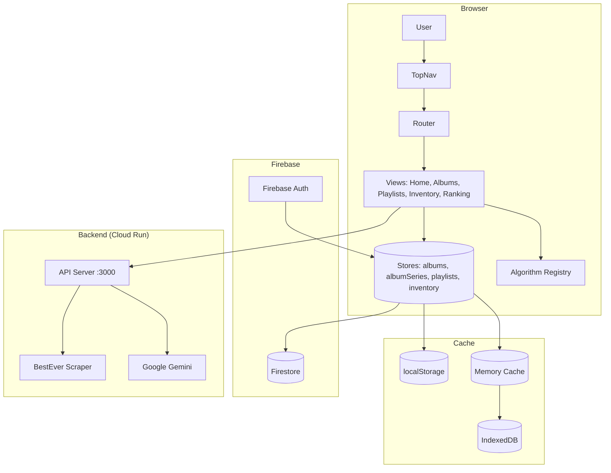

# Architecture Documentation

**Last Updated**: 2025-12-21 18:30
**Workflow**: See `.agent/workflows/architecture_protocol.md`

> **For project overview, features, and deployment info, see:**
> - [PROJECT_SUMMARY.md](product-management/PROJECT_SUMMARY.md)
> - [ROADMAP.md](product-management/ROADMAP.md)

---

## High-Level Architecture



---

## Table of Contents

1. [Core Domain Models (V3)](#core-domain-models)
2. [V3 Component Architecture](#v3-component-architecture-series-centric)
3. [Design Patterns & Core Strategies](#design-patterns--core-strategies)
4. [Router & View Lifecycle](#router--view-lifecycle)
5. [Domain Model Architecture](#domain-model-architecture)
6. [Store State Management](#store-state-management)
7. [UI/UX Standards](#uiux-standards)
8. [Firebase Integration Guide](#firebase-integration-guide)
9. [Caching & Performance](#caching--performance)
10. [Previous Architecture (V1/V2)](#v1v2-monolithic-view-pattern)

### Cross-References
- **[Debug Log](debug/DEBUG_LOG.md)**: Active debugging sessions and historical resolutions.
- **[Component Reference](technical/component_reference.md)**: Detailed API and file-level documentation.
- **[Data Flow Architecture](technical/data_flow_architecture.md)**: Sequence diagrams and technical lifecycle flows.

---

## Core Domain Models
**Principles**: Universal Series Model, Golden Pipeline
**Defined in**: `docs/CONSTITUTION.md`

### 1. Universal Series Model
All curation contexts are treated as a **Series**. This abstracts the difference between an Album, an Artist, or a Genre.
- **Entity**: The base unit (Album, Track, Artist).
- **Series**: A collection of entities treated as a unit for ranking/shuffling.
- **Naming**: `AlbumSeries`, `ArtistSeries`, `TrackSeries`.

### 2. The Golden Pipeline
The standard data flow for all curation actions:
`Input (Entity/Series)` -> `RankingContext (Config)` -> `Blending Menu (Algorithm)` -> `Standardized Output (Playlist)`

---

## [V3 Component Architecture (Series-Centric)]
**Status**: 🟢 Current
**Date**: 2025-12-21 17:15
**Author**: Antigravity (AI Assistant)
**Related Issues**: Sprint 12, #Refactor

### Problem Statement
The application relying on monolithic Views (`AlbumsView.js`) created a "God Class" problem: coupled logic, DOM manipulation, and state management in single files of 600+ lines. This violated the "Separation of Concerns" principle and made adding features like the "Blending Menu" risky.

### Decisions & Patterns (V3)
We adopted a **Responsive Component-Based Architecture** using Vanilla JS.

| Pattern | Role in V3 | Why we chose it |
| :--- | :--- | :--- |
| **Component-Based** | Visuals (`EntityCard`, `SeriesHeader`) | Encapsulates HTML/CSS generation and local event binding. Reusable across Views. |
| **MVC (Controller)** | Logic (`SeriesController`) | Decouples business logic (Filtering, Fetching) from the View. |
| **Observer** | State (`Stores`) | Allows components to react to data changes without prop-drilling. |
| **Repository** | Data (`AlbumRepository`) | Abstracts the data source (Firestore vs Local) from the Controller. |

### Rationale
**Principle Alignment**: **Clean Code & Modular Architecture** (Constitution II)
- **Modularity**: Components are "Lego blocks" (e.g., `SeriesDragDrop` can be attached to any grid).
- **Maintainability**: Logic changes in `SeriesController` don't break the UI in `SeriesView`.
- **Performance**: Virtual DOM is overkill; direct DOM manipulation within small Components is efficient.

### Component Hierarchy
```mermaid
graph TD
    App[App Entry] --> Router
    Router --> SeriesView["SeriesView (Orchestrator)"]

    subgraph "View Layer (Components)"
        SeriesView --> SeriesHeader[Series Header (Meta & Actions)]
        SeriesView --> SeriesFilterBar[Filter & Search Bar]
        SeriesView --> SeriesGrid[Series Grid (Responsive)]
        SeriesGrid --> EntityCard[Entity Card (Album/Artist)]
        SeriesView --> BlendingMenuView[Blending Menu (Overlay)]
    end

    subgraph "Logic Layer"
        SeriesView -.Events.-> SeriesController[Series Controller]
        SeriesController --> DataStores[Data Stores/Repositories]
    end
```

### Key Data Structures

#### RankingContext
The contract between the UI and the Curation Engine for the **Blending Menu**.

```json
{
  "style": "balanced_cascade",
  "targetDuration": 2700,
  "parameters": {
    "strictness": 0.8,
    "p1_count": 1,
    "deep_cut_ratio": 0.5
  },
  "scope": { "type": "series", "id": "series_123" },
  "sources": [
    { "id": "bea", "weight": 1.0 },
    { "id": "spotify", "weight": 0.8 }
  ]
}
```

### Consequences
- ✅ **Benefits**:
    - **Testability**: Logic can be unit-tested without a browser.
    - **Scalability**: New Views (Inventory, Playlists) are just assemblies of existing Components.
    - **Responsiveness**: CSS-driven layouts (Tailwind) handled in Components, not JS.
- ⚠️ **Trade-offs**:
    - **Complexity**: Requires strictly defined interfaces between layers (`props`, `callbacks`).
- 🔴 **Risks**:
    - **Migration Overhead**: Porting 100% of `AlbumsView` features (Drag&Drop, Context Menu) takes significant effort.

### Implementation Status
- [x] Design approved (Plan V3)
- [x] Infrastructure (Base Component, Controller)
- [x] Core Components (Grid, Card, Header, Filter)
- [ ] Logic Migration (Controller Implementation)
- [ ] Blending Menu Implementation

---

## Design Patterns & Core Strategies

The application is built on a modular architecture using standard design patterns to ensure scalability and maintainability.

### 1. Strategy Pattern
Used for interchangeable behaviors:
- **ViewMode Strategy**: Decouples rendering (Compact vs Expanded) from view logic.
- **Algorithm Strategy**: Pluggable playlist generation algorithms (Cascade, S-Draft, etc.).

### 2. Repository Pattern
Abstracts Firestore interactions. All data access is centralized in `*Repository` classes, ensuring consistent schema handling and CRUD operations.

### 3. Observer Pattern
The core of state management. Stores notify registered views of changes, allowing for a reactive UI without a heavy framework like React.

### 4. Key Patterns Summary

| Pattern | Location | Purpose |
|---------|----------|---------|
| **Dependency Injection** | Server Routes / View Renderers | Injecting services or context objects into handlers |
| **State Machine** | `PlaylistsStore.mode` | Managing CREATE vs EDIT workflow states |
| **Barrel Export** | `views/*/index.js` | Single entry point for cleaner module imports |
| **Facade** | `MusicKitService.js` / `SpotifyService.js` | Simplified interfaces for complex external APIs |

---

## Router & View Lifecycle

The application uses a custom client-side router based on the History API (`pushState`).

> [!IMPORTANT]
> Detailed sequence diagrams and lifecycle method definitions are documented in [data_flow_architecture.md](technical/data_flow_architecture.md#view-lifecycle--navigation).

### Registered Routes

| Path | View | Query Params |
|------|------|--------------|
| `/home` | HomeView | - |
| `/albums` | SeriesView (V3) | `?seriesId=X` |
| `/playlists` | PlaylistsView | - |
| `/playlist-series` | SavedPlaylistsView | - |
| `/save-all` | SaveAllView | - |
| `/ranking/:albumId` | RankingView | - |
| `/ranking/consolidated` | ConsolidatedRankingView | - |
| `/inventory` | InventoryView | - |

---

## Domain Model Architecture

We use ES6 classes to encapsulate business logic and data integrity:

- **`Album`**: The central entity. Manages track orderings (Original, Balanced, Acclaim) and Spotify popularity data.
- **`Track`**: Value object ensuring metadata consistency (Artist, Album, Rank, Score).
- **`Playlist`**: Grouping of tracks with specific sequence and duration logic.
- **`Series`**: The curation context (e.g., "The Black Crowes - Essential Mix").

---

## Store State Management

Stores manage the application's runtime state and synchronization with Firestore.

- **Persistence**: Hybrid approach using Memory (L1) -> IndexedDB/Local (L2) -> Firestore (Remote).
- **TTL**: Cache entries for external API data (BestEver, Spotify) have a 7-day expiration.
- **Isolation**: All operations are scoped to `auth.currentUser.uid`.

---

## UI/UX Standards

### Iconography
- **Rule**: **Do NOT use Emojis for UI icons.**
- **Standard**: Use SVG icons from the centralized `Icons.js` registry. This ensures consistent rendering across platforms and CSS-based styling.

### Design Tokens
- **Typography**: Syne (Headers) / Inter (Body).
- **Theme**: Premium Dark (Flame/Amber accents).
- **Components**: Glassmorphism based cards with subtle hover effects.

---

## Firebase Integration Guide

- **SDK Version**: v11.6.1 (Modular).
- **Authentication**: Google & Apple OAuth via Firebase Auth.
- **Security**: Granular Firestore rules ensuring users can only read/write their own `curator` and `inventory` documents.

> [!CAUTION]
> Always deep-serialize objects (JSON) before sending to Firestore to remove class instances and `undefined` values that would cause SDK errors.

---

## Caching & Performance

- **Level 1 (Memory)**: Instant access during the active session.
- **Level 2 (In-Browser)**: Persistent cache for album metadata.
- **Strategy**: Stale-While-Revalidate pattern used for external metadata to ensure snappy transitions.

---

## [V1/V2 Monolithic View Pattern]
**Status**: 🟡 Superseded
**Date**: 2024-01-01 (Legacy)

### Description
Previous architecture relied on `View.js` classes that directly manipulated the DOM and handled all logic internally.
**Deficiencies**:
- Hard to test.
- Duplicate logic (Copy/Paste between Albums and Inventory).
- "God Class" antipattern.

**See**: [V3 Component Architecture](#v3-component-architecture-series-centric)

---

## Maintenance Notes

For a full historical record of architectural decisions (ADRs) and retired strategies from 2024, please consult the `docs/archive/` directory. This document is reserved for the active, current state of the system.
