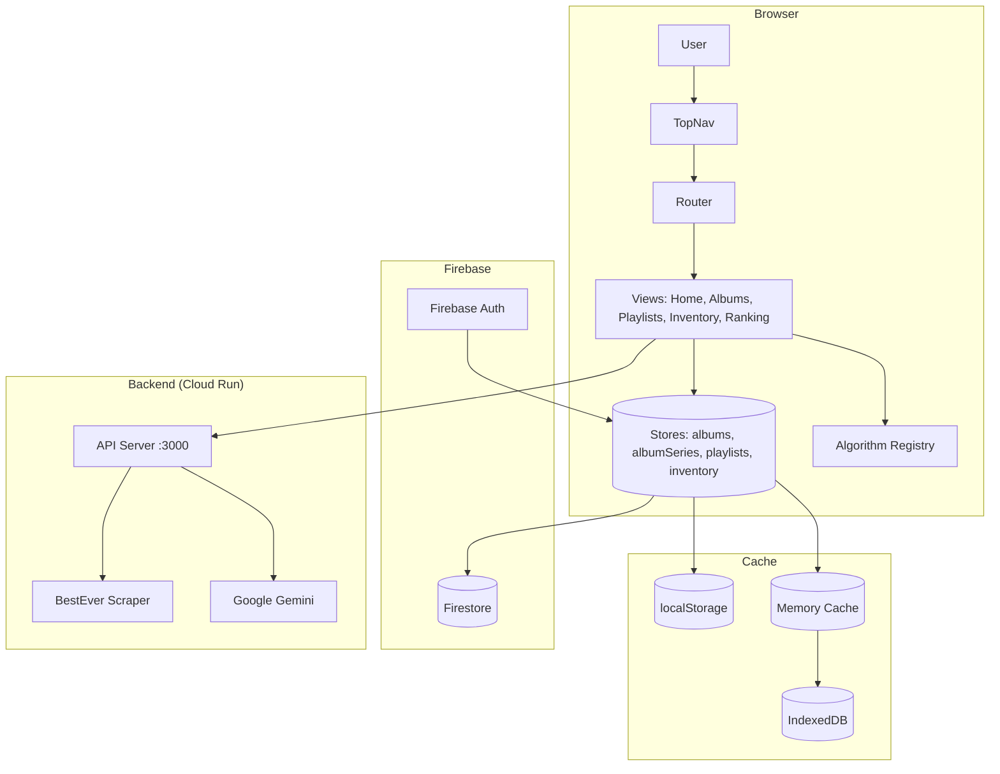

# Architecture Documentation

**Last Updated**: 2025-12-19
**Workflow**: See `.agent/workflows/architecture_documentation.md`

> **For project overview, features, and deployment info, see:**
> - [PROJECT_SUMMARY.md](product-management/PROJECT_SUMMARY.md)
> - [ROADMAP.md](product-management/ROADMAP.md)

---

## High-Level Architecture

---

## Table of Contents

1. [Design Patterns & Core Strategies](#design-patterns--core-strategies)
2. [Router & View Lifecycle](#router--view-lifecycle)
3. [Domain Model Architecture](#domain-model-architecture)
4. [Store State Management](#store-state-management)
5. [UI/UX Standards](#uiux-standards)
6. [Firebase Integration Guide](#firebase-integration-guide)
7. [Caching & Performance](#caching--performance)

### Cross-References
- **[Debug Log](DEBUG_LOG.md)**: Active debugging sessions and historical resolutions.
- **[Component Reference](technical/component_reference.md)**: Detailed API and file-level documentation.
- **[Data Flow Architecture](technical/data_flow_architecture.md)**: Sequence diagrams and technical lifecycle flows.

---

## Design Patterns & Core Strategies

The application is built on a modular architecture using standard design patterns to ensure scalability and maintainability.

### 1. Strategy Pattern
Used for interchangeable behaviors:
- **ViewMode Strategy**: Decouples rendering (Compact vs Expanded) from view logic.
- **Algorithm Strategy**: Pluggable playlist generation algorithms (Cascade, S-Draft, etc.).

### 2. Repository Pattern
Abstracts Firestore interactions. All data access is centralized in `*Repository` classes, ensuring consistent schema handling and CRUD operations.

### 3. Observer Pattern
The core of state management. Stores notify registered views of changes, allowing for a reactive UI without a heavy framework like React.

### 4. Key Patterns Summary

| Pattern | Location | Purpose |
|---------|----------|---------|
| **Dependency Injection** | Server Routes / View Renderers | Injecting services or context objects into handlers |
| **State Machine** | `PlaylistsStore.mode` | Managing CREATE vs EDIT workflow states |
| **Barrel Export** | `views/*/index.js` | Single entry point for cleaner module imports |
| **Facade** | `MusicKitService.js` / `SpotifyService.js` | Simplified interfaces for complex external APIs |

---

## Router & View Lifecycle

The application uses a custom client-side router based on the History API (`pushState`). 

> [!IMPORTANT]
> Detailed sequence diagrams and lifecycle method definitions are documented in [data_flow_architecture.md](technical/data_flow_architecture.md#view-lifecycle--navigation).

### Registered Routes

| Path | View | Query Params |
|------|------|--------------|
| `/home` | HomeView | - |
| `/albums` | AlbumsView | `?seriesId=X` |
| `/playlists` | PlaylistsView | - |
| `/playlist-series` | SavedPlaylistsView | - |
| `/save-all` | SaveAllView | - |
| `/ranking/:albumId` | RankingView | - |
| `/ranking/consolidated` | ConsolidatedRankingView | - |
| `/inventory` | InventoryView | - |

---

## Domain Model Architecture

We use ES6 classes to encapsulate business logic and data integrity:

- **`Album`**: The central entity. Manages track orderings (Original, Balanced, Acclaim) and Spotify popularity data.
- **`Track`**: Value object ensuring metadata consistency (Artist, Album, Rank, Score).
- **`Playlist`**: Grouping of tracks with specific sequence and duration logic.
- **`Series`**: The curation context (e.g., "The Black Crowes - Essential Mix").

---

## Store State Management

Stores manage the application's runtime state and synchronization with Firestore.

- **Persistence**: Hybrid approach using Memory (L1) -> IndexedDB/Local (L2) -> Firestore (Remote).
- **TTL**: Cache entries for external API data (BestEver, Spotify) have a 7-day expiration.
- **Isolation**: All operations are scoped to `auth.currentUser.uid`.

---

## UI/UX Standards

### Iconography
- **Rule**: **Do NOT use Emojis for UI icons.**
- **Standard**: Use SVG icons from the centralized `Icons.js` registry. This ensures consistent rendering across platforms and CSS-based styling.

### Design Tokens
- **Typography**: Syne (Headers) / Inter (Body).
- **Theme**: Premium Dark (Flame/Amber accents).
- **Components**: Glassmorphism based cards with subtle hover effects.

---

## Firebase Integration Guide

- **SDK Version**: v11.6.1 (Modular).
- **Authentication**: Google & Apple OAuth via Firebase Auth.
- **Security**: Granular Firestore rules ensuring users can only read/write their own `curator` and `inventory` documents.

> [!CAUTION]
> Always deep-serialize objects (JSON) before sending to Firestore to remove class instances and `undefined` values that would cause SDK errors.

---

## Caching & Performance

- **Level 1 (Memory)**: Instant access during the active session.
- **Level 2 (In-Browser)**: Persistent cache for album metadata.
- **Strategy**: Stale-While-Revalidate pattern used for external metadata to ensure snappy transitions.

---

## Maintenance Notes

For a full historical record of architectural decisions (ADRs) and retired strategies from 2024, please consult the `docs/archive/` directory. This document is reserved for the active, current state of the system.
