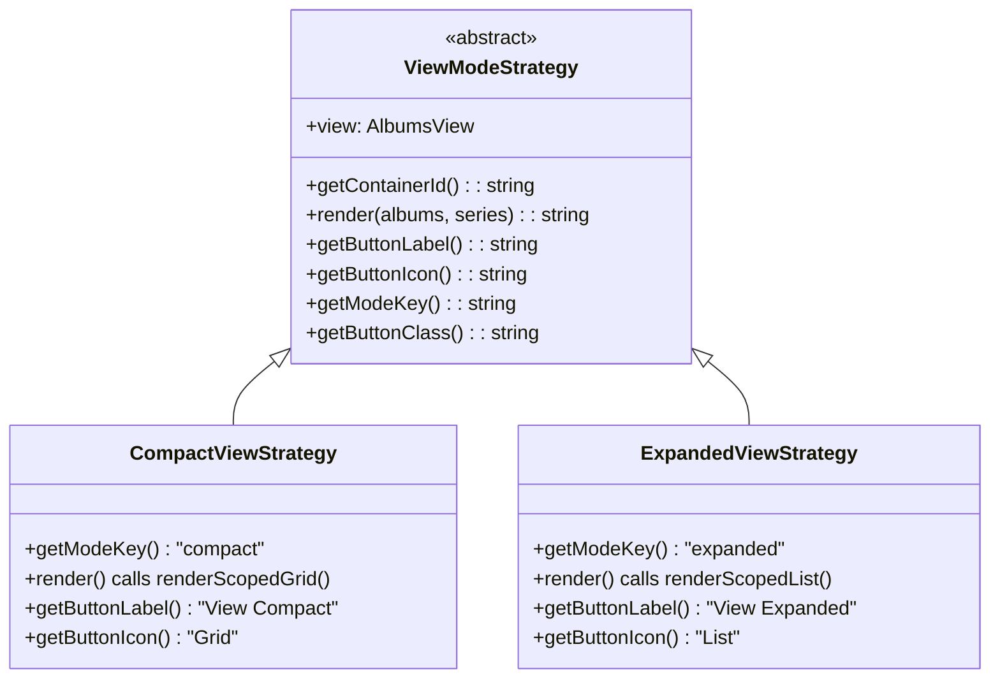
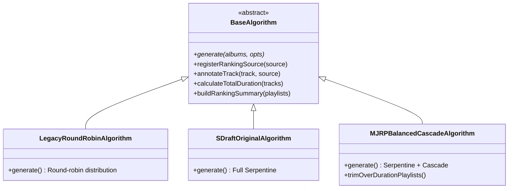
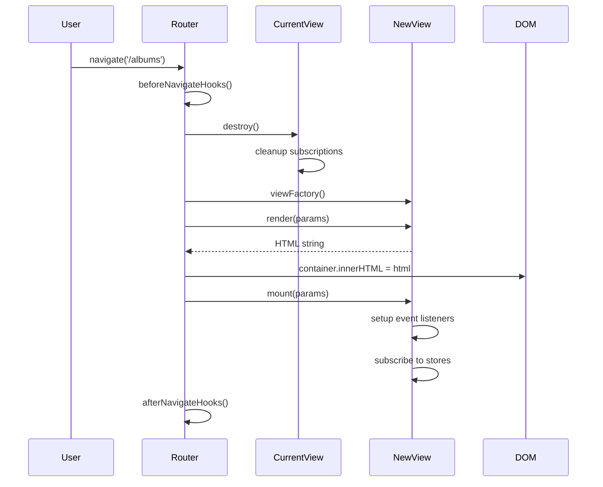

# Architecture Documentation

**Last Updated**: 2025-12-16  
**Workflow**: See `.agent/workflows/architecture_documentation.md`

> **For project overview, features, and deployment info, see:**
> - [PROJECT_SUMMARY.md](product-management/PROJECT_SUMMARY.md)
> - [ROADMAP.md](product-management/ROADMAP.md)

---

## High-Level Architecture


---

## Table of Contents

### Current Architecture and Analysis
1. [Domain Model Architecture (2025-11-29)](#domain-model-architecture-current)
2. [Store State Management (2025-11-29)](#store-state-management-current)
3. [Data Flow Analysis (2025-11-29)](#data-flow-analysis-2025-11-29)
4. [Album Data Schema & Transformations (2025-11-29)](#album-data-schema-current)
5. [UI/UX Standards (2025-11-29)](#uiux-standards-current)
6. [Router Architecture](#router-architecture)
7. [Firebase Integration Guide](#firebase-integration-guide)
8. [ViewMode Strategy Pattern (2025-12-15)](#viewmode-strategy-pattern)
9. [Algorithm Strategy Pattern (2025-12-16)](#algorithm-strategy-pattern)

### Architecture Decisions (ADRs)
- [Caching Strategy](#caching-strategy-previous)
- [Routing Decision](#routing-decision-previous)

### Cross-References
- **[Sprint 5: Persistence Architecture](archive/architecture-artifacts-2025-11-29/SPRINT_5_PERSISTENCE_ARCHITECTURE.md)** (1829 lines)
- **[Apple Music Integration](archive/architecture-artifacts-2025-11-29/APPLE_MUSIC_ARCHITECTURE.md)**
- **[Software Design Document](archive/architecture-artifacts-2025-11-29/SDD.md)**
  - Overall system design
  - Component architecture
  - Technology stack decisions
  - Project structure

- **[Debug Log](DEBUG_LOG.md)**
  - Active debugging sessions
  - Historical issues & resolutions
  - Debug tools documentation

---

## ViewMode Strategy Pattern
**Status**: 🟢 Active  
**Date**: 2025-12-15  
**File**: `public/js/views/strategies/ViewModeStrategy.js`  
**Type**: Behavioral Design Pattern

### Overview

The `AlbumsView` supports two view modes: **Compact** (grid) and **Expanded** (list with dual tracklists). Previously, view mode logic was scattered throughout the code with conditionals like:

```javascript
if (this.viewMode === 'expanded') {
  // render list
} else {
  // render grid
}
```

This was refactored using the **Strategy Pattern** to improve modularity, testability, and extensibility.

### Class Diagram



### Usage

```javascript
import { createViewModeStrategy } from './strategies/ViewModeStrategy.js'

// In AlbumsView constructor
this.viewModeKey = localStorage.getItem('albumsViewMode') || 'compact'
this.viewStrategy = createViewModeStrategy(this.viewModeKey, this)

// Rendering (simplified from conditional to delegation)
const html = this.viewStrategy.render(albums, series)

// Toggle button
${this.viewStrategy.getButtonLabel()}
${getIcon(this.viewStrategy.getButtonIcon(), 'w-5 h-5')}
```

### Benefits

| Aspect | Before | After |
|--------|--------|-------|
| **Logic Location** | Scattered conditionals | Centralized in Strategy classes |
| **Adding New Mode** | Edit multiple places | Create new Strategy class |
| **Testing** | Integration tests only | Unit test each Strategy |
| **Readability** | `if/else` chains | Clear delegation |

### Factory Function

```javascript
export function createViewModeStrategy(modeKey, view) {
  switch (modeKey) {
    case 'expanded': return new ExpandedViewStrategy(view)
    case 'compact':
    default: return new CompactViewStrategy(view)
  }
}
```

### Extension Points

To add a new view mode (e.g., "table"):
1. Create `TableViewStrategy extends ViewModeStrategy`
2. Implement `render()`, `getButtonLabel()`, etc.
3. Add case to factory function
4. No changes needed in `AlbumsView.js`

---

## Algorithm Strategy Pattern
**Status**: 🟢 Active  
**Date**: 2025-12-16  
**Directory**: `public/js/algorithms/`  
**Type**: Behavioral Design Pattern

### Overview

The playlist generation system uses the Strategy Pattern to support multiple algorithms. Users can select which algorithm to use in `PlaylistsView`.

### Class Diagram



### Algorithms

| ID | Name | Description |
|----|------|-------------|
| `legacy-roundrobin` | Legacy Round-Robin | Original simplified implementation |
| `s-draft-original` | S-Draft Original | Full Serpentine distribution |
| `mjrp-balanced-cascade` | MJRP Balanced Cascade | Serpentine + Cascade (RECOMMENDED) |

### MJRP Balanced Cascade Features
- **Greatest Hits**: #1 and #2 only (split if >60min)
- **Serpentine First Pass**: Odd albums DC_last→DC1, even DC1→DC_last
- **Cascade Global**: Excess tracks in ping-pong by ranking
- **Duration Trim**: >48min → Orphan Tracks
- **numDC Formula**: `minTracksInAnyAlbum - 2`

### Usage

```javascript
import { createAlgorithm, getAllAlgorithms } from './algorithms/index.js'

// Get all available algorithms
const algorithms = getAllAlgorithms()

// Create algorithm instance
const algorithm = createAlgorithm('mjrp-balanced-cascade')

// Generate playlists
const { playlists, rankingSummary } = algorithm.generate(albums)
```

### Cross-Reference
- Full specification: [ALGORITHM_MENU.md](technical/specs/ALGORITHM_MENU.md)
- SDD artifacts: [algorithm-strategy/](technical/specs/algorithm-strategy/)

---

## Router Architecture
**Status**: 🟢 Active  
**File**: `public/js/router.js`  
**Type**: Custom SPA Router (History API)

### Overview

The application uses a custom client-side router built on the History API (`pushState`). No external dependencies (React Router, Vue Router, etc.).

### View Lifecycle



### Lifecycle Methods (BaseView)

| Method | When Called | Purpose |
|--------|-------------|---------|
| `render(params)` | After factory, before DOM | Returns HTML string |
| `mount(params)` | After HTML injected | Setup listeners, subscriptions |
| `destroy()` | Before navigation away | Cleanup listeners, subscriptions |
| `update()` | On store notification | Re-render parts of UI |

### Registered Routes

| Path | View | Query Params |
|------|------|--------------|
| `/home` | HomeView | - |
| `/albums` | AlbumsView | `?seriesId=X` |
| `/playlists` | PlaylistsView | - |
| `/album-series` | ⇒ Redirects to `/albums` | - |
| `/series` | ⇒ Redirects to `/albums` | - |
| `/playlist-series` | SavedPlaylistsView | - |
| `/save-all` | SaveAllView | - |
| `/ranking/:albumId` | RankingView | - |
| `/ranking/consolidated` | ConsolidatedRankingView | - |
| `/inventory` | InventoryView | - |

### Navigation API

```javascript
import { router } from './router.js'

// Navigate with history push
router.navigate('/albums?seriesId=123')

// Force reload current route (same view)
await router.loadRoute(window.location.pathname)

// Add before/after hooks
router.beforeNavigate((path, state) => {
    // Return false to prevent navigation
    return !hasUnsavedChanges
})

router.afterNavigate((path, params) => {
    // Analytics, etc.
})
```

### Link Handling

The router intercepts all `<a href="/...">` clicks on the page and uses `pushState` instead of full page reload. No special component needed.

```html
<!-- These are automatically intercepted -->
<a href="/albums">View Albums</a>
<a href="/inventory">Inventory</a>

<!-- External links work normally -->
<a href="https://example.com">External</a>
```

---

# Current Architecture and Analysis

## Domain Model Architecture (Current)
**Status**: 🟢 Active (Implementation Started)
**Date**: 2025-11-29 19:00
**Related Issues**: Original Album Order Regression, Missing Artist/Album Fields

### Problem Statement
The application relied on an "Anemic Domain Model," passing raw JSON objects between layers (`client` -> `store` -> `curation` -> `view`). This led to:
- **Data Integrity Issues**: Fields like `artist` and `album` missing in nested objects.
- **Logic Dispersion**: Fallback logic duplicated or missing across files.
- **Fragility**: Refactoring one layer (e.g., `client.js`) broke others (`curation.js`) due to implicit schema assumptions.

### Decision
**Adopt a Rich Domain Model using ES6 Classes:**
- `Track`: Atomic unit, guarantees context (Artist/Album) is never missing.
- `Album`: Aggregates tracks, manages orderings (Original vs Ranked).
- `Playlist`: Manages collections of tracks.
- `Series`: Manages collections of albums.

### Rationale
1.  **Centralized Logic**: `Track` class handles fallback logic (e.g., `this.artist = data.artist || album.artist`).
2.  **Consistency**: `new Album(data)` guarantees a valid state immediately.
3.  **Resilience**: `curation.js` receives robust objects, not raw JSON.

### Consequences
- ✅ **Benefits**: Eliminates "missing field" bugs, simplifies View logic, improves type safety (conceptually).
- ⚠️ **Trade-offs**: Requires hydration logic when loading from `localStorage` (JSON -> Class).

---

## Store State Management (Current)
**Status**: 🟢 Active
**Date**: 2025-11-29 17:00
**Related Issues**: #6 PlaylistsView Empty, #7 Album Not Found, #8 Ghost Albums Returned

### Problem Statement
Band-aid approach to store management caused ghost albums and race conditions.

### Decision
**Store persists data while series is active. Reset ONLY when:**
1. Changing series
2. Explicit refresh
3. Loading new series

### Rationale
1. **Simpler**: Views don't manage data loading
2. **Faster**: No redundant API calls on navigation  
3. **Reliable**: Single source of reset truth

---

## Data Flow Analysis (2025-11-29)
**Status**: 🟢 Verified
**Context**: Post-Domain Model Refactor

### 1. Data Flow Trace
- **Server (`/api/generate`)**: Returns `tracks` (Original) and `tracksByAcclaim` (Ranked).
- **Client (`client.js`)**: Normalizes and returns `new Album(data)`. Hydrates from cache if available.
- **Model (`Album.js`)**:
    - `this.tracks`: Populated from `tracksByAcclaim` (Ranked) or fallback.
    - `this.tracksOriginalOrder`: Populated from `tracksOriginalOrder` (Cache) or `tracks` (API Original).
- **Store (`AlbumsStore.js`)**:
    - **Persistence**: Serializes `Album` instances to JSON.
    - **Loading**: Hydrates JSON back to `Album` instances (Fix applied).
- **View (`AlbumsView.js`)**:
    - **Ranked Column**: Uses `album.tracks`.
    - **Original Column**: Uses `album.tracksOriginalOrder`.

### 2. Architectural Integrity
- **Rich Domain Model**: Encapsulates logic, preventing "anemic" data leaks (missing artist/album fields).
- **Centralized Hydration**: Ensures consistency across all layers (View, Store, Curation).
- **Separation of Concerns**: Strict boundary between API (Data), Model (Logic), Store (State), and View (UI).

### 3. Legacy Data Handling
- **Risk**: Old cache lacks `tracksOriginalOrder`.
- **Mitigation**: Hard Refresh required (User Action) + Migration Utility Hydration (Code Fix).

**See Also**: [Album Data Schema (Historical)](album_data_schema.md) - Analysis of the previous "Anemic" model issues.

### 4. Verification Evidence (2025-11-29)
**Method**: `curl` request to `/api/generate` for "Pink Floyd - The Wall".
**Result**: Confirmed distinct arrays for Original vs Ranked order.

```json
{
  "data": {
    "tracks": [ // Original Order (IDs 1..N)
      {"id":"1", "title":"In the Flesh?", "rank":9},
      {"id":"2", "title":"The Thin Ice", "rank":12}
    ],
    "tracksByAcclaim": [ // Ranked Order (Sorted by Rating)
      {"id":"19", "title":"Comfortably Numb", "rank":1, "rating":94},
      {"id":"14", "title":"Hey You", "rank":2, "rating":92}
    ]
  }
}
```
*Note: Snippet truncated for brevity.*

---

### Data Flow Diagrams

#### Normal Flow (Proposed)

```mermaid
sequenceDiagram
    participant User
    participant AlbumsView
    participant AlbumsStore
    participant PlaylistsView
    participant RankingView
    
    User->>AlbumsView: Load Series
    AlbumsView->>AlbumsStore: reset() + load()
    AlbumsStore-->>AlbumsView: [albums]
    
    User->>PlaylistsView: Navigate
    Note over AlbumsStore: ✅ Data persists
    PlaylistsView->>AlbumsStore: getAlbums()
    AlbumsStore-->>PlaylistsView: [albums] ✅
    
    User->>RankingView: Click Album
    Note over AlbumsStore: ✅ Data still there
    RankingView->>AlbumsStore: getAlbums()
    AlbumsStore-->>RankingView: [albums] ✅
```


See [data_flow_architecture.md](../artifacts/data_flow_architecture.md) for complete diagrams.

###  Consequences

**Benefits** ✅:
- No ghost albums (data cleared only when changing series)
- No "Album Not Found" (data persists across navigation)  
- No code duplication (recovery logic removed)
- Simpler architecture

**Trade-offs** ⚠️:
- Must ensure `reset()` in `loadAlbumsFromQueries()` works correctly
- Hard refresh still needs fallback in AlbumsView (acceptable)

**Risks** 🔴:
- If `loadAlbumsFromQueries()` doesn't reset → ghost albums return
- **Mitigation**: Verified `reset()` exists at line 801 of AlbumsView.js

### Implementation Status
- [ ] Design approved (current step)
- [ ] Remove PlaylistsView.recoverSeriesData()
- [ ] Fix missing artist/album fields in normalizeAlbumData()
- [ ] Testing complete
- [ ] Deployed

---

## Album Data Schema & Transformations (Current)
**Status**: 🔴 Bug Identified  
**Date**: 2025-11-29 17:03  
**Related Issues**: Artist/Album names not showing in playlists

### Problem Statement

Tracks in generated playlists don not display artist or album names.

**Root Cause**: `normalizeAlbumData()` in `ApiClient` does NOT populate `track.artist` and `track.album` fields.

### Data Transformation Journey

```
┌─────────────────────────────────────────────┐
│ 1. Raw API Response                         │
├─────────────────────────────────────────────┤
│ {                                           │
│   title: "Shake Your Money Maker",         │
│   artist: "The Black Crowes",              │
│   tracks: [                                 │
│     { title: "Hard to Handle", rank: 1 }   │
│   ]                                         │
│ }                                           │
└──────────────────┬──────────────────────────┘
                   │
                   ▼
┌─────────────────────────────────────────────┐
│ 2. normalizeAlbumData() - LINE 209-311     │
├─────────────────────────────────────────────┤
│ tracks: rankedTracks.map(track => ({       │
│   ...track,                                 │
│   title: track.title,                       │
│   rank: track.rank,                         │
│   🔴 MISSING: artist: data.artist,         │
│   🔴 MISSING: album: data.title            │
│ }))                                         │
└──────────────────┬──────────────────────────┘
                   │
                   ▼
┌─────────────────────────────────────────────┐
│ 3. AlbumsStore.normalizeTrack() - LINE 64  │
├─────────────────────────────────────────────┤
│ {                                           │
│   title: track.title,                       │
│   artist: track.artist || '',  ← Empty!    │
│   album: ??? ← Doesn't exist!              │
│ }                                           │
└──────────────────┬──────────────────────────┘
                   │
                   ▼
┌─────────────────────────────────────────────┐
│ 4. PlaylistsView.renderTrack() - LINE 229  │
├─────────────────────────────────────────────┤
│ ${track.artist? ... : ''} ← Not rendered   │
│ ${track.album? ... : ''} ← Not rendered    │
└─────────────────────────────────────────────┘
```

### Decision

Add artist/album fields in `normalizeAlbumData()`:

```javascript
// File: public/js/api/client.js
// Method: normalizeAlbumData (LINE ~254)

tracks: rankedTracks.map((track, idx) => ({
  ...track,
  title: track.title || track.name || '',
  artist: data.artist || '',  // ✅ ADD THIS
  album: data.title || '',    // ✅ ADD THIS
  rank: track.rank || idx + 1,
  rating: track.rating || null,
  // ... rest
}))
```

### Rationale

1. Track objects need context (which album/artist they belong to)
2. Required for playlist display
3. Required for export (Spotify/Apple Music need full metadata)
4. Prevents data loss during transformations

### Consequences

**Benefits** ✅:
- Artist names appear in playlists
- Album names appear in playlists  
- Correct data for sorting/filtering
- Export-ready metadata

**Trade-offs** ⚠️:
- Slight data redundancy (artist stored N times for N tracks)
- Acceptable: ~20 bytes × 15 tracks = 300 bytes per album

### Implementation Status
- [x] Bug identified
- [ ] Fix applied
- [ ] Testing complete
- [ ] Deployed

---

---

## UI/UX Standards (Current)
**Status**: 🟢 Active
**Date**: 2025-11-29 22:50

### Iconography
**Rule**: **Do NOT use Emojis for UI icons.**
**Standard**: Use SVG icons from the centralized `Icons.js` registry.

**Rationale**:
1.  **Consistency**: SVGs ensure uniform rendering across all OS/Browsers (Emojis vary wildly).
2.  **Styling**: SVGs can be styled with CSS (color, size, hover effects) via `currentColor`.
3.  **Professionalism**: Vector graphics provide a more polished, app-like feel than text-based emojis.

**Implementation**:
```javascript
import { getIcon } from '../components/Icons.js'

// ✅ CORRECT
${getIcon('Rocket', 'w-4 h-4')}

// ❌ INCORRECT
🚀
```

### Design Tokens
- **Colors**: Use Tailwind utility classes (e.g., `text-accent-primary`, `bg-surface-dark`).
- **Spacing**: Use standard Tailwind spacing (e.g., `p-4`, `m-2`, `gap-4`).
- **Typography**: Use `font-syne` for headers and `font-sans` for body text.


---

## Firebase Integration Guide
**Status**: 🟢 Active  
**SDK Version**: v11.6.1 (Modular)  
**Last Updated**: 2025-12-08

### Setup

#### Initialization (app.js)

```javascript
import { initializeApp } from 'https://www.gstatic.com/firebasejs/11.6.1/firebase-app.js'
import { getAuth, signInAnonymously } from 'https://www.gstatic.com/firebasejs/11.6.1/firebase-auth.js'
import { getFirestore } from 'https://www.gstatic.com/firebasejs/11.6.1/firebase-firestore.js'

const firebaseConfig = {
    apiKey: "...",
    authDomain: "mjrp-albums.firebaseapp.com",
    projectId: "mjrp-albums"
}

const app = initializeApp(firebaseConfig)
const auth = getAuth(app)
const db = getFirestore(app)

// Anonymous authentication
signInAnonymously(auth)
```

#### Modular SDK Imports

**✅ CORRECT** (Modular v9+):
```javascript
import { collection, doc, setDoc, getDoc, serverTimestamp } 
  from 'https://www.gstatic.com/firebasejs/11.6.1/firebase-firestore.js'
```

**❌ WRONG** (Compat v8):
```javascript
firebase.firestore.FieldValue.serverTimestamp()  // ReferenceError!
```

### Firestore Security Rules (Production)

> [!IMPORTANT]
> **Source of Truth:** Firebase Console (not local files)  
> **Last Updated:** 2025-12-08

```javascript
rules_version = '2';
service cloud.firestore {
  match /databases/{database}/documents {
  
    // Curated data (AlbumSeries, PlaylistSeries, Albums, Playlists)
    match /artifacts/{appId}/users/{userId}/curator/{document=**} {
      allow read, write: if request.auth != null && request.auth.uid == userId;
    }
    
    // Inventory collection
    match /artifacts/{appId}/users/{userId}/inventory/{document=**} {
      allow read, write: if request.auth != null && request.auth.uid == userId;
    }
    
  }
}
```

**Allowed Paths (for Repositories):**

| Data Type | Collection Path |
|-----------|-----------------|
| AlbumSeries | `artifacts/mjrp-albums/users/{userId}/curator/albumSeries` |
| PlaylistSeries | `artifacts/mjrp-albums/users/{userId}/curator/playlistSeries` |
| Inventory | `artifacts/mjrp-albums/users/{userId}/inventory` |

---

### Common Patterns

#### Reading Data

```javascript
import { doc, getDoc } from 'https://www.gstatic.com/firebasejs/11.6.1/firebase-firestore.js'

async loadFromFirestore(db, userId, seriesId) {
    // Path must match security rules: artifacts/{appId}/users/{userId}/curator/*
    const collectionPath = `artifacts/mjrp-albums/users/${userId}/curator/albumSeries`
    const docRef = doc(db, collectionPath, seriesId)
    const docSnap = await getDoc(docRef)
    
    if (docSnap.exists()) {
        return docSnap.data()
    }
    return null
}
```

#### Writing Data

```javascript
import { doc, setDoc, serverTimestamp } from 'https://www.gstatic.com/firebasejs/11.6.1/firebase-firestore.js'

async saveToFirestore(db, userId, data) {
    // Path must match security rules
    const collectionPath = `artifacts/mjrp-albums/users/${userId}/curator/albumSeries`
    const docRef = doc(db, collectionPath, data.id)
    
    // Deep serialize: removes undefined and converts ES6 classes to POJOs
    const serialized = JSON.parse(JSON.stringify(data))
    
    await setDoc(docRef, {
        ...serialized,
        updatedAt: serverTimestamp()
    })
}
```

#### Handling Custom Classes

**Problem**: Firestore rejects ES6 class instances

**Solution**: Deep serialize
```javascript
// ❌ WRONG
await setDoc(docRef, album)  // Crashes if album is Album instance

// ✅ CORRECT
const serialized = JSON.parse(JSON.stringify(album))
await setDoc(docRef, serialized)
```

**Why**: `JSON.parse(JSON.stringify())` converts classes to plain objects AND removes `undefined` values automatically.

**See**: [DEBUG_LOG.md](debug/DEBUG_LOG.md) Issue #26 for full context.

---

### Error Handling

#### Common Errors

| Error | Cause | Solution |
|-------|-------|----------|
| `firebase is not defined` | Mixing modular + compat | Use modular imports only |
| `Unsupported field value: undefined` | Undefined properties | Use JSON serialization |
| `Unsupported field value: custom object` | Class instances | Use JSON serialization |
| `Missing permissions` | Firestore rules | Check anonymous auth enabled |

#### Troubleshooting Steps

1. **Check imports**: All Firebase imports use modular CDN syntax
2. **Check serialization**: No class instances sent to Firestore  
3. **Check auth**: User authenticated (`auth.currentUser` exists)
4. **Check console**: Firebase errors include stack traces

---

### Architecture: Firestore vs localStorage

| Aspect | Firestore | localStorage |
|--------|-----------|--------------|
| **Persistence** | Cloud (cross-device) | Browser only |
| **Offline** | SDK caches locally | Always available |
| **Size limit** | 1MB per document | 5-10MB total |
| **Speed** | Network latency | Instant |
| **Use for** | Series, Playlists, Inventory | UI state, cache |

**Pattern**: Write to both
- **Firestore**: Source of truth (cloud persistence)
- **localStorage**: Fast reads (instant access)
- **IndexedDB**: Offline cache (via Firebase SDK)

---

### Authentication (Current State)

**Sprint 5-6**: Firebase Anonymous Authentication  
**Sprint 7**: Apple & Google OAuth (planned)

**Current Flow**:
```javascript
// app.js automatically signs in
signInAnonymously(auth)

// Sets userId in stores
onAuthStateChanged(auth, (user) => {
    albumSeriesStore.setUserId(user.uid)
})
```

**⚠️ Tech Debt**: 
Some code uses fallback `|| 'anonymous-user'` string. This creates shared data bug.

**Correct**: Always use `auth.currentUser.uid` (unique per visitor).

**See**: ROADMAP Sprint 7 for OAuth implementation plan.

---

### See Also
- [Repository Pattern](#sprint-5-repository-pattern-previous)
- [DEBUG_LOG.md](debug/DEBUG_LOG.md) - Issues #25, #26
- [Firebase Docs](https://firebase.google.com/docs/firestore)

---

## Caching Strategy (Previous)
**Status**: 🟢 Implemented  
**Date**: 2025-11-29 01:32  
**Superseded**: No (still active)

### Decision

Hybrid L1 (Memory) + L2 (localStorage) cache with 7-day TTL.

### Key Points

```javascript
class AlbumCache {
  get(query) {
    // L1: Check memory (instant)
    if (this.memoryCache.has(query)) return this.memoryCache.get(query)
    
    // L2: Check localStorage (100ms)
    const cached = localStorage.getItem(`album_${query}`)
    if (cached && !isExpired(cached)) {
      this.memoryCache.set(query, cached.data) // Promote to L1
      return cached.data
    }
    
    return null // Cache miss
  }
}
```

**Rationale**:
- BestEverAlbums data is relatively static (updates weekly/monthly)
- 7-day TTL balances freshness vs performance
- L1 cache = instant on repeated views
- L2 cache = survives browser refresh

**Trade-offs**:
- Data can be up to 7 days stale (user can refresh manually)
- localStorage size limits (~5MB, ~100-500 albums)

**Full Details**: [Archive of CACHING_STRATEGY.md](#caching-strategy-full-archive)

---

## Routing Decision (Previous)
**Status**: 🟢 Implemented  
**Date**: 2025-11-29 01:32  
**Superseded**: No (still active)

### Decision

**History API (pushState)** over Hash Routing.

### Rationale

1. **OAuth-friendly**: Apple Music/Spotify OAuth require clean URLs
   ```
   ✅ https://app.com/auth/callback?code=ABC
   ❌ https://app.com/#/auth/callback (Apple won't redirect here)
   ```

2. **Professional URLs**: Clean sharing links
3. **PWA-ready**: Required for installable apps
4. **Analytics-friendly**: Google Analytics tracks automatically

### Configuration

```json
// firebase.json
{
  "hosting": {
    "rewrites": [
      { "source": "**", "destination": "/index.html" }
    ]
  }
}
```

**Trade-off**: Requires server configuration (1 line in firebase.json)

**Full Details**: [Archive of ROUTING_DECISION.md](#routing-decision-full-archive)

---

# Appendix: Full Archives

<details>
<summary><h2 id="caching-strategy-full-archive">Caching Strategy (Full Archive)</h2></summary>

[Full content of CACHING_STRATEGY.md would go here - omitted for brevity in this response]

</details>

<details>
<summary><h2 id="routing-decision-full-archive">Routing Decision (Full Archive)</h2></summary>

[Full content of ROUTING_DECISION.md would go here - omitted for brevity in this response]

</details>

---

## Maintenance Notes

**How to Update This Document**:

1. When implementing architectural change → Move Current section to Previous
2. Add timestamp and "Superseded" label
3. Write new Current section
4. Keep Previous sections for history (don't delete)
5. Archive full docs in Appendix if needed

**See**: `.agent/workflows/architecture_documentation.md` for detailed process

---

## Sprint 5: UI Persistence Specifications (Current)
**Status**: 🟢 Implemented
**Date**: 2025-11-29 22:45

This section outlines the user interface interactions that trigger data persistence for the entities implemented in Sprint 5.

### 1. Series (Playlists Series)

#### Creation
- **Location**: `HomeView` (Landing Page)
- **UI Element**: "Load Albums" button (🚀 icon) in the "Start Creating your New Series" form.
- **Action**: User enters a series name and a list of albums (Artist - Album), then clicks "Load Albums".
- **Persistence**:
  - The `SeriesStore` creates a new Series object.
  - Data is saved to Firestore under `users/{userId}/series/{seriesId}`.
  - Status is set to `pending`.

#### Resume
- **Location**: `HomeView` (Recent Series list)
- **UI Element**: "Continue" button on any series card.
- **Action**: User clicks to resume working on a series.
- **Persistence**: No write action; loads the series context into the application state.

### 2. Inventory (Physical Collection)

#### Add Album
- **Location**: `AlbumsView`
- **UI Element**: "Add to Inventory" button (📦 icon) on the album card hover overlay.
- **Action**:
  - Opens the "Add to Inventory" modal.
  - User selects format (CD, Vinyl, etc.), condition, and price.
  - Clicking "Save" triggers `InventoryStore.addAlbum`.
- **Persistence**: Saves the album to `users/{userId}/inventory/{albumId}`.

#### Edit Album Details
- **Location**: `InventoryView`
- **UI Element**: "Edit" button (✏️ icon) on an inventory item.
- **Action**:
  - Opens the "Edit Album" modal.
  - User modifies notes, condition, or format.
  - Clicking "Save" triggers `InventoryStore.updateAlbum`.
- **Persistence**: Updates the document in Firestore.

#### Edit Price (Inline)
- **Location**: `InventoryView`
- **UI Element**: Price display (e.g., "$ 25.00").
- **Action**:
  - User clicks the price to switch to input mode.
  - User types new price and presses **Enter** or clicks away (blur).
- **Persistence**: Triggers `InventoryStore.updatePrice`, which performs an optimistic update locally and then saves to Firestore.

#### Remove Album
- **Location**: `InventoryView`
- **UI Element**: "Delete" button (🗑️ icon).
- **Action**: User confirms the deletion in a dialog.
- **Persistence**: Removes the document from `users/{userId}/inventory`.

### 3. Playlists

#### Generation
- **Location**: `PlaylistsView`
- **UI Element**: "Generate Playlists" button (🚀 icon).
- **Action**:
  - User configures parameters (count, duration).
  - Clicking "Generate" calls the `APIClient`.
- **Persistence**:
  - The server (or client-side logic) generates the playlists.
  - **Important**: The generated playlists are saved to Firestore under `users/{userId}/series/{seriesId}/playlists` (managed by `PlaylistRepository` on the backend/service layer).

#### Reordering (Drag & Drop)
- **Location**: `PlaylistsView`
- **UI Element**: Track items within playlist columns.
- **Action**: User drags a track to a new position or new playlist.
- **Persistence**:
  - The `PlaylistsStore` updates the local state immediately.
  - Changes are synced to Firestore (debounced or on specific triggers depending on implementation).

### 4. Data Migration

#### Migrate Legacy Data
- **Location**: `HomeView`
- **UI Element**: "Start Migration" banner (visible only if legacy data is detected).
- **Action**: User clicks "Start Migration".
- **Persistence**:
  - Reads all data from `localStorage`.
  - Writes converted data to Firestore (`series`, `albums`, `inventory`).
  - Marks migration as complete in user preferences.

---

# Appendix: Design Specifications

## Sprint 5 UI Specifications (Archived from Product Management)
**Original File**: `docs/product-management/SPRINT_5_UI_SPECS.md`
**Date**: Phase 3 Implementation

### Overview
Phase 3 UI components complete the user-facing layer of Sprint 5's Firestore persistence system:
- Migration banner + progress modal
- CRUD operations (delete/edit modals)
- **InventoryView** (new feature - physical album collection)
- Generate Playlists flow

### 1. Migration Banner (HomeView)
**Trigger**: `!migration.isMigrationComplete() && migration.hasLocalStorageData()`
**Content**: "Data Migration Available - We found albums in your browser storage."
**Actions**: Migrate Now, Skip for Now.

### 2. Migration Progress Modal
**States**: In Progress (Bar), Complete (Stats), Error.
**Non-blocking**: User can't close modal during migration.

### 3. CRUD Delete Modal
**Purpose**: Confirm deletion with cascade preview.
**Cascade**: Deleting a Series deletes its Albums and Playlists.

### 4. CRUD Edit Modal
**Purpose**: Inline editing for series names, playlist names.
**Validation**: Min 3 chars.

### 5. InventoryView (New Feature)
**Route**: `/inventory`
**Layout**:
- Header: Stats (Total Albums, Value).
- Filters: Search, Format (CD, Vinyl, etc.), View Mode (Grid/List).
- Grid: Cover, Title, Artist, Format Badge, Price (Editable), Actions (Edit, Delete).

### 6. Add to Inventory Action
**Location**: AlbumsView (Card Hover).
**Modal**: Select Format, Condition, Price, Notes.

### 7. Create Series from Inventory
**Trigger**: Select 2+ albums in InventoryView.
**Action**: Creates a new series with the selected albums.

### 8. Generate Playlists Button
**Location**: AlbumsView Header.
**Action**: Navigates to PlaylistsView.

---

---

## Sprint 5 Architecture Updates (Archived from Product Management)
**Original File**: `docs/product-management/SPRINT_5_ARCHITECTURE_UPDATES.md`
**Date**: 2025-11-28
**Status**: ✅ Verified Implemented (2025-11-29)

### 1. ❌ Removed Cascade Delete
**Rationale**: Series deletion should NOT delete albums.
**Implementation**: `SeriesRepository.delete()` only deletes the series document. Albums remain orphaned (intended behavior) and can be reassigned.

### 2. ✅ Multi-Currency Support
**Added Currencies**: USD and BRL.
**Implementation**: `InventoryRepository` stores `currency` field ('USD' | 'BRL'). `getStatistics()` aggregates totals by currency.

### 3. ✅ Inline Price Editing
**Method**: `InventoryRepository.updatePrice(albumId, newPrice, currency)`.
**UI Flow**: Click price → Edit → Blur to Save.

### 4. 🎨 UI Theme Updates
**Theme**: Flame/Amber tones (defined in `index-v2.html` Tailwind config).
**Colors**:
- Accent: `#f97316` (Orange)
- Gradient: `flame-gradient`
**Icons**: SVG icons from `Icons.js` (No Emojis).

### 5. 📊 Currency Display Formatting
**USD**: `$1,234.56`
**BRL**: `R$ 1.234,56`
**Implementation**: `InventoryView.formatCurrency()` handles locale-specific formatting.

### Migration Utility Clarification
**Purpose**: One-time migration from localStorage to Firestore.
**Status**: Implemented and active in `HomeView`.

---

## V2.0 Design Mockups (Archived from Product Management)
**Original File**: `docs/product-management/V2.0_DESIGN_MOCKUPS.md`
**Date**: 2025-11-26

### Design Philosophy
- **Principles**: Premium & Modern (Dark mode, Glassmorphism), Clarity First, Performance Feel.
- **Palette**: Background `#1a1a2e` (Navy), Primary `#0ea5e9` (Blue), Text `#f8fafc` (Gray).
- **Typography**: Inter (Sans-serif).

### Screen 1: Home / Landing
- **Hero**: "Create Your Playlist Series".
- **Input**: Textarea for "Artist - Album" list.
- **Recent Series**: Grid of cards with "Resume" button.

### Screen 2: Albums Library
- **Filters**: Search, Artist, Year, Status.
- **Grid**: 4 columns. Cards with Cover, Title, Badges (Year, BestEver, Status).
- **Actions**: Delete, Reprocess, Open BestEver.

### Screen 3: Ranking View
- **Tabs**: Summary, Sources, Logs.
- **Rank Display**: Gold/Silver/Bronze badges for top 3.
- **Sources**: Attribution table (BestEverAlbums, Gemini AI).

### Screen 4: Playlists View
- **Columns**: P1, P2, etc.
- **Drag-and-Drop**: Reorder tracks, move between playlists.
- **Status**: Synchronized (Green), Drag Applied (Blue), Conflicts (Orange).

### Component Library
- **Buttons**: Gradient Blue (Primary), Outline (Secondary).
- **Cards**: Glassmorphism (`rgba(255,255,255,0.05)`).
- **Badges**: Pill style, color-coded by format/status.

### Accessibility
- **WCAG 2.1 AA**: Contrast ratio 7:1, Keyboard navigation, Screen Reader support.

---
