# Architecture Documentation

**Last Updated**: 2025-11-29 17:10
**Workflow**: See `.agent/workflows/architecture_documentation.md`

---

## Table of Contents

### Current Architecture and Analysis
1. [Store State Management (2025-11-29)](#store-state-management-current)
2. [Album Data Schema & Transformations (2025-11-29)](#album-data-schema-current)

### Previous Architecture and Analysis  
3. [Sprint 5: Repository Pattern (2025-11-28)](#sprint-5-repository-pattern-previous)
4. [Caching Strategy (2025-11-29 01:32)](#caching-strategy-previous)
5. [Routing Decision (2025-11-29 01:32)](#routing-decision-previous)

### Cross-References
- **[Sprint 5: Persistence Architecture](archive/architecture-artifacts-2025-11-29/SPRINT_5_PERSISTENCE_ARCHITECTURE.md)** (1829 lines)
  - Repository Pattern implementation
  - Firestore data models & schema versioning
  - Full CRUD operations (create, read, update, delete)
  - Cache invalidation strategy
  - User-scoped collections for Sprint 7 auth
  - Inventory system architecture
  
- **[Apple Music Integration](archive/architecture-artifacts-2025-11-29/APPLE_MUSIC_ARCHITECTURE.md)**
  - OAuth flow & authentication
  - MusicKit JS integration
  - Track matching strategy
  - Backend proxy requirements
  
- **[Software Design Document](archive/architecture-artifacts-2025-11-29/SDD.md)**
  - Overall system design
  - Component architecture
  - Technology stack decisions
  - Project structure

- **[Debug Log](DEBUG_LOG.md)**
  - Active debugging sessions
  - Historical issues & resolutions
  - Debug tools documentation

---

# Current Architecture and Analysis

## Store State Management (Current)
**Status**: 🟢 Proposed (Pending Implementation)  
**Date**: 2025-11-29 17:00  
**Related Issues**: #6 PlaylistsView Empty, #7 Album Not Found, #8 Ghost Albums Returned

### Problem Statement

Band-aid approach to store management caused:
- **Ghost Albums**: Data from previous series appearing  
- **"Album Not Found"**: Missing data when expected
- **Code Duplication**: Recovery logic in 3 views (AlbumsView, PlaylistsView, RankingView)
- **Race Conditions**: Multiple views calling `reset() + reload`

**Root Cause**:
```
AlbumsView.destroy() → AlbumsView.constructor() → reset store on every navigation
  ↓
PlaylistsView.mount() → Store empty → Recovery logic
RankingView.mount() → Store empty → Recovery logic
  ↓
Duplicated code + race conditions + ghost data
```

### Decision

**Store persists data while series is active. Reset ONLY when:**
1. Changing series (user switches to different series)
2. Explicit refresh (user clicks refresh button)
3. Loading new series (`loadAlbumsFromQueries()` called)

**DO NOT reset when:**
- ❌ Navigating between views (Albums → Playlists → Ranking)
- ❌ View lifecycle (constructor/destroy)

### Rationale

1. **Simpler**: Views don't manage data loading
2. **Faster**: No redundant API calls on navigation  
3. **Reliable**: Single source of reset truth
4. **Maintainable**: No recovery logic duplication

### Data Flow Diagrams

#### Normal Flow (Proposed)

```mermaid
sequenceDiagram
    participant User
    participant AlbumsView
    participant AlbumsStore
    participant PlaylistsView
    participant RankingView
    
    User->>AlbumsView: Load Series
    AlbumsView->>AlbumsStore: reset() + load()
    AlbumsStore-->>AlbumsView: [albums]
    
    User->>PlaylistsView: Navigate
    Note over AlbumsStore: ✅ Data persists
    PlaylistsView->>AlbumsStore: getAlbums()
    AlbumsStore-->>PlaylistsView: [albums] ✅
    
    User->>RankingView: Click Album
    Note over AlbumsStore: ✅ Data still there
    RankingView->>AlbumsStore: getAlbums()
    AlbumsStore-->>RankingView: [albums] ✅
```


See [data_flow_architecture.md](../artifacts/data_flow_architecture.md) for complete diagrams.

###  Consequences

**Benefits** ✅:
- No ghost albums (data cleared only when changing series)
- No "Album Not Found" (data persists across navigation)  
- No code duplication (recovery logic removed)
- Simpler architecture

**Trade-offs** ⚠️:
- Must ensure `reset()` in `loadAlbumsFromQueries()` works correctly
- Hard refresh still needs fallback in AlbumsView (acceptable)

**Risks** 🔴:
- If `loadAlbumsFromQueries()` doesn't reset → ghost albums return
- **Mitigation**: Verified `reset()` exists at line 801 of AlbumsView.js

### Implementation Status
- [ ] Design approved (current step)
- [ ] Remove PlaylistsView.recoverSeriesData()
- [ ] Fix missing artist/album fields in normalizeAlbumData()
- [ ] Testing complete
- [ ] Deployed

---

## Album Data Schema & Transformations (Current)
**Status**: 🔴 Bug Identified  
**Date**: 2025-11-29 17:03  
**Related Issues**: Artist/Album names not showing in playlists

### Problem Statement

Tracks in generated playlists don not display artist or album names.

**Root Cause**: `normalizeAlbumData()` in `ApiClient` does NOT populate `track.artist` and `track.album` fields.

### Data Transformation Journey

```
┌─────────────────────────────────────────────┐
│ 1. Raw API Response                         │
├─────────────────────────────────────────────┤
│ {                                           │
│   title: "Shake Your Money Maker",         │
│   artist: "The Black Crowes",              │
│   tracks: [                                 │
│     { title: "Hard to Handle", rank: 1 }   │
│   ]                                         │
│ }                                           │
└──────────────────┬──────────────────────────┘
                   │
                   ▼
┌─────────────────────────────────────────────┐
│ 2. normalizeAlbumData() - LINE 209-311     │
├─────────────────────────────────────────────┤
│ tracks: rankedTracks.map(track => ({       │
│   ...track,                                 │
│   title: track.title,                       │
│   rank: track.rank,                         │
│   🔴 MISSING: artist: data.artist,         │
│   🔴 MISSING: album: data.title            │
│ }))                                         │
└──────────────────┬──────────────────────────┘
                   │
                   ▼
┌─────────────────────────────────────────────┐
│ 3. AlbumsStore.normalizeTrack() - LINE 64  │
├─────────────────────────────────────────────┤
│ {                                           │
│   title: track.title,                       │
│   artist: track.artist || '',  ← Empty!    │
│   album: ??? ← Doesn't exist!              │
│ }                                           │
└──────────────────┬──────────────────────────┘
                   │
                   ▼
┌─────────────────────────────────────────────┐
│ 4. PlaylistsView.renderTrack() - LINE 229  │
├─────────────────────────────────────────────┤
│ ${track.artist? ... : ''} ← Not rendered   │
│ ${track.album? ... : ''} ← Not rendered    │
└─────────────────────────────────────────────┘
```

### Decision

Add artist/album fields in `normalizeAlbumData()`:

```javascript
// File: public/js/api/client.js
// Method: normalizeAlbumData (LINE ~254)

tracks: rankedTracks.map((track, idx) => ({
  ...track,
  title: track.title || track.name || '',
  artist: data.artist || '',  // ✅ ADD THIS
  album: data.title || '',    // ✅ ADD THIS
  rank: track.rank || idx + 1,
  rating: track.rating || null,
  // ... rest
}))
```

### Rationale

1. Track objects need context (which album/artist they belong to)
2. Required for playlist display
3. Required for export (Spotify/Apple Music need full metadata)
4. Prevents data loss during transformations

### Consequences

**Benefits** ✅:
- Artist names appear in playlists
- Album names appear in playlists  
- Correct data for sorting/filtering
- Export-ready metadata

**Trade-offs** ⚠️:
- Slight data redundancy (artist stored N times for N tracks)
- Acceptable: ~20 bytes × 15 tracks = 300 bytes per album

### Implementation Status
- [x] Bug identified
- [ ] Fix applied
- [ ] Testing complete
- [ ] Deployed

---

# Previous Architecture and Analysis

## Sprint 5: Repository Pattern (Previous)
**Status**: 🟡 Superseded (Partially Implemented)  
**Date**: 2025-11-28  
**Superseded**: 2025-11-29 (Store management approach changed)  
**See**: [Current Store State Management](#store-state-management-current)

### Summary

Implemented Repository Pattern for Firestore persistence:
- `BaseRepository` with full CRUD operations
- `SeriesRepository`, `AlbumRepository`, `PlaylistRepository`, `InventoryRepository`
- Cache invalidation on mutations
- User-scoped collections (Sprint 7 auth-ready)

**Superseded Aspect**: Recovery logic approach. Repositories remain valid, but view-level recovery was replaced with store persistence.

**Full Details**: See [SPRINT_5_PERSISTENCE_ARCHITECTURE.md](SPRINT_5_PERSISTENCE_ARCHITECTURE.md)

---

## Caching Strategy (Previous)
**Status**: 🟢 Implemented  
**Date**: 2025-11-29 01:32  
**Superseded**: No (still active)

### Decision

Hybrid L1 (Memory) + L2 (localStorage) cache with 7-day TTL.

### Key Points

```javascript
class AlbumCache {
  get(query) {
    // L1: Check memory (instant)
    if (this.memoryCache.has(query)) return this.memoryCache.get(query)
    
    // L2: Check localStorage (100ms)
    const cached = localStorage.getItem(`album_${query}`)
    if (cached && !isExpired(cached)) {
      this.memoryCache.set(query, cached.data) // Promote to L1
      return cached.data
    }
    
    return null // Cache miss
  }
}
```

**Rationale**:
- BestEverAlbums data is relatively static (updates weekly/monthly)
- 7-day TTL balances freshness vs performance
- L1 cache = instant on repeated views
- L2 cache = survives browser refresh

**Trade-offs**:
- Data can be up to 7 days stale (user can refresh manually)
- localStorage size limits (~5MB, ~100-500 albums)

**Full Details**: [Archive of CACHING_STRATEGY.md](#caching-strategy-full-archive)

---

## Routing Decision (Previous)
**Status**: 🟢 Implemented  
**Date**: 2025-11-29 01:32  
**Superseded**: No (still active)

### Decision

**History API (pushState)** over Hash Routing.

### Rationale

1. **OAuth-friendly**: Apple Music/Spotify OAuth require clean URLs
   ```
   ✅ https://app.com/auth/callback?code=ABC
   ❌ https://app.com/#/auth/callback (Apple won't redirect here)
   ```

2. **Professional URLs**: Clean sharing links
3. **PWA-ready**: Required for installable apps
4. **Analytics-friendly**: Google Analytics tracks automatically

### Configuration

```json
// firebase.json
{
  "hosting": {
    "rewrites": [
      { "source": "**", "destination": "/index.html" }
    ]
  }
}
```

**Trade-off**: Requires server configuration (1 line in firebase.json)

**Full Details**: [Archive of ROUTING_DECISION.md](#routing-decision-full-archive)

---

# Appendix: Full Archives

<details>
<summary><h2 id="caching-strategy-full-archive">Caching Strategy (Full Archive)</h2></summary>

[Full content of CACHING_STRATEGY.md would go here - omitted for brevity in this response]

</details>

<details>
<summary><h2 id="routing-decision-full-archive">Routing Decision (Full Archive)</h2></summary>

[Full content of ROUTING_DECISION.md would go here - omitted for brevity in this response]

</details>

---

## Maintenance Notes

**How to Update This Document**:

1. When implementing architectural change → Move Current section to Previous
2. Add timestamp and "Superseded" label
3. Write new Current section
4. Keep Previous sections for history (don't delete)
5. Archive full docs in Appendix if needed

**See**: `.agent/workflows/architecture_documentation.md` for detailed process
