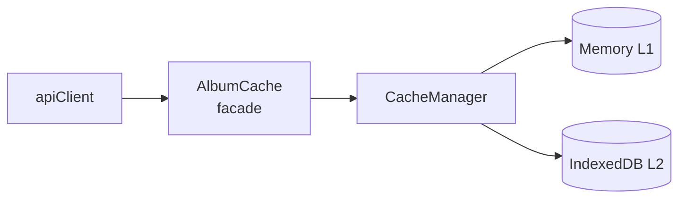

# Architecture Documentation

**Last Updated**: 2025-12-31
**Workflow**: See `.agent/workflows/architecture_protocol.md`

> **For project overview, features, and deployment info, see:**
> - [PROJECT_SUMMARY.md](product-management/PROJECT_SUMMARY.md)
> - [ROADMAP.md](product-management/ROADMAP.md)

---

## Architectural Evolution (Sprint 13-15)

> [!NOTE]
> This section documents architectural changes made during Sprint 13-15 refactoring.
> For detailed specs, see `docs/technical/specs/arch-*` files.

### Summary Table

| ID | Name | Status | Description |
|:---|:-----|:-------|:------------|
| **ARCH-1** | PlaylistsView Modularization | ✅ Complete | Exploded God Class into Controller + Renderer + DragHandler |
| **ARCH-2** | Store Pattern Standardization | ✅ Complete | SpotifyEnrichmentStore → Repository pattern |
| **ARCH-3** | Component Reuse Foundation | ✅ Complete | BaseCard + BatchGroupCard enhancements |
| **ARCH-4** | Album Search Modularization | ✅ Complete | Extract search logic from SeriesView |
| **ARCH-5** | Cache Consolidation | ✅ Complete | AlbumCache → CacheManager (IndexedDB) |
| **ARCH-6** | SeriesView Loading Optimization | ✅ Complete | Incremental render, store-level caching |
| **ARCH-8** | InventoryView V3 Refactor | ✅ Complete | Modularized InventoryView (Controller + Renderer) |
| **ARCH-12** | SafeDOM Migration | ✅ Complete | Eliminated innerHTML XSS sinks (Sprint 15) |
| **ARCH-13** | Lazy Authorize + Browser Locale | ✅ Complete | MusicKit storefront via navigator.language (Sprint 15 Phase 6) |
| **ARCH-14** | Context-Aware Series Loading | ✅ Complete | Strict Series ID filtering (Sprint 16) |
| **ARCH-15** | MusicKit Modularization | ✅ Complete | Split God Service into Auth/Catalog/Library modules (Sprint 17) |
| **ARCH-16** | SeriesView Thin Refactor | ✅ Complete | MVVM Pattern: Passive View, Logic in Controller (Sprint 17) |
| **ARCH-17** | Variable Top N Strategy | ✅ Complete | Parametrized Strategy Pattern for Top N Algorithms (Sprint 17) |
| **ARCH-18** | Album Classification Modularization | 📋 Planned | Extract classification heuristics from AlbumSearchService into dedicated strategies (Sprint 17.75) |

### ARCH-1: PlaylistsView Modularization

**Problem**: `PlaylistsView.js` was 960+ LOC "God Class" with coupled concerns.

**Solution**: Exploded into:
- `PlaylistsController.js` - Business logic, state management
- `PlaylistsGridRenderer.js` - Rendering logic
- `PlaylistsDragHandler.js` - Drag-and-drop behavior

**Result**: View reduced to ~300 LOC thin orchestrator.

---

### ARCH-2: Store Pattern Standardization

**Problem**: `SpotifyEnrichmentStore` didn't follow Repository pattern.

**Solution**: Created `SpotifyEnrichmentRepository` extending `BaseRepository`.

**Pattern**: All stores now follow:
```
Store (runtime state) → Repository (Firestore CRUD)
```

---

### ARCH-3: Component Reuse Foundation

**Problem**: Low component reuse (5%), duplicate card implementations.

**Solution**:
- Created `BaseCard` abstract component
- Enhanced `BatchGroupCard` with collapsible/expandable states

---

### ARCH-5: Cache Consolidation

**Problem**: Two parallel cache systems (AlbumCache + CacheManager), localStorage 5MB limit.

**Solution**:
- Migrated `AlbumCache` to use `CacheManager` as backend
- L1: Memory (MemoryCache), L2: IndexedDB (~500MB)
- Normalized cache keys (lowercase, trimmed)
- 7-day migration period from localStorage

**Files Changed**:
- `public/js/cache/albumCache.js` - Refactored to async API
- `public/js/api/client.js` - Updated to await cache methods

**Spec**: [arch-5-cache-consolidation_spec.md](technical/specs/arch-5-cache-consolidation_spec.md)

---

### ARCH-6: SeriesView Loading Optimization

**Problem**: Albums displayed all at once at end, filter changes caused full remount.

**Solution**:
- Incremental render: albums appear 1-by-1 synced with progress bar
- Store-level cache check before fetching
- Filter changes call loadScope directly (no router remount)
- Navigation back uses cached albums (instant)

**Files Changed**:
- `public/js/controllers/SeriesController.js` - Cache check, incremental notify
- `public/js/views/SeriesView.js` - Direct loadScope calls
- `public/js/stores/albums.js` - Preserve Map on reset

**Spec**: [arch-6-series-loading-optimization_spec.md](technical/specs/arch-6-series-loading-optimization_spec.md)

**Known Issue**: #95 - Series filter dropdown empty on first load (Sprint 14)

---

### ARCH-8: InventoryView V3 Refactor

**Problem**: `InventoryView.js` was a "God Class" (~800 LOC) containing logic, rendering, and event handling.

**Solution**:
- **Controller**: `InventoryController.js` handles data loading, filtering, stats, and CRUD.
- **Renderer**: `InventoryGridRenderer.js` generates pure HTML for Grid/List views.
- **View**: `InventoryView.js` acts as a thin shell for DOM patching and event delegation.

**Key Changes**:
- **Strict Ownership**: Explicit tri-state logic (Owned, Wishlist, Not Owned).
- **Currency Support**: Split stats for USD/BRL.
- **Performance**: Use `OptimizedAlbumLoader` for covers.

---

### ARCH-12: SafeDOM Migration (Sprint 15)

**Problem**: Widespread use of `innerHTML` created theoretical XSS vulnerabilities.

**Solution**:
- Created `SafeDOM.js` utility for programmatic DOM construction
- Migrated all core components (`Card`, `TrackRow`, `BaseModal`) to SafeDOM
- Added `.renderHTML()` adapters for backward compatibility

**Result**: Eliminated 50+ innerHTML sinks. See [Sprint 15 Tasks](technical/specs/sprint15-arch12/tasks.md).

---

### ARCH-13: Lazy Authorize + Browser Locale (Sprint 15 Phase 6)

**Problem**: MusicKit required `authorize()` on init, causing popup on every page load.

**Solution**:
- **Lazy Authorize**: Removed `authorize()` from `init()`, only call on Firestore persist
- **Browser Locale**: Use `navigator.language` to infer storefront (e.g., "pt-BR" → "br")
- **`authorizeAndValidate()`**: Detects storefront mismatch on persist

**Files Changed**:
- `MusicKitService.js` - `getBrowserStorefront()`, `authorizeAndValidate()`
- `SeriesModals.js` - Artist scan + filters (deprecated Autocomplete)

**Spec**: [Phase 6 Hotfix Plan](technical/specs/sprint15-arch12/phase6-hotfix-plan.md)

---

### ARCH-14: Context-Aware Series Loading (Sprint 16)

**Problem**: "Cross-contamination" of albums between series due to fuzzy matching in `AlbumsScopedRenderer`. Albums like "Blonde" (Frank Ocean) would appear in "Bob Dylan" series (matching "Blonde on Blonde").

**Solution**:
- **Context Preservation**: `SeriesController` attaches `_sourceSeriesId` to queries during load.
- **Strict Ownership**: Albums are tagged with `seriesIds` indicating exactly which series requested/owns them.
- **Precise Rendering**: View uses strict ID inclusion checks instead of fuzzy string matching.

**Files Changed**:
- `SeriesController.js`
- `AlbumsScopedRenderer.js`
- `albumsStore.js`

---

### ARCH-18: Album Classification Modularization (Sprint 17.75)

**Problem**: Classification logic (~100 LOC) embedded inline in `AlbumSearchService._classifyWithAI()` as a "God Method" with multiple responsibilities: DJ Mix detection, track count heuristics, electronic genre detection, AI whitelist checking.

**Solution**: Extracted into modular **5-stage funnel** using Chain of Responsibility pattern:
1. `AppleMetadataStrategy` - Uses Apple API flags (`isSingle`, `isCompilation`, `albumType`, `contentTraits`)
2. `TitleKeywordStrategy` - Pattern matching (Live, DJ Mix, EP, Remix, etc.)
3. `RemixTracksStrategy` - Track analysis (≥50% remix tracks = remix package)
4. `TrackCountStrategy` - Track count + duration (with prog rock protection)
5. `AIWhitelistStrategy` - AI confirmation for electronic music
6. `TypeSanityCheckStrategy` - Final post-processing safety net (e.g., force "Hello World" to EP)

**Files Created**:
- `AlbumTypeClassifier.js` - Pipeline orchestrator
- `classification/BaseStrategy.js` - Abstract interface
- `classification/AppleMetadataStrategy.js`, `TitleKeywordStrategy.js`, etc.

**Result**:
- `album.type` property set by centralized classifier
- Backward-compatible flags (`isSingle`, `isCompilation`, `isLive`) maintained
- Single Source of Truth for classification across all consumers

**Spec**: [sprint17.75-classification-modularization/spec.md](technical/specs/sprint17.75-classification-modularization/spec.md)

---

## High-Level Architecture


---

## Table of Contents

1. [Core Domain Models (V3)](#core-domain-models)
2. [V3 Component Architecture](#v3-component-architecture-series-centric)
3. [Design Patterns & Core Strategies](#design-patterns--core-strategies)
4. [Router & View Lifecycle](#router--view-lifecycle)
5. [Domain Model Architecture](#domain-model-architecture)
6. [Store State Management](#store-state-management)
7. [UI/UX Standards](#uiux-standards)
8. [Firebase Integration Guide](#firebase-integration-guide)
9. [Caching & Performance](#caching--performance)
10. [Previous Architecture (V1/V2)](#v1v2-monolithic-view-pattern)

### Cross-References
- **[Debug Log](debug/DEBUG_LOG.md)**: Active debugging sessions and historical resolutions.
- **[Component Reference](technical/component_reference.md)**: Detailed API and file-level documentation.
- **[Data Flow Architecture](technical/data_flow_architecture.md)**: Sequence diagrams and technical lifecycle flows.
- **[Codebase Analysis](technical/codebase_analysis.md)**: Complete architecture map with data flow diagrams (2025-12-25).

---

## Core Domain Models
**Principles**: Universal Series Model, Golden Pipeline
**Defined in**: `docs/CONSTITUTION.md`

### 1. Universal Series Model
All curation contexts are treated as a **Series**. This abstracts the difference between an Album, an Artist, or a Genre.
- **Entity**: The base unit (Album, Track, Artist).
- **Series**: A collection of entities treated as a unit for ranking/shuffling.
- **Naming**: `AlbumSeries`, `ArtistSeries`, `TrackSeries`.

### 2. The Golden Pipeline
The standard data flow for all curation actions:
`Input (Entity/Series)` -> `RankingContext (Config)` -> `Blending Menu (Algorithm)` -> `Standardized Output (Playlist)`

---

## [V3 Component Architecture (Series-Centric)]
**Status**: 🟢 Current
**Date**: 2025-12-21 17:15
**Author**: Antigravity (AI Assistant)
**Related Issues**: Sprint 12, #Refactor

### Problem Statement
The application relying on monolithic Views (`AlbumsView.js`) created a "God Class" problem: coupled logic, DOM manipulation, and state management in single files of 600+ lines. This violated the "Separation of Concerns" principle and made adding features like the "Blending Menu" risky.

### Decisions & Patterns (V3)
We adopted a **Responsive Component-Based Architecture** using Vanilla JS.

| Pattern | Role in V3 | Why we chose it |
| :--- | :--- | :--- |
| **Component-Based** | Visuals (`EntityCard`, `SeriesHeader`) | Encapsulates HTML/CSS generation and local event binding. Reusable across Views. |
| **MVC (Controller)** | Logic (`SeriesController`) | Decouples business logic (Filtering, Fetching) from the View. |
| **Observer** | State (`Stores`) | Allows components to react to data changes without prop-drilling. |
| **Repository** | Data (`AlbumRepository`) | Abstracts the data source (Firestore vs Local) from the Controller. |

### Rationale
**Principle Alignment**: **Clean Code & Modular Architecture** (Constitution II)
- **Modularity**: Components are "Lego blocks" (e.g., `SeriesDragDrop` can be attached to any grid).
- **Maintainability**: Logic changes in `SeriesController` don't break the UI in `SeriesView`.
- **Performance**: Virtual DOM is overkill; direct DOM manipulation within small Components is efficient.

### Component Hierarchy
```mermaid
graph TD
    App[App Entry] --> Router
    Router --> SeriesView["SeriesView (Orchestrator)"]

    subgraph "View Layer (Components)"
        SeriesView --> SeriesHeader[Series Header (Meta & Actions)]
        SeriesView --> SeriesFilterBar[Filter & Search Bar]
        SeriesView --> SeriesGrid[Series Grid (Responsive)]
        SeriesGrid --> EntityCard[Entity Card (Album/Artist)]
        SeriesView --> BlendingMenuView[Blending Menu (Overlay)]
    end

    subgraph "Logic Layer"
        SeriesView -.Events.-> SeriesController[Series Controller]
        SeriesController --> DataStores[Data Stores/Repositories]
    end
```

### Key Data Structures

#### RankingContext
The contract between the UI and the Curation Engine for the **Blending Menu**.

```json
{
  "style": "balanced_cascade",
  "targetDuration": 2700,
  "parameters": {
    "strictness": 0.8,
    "p1_count": 1,
    "deep_cut_ratio": 0.5
  },
  "scope": { "type": "series", "id": "series_123" },
  "sources": [
    { "id": "bea", "weight": 1.0 },
    { "id": "spotify", "weight": 0.8 }
  ]
}
```

### Consequences
- ✅ **Benefits**:
    - **Testability**: Logic can be unit-tested without a browser.
    - **Scalability**: New Views (Inventory, Playlists) are just assemblies of existing Components.
    - **Responsiveness**: CSS-driven layouts (Tailwind) handled in Components, not JS.
- ⚠️ **Trade-offs**:
    - **Complexity**: Requires strictly defined interfaces between layers (`props`, `callbacks`).
- 🔴 **Risks**:
    - **Migration Overhead**: Porting 100% of `AlbumsView` features (Drag&Drop, Context Menu) takes significant effort.

### Implementation Status
- [x] Design approved (Plan V3)
- [x] Infrastructure (Base Component, Controller)
- [x] Core Components (Grid, Card, Header, Filter)
- [x] **SeriesView V3** (575 LOC thin orchestrator, 8 components, Controller with 0 DOM refs) ✅
- [x] **Blending Menu Phase 1** (Algorithm Mixins + TopN Algorithms) ✅
- [x] **Blending Menu Phase 2** (UI Components: BlendingMenuView, BlendFlavorCard, etc.) ✅
- [/] **Blending Menu Phase 3** (In Progress)
  - [x] Conditional Ingredients Panel (rankingType, discoveryMode per algorithm)
  - [x] Connect UI config to algorithm.generate() 
  - [ ] Background Enrichment Service (Firestore, spec complete)
- [ ] AlbumsView Refactor (Applying V3 pattern - deferred)

### Related Documentation
- [AlgorithmsMenu.md](technical/specs/sprint12-architecture-v3.0/blending-menu/AlgorithmsMenu.md) - Flavor definitions and ingredient matrix
- [background-enrichment-spec.md](technical/specs/sprint12-architecture-v3.0/blending-menu/background-enrichment-spec.md) - Spotify enrichment with Firestore + lazy cleanup

---

## Design Patterns & Core Strategies

The application is built on a modular architecture using standard design patterns to ensure scalability and maintainability.

### 1. Strategy Pattern
Used for interchangeable behaviors:
- **ViewMode Strategy**: Decouples rendering (Compact vs Expanded) from view logic.
- **Algorithm Strategy**: Pluggable playlist generation algorithms (Cascade, S-Draft, TopN).
- **Ranking Strategy**: Pluggable ranking sources (Spotify, BEA, Balanced).

### 2. Mixin Pattern (Sprint 12)
Reusable algorithm behaviors extracted from legacy algorithms:
- `PlaylistBalancingMixin`: Swap balancing logic for track distribution
- `DurationTrimmingMixin`: Playlist duration enforcement
- `TrackEnrichmentMixin`: Track metadata enrichment

**Location**: `public/js/algorithms/mixins/`

### 3. Repository Pattern
Abstracts Firestore interactions. All data access is centralized in `*Repository` classes, ensuring consistent schema handling and CRUD operations.

### 3. Observer Pattern
The core of state management. Stores notify registered views of changes, allowing for a reactive UI without a heavy framework like React.

### 4. Key Patterns Summary

| Pattern | Location | Purpose |
|---------|----------|---------|
| **Dependency Injection** | Server Routes / View Renderers | Injecting services or context objects into handlers |
| **State Machine** | `PlaylistsStore.mode` | Managing CREATE vs EDIT workflow states |
| **Barrel Export** | `views/*/index.js` | Single entry point for cleaner module imports |
| **Facade** | `MusicKitService.js` / `SpotifyService.js` | Simplified interfaces for complex external APIs |

---

## Router & View Lifecycle

The application uses a custom client-side router based on the History API (`pushState`).

> [!IMPORTANT]
> Detailed sequence diagrams and lifecycle method definitions are documented in [data_flow_architecture.md](technical/data_flow_architecture.md#view-lifecycle--navigation).

### Registered Routes

| Path | View | Query Params |
|------|------|--------------|
| `/home` | HomeView | - |
| `/albums` | SeriesView (V3) | `?seriesId=X` |
| `/blend` | BlendingMenuView | - |
| `/playlists` | PlaylistsView | - |
| `/playlist-series` | SavedPlaylistsView | - |
| `/save-all` | SaveAllView | - |
| `/ranking/:albumId` | RankingView | - |
| `/ranking/consolidated` | ConsolidatedRankingView | - |
| `/inventory` | InventoryView | - |

---

## Domain Model Architecture

We use ES6 classes to encapsulate business logic and data integrity:

- **`Album`**: The central entity. Manages track orderings (Original, Balanced, Acclaim) and Spotify popularity data.
- **`Track`**: Value object ensuring metadata consistency (Artist, Album, Rank, Score).
- **`Playlist`**: Grouping of tracks with specific sequence and duration logic.
- **`Series`**: The curation context (e.g., "The Black Crowes - Essential Mix").

---

## Store State Management

Stores manage the application's runtime state and synchronization with Firestore.

- **Persistence**: Hybrid approach using Memory (L1) -> IndexedDB/Local (L2) -> Firestore (Remote).
- **TTL**: Cache entries for external API data (BestEver, Spotify) have a 7-day expiration.
- **Isolation**: All operations are scoped to `auth.currentUser.uid`.

---

## UI/UX Standards

### Iconography
- **Rule**: **Do NOT use Emojis for UI icons.**
- **Standard**: Use SVG icons from the centralized `Icons.js` registry. This ensures consistent rendering across platforms and CSS-based styling.

### Design Tokens
- **Typography**: Syne (Headers) / Inter (Body).
- **Theme**: Premium Dark (Flame/Amber accents).
- **Components**: Glassmorphism based cards with subtle hover effects.

---

## Firebase Integration Guide

- **SDK Version**: v11.6.1 (Modular).
- **Authentication**: Google & Apple OAuth via Firebase Auth.
- **Security**: Granular Firestore rules ensuring users can only read/write their own `curator` and `inventory` documents.

> [!CAUTION]
> Always deep-serialize objects (JSON) before sending to Firestore to remove class instances and `undefined` values that would cause SDK errors.

---

## Caching & Performance

> [!NOTE]
> **ARCH-5 Update (2025-12-26)**: Cache architecture consolidated to use IndexedDB.

### Cache Architecture (Post ARCH-5)



| Layer | Storage | Capacity | Persistence |
|-------|---------|----------|-------------|
| **L1** | MemoryCache (Map) | ~50MB | Session only |
| **L2** | IndexedDB | ~500MB | Permanent (7-day TTL) |

### Key Features
- **Normalized Keys**: `album:artist - title` (lowercase, trimmed)
- **Migration**: 7-day dual-read from legacy localStorage
- **Async API**: `await albumCache.get()` / `await albumCache.set()`

---

## [V1/V2 Monolithic View Pattern]
**Status**: 🟡 Superseded
**Date**: 2024-01-01 (Legacy)

### Description
Previous architecture relied on `View.js` classes that directly manipulated the DOM and handled all logic internally.
**Deficiencies**:
- Hard to test.
- Duplicate logic (Copy/Paste between Albums and Inventory).
- "God Class" antipattern.

**See**: [V3 Component Architecture](#v3-component-architecture-series-centric)

---

## Maintenance Notes

For a full historical record of architectural decisions (ADRs) and retired strategies from 2024, please consult the `docs/archive/` directory. This document is reserved for the active, current state of the system.
