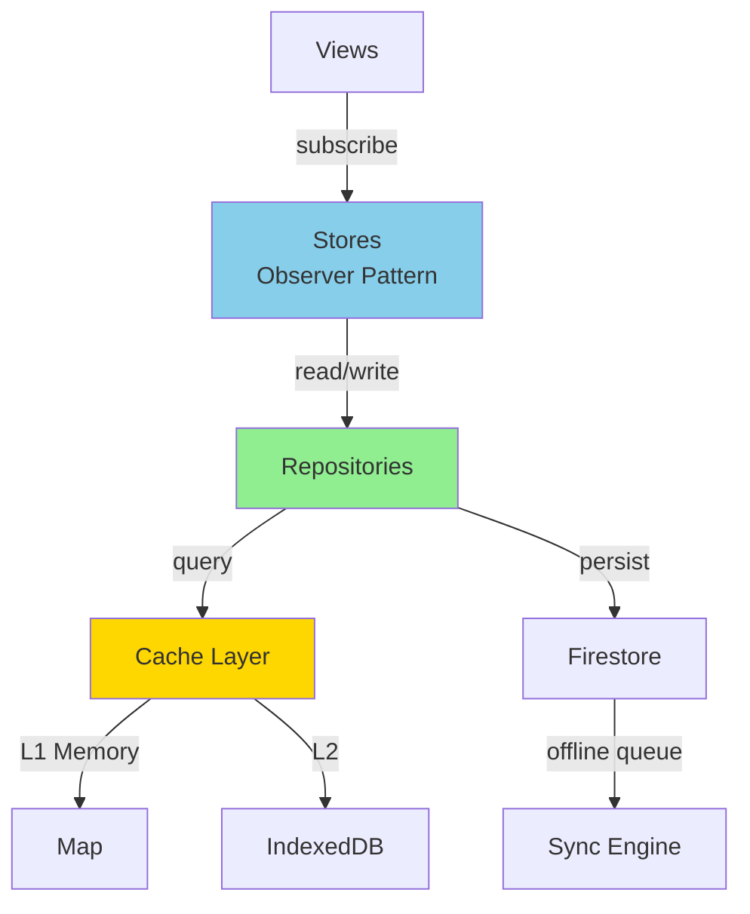

# Sprint 5: Firestore Persistence Architecture Specification

**Status**: 📋 Planning / Design Review  
**Date**: 2025-11-28  
**Version**: 1.0

---

## Table of Contents
1. [Current State Analysis](#current-state-analysis)
2. [Design Pattern Comparison](#design-pattern-comparison)
3. [Recommended Architecture](#recommended-architecture)
4. [Data Models](#data-models)
5. [Migration Strategy](#migration-strategy)
6. [Implementation Plan](#implementation-plan)
7. [Risk Analysis](#risk-analysis)

---

## Current State Analysis

### Existing Architecture

**State Management**: Observer Pattern (Stores)
```javascript
// AlbumsStore, SeriesStore, PlaylistsStore
- In-memory state management
- Pub/sub notification pattern
- Singleton instances
```

**Caching**: Hybrid L1/L2
```javascript
// AlbumCache.js
- L1: Memory Map (session-only)
- L2: localStorage (7-day TTL, version-based invalidation)
- ~5MB localStorage limit
- LRU eviction on QuotaExceeded
```

**Firestore Integration**: Direct Method Calls
```javascript
// Current pattern in stores:
async loadFromFirestore(db) {
  const snapshot = await db.collection('albums').get()
  this.albums = snapshot.docs.map(...)
}

async saveToFirestore(db, album) {
  await db.collection('albums').doc(album.id).update(album)
}
```

### Issues with Current Approach

❌ **No Abstraction Layer**
- Stores tightly coupled to Firestore API
- Hard to test (requires mocking Firestore)
- Difficult to swap persistence layer

❌ **localStorage Limitations**
- Cache invalidation on schema changes requires manual workarounds
- 5MB size limit (100-500 albums max)
- No cross-device sync
- Missing fields in old cache entries

❌ **No Offline-First Support**
- No queue for offline writes
- No conflict resolution
- Direct API calls fail when offline

❌ **Duplicate Storage Logic**
- Cache and Store have separate persistence logic
- No single source of truth

---

## Design Pattern Comparison

### Pattern 1: **Repository Pattern** 🏆 RECOMMENDED

**Description**: Abstract data access behind repository interfaces, isolating business logic from persistence details.

```javascript
// Interface (not enforced in JS, but conceptual)
class AlbumRepository {
  async findAll()
  async findById(id)
  async save(album)
  async delete(id)
  async findBySeriesId(seriesId)
}

// Implementation
class FirestoreAlbumRepository extends AlbumRepository {
  constructor(firestore, cache) {
    this.db = firestore
    this.cache = cache
  }

  async findById(id) {
    // Try cache first
    const cached = await this.cache.get(`album:${id}`)
    if (cached) return cached

    // Fetch from Firestore
    const doc = await this.db.collection('albums').doc(id).get()
    const album = { id: doc.id, ...doc.data() }

    // Update cache
    await this.cache.set(`album:${id}`, album)
    return album
  }
}
```

**Pros** ✅
- ✅ Clean separation ofconcerns
- ✅ Easy to test (mock repositories)
- ✅ Flexibility to swap backends (Firestore → IndexedDB → PostgreSQL)
- ✅ Single source for data access logic
- ✅ Supports query builders and filters
- ✅ Works well with DDD (Domain-Driven Design)

**Cons** ⚠️
- ⚠️ More boilerplate (interfaces + implementations)
- ⚠️ Might be overkill for simple CRUD
- ⚠️ Requires discipline to avoid bypassing repository

**Best For**:
- ✅ Complex queries
- ✅ Multiple data sources
- ✅ Long-term maintainability

---

### Pattern 2: **Active Record Pattern**

**Description**: Domain models contain persistence logic (like Rails ActiveRecord).

```javascript
class Album {
  constructor(data) {
    Object.assign(this, data)
  }

  static async find(id) {
    const doc = await db.collection('albums').doc(id).get()
    return new Album({ id: doc.id, ...doc.data() })
  }

  async save() {
    if (this.id) {
      await db.collection('albums').doc(this.id).update(this)
    } else {
      const ref = await db.collection('albums').add(this)
      this.id = ref.id
    }
  }

  async delete() {
    await db.collection('albums').doc(this.id).delete()
  }
}
```

**Pros** ✅
- ✅ Very simple and intuitive
- ✅ Less code (models know how to persist themselves)
- ✅ Rapid development

**Cons** ⚠️
- ⚠️ Tight coupling (models depend on Firestore)
- ⚠️ Hard to test without actual database
- ⚠️ Violates Single Responsibility Principle
- ⚠️ Difficult to swap backends
- ⚠️ Models bloated with persistence logic

**Best For**:
- Prototypes
- Simple CRUD apps
- Rails-like conventions

---

### Pattern 3: **Data Mapper Pattern**

**Description**: Complete separation between domain models and database schema via mapper classes.

```javascript
// Domain Model (Pure POJO)
class Album {
  constructor({ id, title, artist, tracks }) {
    this.id = id
    this.title = title
    this.artist = artist
    this.tracks = tracks
  }
}

// Mapper
class AlbumMapper {
  toDomain(firestoreDoc) {
    const data = firestoreDoc.data()
    return new Album({
      id: firestoreDoc.id,
      title: data.title,
      artist: data.artist,
      tracks: (data.tracks || []).map(t => new Track(t))
    })
  }

  toFirestore(album) {
    return {
      title: album.title,
      artist: album.artist,
      tracks: album.tracks.map(t => this.trackToFirestore(t))
    }
  }
}
```

**Pros** ✅
- ✅ Complete decoupling (domain != database)
- ✅ Easy to evolve schema independently
- ✅ Clean domain models
- ✅ Supports complex transformations

**Cons** ⚠️
- ⚠️ Most boilerplate code
- ⚠️ Over-engineering for small apps
- ⚠️ Requires maintaining mappers for all models

**Best For**:
- Enterprise applications  
- Complex domain logic
- Legacy database migrations

---

### Pattern 4: **Service Layer + DAO**

**Description**: Business logic in services, data access in DAOs (Data Access Objects).

```javascript
// DAO
class AlbumDAO {
  async getAll() {}
  async getById(id) {}
  async insert(album) {}
  async update(album) {}
  async delete(id) {}
}

// Service
class AlbumService {
  constructor(albumDAO, cache) {
    this.dao = albumDAO
    this.cache = cache
  }

  async getAlbum(id) {
    // Business logic + caching
    const cached = this.cache.get(id)
    if (cached) return cached

    const album = await this.dao.getById(id)
    this.cache.set(id, album)
    return album
  }
}
```

**Pros** ✅
- ✅ Clear separation (business vs data)
- ✅ Testable (mock DAOs)
- ✅ Familiar to Java/Spring developers

**Cons** ⚠️
- ⚠️ More layers (Service + DAO)
- ⚠️ Can become verbose
- ⚠️ DAO vs Repository often blurred

**Best For**:
- Java-style architectures
- Complex business rules
- Team familiar with Spring/JEE

---

## Recommended Architecture

**Choice**: ✅ **Repository Pattern** with **Light Data Mappers**

**Rationale**:
1. **Balance** between simplicity  and flexibility
2. **Testability** without over-engineering
3. **Future-proof** (can swap Firestore → other backends)
4. **Familiar** to most developers
5. **Works well** with existing Observer (Store) pattern

### Architecture Diagram



### Folder Structure

```
public/js/
├── stores/                   # Existing (minimal changes)
│   ├── albums.js            # Observer state management
│   ├── series.js
│   └── playlists.js
│
├── repositories/             # NEW - Data access layer
│   ├── BaseRepository.js    # Abstract base
│   ├── AlbumRepository.js   # Album-specific queries
│   ├── SeriesRepository.js
│   └── PlaylistRepository.js
│
├── cache/                    # Enhanced caching
│   ├── CacheManager.js      # Unified cache interface
│   ├── IndexedDBCache.js    # Replaces localStorage (NEW)
│   └── MemoryCache.js       # L1 cache
│
├── sync/                     # NEW - Offline sync
│   ├── SyncEngine.js        # Queue + conflict resolution
│   └── SyncQueue.js
│
└── models/                   # NEW - Domain models (optional)
    ├── Album.js
    ├── Series.js
    └── Track.js
```

---

## Data Models

### Firestore Collections Structure

> **IMPORTANT**: User-scoped from Sprint 5 to support Sprint 7 authentication

```
/users/{userId}/                      # ← User authentication (Sprint 7)
  - name: string                      # From Apple/Google OAuth
  - email: string
  - authProvider: "apple" | "google"
  - createdAt: timestamp
  - lastLogin: timestamp
  
  /inventory/                         # ← NEW: Global album collection (Sprint 5)
    /albums/{albumId}/
      - title: string
      - artist: string
      - year: number
      - format: "cd" | "vinyl" | "dvd" | "bluray" | "digital"  # Physical format
      - purchasePrice: number         # Optional (Sprint 6+)
      - purchaseDate: timestamp       # Optional (Sprint 6+)
      - condition: string             # Optional (Sprint 6+): "mint", "good", "fair"
      - notes: string                 # User notes
      - albumData: Album              # Full album data (tracks, acclaim, etc.)
      - addedToInventory: timestamp
      - updatedAt: timestamp
  
  /series/{seriesId}/
    - name: string
    - albumQueries: string[]          # List of "Artist - Album" queries
    - createdAt: timestamp
    - updatedAt: timestamp
    - owner: userId                   # For future sharing (Sprint 8?)
    - sourceType: "search" | "inventory"  # NEW: Where albums came from
    
    /albums/{albumId}/
      - title: string
      - artist: string
      - year: number
      - bestEverAlbumId: string
      - bestEverUrl: string
      - tracks: Track[]                # Ranked (denormalized)
      - tracksOriginalOrder: Track[]   # AS IS order
      - acclaim: { hasRatings, source, trackCount }
      - metadata: { 
          fetchedAt: timestamp,
          _schemaVersion: number,      # For migrations
          seriesId: string,            # Reference to parent
          inventoryAlbumId: string     # NEW: Link to inventory (if from inventory)
        }
      - lastFetched: timestamp         # For cache invalidation (7-day TTL)
      
    /playlists/{playlistId}/
      - name: string
      - tracks: TrackRef[]
      - createdAt: timestamp
      - updatedAt: timestamp
      - seriesId: string                # Reference to parent series
```

### Inventory Album Model

```javascript
{
  id: string,                      // Album ID (same as regular album)
  title: string,
  artist: string,
  year: number,
  
  // Physical collection metadata
  format: "cd" | "vinyl" | "dvd" | "bluray" | "digital",
  purchasePrice: number,           // Optional
  purchaseDate: timestamp,         // Optional
  condition: "mint" | "good" | "fair" | "poor",  // Optional
  notes: string,                   // User notes
  
  // Full album data (for creating series from inventory)
  albumData: {
    tracks: Track[],
    tracksOriginalOrder: Track[],
    acclaim: {...},
    bestEverAlbumId: string,
    // ... all standard album fields
  },
  
  // Timestamps
  addedToInventory: timestamp,
  updatedAt: timestamp
}
```

### Track Model

```javascript
{
  id: string,                 // Unique track ID
  title: string,
  rank: number,               // Acclaim rank (1-N)
  rating: number,             // 0-100 score
  duration: number,           // seconds
  position: number,           // Original album position
  metadata: {
    isrc: string,             // For Spotify matching (Sprint 8?)
    appleMusicId: string,     // ← Sprint 6 export
    spotifyId: string         // ← Sprint 8 (future)
  }
}
```

### Schema Versioning

```javascript
{
  _schemaVersion: 2,          // Increment on breaking changes
  _migratedFrom: 1,           // Track migration history
  _migrationDate: timestamp,
  // ... other fields
}
```

---

## Repository Pattern - Full CRUD Support

### Base Repository Interface

```javascript
export class BaseRepository {
  constructor(firestore, cache) {
    this.db = firestore
    this.cache = cache
  }

  // ========== READ ==========
  async findById(id) { /* ... */ }
  async findAll(filters = {}) { /* ... */ }
  async findByField(fieldName, value) { /* ... */ }

  // ========== CREATE ==========
  async create(data) {
    const docRef = await this.collection.add({
      ...data,
      createdAt: firebase.firestore.FieldValue.serverTimestamp(),
      _schemaVersion: this.schemaVersion
    })
    await this.cache.invalidate(this.getCacheKey('all'))
    return docRef.id
  }

  // ========== UPDATE ========== (Sprint 5 REQUIREMENT)
  async update(id, data) {
    await this.collection.doc(id).update({
      ...data,
      updatedAt: firebase.firestore.FieldValue.serverTimestamp()
    })
    await this.cache.invalidate(this.getCacheKey(id))
    await this.cache.invalidate(this.getCacheKey('all'))
    return id
  }

  // ========== DELETE ========== (Sprint 5 REQUIREMENT)
  async delete(id) {
    await this.collection.doc(id).delete()
    await this.cache.invalidate(this.getCacheKey(id))
    await this.cache.invalidate(this.getCacheKey('all'))
  }

  // ========== BATCH OPERATIONS ==========
  async deleteMany(ids) {
    const batch = this.db.batch()
    ids.forEach(id => {
      batch.delete(this.collection.doc(id))
    })
    await batch.commit()
    await Promise.all(ids.map(id => this.cache.invalidate(this.getCacheKey(id))))
    await this.cache.invalidate(this.getCacheKey('all'))
  }
}
```

### Series Repository Example

```javascript
export class SeriesRepository extends BaseRepository {
  constructor(firestore, cache, userId) {
    super(firestore, cache)
    this.userId = userId  // ← User scope for Sprint 7 auth
    this.collection = firestore.collection(`users/${userId}/series`)
    this.schemaVersion = 1
  }

  // Custom query: Find series with albums
  async findWithAlbums(seriesId) {
    const series = await this.findById(seriesId)
    const albumsSnapshot = await this.collection
      .doc(seriesId)
      .collection('albums')
      .get()
    
    series.albums = albumsSnapshot.docs.map(doc => ({
      id: doc.id,
      ...doc.data()
    }))
    
    return series
  }

  // CRUD: Update series name
  async rename(seriesId, newName) {
    return this.update(seriesId, { name: newName })
  }

  // CRUD: Delete series + all albums + playlists (CASCADE)
  async deleteWithCascade(seriesId) {
    // Delete all albums
    const albumsSnapshot = await this.collection
      .doc(seriesId)
      .collection('albums')
      .get()
    
    const batch = this.db.batch()
    albumsSnapshot.docs.forEach(doc => {
      batch.delete(doc.ref)
    })

    // Delete all playlists
    const playlistsSnapshot = await this.collection
      .doc(seriesId)
      .collection('playlists')
      .get()
    
    playlistsSnapshot.docs.forEach(doc => {
      batch.delete(doc.ref)
    })

    // Delete series itself
    batch.delete(this.collection.doc(seriesId))
    
    await batch.commit()
    await this.cache.invalidate(this.getCacheKey(seriesId))
    await this.cache.invalidate(this.getCacheKey('all'))
  }
}
```

### Album Repository Example

```javascript
export class AlbumRepository extends BaseRepository {
  constructor(firestore, cache, userId, seriesId) {
    super(firestore, cache)
    this.userId = userId
    this.seriesId = seriesId
    this.collection = firestore.collection(`users/${userId}/series/${seriesId}/albums`)
    this.schemaVersion = 2  // Incremented for new fields
  }

  // CRUD: Update album (e.g., edit tracks)
  async updateTracks(albumId, tracks) {
    return this.update(albumId, { 
      tracks,
      tracksOriginalOrder: tracks  // Keep both in sync
    })
  }

  // CRUD: Delete album
  async delete(albumId) {
    await super.delete(albumId)
    // Invalidate parent series cache
    await this.cache.invalidate(`series:${this.seriesId}`)
  }
}
```

---

## Migration Strategy

### Phase 1: Parallel Write (Safe) - WITH USER SCOPE

```javascript
// Week 1: Write to BOTH localStorage AND Firestore
async save(album, userId, seriesId) {
  // Old way (keep working - NO USER SCOPE)
  localStorage.setItem(key, JSON.stringify(album))
  
  // New way (USER-SCOPED for Sprint 7)
  const albumRepo = new AlbumRepository(firestore, cache, userId, seriesId)
  await albumRepo.create(album)
}
```

**⚠️ CRITICAL**: Sprint 5 must support `userId` parameter **even if auth not implemented yet**

**Workaround for Sprint 5** (no auth):
```javascript
const mockUserId = 'anonymous-user'  // Temporary until Sprint 7
const albumRepo = new AlbumRepository(firestore, cache, mockUserId, seriesId)
```

**Sprint 7 Migration**:
```javascript
// Move all 'anonymous-user' data to real userId after login
async migrateAnonymousToUser(realUserId) {
  const anonData = await db.collection('users/anonymous-user/series').get()
  const batch = db.batch()
  
  anonData.docs.forEach(doc => {
    const newRef = db.collection(`users/${realUserId}/series`).doc(doc.id)
    batch.set(newRef, doc.data())
  })
  
  await batch.commit()
  // Delete anonymous data
  await this.deleteAnonymousData()
}
```

### Phase 2: Read from Firestore, Fallback to localStorage

```javascript
async load(id, userId, seriesId) {
  try {
    const albumRepo = new AlbumRepository(firestore, cache, userId, seriesId)
    return await albumRepo.findById(id)
  } catch (error) {
    console.warn('Firestore unavailable, using localStorage')
    return JSON.parse(localStorage.getItem(key))
  }
}
```

### Phase 3: Migrate localStorage → Firestore (User-scoped)

```javascript
async migrateLocalStorage(userId) {
  const series = this.loadAllSeriesFromLocalStorage()
  
  for (const s of series) {
    const seriesRepo = new SeriesRepository(firestore, cache, userId)
    const seriesId = await seriesRepo.create(s)
    
    // Migrate albums
    const albumRepo = new AlbumRepository(firestore, cache, userId, seriesId)
    for (const album of s.albums) {
      album._schemaVersion = 2
      album._migratedFrom = 1
      await albumRepo.create(album)
    }
    
    // Migrate playlists
    const playlistRepo = new PlaylistRepository(firestore, cache, userId, seriesId)
    for (const playlist of s.playlists) {
      await playlistRepo.create(playlist)
    }
  }
  
  localStorage.clear()
}
```

### Phase 4: Firestore Only

```javascript
// Sprint 7: Full auth-aware persistence
async load(id) {
  const userId = authStore.getCurrentUser().uid  // ← From Apple/Google login
  const albumRepo = new AlbumRepository(firestore, cache, userId, seriesId)
  return await albumRepo.findById(id)
}
```

---

## Implementation Plan

> **CRITICAL**: Sprint 5 = **Production Release Candidate**
> - ✅ CRUD operations (delete/edit) **MUST** be included
> - ✅ Comprehensive testing before prod deployment
> - ✅ User-scoped from day 1 ('anonymous-user' fallback)

---

### Sprint 5.1: Repository Layer + CRUD + Inventory (Week 1 - Days 1-3)

**Goal**: Foundation with full CRUD support + Inventory System

**Tasks**:
- [ ] Create `BaseRepository` abstract class with CRUD methods
  - [ ] `create(data)` - Returns doc ID
  - [ ] `findById(id)` - With cache layer
  - [ ] `findAll(filters)` - With pagination support
  - [ ] `update(id, data)` - **PRODUCTION CRITICAL**
  - [ ] `delete(id)` - **PRODUCTION CRITICAL**
  - [ ] `deleteMany(ids)` - Batch operations
  
- [ ] Implement `SeriesRepository`
  - [ ] User-scoped collection path (`users/${userId}/series`)
  - [ ] `findWithAlbums(seriesId)` - Load series + albums
  - [ ] `rename(seriesId, newName)` - **CRUD**
  - [ ] `deleteWithCascade(seriesId)` - **CRUD** (deletes albums + playlists)
  - [ ] `createFromInventory(albumIds, seriesName)` - **NEW** (Create series from inventory selection)
  
- [ ] Implement `AlbumRepository`
  - [ ] User + Series scoped (`users/${userId}/series/${seriesId}/albums`)
  - [ ] `updateTracks(albumId, tracks)` - **CRUD**
  - [ ] `delete(albumId)` - **CRUD** (invalidates series cache)
  
- [ ] Implement `PlaylistRepository`
  - [ ] User + Series scoped
  - [ ] `update(playlistId, data)` - **CRUD**
  - [ ] `delete(playlistId)` - **CRUD**

- [ ] **Implement `InventoryRepository`** - **NEW FEATURE**
  - [ ] User-scoped collection path (`users/${userId}/inventory/albums`)
  - [ ] `addAlbum(album, format)` - Add album to inventory
  - [ ] `findAll()` - Get all inventory albums
  - [ ] `findByFormat(format)` - Filter by format ("cd", "vinyl", etc.)
  - [ ] `updateAlbum(albumId, { format, purchasePrice, notes })` - **CRUD**
  - [ ] `removeAlbum(albumId)` - **CRUD**
  - [ ] `getStatistics()` - Count by format, total value, etc. (Sprint 6+)

- [ ] **Create `InventoryStore`** - **NEW FEATURE**
  - [ ] Observer pattern (like AlbumsStore, SeriesStore)
  - [ ] State: `{ albums: [], loading: false, error: null }`
  - [ ] `addToInventory(album, format)` - Add album
  - [ ] `removeFromInventory(albumId)` - Remove album
  - [ ] `isInInventory(albumId)` - Check if album exists
  - [ ] `getInventoryAlbums()` - Get all albums
  - [ ] `subscribe(listener)` / `notify()` - Observer pattern

**Verification**:
```bash
# Unit tests (mock Firestore)
npm test -- repositories

# Expected: All CRUD operations tested INCLUDING Inventory
# - Create series/album/playlist
# - Update series name, album tracks, playlist tracks
# - Delete with cache invalidation
# - Cascade delete (series → albums + playlists)
# - Add/remove albums from inventory
# - Create series from inventory selection
```

**Acceptance Criteria**:
- ✅ All repositories pass unit tests
- ✅ CRUD methods invalidate cache correctly
- ✅ Cascade delete removes all child documents
- ✅ InventoryRepository can add/remove albums
- ✅ InventoryStore notifies listeners on changes
- ✅ No Firestore calls in tests (mocked)

---

### Sprint 5.2: Cache Layer - IndexedDB (Week 1 - Days 4-5)

**Goal**: Replace localStorage with IndexedDB for large datasets

**Tasks**:
- [ ] Create `IndexedDBCache` (L2 cache)
  - [ ] `get(key)` - Async read
  - [ ] `set(key, value, ttl)` - Async write with 7-day TTL
  - [ ] `delete(key)` - Invalidation
  - [ ] `clear()` - Wipe all cached data
  
- [ ] Create `CacheManager` (unified interface)
  - [ ] L1: Memory Map (fast, session-only)
  - [ ] L2: IndexedDB (persistent, cross-tab)
  - [ ] Auto fallback: IndexedDB → localStorage → none
  
- [ ] Schema versioning support
  - [ ] `_schemaVersion` field in cached data
  - [ ] Auto-invalidate on version mismatch

**Verification**:
```javascript
// Manual test in browser console
const cache = new CacheManager()
await cache.set('album:123', { title: 'Test', _schemaVersion: 2 })
const cached = await cache.get('album:123')
console.assert(cached.title === 'Test', 'Cache read failed')

// Test cross-tab sync
// 1. Open app in Tab 1
// 2. Create series in Tab 1
// 3. Open Tab 2
// 4. Verify series appears in Tab 2 (IndexedDB shared)
```

**Acceptance Criteria**:
- ✅ IndexedDB stores >100 albums without quota errors
- ✅ Cache reads <10ms (L1) or <30ms (L2)
- ✅ Cross-tab sync works (both tabs see same data)
- ✅ Old localStorage cache auto-migrates to IndexedDB

---

### Sprint 5.3: Migration Tool + CRUD UI + Inventory UI (Week 2 - Days 1-3)

**Goal**: Migrate localStorage → Firestore + Add delete/edit UI + Inventory UI

**Tasks**:
- [ ] Migration utility
  - [ ] Detect localStorage data on app load
  - [ ] Show "Migrate to Firestore" banner
  - [ ] Progress indicator (X/Y series migrated)
  - [ ] Error handling + rollback on failure
  - [ ] Mark migration complete (flag in localStorage)
  
- [ ] CRUD UI Components **PRODUCTION CRITICAL**
  - [ ] **Delete Series** modal
    - [ ] Confirmation: "Delete \"{name}\"? This will also delete X albums and Y playlists."
    - [ ] Cascade count preview
    - [ ] Loading state during deletion
  - [ ] **Edit Series Name** inline
    - [ ] Click name → editable input
    - [ ] Save on Enter, cancel on Esc
    - [ ] Validation (min 3 chars)
  - [ ] **Delete Album** button
    - [ ] Confirmation modal
    - [ ] Remove from series albums list (UI update)
  - [ ] **Edit/Delete Playlist** actions
    - [ ] Rename playlist
    - [ ] Delete playlist
    - [ ] Drag-and-drop track reordering (existing feature)

- [ ] **Inventory UI Components** - **NEW FEATURE**
  - [ ] **Add to Inventory** action in AlbumsView
    - [ ] Button/icon next to each album: "Add to Inventory"
    - [ ] Modal: Select format (CD, Vinyl, DVD, Blu-ray, Digital)
    - [ ] Optional: Add notes
    - [ ] Success notification: "Added to Inventory!"
    - [ ] Disable if already in inventory (show "In Inventory ✓")
  
  - [ ] **InventoryView** (new route: `/inventory`)
    - [ ] Grid/List toggle (like AlbumsView)
    - [ ] Filter by format dropdown: All | CD | Vinyl | DVD | Blu-ray | Digital
    - [ ] Search by artist/album
    - [ ] Album cards show:
      * Album cover
      * Title, Artist, Year
      * Format badge (colored: CD=blue, Vinyl=green, etc.)
      * "Remove from Inventory" button
      * "Edit" button (open edit modal)
    - [ ] Empty state: "Your inventory is empty. Add albums from Search or Albums view."
  
  - [ ] **Edit Inventory Album** modal
    - [ ] Change format (dropdown)
    - [ ] Add/edit purchase price (optional)
    - [ ] Add/edit purchase date (optional)
    - [ ] Add/edit condition (dropdown: Mint, Good, Fair, Poor)
    - [ ] Add/edit notes (textarea)
    - [ ] Save button
  
  - [ ] **Create Series from Inventory** flow
    - [ ] Multi-select mode in InventoryView (checkbox per album)
    - [ ] "Create Series from Selected" button
    - [ ] Shows when >= 2 albums selected
    - [ ] Modal: Enter series name
    - [ ] Creates series with selected albums (copies albumData)
    - [ ] Navigates to new series AlbumsView

**Verification**:
```bash
# Manual testing checklist:
1. ✅ Load app with localStorage data
2. ✅ Click "Migrate to Firestore" banner
3. ✅ Verify all series appear in Firestore console
4. ✅ Delete a series → confirm cascade delete works
5. ✅ Rename a series → verify update in Firestore
6. ✅ Delete an album → verify UI updates + Firestore deletion
7. ✅ Delete a playlist → verify removal

# NEW: Inventory tests
8. ✅ Add album to inventory (select format: Vinyl)
9. ✅ Verify album appears in /inventory route
10. ✅ Edit inventory album (change format to CD, add price)
11. ✅ Remove album from inventory
12. ✅ Add 5 albums to inventory
13. ✅ Multi-select 3 albums → Create Series
14. ✅ Verify new series has all 3 albums
```

**Acceptance Criteria**:
- ✅ Migration completes without data loss
- ✅ Delete confirmations prevent accidental deletions
- ✅ Cascade deletes work (series → albums + playlists)
- ✅ UI updates immediately after CRUD operations
- ✅ Firestore confirms deletions (check console)
- ✅ **Inventory albums persist in Firestore**
- ✅ **Create Series from Inventory works**
- ✅ **Filter by format works**

---

### Sprint 5.4: Production QA + Bug Fixing (Week 2 - Days 4-5)

**Goal**: Ensure production-ready quality

**Critical Testing Areas**:

1. **Data Integrity**:
   - [ ] Create 10 series with 5 albums each
   - [ ] Delete 3 series → verify cascade
   - [ ] Rename 2 series → verify persistence
   - [ ] Offline test: Go offline → create series → go online → verify sync queue works

2. **Performance**:
   - [ ] Load 100+ albums → verify <2s initial load (with cache)
   - [ ] Delete series with 20 albums → verify <1s total time
   - [ ] Switch between series → verify <500ms (cached)

3. **Error Handling**:
   - [ ] Firestore quota exceeded → verify fallback to localStorage
   - [ ] Network offline → verify graceful degradation (show message)
   - [ ] Concurrent edits (2 tabs) → verify last-write-wins

4. **Browser Compatibility**:
   - [ ] Chrome (latest)
   - [ ] Firefox (latest)
   - [ ] Safari (latest)
   - [ ] Mobile Safari (iOS)
   - [ ] Chrome Mobile (Android)

5. **Edge Cases**:
   - [ ] Empty series (no albums) → verify can delete
   - [ ] Series with 1 album → verify can delete album
   - [ ] Special characters in names (émojis, 中文) → verify saves correctly
   - [ ] Very long series name (>200 chars) → verify validation

**Bug Fixing Protocol**:
```
Priority Levels:
- P0 (Blocker): Data loss, app crashes → FIX IMMEDIATELY
- P1 (Critical): CRUD broken, major UX issue → FIX IN 24h
- P2 (High): Minor bugs, polish → FIX IN SPRINT
- P3 (Low): Nice-to-haves → DEFER TO SPRINT 6

Bug Triage:
1. Reproduce bug
2. Document in troubleshooting_log.md
3. Create fix + test
4. Verify fix doesn't break other features
5. Mark as resolved
```

**Acceptance Criteria** (Production Release Gate):
- ✅ **ZERO P0 bugs**
- ✅ **ZERO P1 bugs**
- ✅ All manual tests pass
- ✅ Performance benchmarks met
- ✅ Cross-browser tested
- ✅ Migration tested with real localStorage data

---

### Sprint 5 Deliverables Summary

**Features**:
- ✅ Firestore persistence (series/albums/playlists)
- ✅ IndexedDB cache (replaces localStorage)
- ✅ **CRUD operations** (delete series/albums/playlists, edit names)
- ✅ **Inventory System** - Mark albums you own + create series from inventory
- ✅ Migration tool (localStorage → Firestore)
- ✅ User-scoped data model ('anonymous-user' fallback)
- ✅ Repository pattern (testable, extensible)

**Documentation**:
- ✅ `SPRINT_5_PERSISTENCE_ARCHITECTURE.md` (this doc)
- ✅ `troubleshooting_log.md` (updated with Sprint 5 issues)
- ✅ `CHANGELOG.md` (Sprint 5 entry)

**Tests**:
- ✅ Repository unit tests (mocked Firestore)
- ✅ InventoryRepository unit tests
- ✅ Cache layer tests
- ✅ Manual QA checklist (all passing)

**Production Readiness**:
- ✅ No P0/P1 bugs
- ✅ Performance benchmarks met
- ✅ Cross-browser compatible
- ✅ Rollback plan (keep localStorage as backup)
- ✅ Inventory feature fully tested

---

### Post-Sprint 5: Production Deployment

**Deployment Checklist**:
```bash
# 1. Final verification
npm run build
npm run test
# Verify all tests pass

# 2. Manual smoke test
# - Create series
# - Add albums
# - Delete series (cascade)
# - Verify Firestore console shows correct data

# 3. Deploy
firebase deploy --only hosting
# Or your deployment method

# 4. Monitor
# - Check Firestore quotas (should be <1% of free tier)
# - Watch for errors in browser console
# - User feedback monitoring

# 5. Rollback plan (if needed)
# - Revert to previous deployment
# - localStorage still has backup data
```

**Success Metrics** (Week 1 post-release):
- ✅ Zero data loss reports
- ✅ <1% error rate
- ✅ Firestore quota <5% of daily limit
- ✅ Positive user feedback on CRUD features

---

## Risk Analysis

### High Risk ⚠️

**Data Loss During Migration**
- **Mitigation**: Parallel write period (keep localStorage as backup)
- **Rollback**: Keep localStorage until 100% verified

**Firestore Quota Exceeded**
- **Mitigation**: Monitor usage, implement pagination
- **Limit**: 50K reads/day (free tier)

### Medium Risk ⚠️

**Schema Changes Break Old Clients**
- **Mitigation**: Schema versioning + migration scripts
- **Strategy**: Support N-1 versions

**Offline Sync Conflicts**
- **Mitigation**: Last-write-wins + timestamp comparison
- **Future**: CRDTs for collaborative editing (Sprint 6)

### Low Risk ✅

**Performance Regression**
- **Mitigation**: IndexedDB faster than localStorage for large datasets
- **Benchmark**: Test with 500+ albums

---

## Success Criteria

✅ **Functional**:
- [ ] Save/load albums to/from Firestore
- [ ] Offline editing works (queued sync)
- [ ] Migration tool successfully migrates localStorage → Firestore
- [ ] Zero data loss

✅ **Performance**:
- [ ] Initial load < 2s (with cache)
- [ ] Save operation < 500ms
- [ ] Offline queue processes in background

✅ **Developer Experience**:
- [ ] Repositories testable without Firebase emulator
- [ ] Clear separation of concerns
- [ ] Easy to add new models

---

## Next Steps

1. **👥 User Review**: Discuss this architecture doc
2. **🔧 Finalize Design**: Incorporate feedback
3. **📋 Implementation Plan**: Break down into tickets
4. **🚀 Start Coding**: Begin with Repository layer

---

## Performance Analysis

### Current Performance Baselines

**localStorage Cache** (Current):
```
- Write: ~1-5ms (synchronous, blocks main thread)
- Read: ~1-3ms (synchronous)
- Size limit: 5MB (~100-500 albums)
- Quota exceeded: Manual cleanup required
```

**Memory Cache** (L1):
```
- Write: <1ms (Map.set)
- Read: <1ms (Map.get)
- Size limit: Unlimited (until browser kills tab)
- Eviction: None (cleared on refresh)
```

### Proposed Performance (IndexedDB)

**IndexedDB Cache** (L2):
```javascript
// Benchmarks from MDN and Chrome tests:
- Write (single): ~5-15ms (async, non-blocking)
- Write (batch 100): ~50-150ms (transaction)
- Read (single): ~3-8ms
- Read (query): ~10-30ms (with index)
- Size limit: ~50% of available disk (hundreds of MB)
- Concurrent: Yes (multiple tabs share data)
```

**Performance Comparison**:
```
Operation          localStorage    IndexedDB    Winner
─────────────────────────────────────────────────────
Single Write        1-5ms          5-15ms       ❌ (but non-blocking ✅)
Batch Write (100)   100-500ms      50-150ms     IndexedDB ✅
Single Read         1-3ms          3-8ms        localStorage (marginal)
Large Dataset       Slow (parse)   Fast (index) IndexedDB ✅
Storage Limit       5MB            ~500MB+      IndexedDB ✅
Multi-tab Sync      ❌ (events)     ✅ (native)   IndexedDB ✅
```

**Verdict**: ✅ IndexedDB wins for:
- Large datasets (>50 albums)
- Batch operations
- Multi-tab consistency
- Future scalability

---

### Firestore Performance & Quotas

**Free Tier Limits** (Spark Plan):
```
Daily Quotas:
- Reads: 50,000/day
- Writes: 20,000/day
- Deletes: 20,000/day
- Storage: 1GB

Rate Limits:
- Max 1 write/second per document
- Max 500 reads/second
```

**Estimated Usage** (100 albums, 3 users):
```javascript
// Load series with 20 albums:
// 1 read (series) + 20 reads (albums) = 21 reads

// Daily usage (3 users, 5 series each):
3 users × 5 series × 21 reads = 315 reads/day
315 / 50,000 = 0.63% of daily quota ✅

// Album writes (cache misses):
3 users × 5 new albums/day = 15 writes/day
15 / 20,000 = 0.075% of daily quota ✅
```

**Optimization Strategy**:
1. **Cache-First**: Always check IndexedDB before Firestore
2. **Batch Reads**: Use `getAll()` instead of individual `get()`
3. **Real-time Listeners**: Only for active series (not all albums)
4. **TTL Strategy**: Re-fetch only if `lastFetched > 7 days`

---

### Curation Algorithm Performance

**Current Complexity** (CurationEngine):
```javascript
// From curation.js analysis:
enrichTracks(album):      O(n) where n = tracks per album
curate(albums):           O(m × n) where m = albums, n = tracks
fillPlaylist:             O(k × remaining) where k = playlists
runFase4SwapBalancing:    O(iterations × p² × t²) 
                          // p = playlists, t = tracks per playlist
                          // Max iterations = 100

// WORST CASE: 10 albums × 12 tracks = 120 tracks total
enrichTracks:    10 × 12 = 120 ops      (~5ms)
curate:          10 × 12 = 120 ops      (~10ms)
fillPlaylist:    4 × 80 = 320 ops       (~5ms)
swapBalancing:   100 × 4² × 10² = 160K ops  (~200-500ms) ⚠️

Total: ~220-520ms (acceptable for offline processing)
```

**Optimization Opportunities** (Sprint 6):
- [ ] Cache enriched tracks in Firestore (avoid re-enrichment)
- [ ] Limit swap iterations based on convergence rate
- [ ] Web Worker for curation (off main thread)

---

### Real-Time Sync Performance

**Firestore Real-Time Listeners**:
```javascript
// Pattern: Subscribe only to active series
const unsubscribe = db
  .collection('series/${activeSeries.id}/albums')
  .onSnapshot(snapshot => {
    // Process changes
    snapshot.docChanges().forEach(change => {
      if (change.type === 'added') { ... }
      if (change.type === 'modified') { ... }
      if (change.type === 'removed') { ... }
    })
  })

// Performance:
- Initial load: ~100-500ms (depends on album count)
- Update notification: ~50-200ms (websocket)
- Bandwidth: ~1-5KB per update

// ⚠️ Warning: Each listener = 1 concurrent connection
// Free tier: Max 100 concurrent connections
// Strategy: Only 1 listener per active series (not all series)
```

---

## Future Integrations Analysis

> **UPDATED ROADMAP** (per user feedback 2025-11-28):
> - Sprint 6: Apple Music Export (only)
> - Sprint 7: Authentication (Apple ID + Google) + CRUD
> - Sprint 8: Spotify Export (deferred)

---

### Sprint 6: Apple Music Integration (Export Only)

**Scope**:
1. ✅ Apple Music OAuth2 (Backend proxy)
2. ✅ Apple Music API Client
3. ✅ Export Workflow UI
4. ❌ ~~Spotify~~ (moved to Sprint 8)

**Architecture Impact**:

**1. OAuth2 Flow** (Backend required):
```javascript
// Apple Music requires server-side OAuth (client_secret)
// Frontend cannot handle this securely

// NEW BACKEND ENDPOINTS:
POST /api/apple-music/auth
  Body: { code: string }
  Returns: { access_token, refresh_token, expires_in }

POST /api/apple-music/create-playlist
  Body: { name, description, tracks: [...] }
  Returns: { playlistId, url }

POST /api/apple-music/search-track
  Body: { isrc?: string, query?: string }
  Returns: { appleMusicId, name, artist }
```

**2. AuthStore** (NEW - Sprint 6):
```javascript
// public/js/stores/auth.js
export class AuthStore {
  constructor() {
    this.appleMusicToken = null
    this.googleUserId = null      // ← Sprint 7
    this.appleUserId = null        // ← Sprint 7
    this.tokenExpiry = null
    this.listeners = new Set()
  }

  // Apple Music OAuth
  async connectAppleMusic() {
    // Redirect to backend proxy
    window.location.href = '/api/apple-music/auth/start'
  }

  async handleAppleMusicCallback(code) {
    const response = await fetch('/api/apple-music/auth', {
      method: 'POST',
      headers: { 'Content-Type': 'application/json' },
      body: JSON.stringify({ code })
    })
    const { access_token, refresh_token, expires_in } = await response.json()
    
    this.appleMusicToken = access_token
    this.tokenExpiry = Date.now() + (expires_in * 1000)
    this.saveToLocalStorage()
    this.notify()
  }

  async refreshAppleMusicToken() {
    // Auto-refresh if expired
    if (Date.now() >= this.tokenExpiry) {
      const response = await fetch('/api/apple-music/refresh')
      const { access_token, expires_in } = await response.json()
      this.appleMusicToken = access_token
      this.tokenExpiry = Date.now() + (expires_in * 1000)
      this.saveToLocalStorage()
    }
  }

  isAppleMusicConnected() {
    return !!this.appleMusicToken && Date.now() < this.tokenExpiry
  }
}

export const authStore = new AuthStore()
```

**3. Track Matching via Apple Music ID**:
```javascript
// Strategy: Match by ISRC (if available) or fuzzy search
export class AppleMusicMatcher {
  constructor(apiClient) {
    this.api = apiClient
    this.cache = new Map()  // Cache successful matches
  }

  async matchTrack(track) {
    // 1. Try ISRC (most reliable)
    if (track.metadata?.isrc) {
      const result = await this.api.searchTrack({ isrc: track.metadata.isrc })
      if (result) {
        this.cache.set(track.id, result.appleMusicId)
        return result
      }
    }

    // 2. Fuzzy search (title + artist)
    const query = `${track.title} ${track.artist || ''}`
    const result = await this.api.searchTrack({ query })
    
    if (result) {
      this.cache.set(track.id, result.appleMusicId)
      return result
    }

    // 3. Manual fallback (user must select)
    return null
  }

  async matchPlaylist(playlist, onProgress) {
    const results = []
    for (let i = 0; i < playlist.tracks.length; i++) {
      const track = playlist.tracks[i]
      const match = await this.matchTrack(track)
      results.push({ track, match })
      onProgress?.(i + 1, playlist.tracks.length, match !== null)
    }
    return results
  }
}
```

**4. Export Workflow UI**:
```javascript
// PlaylistsView.js - Export button
renderExportSection() {
  return `
    <div class="export-section">
      ${authStore.isAppleMusicConnected() ? `
        <button class="btn btn-primary" id="exportAppleMusic">
          ${getIcon('Music', 'w-5 h-5')}
          Export to Apple Music
        </button>
      ` : `
        <button class="btn btn-secondary" id="connectAppleMusic">
          Connect to Apple Music
        </button>
      `}
    </div>
  `
}

// Export handler
async handleAppleMusicExport(playlist) {
  // Show modal
  this.showExportModal('apple-music', playlist)

  // Match tracks
  const matcher = new AppleMusicMatcher(appleMusicAPI)
  const results = await matcher.matchPlaylist(playlist, (current, total, success) => {
    this.updateExportProgress(current, total, success ? 'matched' : 'unmatched')
  })

  // Handle unmatched tracks
  const unmatched = results.filter(r => !r.match)
  if (unmatched.length > 0) {
    await this.handleUnmatchedTracks(unmatched)  // Manual search UI
  }

  // Create playlist
  const appleMusicIds = results.filter(r => r.match).map(r => r.match.appleMusicId)
  const response = await appleMusicAPI.createPlaylist({
    name: playlist.name,
    description: `Generated by MJRP Playlist Synthesizer`,
    tracks: appleMusicIds
  })

  // Success
  this.showExportSuccess(response.url)
}
```

**Repository Pattern Benefits**:
- ✅ No changes needed to core Repository pattern
- ✅ Track `metadata.appleMusicId` already in schema
- ✅ AuthStore handles token management separately

---

### Sprint 7: Authentication + CRUD Operations

**Scope**:
1. ✅ Login with Apple ID
2. ✅ Login with Google Account
3. ✅ Capture name + email only (minimal data)
4. ✅ **CRUD for Series, Albums, Playlists**

**Architecture Impact**:

**1. Firebase Authentication Setup**:
```javascript
// firebase-config.js
import firebase from 'firebase/app'
import 'firebase/auth'

const firebaseConfig = {
  // ... existing config
}

firebase.initializeApp(firebaseConfig)

export const auth = firebase.auth()
export const googleProvider = new firebase.auth.GoogleAuthProvider()
export const appleProvider = new firebase.auth.OAuthProvider('apple.com')

// Request only name + email
googleProvider.addScope('email')
googleProvider.addScope('profile')

appleProvider.addScope('email')
appleProvider.addScope('name')
```

**2. AuthStore Enhancement**:
```javascript
export class AuthStore {
  constructor() {
    this.currentUser = null  // { uid, name, email, authProvider }
    this.appleMusicToken = null  // Sprint 6 export token
    this.listeners = new Set()

    // Listen to auth state changes
    auth.onAuthStateChanged(user => {
      if (user) {
        this.currentUser = {
          uid: user.uid,
          name: user.displayName,
          email: user.email,
          authProvider: user.providerData[0]?.providerId
        }
        this.migrateAnonymousData(user.uid)  // ← Migrate 'anonymous-user' data
      } else {
        this.currentUser = null
      }
      this.notify()
    })
  }

  async loginWithGoogle() {
    const result = await auth.signInWithPopup(googleProvider)
    return result.user
  }

  async loginWithApple() {
    const result = await auth.signInWithPopup(appleProvider)
    return result.user
  }

  async logout() {
    await auth.signOut()
  }

  getCurrentUser() {
    return this.currentUser || { uid: 'anonymous-user' }  // ← Fallback for Sprint 5-6
  }

  async migrateAnonymousData(realUserId) {
    // Called automatically after first login
    const anonSeries = await db.collection('users/anonymous-user/series').get()
    if (anonSeries.empty) return

    const batch = db.batch()
    anonSeries.docs.forEach(doc => {
      const newRef = db.collection(`users/${realUserId}/series`).doc(doc.id)
      batch.set(newRef, doc.data())
    })
    await batch.commit()

    // Delete anonymous data
    const deleteAnon = db.batch()
    anonSeries.docs.forEach(doc => {
      deleteAnon.delete(doc.ref)
    })
    await deleteAnon.commit()
  }
}
```

**3. CRUD Operations** (Already in Repository Pattern ✅):

**Series CRUD**:
```javascript
// Rename series
await seriesRepository.rename(seriesId, 'New Name')

// Delete series (CASCADE deletes albums + playlists)
await seriesRepository.deleteWithCascade(seriesId)
```

**Albums CRUD**:
```javascript
// Update album tracks
await albumRepository.updateTracks(albumId, updatedTracks)

// Delete album
await albumRepository.delete(albumId)
```

**Playlists CRUD**:
```javascript
// Update playlist name
await playlistRepository.update(playlistId, { name: 'New Name' })

// Delete playlist
await playlistRepository.delete(playlistId)
```

**4. UI Components** (NEW):

**Edit Series Modal**:
```javascript
renderEditSeriesModal(series) {
  return `
    <div class="modal">
      <h2>Edit Series</h2>
      <input id="seriesName" value="${series.name}" />
      <button id="saveSeries">Save</button>
      <button id="deleteSeries" class="btn-danger">
        Delete Series (and all albums)
      </button>
    </div>
  `
}
```

**Delete Confirmations**:
```javascript
async confirmDelete(type, name, cascadeInfo) {
  return confirm(
    `Delete ${type} "${name}"?\n\n` +
    `${cascadeInfo || 'This action cannot be undone.'}`
  )
}

// Usage:
if (await this.confirmDelete('series', series.name, 
  `This will also delete ${albumCount} albums and ${playlistCount} playlists.`
)) {
  await seriesRepository.deleteWithCascade(seriesId)
}
```

**Repository Pattern Benefits**:
- ✅ CRUD methods already designed for Sprint 7
- ✅ User-scoped paths ready (`users/${userId}/...`)
- ✅ Cascade deletes via batch operations
- ✅ Cache invalidation on mutations

---

### Sprint 8: Spotify Integration (Deferred)

**Moved from Sprint 6**:
- Spotify OAuth
- Spotify Web API Client
- ISRC-based track matching
- Export workflow

**Why Deferred**:
- Apple Music is priority (Sprint 6)
- Similar architecture to Apple Music
- Can reuse AuthStore pattern
- Track `metadata.spotifyId` already in schema

---

### Multi-Tenant / Collaborative Series (Sprint 9+?)

**Potential Future Feature**:
```javascript
/users/{userId}/series/{seriesId}
  - sharedWith: string[]  // Array of user IDs
  - permissions: {
      [userId]: 'view' | 'edit' | 'admin'
    }
```

**Repository Support**:
```javascript
class SeriesRepository {
  async findByUser(userId) {
    // Return series where owner = userId OR sharedWith contains userId
    const owned = await this.collection
      .where('owner', '==', userId)
      .get()
    
    const shared = await this.collection
      .where('sharedWith', 'array-contains', userId)
      .get()
    
    return [...owned.docs, ...shared.docs].map(doc => ({
      id: doc.id,
      ...doc.data()
    }))
  }
}
```

---

### Performance Optimization Roadmap

**Sprint 5 (Foundation)**:
- [x] Repository pattern (decoupled, testable)
- [x] IndexedDB cache (large datasets)
- [x] Firestore persistence (cross-device)
- [x] User-scoped data model (Sprint 7-ready)
- [x] Full CRUD operations in repositories
- [ ] Background sync queue (offline-first)

**Sprint 6 (Apple Music Export)**:
- [ ] Apple Music OAuth backend proxy
- [ ] Track matching with ISRC fallback
- [ ] Export progress UI with unmatched handling
- [ ] Cache matched appleMusicIds in Firestore

**Sprint 7 (Auth + CRUD)**:
- [ ] Firestore query optimization (composite indexes)
- [ ] Denormalized data for complex queries
- [ ] CDN for static assets
- [ ] Service Worker for offline-first PWA

---

## Appendix: Code Examples

### Example: AlbumRepository Implementation

```javascript
export class AlbumRepository {
  constructor(firestore, cache) {
    this.db = firestore
    this.cache = cache
    this.collection = 'albums'
  }

  async findById(id) {
    // Try cache
    const cached = await this.cache.get(`album:${id}`)
    if (cached) return cached

    // Fetch from Firestore
    const doc = await this.db.collection(this.collection).doc(id).get()
    if (!doc.exists) throw new Error('Album not found')

    const album = { id: doc.id, ...doc.data() }
    
    // Cache result
    await this.cache.set(`album:${id}`, album)
    return album
  }

  async findBySeriesId(seriesId) {
    const snapshot = await this.db
      .collection(this.collection)
      .where('seriesId', '==', seriesId)
      .orderBy('createdAt', 'desc')
      .get()

    return snapshot.docs.map(doc => ({ id: doc.id, ...doc.data() }))
  }

  async save(album) {
    const data = {
      ...album,
      updatedAt: firebase.firestore.FieldValue.serverTimestamp(),
      _schemaVersion: 2
    }

    if (album.id) {
      await this.db.collection(this.collection).doc(album.id).update(data)
      await this.cache.invalidate(`album:${album.id}`)
      return album.id
    } else {
      const ref = await this.db.collection(this.collection).add({
        ...data,
        createdAt: firebase.firestore.FieldValue.serverTimestamp()
      })
      album.id = ref.id
      return ref.id
    }
  }

  async delete(id) {
    await this.db.collection(this.collection).doc(id).delete()
    await this.cache.invalidate(`album:${id}`)
  }
}
```

### Example: Using Repository in Store

```javascript
// AlbumsStore.js (updated)
export class AlbumsStore {
  constructor(albumRepository) {
    this.repo = albumRepository  // Injected dependency
    this.albums = []
    this.listeners = new Set()
  }

  async loadAlbums(seriesId) {
    this.loading = true
    this.notify()

    try {
      this.albums = await this.repo.findBySeriesId(seriesId)
      this.notify()
    } catch (error) {
      this.error = error.message
      this.notify()
    } finally {
      this.loading = false
      this.notify()
    }
  }

  async saveAlbum(album) {
    const id = await this.repo.save(album)
    
    // Update local state
    const existing = this.albums.find(a => a.id === id)
    if (existing) {
      Object.assign(existing, album)
    } else {
      this.albums.push({ ...album, id })
    }
    
    this.notify()
    return id
  }
}
```
