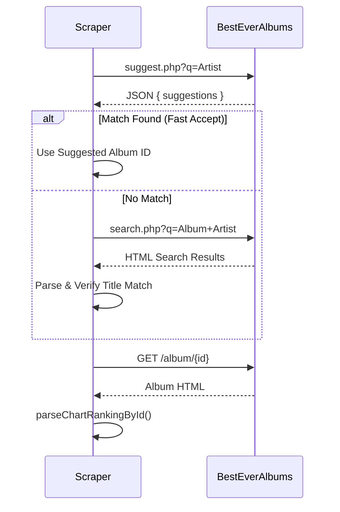

# Server Libraries Analysis

## 1. AI Client: `server/lib/aiClient.js`
**Status**: `[ACTIVE]`
**Type**: Utility / Service wrapper

### Logic
-   Wraps calls to Google Gemini API (`generativelanguage.googleapis.com`).
-   **Features**:
    -   Supports `google_search` grounding tool.
    -   Configurable `temperature` (0.1) and `maxTokens`.
    -   Legacy fallback for proxied endpoints.

---

## 2. Ranking Fetcher: `server/lib/fetchRanking.js`
**Status**: `[ACTIVE]`
**Type**: Domain Logic (Complex)

### Core Workflow
1.  **Preparation**: Loads normalization keys and ranking prompts.
2.  **Primary Source**: Scrapes **BestEverAlbums** (Community ratings).
3.  **Fallback Logic** (Critical):
    -   If BestEver has insufficient data (few rated tracks), triggers **Spotify Popularity** fallback.
    -   If Spotify Popularity has good coverage (>=50% tracks), it **replaces** the weak BestEver data entirely.
4.  **Enrichment**:
    -   Consolidates AI results with scraper results.

### Architecture Diagram
```mermaid
flowchart TD
    Start([Fetch Ranking]) --> BEA[BestEverAlbums Scraper]
    BEA --> Check{Suffient Data?}
    Check -- Yes --> AI_Check{Enrichment Needed?}
    Check -- No --> Spotify[Spotify Popularity Fallback]
    Spotify --> SpotCheck{Spotify Coverage >= 50%?}
    SpotCheck -- Yes --> UseSpotify[Use Spotify Data exclusively]
    SpotCheck -- No --> AI[AI Enrichment (Gemini)]
    AI_Check -- Yes --> AI
    AI_Check -- No --> Return
    AI --> Norm[Normalize & Merge]
    Norm --> Return([Return Ranking])
    UseSpotify --> Return
```

---

## 3. Logger: `server/lib/logger.js`
**Status**: `[ACTIVE]`
**Type**: Utility

### Logic
-   Simple structured logging (JSON output).
-   `info`, `warn`, `error` levels.
-   Designed for ingestion by cloud logging agents (Cloud Run).

---

## 4. Normalization: `server/lib/normalize.js`
**Status**: `[ACTIVE]`
**Type**: Utility / Data Cleaning

### Responsibilities
-   **Text Cleaning**: `cleanFencedMarkdown` removes Markdown code blocks from LLM responses.
-   **JSON Repair**: `tryParseJson` and `tryRecoverRankingFromText` attempt to extract valid JSON from broken AI text responses (e.g., finding the first valid `{}` block).
-   **Ranking Extraction**: Parsers for various list formats (Numbered lists, "ranking" keys).
-   **Album Normalization**: `extractAlbum` ensures fields like `tracks` are arrays and defaults are set.

---

## 5. Prompts Loader: `server/lib/prompts.js`
**Status**: `[ACTIVE]`
**Type**: Config Loader

### Logic
-   Loads `prompts.json` from either parent directory or container config path.
-   **Template Rendering**: `renderPrompt` handles `{{variable}}` substitution.

---

## 6. Ranking Logic: `server/lib/ranking.js`
**Status**: `[ACTIVE]`
**Type**: Algorithm

### Logic
-   **Consolidation**: Merges rankings from multiple sources.
-   **Matching**: Uses **Fuzzy Token Overlap** (`tokenOverlapRatio`) to match tracks (e.g., "Song (Live)" vs "Song").
-   **Scoring**:
    -   **Borda Count**: Points = `N - Position + 1`.
    -   **Prioritization**: Prefers explicit ratings (0-100) over calculated position scores when sorting.
-   **Output**: Returns consolidated `results` and `divergence` stats (unmatched tracks).

---

## 7. Schema Validator: `server/lib/schema.js`
**Status**: `[ACTIVE]`
**Type**: Validation

### Logic
-   Wraps `ajv` to compile `server/schema/album.schema.json`.
-   Gracefully handles missing `ajv` (logs warning instead of crashing).

---

## 8. Source Validator: `server/lib/validateSource.js`
**Status**: `[ACTIVE]`
**Type**: Validation / Network

### Logic
-   `verifyUrl(url)`: Performs a GET request (max 50KB) to ensure a URL is reachable (status < 400).
-   `isBestEverUrl(url)`: Whitelists `besteveralbums.com` (skips verification for known good domain).

---

## 9. Scraper: `server/lib/scrapers/besteveralbums.js`
**Status**: `[ACTIVE]`
**Type**: Web Scraper / Crawler

### Logic
-   **Target**: `besteveralbums.com`
-   **Heuristics**:
    -   **Smart Search**: Uses the site's `suggest.php` endpoint first for "fast accept" (avoiding full page loads if a "By [Artist]" match is found).
    -   **Fallback**: Standard HTML search via `search.php`.
    -   **Verification**: Checks page HTML (`h1`, `title`) to ensure the album matches the requested Artist/Title (prevents tribute/cover album mix-ups).
-   **Parsers**:
    -   `parseChartRankingById`: Extracts ratings from chart tables (looking for "Rating: 84 (398 votes)").
    -   `parseAlbumRanking`: HTML fallback if no chart table found.

    -   `parseAlbumRanking`: HTML fallback if no chart table found.

### Scraper Discovery Sequence


---

## 10. Service: `server/lib/services/spotifyPopularity.js`
**Status**: `[ACTIVE]`
**Type**: External API Client

### Logic
-   **Auth**: Client Credentials Flow (`grant_type: client_credentials`) to get a server-side Access Token.
-   **Workflow**:
    1.  Search `album:{title} artist:{name}` to get Album ID.
    2.  Get Album Tracks (IDs only).
    3.  **Batch Request**: Query `/v1/tracks` with up to 50 IDs to get the full track objects (which contain the `popularity` field).
    4.  **Output**: Maps `popularity` (0-100) directly to `rating`.
