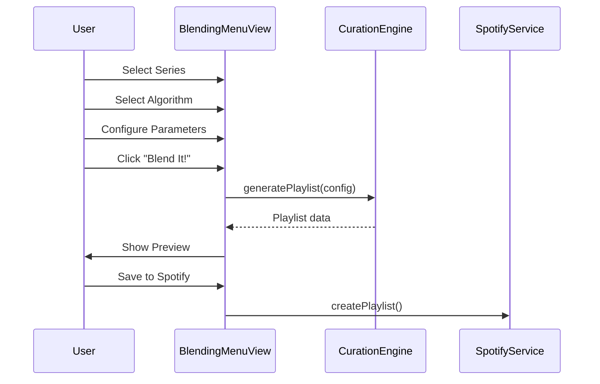

# Feature Specification: The Blending Menu

**Feature**: The Blending Menu - Playlist Generation Wizard  
**Created**: 2025-12-22  
**Updated**: 2025-12-23  
**Status**: 🟡 PARTIALLY IMPLEMENTED  
**Sprint**: 12 (V3 Architecture)  
**Route**: `/blend`

> [!NOTE]
> **Implementation Status (2025-12-23 17:40)**:
> - ✅ **Phase 1A**: Algorithm Mixins created (3 files, 14 tests ✅)
> - ✅ **Phase 1B**: TopN algorithms created (5 files, 16 tests ✅)
> - ✅ **Phase 2**: UI components created (BlendingMenuView, BlendFlavorCard, BlendSeriesSelector, BlendIngredientsPanel)
> - 🚧 **Phase 3**: Integration & Testing (in progress)
>   - ✅ Conditional Ingredients Panel (show/hide per algorithm)
>   - ✅ Connect UI config to algorithms (rankingType, outputMode, discoveryMode)
>   - 🔲 Background Enrichment Service (spec complete, implementation pending)

---

## 1. Problem Statement

### Current State
Users can manually generate playlists from a single album series by visiting the series and clicking "Generate Playlist". There's no centralized wizard to:
- Select multiple series as sources
- Configure algorithm parameters
- Preview and generate blended playlists

### Business Need
Provide a streamlined, visually appealing wizard interface that follows the **Restaurant Menu Metaphor** to make playlist generation intuitive and engaging.

---

## 2. Restaurant Metaphor Theme

> 🍹 **"Your Music, Your Recipe"**

| Section | Name | Purpose |
|---------|------|---------|
| Step 1 | **🍹 Choose Your Blend** | First select entity type (Album, Artist, Genre, Tracks), then select ONE series for that entity |
| Step 2 | **🍬 Choose Your Flavor** | Select blending algorithm (requires algorithm refactoring) |
| Step 3 | **🥗 Pick Your Ingredients** | Configure parameters (requires ranking/algorithm refactoring) |
| Step 4 | **🎛️ Blend It!** | Preview & Generate (requires algorithm refactoring) |

---

## 3. User Stories

### US1: Series Selection (P0)
> As a **Curator**, I want to select a music entity type (Album, Artist, Genre, or Tracks) and then choose ONE series of that type, so that I can blend the tracks from entities within that series.

**Acceptance Criteria**:
- [ ] Dropdown to select entity type first (Albums, Artists, Genres, Tracks)
- [ ] After entity selection, load available series for that entity type
- [ ] Select ONE series (single selection, not multi-select)
- [ ] Show selected series with visual feedback
- [ ] Blending happens on tracks of entities WITHIN the selected series

### US2: Algorithm Selection (P1)
> As a **Curator**, I want to choose a blending algorithm (flavor), so that I can control how tracks are selected and ordered.

**Acceptance Criteria**:
- [ ] Display available algorithms with user-friendly descriptions (for music lovers, not technical jargon)
- [ ] Visual cards for each algorithm option with clear icons
- [ ] Algorithms should explain in plain language what they do (e.g., "Picks the crowd favorites based on Spotify plays")

> [!NOTE]
> **Requires Algorithm Refactoring**: New algorithms need to be implemented to support this feature.

### US3: Parameter Configuration (P1)
> As a **Curator**, I want to configure playlist parameters, so that I can customize the output.

**Acceptance Criteria**:
- [ ] Duration: Total playlist length (30min, 1hr, 2hr, etc.)
- [ ] Output Mode: Single playlist vs Multiple playlists
- [ ] Number of Playlists (if multiple)
- [ ] Discovery Mode toggle (include unranked tracks)
- [ ] Fair Distribution toggle (equal representation per album)

### US4: Generate & Preview (P0)
> As a **Curator**, I want to preview and generate my playlist(s), so that I can see the result before saving.

**Acceptance Criteria**:
- [ ] **Dynamic CTA button**: "Blend your `<entity>` Playlist`<s>`!"
  - Entity changes based on selection (Album, Artist, Genre, Track)
  - Plural 's' only appears if multiple playlists
  - Examples: "Blend your Album Playlist!", "Blend your Artist Playlists!"
- [ ] Loading state during generation
- [ ] Preview of generated playlist(s)
- [ ] Save to Spotify / Save Locally buttons

> [!NOTE]
> **Playlist Output**: Reuse existing `PlaylistSeries` code for output management:
> - Drag & Drop reordering
> - Edit functionality
> - Delete capability
> - Save & Export features

---

## 4. UI Layout

### Desktop View
```
┌────────────────────────────────────────────────────────────────────────────────┐
│                           🍹 THE BLENDING MENU                                 │
│                          "Your Music, Your Recipe"                             │
├────────────────────────────────────────────────────────────────────────────────┤
│                                                                                │
│  ┌─────────────────────────────────────────────────────────────────────────┐  │
│  │  STEP 1: CHOOSE YOUR BLEND                                              │  │
│  │  ┌──────────────────┐   ┌──────────────────────────────────────────┐   │  │
│  │  │ Entity Type  ▼   │   │ Select Series...                        ▼│   │  │
│  │  │ Albums           │   │ [Beatles Collection] [Rock Essentials]   │   │  │
│  │  └──────────────────┘   └──────────────────────────────────────────┘   │  │
│  └─────────────────────────────────────────────────────────────────────────┘  │
│                                                                                │
│  ┌─────────────────────────────────────────────────────────────────────────┐  │
│  │  STEP 2: CHOOSE YOUR FLAVOR                                             │  │
│  │                                                                         │  │
│  │  ┌───────────┐  ┌───────────┐  ┌───────────┐  ┌───────────┐            │  │
│  │  │ Balanced  │  │Top-Heavy  │  │ Discovery │  │   Fair    │            │  │
│  │  │   ✓       │  │           │  │           │  │           │            │  │
│  │  └───────────┘  └───────────┘  └───────────┘  └───────────┘            │  │
│  └─────────────────────────────────────────────────────────────────────────┘  │
│                                                                                │
│  ┌─────────────────────────────────────────────────────────────────────────┐  │
│  │  STEP 3: PICK YOUR INGREDIENTS                                          │  │
│  │                                                                         │  │
│  │  Duration: [===●=====] 1 hour     Output: ○ Single  ● Multiple (3)     │  │
│  │                                                                         │  │
│  │  [✓] Discovery Mode    [ ] Fair Distribution                           │  │
│  └─────────────────────────────────────────────────────────────────────────┘  │
│                                                                                │
│  ┌─────────────────────────────────────────────────────────────────────────┐  │
│  │                      [ 🎛️ BLEND IT! ]                                   │  │
│  └─────────────────────────────────────────────────────────────────────────┘  │
│                                                                                │
└────────────────────────────────────────────────────────────────────────────────┘
```

---

## 5. Component Architecture

| Component | Responsibility |
|-----------|----------------|
| `BlendingMenuView.js` | Main view, orchestrates wizard steps |
| `BlendSeriesSelector.js` | Step 1: Entity filter + series multi-select |
| `BlendFlavorCard.js` | Step 2: Algorithm selection cards |
| `BlendIngredientsPanel.js` | Step 3: Parameter controls |
| `BlendPreview.js` | Result preview after generation |

---

## 6. Data Flow



---

## 7. Algorithm Options (Flavors)

> [!NOTE]
> **Algorithm Refactoring Required**: New algorithms must be implemented for the Blending Menu.

### New Algorithms (To Be Implemented)

| Algorithm | User-Friendly Name | Description (for music lovers) | Config |
|-----------|-------------------|-------------------------------|--------|
| **Top 3 Popular** | "Crowd Favorites" | Picks the top 3 most-played tracks from each album based on Spotify plays - the songs everyone loves! | Duration: 30m/45m/60m, Single/Multiple |
| **Top 3 Acclaimed** | "Critics' Choice" | Selects the top 3 tracks rated highest by critics (BEA/AOY rankings) - the hidden gems the experts love! | Duration: 30m/45m/60m, Single/Multiple |
| **Top 5 Popular** | "Greatest Hits" | A deeper dive into the 5 most-played tracks per album - more of what the crowd loves! | Duration: 30m/45m/60m, Single/Multiple |
| **Top 5 Acclaimed** | "Deep Cuts" | The 5 tracks that critics rate highest - for the discerning listener who wants quality over popularity! | Duration: 30m/45m/60m, Single/Multiple |

### Ranking Sources
| Source | Description | Status |
|--------|-------------|--------|
| **Spotify Ranking** | Track popularity score from Spotify (0-100) | ✅ Available |
| **BEA Ranking** | Best Ever Albums user-generated rankings | ✅ Available |
| **AOY Ranking** | Album of the Year expert rankings | ⚠️ **Feasibility Analysis Required** |

### Legacy Algorithms (Review for Parametrization)

| Algorithm | Description | Status |
|-----------|-------------|--------|
| `SDraftOriginalAlgorithm` | Original draft algorithm | ⚠️ Review |
| `SDraftBalancedAlgorithm` | Balanced distribution draft | ⚠️ Review |
| **`MJRPBalancedCascadeAlgorithm`** | **Cascade through tiers** | ⭐ **RECOMMENDED - User's preferred algorithm** |
| `MJRPBalancedCascadeV0Algorithm` | V0 cascade variant | ⚠️ Review |
| `LegacyRoundRobinAlgorithm` | Round-robin selection | ⚠️ Review |

---

## 8. Success Criteria

1. User can select entity type first, then ONE series to blend
2. User can choose algorithm (flavor) with clear user-friendly descriptions
3. User can configure parameters (ingredients): duration, single/multiple playlists
4. Playlist generation completes without errors
5. Preview shows track list before saving
6. Visual design follows Restaurant Menu Metaphor
7. Dynamic CTA button reflects entity and playlist count

---

## 9. Out of Scope (Phase 1)

- Artist/Genre/Track series views (Coming Soon - routes exist)
- Spotify playlist syncing (beyond basic create)
- AI-powered recommendations
- Cross-entity blending (Albums + Playlists together)

---

## 10. Open Questions - RESOLVED

| Question | Answer |
|----------|--------|
| Q1: Support cross-entity blending? | **No** - Single entity type per blend |
| Q2: Maximum series to blend? | **1** - Single series selection per blend |
| Q3: Save blend configurations for reuse? | **Deferred** - Phase 2 consideration |

---

## 11. Dependencies & Prerequisites

> [!WARNING]
> **Before implementing Blending Menu UI, the following must be completed:**

1. **Algorithm Analysis & Refactoring**:
   - Analyze existing algorithms for **parametrization potential**
   - Use `MJRPBalancedCascadeAlgorithm` as base (⭐ recommended)
   - Create 4 new algorithms (Top 3/5 Popular/Acclaimed) if parametrization not viable
2. **Ranking System Review**:
   - Spotify ranking: ✅ Available
   - BEA ranking: ✅ Available
   - AOY ranking: ⚠️ **Feasibility analysis required**
3. **CurationEngine Update**: Support new/parametrized algorithm interfaces
4. **PlaylistSeries Integration**: Ensure output can reuse existing playlist management features

---

## User Review Required

> [!IMPORTANT]
> **Spec Updated Per Your Feedback:**
> - ✅ Restaurant Menu Metaphor terminology
> - ✅ Single series selection model (entity first → series)
> - ✅ 4 new algorithms with user-friendly names
> - ✅ Dynamic CTA button
> - ✅ Algorithm refactoring noted as prerequisite
> - ✅ PlaylistSeries reuse for output (drag & drop, edit, save, export)
> - ✅ AOY ranking marked as feasibility analysis required
> - ✅ `MJRPBalancedCascadeAlgorithm` marked as RECOMMENDED
> - ✅ Existing algorithm parametrization analysis added
>
> **Ready for Plan phase?**


