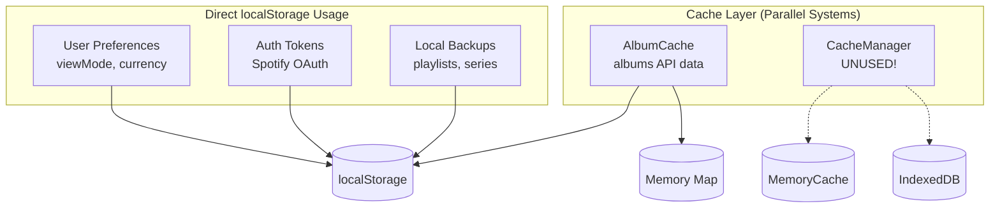
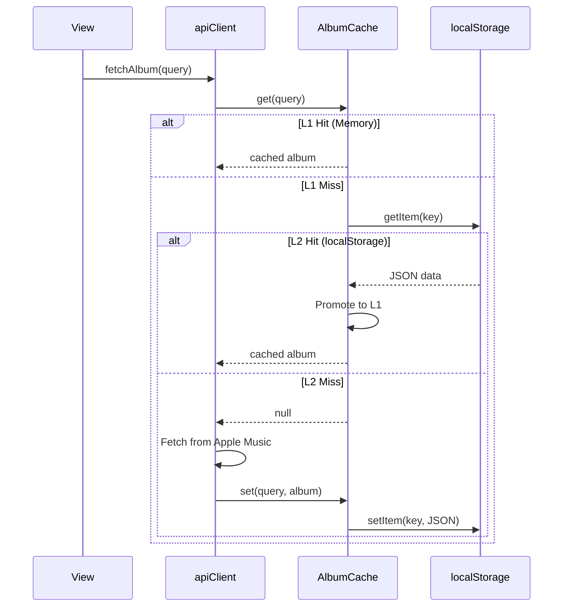

# Cache Architecture Documentation
**Date**: 2025-12-26
**Version**: 1.0

---

## Executive Summary

The application uses **3 different storage mechanisms** with **no unified strategy**:

| Storage | Persistence | Size Limit | Speed | Current Usage |
|---------|-------------|------------|-------|---------------|
| Memory (Map) | Session only | ~50MB | ⚡ Fast | L1 cache |
| localStorage | Permanent | ~5MB | 🔶 Medium | Albums, Auth, Prefs |
| IndexedDB | Permanent | ~500MB+ | 🔶 Medium | Available but UNUSED |

> [!CAUTION]
> **CacheManager with IndexedDB exists but is not being used!**
> AlbumCache uses localStorage as L2 instead.

---

## Storage Systems Map



---

## Component Usage Matrix

### By File Category

| Category | Files | Storage Used | Data Type |
|----------|-------|--------------|-----------|
| **Views** | SeriesView, AlbumsView, InventoryView | localStorage | User preferences |
| **Stores** | playlists.js, albumSeries.js | localStorage | Local backup (draft) |
| **Services** | SpotifyAuthService | localStorage | OAuth tokens |
| **Cache** | AlbumCache | Memory + localStorage | Album API responses |
| **Cache** | CacheManager | Memory + IndexedDB | **DEAD CODE** |

### Detailed localStorage Keys

| Key | Used By | Type | TTL |
|-----|---------|------|-----|
| `albumsViewMode` | SeriesView, AlbumsView | User Pref | ∞ |
| `inventoryViewMode` | InventoryView | User Pref | ∞ |
| `inventoryCurrency` | InventoryView | User Pref | ∞ |
| `mjrp_series` | albumSeries.js | Draft Backup | ∞ |
| `mjrp_current_playlists` | playlists.js | Draft Backup | ∞ |
| `spotify_access_token` | SpotifyAuthService | Auth | 1h |
| `spotify_refresh_token` | SpotifyAuthService | Auth | ∞ |
| `spotify_expires_at` | SpotifyAuthService | Auth | — |
| `album_cache_v3.1_*` | AlbumCache | API Cache | 7 days |

---

## Cache Flow Analysis

### Album Loading (Current)



---

## Identified Issues

### 1. Dead Code: CacheManager
- `CacheManager.js` and `IndexedDBCache.js` exist but are **never used**
- DEBT-2 was marked "resolved" but IndexedDB isn't utilized

### 2. localStorage Quota Risk
- 5MB limit for localStorage
- Album cache could grow large (each album ~5-10KB)
- ~500-1000 albums max before quota exceeded

### 3. No Cache Invalidation Strategy
- Only TTL-based (7 days)
- No version-based invalidation for schema changes
- Manual `version` bump in AlbumCache (currently 3.1)

### 4. Query-Based Keys
- Cache key = query string ("Artist - Album")
- Case/spacing differences = cache miss
- Example: "Pink Floyd - The Wall" ≠ "pink floyd-the wall"

### 5. Auth Tokens in localStorage
- Spotify tokens stored in localStorage (XSS vulnerable)
- Should use httpOnly cookies or sessionStorage

---

## Recommended Architecture

### Phase 1: Consolidate Cache (Quick Win)
1. Remove unused CacheManager/IndexedDBCache OR
2. Migrate AlbumCache to use CacheManager as backend

### Phase 2: Unified Storage Service
```javascript
// Proposed: StorageService.js
export class StorageService {
    constructor(namespace) {
        this.namespace = namespace
        this.memory = new Map()
        this.idb = null // IndexedDB instance
    }
    
    // Unified API
    async get(key, options = {})
    async set(key, value, options = { ttl, persist })
    async invalidate(key)
    async clear(pattern)
}
```

### Phase 3: Domain-Specific Caches
```
StorageService (base)
├── AlbumStorage extends StorageService
├── AuthStorage extends StorageService  
├── PreferencesStorage extends StorageService
└── PlaylistStorage extends StorageService
```

---

## Files to Modify

| File | Action |
|------|--------|
| `cache/CacheManager.js` | Decide: DELETE or migrate AlbumCache |
| `cache/IndexedDBCache.js` | Decide: DELETE or use via CacheManager |
| `cache/albumCache.js` | Refactor to use StorageService |
| `services/SpotifyAuthService.js` | Move tokens to StorageService |
| Views (3 files) | Use PreferencesStorage |
| Stores (2 files) | Use domain-specific storage |

---

## Next Steps

1. [ ] Decide: Delete CacheManager OR migrate to it
2. [ ] Create `StorageService` base class
3. [ ] Migrate AlbumCache to use new base
4. [ ] Create PreferencesStorage for view modes
5. [ ] Move auth tokens to secure storage
6. [ ] Add cache invalidation API
