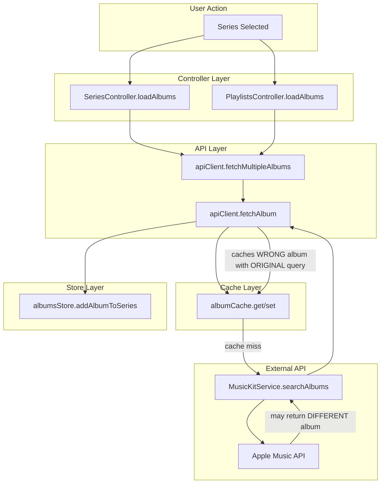

# Album Data Pipeline - Architectural Analysis

**Created**: 2025-12-25
**Related Issues**: #92 (Album Cache/Display), #93 (Reconfigure Panel)
**Sprint**: 13 (Part of ARCH-2 Refactoring)

---

## Executive Summary

Investigation of bugs #92 and #93 revealed fundamental architectural flaws in how album data flows through the application. The current design has **3 interlinked problems** that cause wrong albums to appear in series and configuration to be lost.

---

## Current Architecture (Problematic)



---

## Problem Analysis

### Problem 1: Cache Key ≠ Album Identity

**Location**: `public/js/api/client.js` lines 48-54, `public/js/cache/albumCache.js`

```javascript
// client.js - fetchAlbum()
const appleAlbums = await musicKitService.searchAlbums(artist, albumName, 5)
const selected = appleAlbums[0]  // ← May be a DIFFERENT album!
// ...later...
this.cache.set(query, album)  // ← Caches with ORIGINAL query, not actual album

// albumCache.js - set()
set(query, album) {
    this.memoryCache.set(query, album)  // ← Key is query, value may be different album
}
```

**Example**:
| Query | Apple Music Returns | Cached As |
|-------|---------------------|-----------|
| `"Jimmy Page & Robert Plant - No Quarter"` | `"Physical Graffiti (Remastered)"` | `{ key: "jimmy_page_robert_plant_no_quarter", album: "Physical Graffiti" }` |

**Impact**: When series loads albums by query, it gets wrong album data.

---

### Problem 2: No Validation of Search Results

**Location**: `public/js/api/client.js` lines 48-58

```javascript
if (appleAlbums && appleAlbums.length > 0) {
    const selected = appleAlbums[0]  // ← No similarity check!
    // Proceeds to cache and use this album
}
```

Apple Music search is fuzzy. Searching for `"Robert Plant & Jimmy Page - Walking Into Clarksdale"` returns Led Zeppelin albums because:
1. Apple Music may not have that album
2. Or it's listed as `"Page and Plant"` (artist name variation)
3. The search returns related popular albums by same artists

---

### Problem 3: AlbumsStore Global Pollution

**Location**: `public/js/stores/albums.js`

While `albumsStore` has `albumsByAlbumSeriesId`, the bug occurs because:
1. `PlaylistsController` loads albums for editing
2. Albums are fetched via `apiClient.fetchMultipleAlbums(queries)`
3. Each album is added to store
4. If album title ≠ originally stored title, a "new" album is created
5. This "new" album has no series association → becomes "uncategorized"

---

## Proposed Refactoring

### Solution 1: Album Identity Model

Create a stable identity for albums that survives cache/API round-trips.

```javascript
// NEW: public/js/models/AlbumIdentity.js
export class AlbumIdentity {
    constructor(originalQuery, resolvedAlbum) {
        this.originalQuery = originalQuery  // What user saved
        this.resolvedTitle = resolvedAlbum.title
        this.resolvedArtist = resolvedAlbum.artist
        this.appleId = resolvedAlbum.appleId
        this.spotifyId = resolvedAlbum.spotifyId
        this.matchConfidence = this.calculateConfidence()
    }
    
    calculateConfidence() {
        // Compare originalQuery vs resolved title+artist
        // Return 0-1 score
    }
    
    isValid() {
        return this.matchConfidence >= 0.4  // Threshold
    }
}
```

---

### Solution 2: Cache Key Normalization

Cache by **result identity**, not query.

```javascript
// CHANGE: albumCache.set()
set(query, album) {
    // Generate key from ACTUAL album, not query
    const albumKey = this.getAlbumKey(album)  // Uses title + artist
    
    // Store mapping: query → albumKey (for lookups)
    this.queryToAlbumKey.set(query, albumKey)
    
    // Store album data
    this.memoryCache.set(albumKey, album)
}

getAlbumKey(album) {
    const normalized = `${album.artist}_${album.title}`
        .toLowerCase()
        .replace(/\s+/g, '_')
        .replace(/[^\w-]/g, '')
    return `album_${normalized}`
}
```

---

### Solution 3: Validation Before Caching

Reject low-confidence matches in `apiClient.fetchAlbum()`.

```javascript
// CHANGE: client.js - fetchAlbum()
const selected = appleAlbums[0]
const similarity = calculateSimilarity(albumName, selected.attributes.name)

if (similarity < 0.35) {
    console.warn(`[APIClient] Rejected "${selected.attributes.name}" - ${similarity*100}% match to "${albumName}"`)
    return this._fetchAlbumFromLegacyAPI(query)  // Fallback
}

// Only cache if confident match
this.cache.set(query, album)
```

---

### Solution 4: Series-Scoped Album Loading

Ensure `PlaylistsController` only uses albums from the correct series.

```javascript
// CHANGE: PlaylistsController.loadAlbumsForEdit()
async loadAlbumsForEdit(seriesId) {
    // Get series queries
    const series = albumSeriesStore.getSeries().find(s => s.id === seriesId)
    const queries = series.albumQueries
    
    // Load albums
    const { results } = await apiClient.fetchMultipleAlbums(queries)
    
    // Filter: Only add albums that matched their queries
    const validAlbums = results.filter(r => {
        if (r.status !== 'success') return false
        const expected = this.extractAlbumName(r.query)
        const actual = r.album.title
        return calculateSimilarity(expected, actual) >= 0.4
    })
    
    // Set in store with explicit seriesId
    albumsStore.setAlbumsForSeries(seriesId, validAlbums.map(r => r.album))
}
```

---

## Implementation Priority

| Phase | Change | Files | Effort |
|-------|--------|-------|--------|
| 1 | Add similarity validation to `fetchAlbum()` | `client.js` | S |
| 2 | Add AlbumIdentity model | `models/AlbumIdentity.js` (new) | M |
| 3 | Refactor cache key strategy | `albumCache.js` | M |
| 4 | Series-scoped album loading | `PlaylistsController.js` | M |
| 5 | Migrate existing cached data | Migration script | S |

---

## Testing Plan

1. **Unit Tests**:
   - `AlbumIdentity.calculateConfidence()` with edge cases
   - `albumCache` with new key strategy

2. **Integration Tests**:
   - Load series with problematic albums (Page & Plant)
   - Verify no cross-series pollution

3. **Manual Verification**:
   - "Robert Plant 00-10s" series should have exactly 7 albums
   - Reconfigure panel should apply settings

---

## Related Specs

- [ARCH-2: Standardize Stores](specs/sprint13-tech-debt/arch-2-standardize-stores_spec.md)
- [DEBUG_LOG #92](../debug/DEBUG_LOG.md#issue-92)
- [DEBUG_LOG #93](../debug/DEBUG_LOG.md#issue-93)
