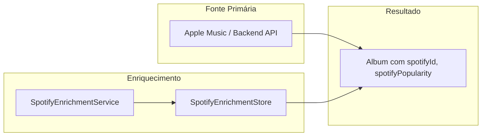
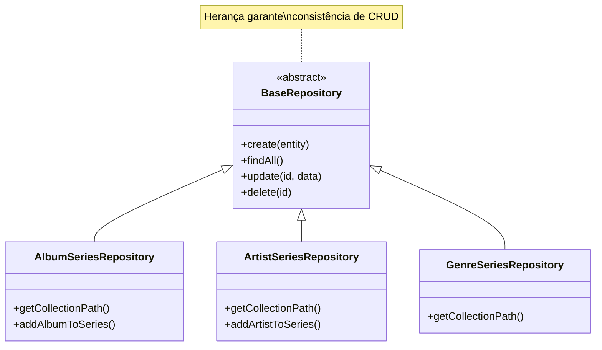

# Complementary Architecture Analysis
# CRIT-5: Album Data Pipeline & Future-Proof Modular Design

**Created**: 2025-12-25 23:30
**Author**: Antigravity (AI)
**Context**: Responses to user inquiries about data model, enrichment, and extensibility

---

## 1. Reflexão: Por que CRIT-5 é Necessário?

### O Que o Schema Atual Faz Bem
O modelo de dados atual (`album_data_schema.md`) define claramente:
- `Album` com `tracks` e `tracksByAcclaim`
- `Track` com metadata, ratings, positions
- Normalização via `normalizeAlbumData()`

### O Que o Schema NÃO Resolve (e CRIT-5 Precisa Resolver)

| Problema | Por que Schema Não Resolve | CRIT-5 Solução |
|----------|---------------------------|----------------|
| **Cache Key ≠ Identity** | Schema define *estrutura* do álbum, não *como* ele é identificado/buscado | AlbumIdentity model com ID estável |
| **Apple Music Mismatch** | Schema assume dados já corretos; não valida origem | Similarity validation antes de cachear |
| **Cross-Series Pollution** | Schema não define escopo; Store é global | Series-scoped loading |

**Resumo**: O Schema define "como o dado é estruturado". CRIT-5 define "como o dado é obtido e validado".

---

## 2. Questões de Enriquecimento de Dados

### 2.1 Enriquecimento de Álbuns (Spotify Album Data)



**Fluxo Atual (Correto)**:
1. Álbum é carregado via `/api/generate` (Backend → AI → BestEver)
2. Se Spotify conectado, `SpotifyEnrichmentService.enrichAlbumData()` busca IDs e popularidade
3. Dados são salvos em `SpotifyEnrichmentStore` → Firestore (`spotify_enrichment/{key}`)
4. No próximo load, cache é verificado primeiro

**Arquivos Envolvidos**:
- `services/SpotifyEnrichmentService.js`
- `stores/SpotifyEnrichmentStore.js`
- `helpers/SpotifyEnrichmentHelper.js`

---

### 2.2 Enriquecimento de Faixas (Track Data)

```
Faixa Origem (API)          →  Faixa Enriquecida (Store)
─────────────────────────────────────────────────────────
title, position, duration    ✅ Preservado
rating (BestEver)            ✅ Preservado
spotifyId                    ✅ Adicionado por SpotifyEnrichmentService
spotifyPopularity            ✅ Adicionado (0-100)
spotifyPopularityRank        ✅ Calculado (posição relativa no álbum)
```

**Como Acontece**:
```javascript
// SpotifyEnrichmentService.enrichAlbumData()
album.tracks.forEach((track, idx) => {
    const spotifyTrack = matchedTracks.find(t => similarityMatch(track.title, t.name))
    if (spotifyTrack) {
        track.spotifyId = spotifyTrack.id
        track.spotifyPopularity = spotifyTrack.popularity
    }
})
```

**Persistência**:
- Dados enriquecidos são salvos no `SpotifyEnrichmentStore`
- NÃO são salvos no `albumsStore` (transiente)
- Para uso permanente, `SpotifyEnrichmentHelper.applyEnrichmentToAlbum()` reaplica

---

## 3. Arquitetura Modular para Entidades Futuras

### 3.1 Padrão Atual (Universal Series Model)

A arquitetura já foi projetada para extensibilidade via o conceito de **Universal Series Model**:

```
Entity (Album, Artist, Genre, Track)
    ↓
EntitySeries (AlbumSeries, ArtistSeries, GenreSeries)
    ↓
Blending Menu (Algorithm + Parameters)
    ↓
Playlist Output
```

### 3.2 Como Adicionar Nova Entidade (Ex: ArtistSeries)

**Camada de Dados**:
```javascript
// NEW: repositories/ArtistSeriesRepository.js
export class ArtistSeriesRepository extends BaseRepository {
    getCollectionPath(userId) {
        return `users/${userId}/artistSeries`
    }
    // Herda: create, findAll, update, delete, findById
}
```

**Camada de Store**:
```javascript
// NEW: stores/artistSeries.js  
export class ArtistSeriesStore {
    constructor() {
        this.series = []
        this.repository = new ArtistSeriesRepository()
    }
    // Padrão Observer para notificar Views
}
```

**Camada de View**:
```javascript
// NEW: views/ArtistSeriesView.js extends BaseView
// Reusa componentes existentes:
import { SeriesHeader } from '../components/series/SeriesHeader.js'
import { SeriesGrid } from '../components/series/SeriesGrid.js'  // Parametrizado para Artists
```

### 3.3 Componentes Reutilizáveis (Atual vs Ideal)

| Componente | Reuso Atual | Reuso Ideal (ARCH-3) |
|------------|-------------|---------------------|
| `SeriesHeader` | AlbumSeries only | **Universal**: `<EntityHeader entity={album|artist}>` |
| `EntityCard` | AlbumCard only | **Universal**: `<EntityCard type="album|artist|genre">` |
| `BlendFlavorCard` | Blending Menu | `BaseCard` → `BlendFlavorCard extends BaseCard` |
| `BatchGroupCard` | SavedPlaylists | `BaseCard` → `BatchGroupCard extends BaseCard` |

### 3.4 Diagrama de Extensibilidade



---

## 4. Análise de Impacto: Persistência e CRUD

### Cenário Atual (Sem mudanças)

| Operação | View | Store | Firestore | Cache |
|----------|------|-------|-----------|-------|
| Add Album to Series | SeriesView | `AlbumSeriesStore.updateSeries()` | `users/{uid}/series/{id}.albumQueries[]` | - |
| Load Series Albums | SeriesView/PlaylistsView | - | Não usado | `albumCache.get(query)` |
| Remove Album | SeriesView | `AlbumSeriesStore.removeAlbumFromSeries()` | Update albumQueries | - |
| Save Enrichment | AlbumsView | SpotifyEnrichmentStore | `spotify_enrichment/{albumId}` | - |

---

### Impacto por Fase CRIT-5

#### CRIT-5a: Validation Only (Menor impacto)

| Componente | Mudança | Impacto |
|------------|---------|---------|
| `apiClient.fetchAlbum()` | Adiciona check de similaridade | Nenhum em persistência |
| Views | Nenhuma | Nenhum |
| Firestore | Nenhuma | Nenhum |
| Cache | Rejeita low-confidence matches | Alguns álbuns não serão cacheados |

**Risco**: Álbuns legítimos com nomes diferentes (ex: "Page and Plant" vs "Robert Plant & Jimmy Page") podem ser rejeitados.

---

#### CRIT-5b: Schema Upgrade (Médio impacto)

```javascript
// ANTES: Series no Firestore
{
  albumQueries: ["Artist - Album", ...]
}

// DEPOIS: Series no Firestore
{
  albumQueries: ["Artist - Album", ...],  // Mantido para compatibilidade
  resolvedAlbums: [
    { query: "...", albumId: "...", appleId: "...", verified: true }
  ]
}
```

| Componente | Mudança | Impacto |
|------------|---------|---------|
| AlbumSeriesStore | Adicionar `resolvedAlbums` ao schema | CRUD atualizado |
| SeriesView - Add Album | Resolver e salvar junto | Novo fluxo |
| SeriesView - Load | Usar resolvedAlbums se disponível | Lógica condicional |
| SeriesView - Remove | Remover de ambos arrays | Atualizar |
| PlaylistsView - Edit | Carregar por albumId | Mais confiável |
| Firestore | Novo campo | Migration needed |

---

#### CRUD Operations Detalhadas

**CREATE (Add Album to Series)**:
```
ANTES:
  User adds "Walking Into Clarksdale"
  → Store: push query to albumQueries
  → Firestore: updateDoc({ albumQueries: [...] })
  → Done

DEPOIS:
  User adds "Walking Into Clarksdale"
  → Fetch album from Apple Music
  → If resolved:
      → Store: push to albumQueries AND resolvedAlbums
      → Firestore: updateDoc({ albumQueries, resolvedAlbums })
  → If NOT resolved:
      → Show warning "Album not found in Apple Music"
      → User decides: add anyway as query-only OR cancel
```

**READ (Load Series)**:
```
ANTES:
  SeriesController.loadAlbums()
  → Get albumQueries from series
  → apiClient.fetchMultipleAlbums(queries)
  → Results may be wrong albums!

DEPOIS:
  SeriesController.loadAlbums()
  → IF series.resolvedAlbums exists:
      → Load by albumId (não query)
      → Garantido ser o álbum certo
  → ELSE (legacy series):
      → Fallback to query-based loading
      → Run resolution on first load
```

**DELETE (Remove Album from Series)**:
```
ANTES:
  AlbumSeriesStore.removeAlbumFromSeries(album)
  → Find matching query in albumQueries
  → Remove from array
  → BUG: Se album.title ≠ query original, não encontra!

DEPOIS:
  AlbumSeriesStore.removeAlbumFromSeries(album)
  → Find by albumId in resolvedAlbums
  → Remove from resolvedAlbums AND corresponding albumQueries
  → Sempre funciona porque usa ID estável
```

---

#### CRIT-5c: Migration (One-time, High effort)

```javascript
// Migration Script
async function migrateSeriesSchema() {
  const allSeries = await albumSeriesStore.loadFromFirestore()
  
  for (const series of allSeries) {
    if (series.resolvedAlbums) continue // Already migrated
    
    const resolvedAlbums = []
    for (const query of series.albumQueries) {
      const album = await apiClient.fetchAlbum(query)
      resolvedAlbums.push({
        query,
        albumId: album?.id || null,
        appleId: album?.appleId || null,
        verified: album ? true : false
      })
    }
    
    await albumSeriesStore.updateSeries(series.id, { resolvedAlbums })
  }
}
```

---

## 5. Resumo de Impacto

| Fase | Persistência | CRUD Views | Risco | Esforço |
|------|--------------|------------|-------|---------|
| 5a | Nenhum | Nenhum | Baixo | S |
| 5b | Schema novo | Todos CRUD | Médio | M |
| 5c | Migration | - | Alto (dados legados) | M |

---

## 6. Recomendação Final: Abordagem Incremental

1. **Agora (5a)**: Validation only - impede novos problemas
2. **Próxima sessão (5b)**: Schema upgrade com backward compatibility
3. **Depois (5c)**: Migration das séries existentes

Isso permite que você continue usando o app enquanto fazemos as mudanças incrementalmente.

---

## 7. Alinhamento com Princípios do Constitution

| Princípio | Como CRIT-5 Alinha |
|-----------|-------------------|
| **User-Centric Quality** | Usuário vê álbuns corretos, sem confusão |
| **Clean Code & Modular** | AlbumIdentity model + BaseRepository pattern |
| **Documentation First** | Este documento + specs atualizados |
| **Spec-Driven** | Implementação segue SDD com fases claras |

---

**Status**: Aguardando aprovação do usuário para prosseguir com Fase 5a