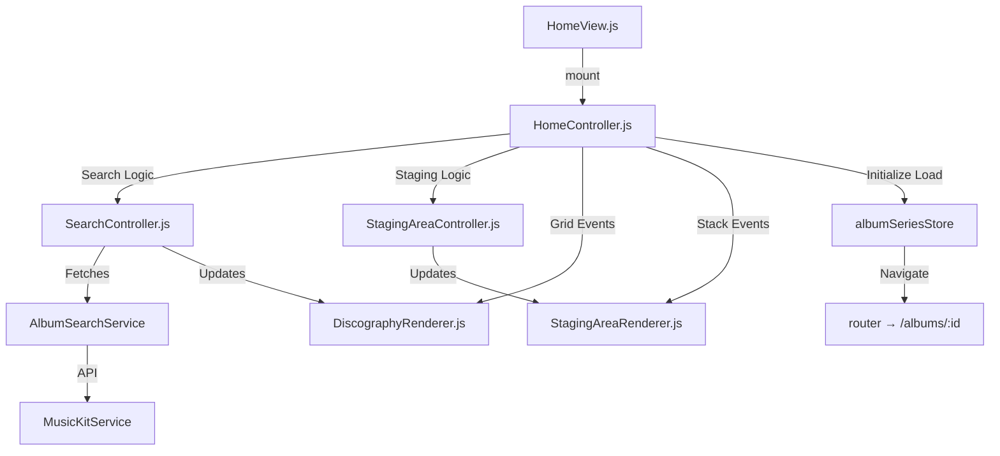

# ARCH-11: HomeView V3 ("The Album Blender") Specification

**Status**: ✅ IMPLEMENTED
**Last Updated**: 2025-12-28
**Prototype**: `public/static_prototype_v3.html` (Visual Reference)
**Implementation**: `public/js/views/HomeView.js`

## 1. Overview
**Goal**: Refactor `HomeView.js` (previously monolithic) into a modular V3 Architecture (Controller + Renderers) implementing the "Split-Panel" design with Nano Banana / Flame aesthetics.

**Result**: Successfully implemented. HomeView V3 is fully functional with modular architecture.

## 2. Architecture Diagram (Implemented)

## 3. Component Inventory

| Component | File | Lines | Status |
|-----------|------|-------|--------|
| HomeView | `views/HomeView.js` | 202 | ✅ Implemented |
| HomeController | `controllers/HomeController.js` | 175 | ✅ Implemented |
| SearchController | `components/home/SearchController.js` | 140 | ✅ Implemented |
| StagingAreaController | `components/home/StagingAreaController.js` | 70 | ✅ Implemented |
| DiscographyRenderer | `views/renderers/DiscographyRenderer.js` | 66 | ✅ Implemented |
| StagingAreaRenderer | `views/renderers/StagingAreaRenderer.js` | 38 | ✅ Implemented |

**Total**: 6 modules, ~691 lines

## 4. UI Design: Split Panel Layout

### Left Panel (400px desktop / full mobile): Control Deck
- **Header**: Album Blender V3 branding
- **01 // Series Configuration**: Series name input with sublabel
- **02a // Artist Filter**: 
  - Visual Mode: Search input + "Scan" button
  - Bulk Mode: Textarea with validation feedback
- **03 // Selected Albums**: Staging stack with drag-drop (SortableJS)
- **Footer**: "Initialize Load Sequence" button (sticky)

### Right Panel (flex-1): Results Matrix
- **Toolbar**: 
  - Breadcrumbs (hidden on mobile)
  - Filter buttons: Studio, Singles/EP, Live, Compilations
- **Grid**: Responsive album cards (2-5 columns)
  - Entire card clickable (adds to staging)
  - Badges: Deluxe, Remaster, Live, Single, Compilation
  - Hover effects: scale, border glow

## 5. Key Features Implemented

### 5.1 Search & Filters
- Client-side filtering with cached results
- 4 filter categories: Studio, Singles/EP, Live, Compilations
- Type detection via `albumType` + title keyword fallback

### 5.2 Staging Area
- Add: Click entire album card
- Remove: Always-visible X button with red background
- Reorder: SortableJS drag-and-drop
- Count: Real-time "(N Albums)" badge

### 5.3 Initialize Load Sequence
- Validates at least one album selected
- Creates series via `albumSeriesStore.createSeries()`
- Navigates to `/albums/:seriesId`
- Toast feedback for success/error

### 5.4 Mobile Responsiveness
- Panels stack vertically
- Filters: horizontal scroll with hidden scrollbar
- Breadcrumbs: hidden on small screens
- Touch targets: larger buttons (min 44px)

## 6. Known Limitations

| Issue | Workaround |
|-------|------------|
| Firestore 400 errors | Unrelated to HomeView; Firebase session issue |
| Some albums fail to load in SeriesView | Expected when new series albumQueries haven't been enriched yet |

## 7. Future Enhancements (Out of Scope)

- [ ] Album card "selected" state indication (checkmark overlay)
- [ ] Flying album animation when staging
- [ ] Search autocomplete for artist names
- [ ] Bulk mode: highlight resolved lines in real-time
