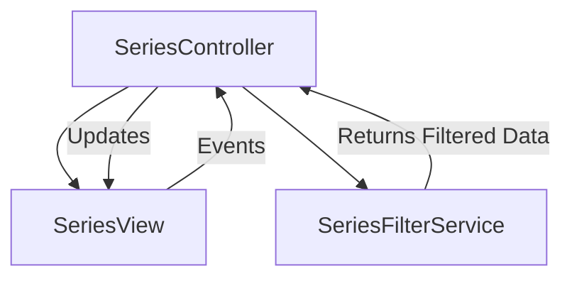

# Implementation Plan: Sprint 17 - Architectural Modularization

**Branch**: `feature/sprint17-modularization`
**Date**: 2026-01-03
**Spec**: [spec.md](./spec.md)

## Summary

This sprint focuses on **Frontend Specialization** to address the "Thick Client" technical debt. We will decompose three major monoliths (`SeriesView`, `MusicKitService`, `CurationEngine`) into modular Controllers and Services, and shift data patching logic to the Backend to clean up the data flow.

---

## User Story 1: SeriesView Refactor (The "Thin View" Pattern)

### Current Architecture vs Proposed
**Current**: `SeriesView.js` (500+ LOC) handles:
1.  UI Mounting/Rendering
2.  Orchestration (Filter updates, Search)
3.  Business Logic (`filterAlbums`, `getUniqueArtists`) - *Stateful*
4.  Event Handling (Card clicks)

**Proposed**: Decompose into MVP-like structure:



### Components

#### 1. `SeriesFilterService.js` (NEW) (Logic Only)
- **Responsibility**: Pure function logic for filtering and sorting.
- **Methods**:
    - `filter(albums, criteria: { series, artist, year, source })`
    - `getUniqueArtists(albums)`
    - `getUniqueYears(albums)`
- **Dependencies**: None (Pure JS).

#### 2. `SeriesController.js` (Enhanced) (Orchestrator)
- **Responsibility**: Manages State (`currentFilter`, `searchQuery`), calls Service, updates View.
- **Methods**:
    - `handleFilterChange()`
    - `handleSearch()`
    - `refreshGrid()`

#### 3. `SeriesView.js` (Refactored) (Dumb UI)
- **Responsibility**: Mounting components, exposing DOM events.
- **Target Size**: < 200 LOC.

---

## User Story 2: MusicKitService Split

### Strategy
Break the 692 LOC file by domain. Keep `MusicKitService.js` as a **Facade** to maintain backward compatibility for consumers.

### File Structure
```text
services/musickit/
├── index.js           # Facade (exports singleton instance)
├── MusicKitAuth.js    # Auth, Token Management, Instance Setup
├── MusicKitCatalog.js # Search, Get Album Details (Public API)
└── MusicKitLibrary.js # Export Playlist, Get User Playlists (Private API)
```

---

## User Story 3: Curation Engine & Top N Parametrization

### Strategy Pattern Implementation
Refactor `CurationEngine` to delegate the "filling" logic to Strategy classes.

```javascript
// Interface
class CurationStrategy {
    generate(albums, opts) { /* returns playlists[] */ }
}
```

### Top N Parametrization (UI/UX)
**UI Mockup (Blending Menu)**:
```text
[ Flavor Card: Top N ] (Selected)
----------------------------------
Ingredients Panel:
[ Slider: Top N Tracks ]
1 ---[o]------ 10  (Value: 3)

[ Output Mode ] [ Discovery Mode ]
```

### Implementation Steps
1.  **Backend/Logic**: `TopNAlgorithm.js` already supports `opts.trackCount`. Ensure `CurationEngine` passes it through.
2.  **UI**: Update `BlendIngredientsPanel.js`:
    - Add `ALGORITHM_INGREDIENTS['top-n'].nValue = true` config.
    - Render Slider if `config.nValue` is true.
    - Pass `algorithmParams: { n: sliderValue }` to `PlaylistGenerationService`.

---

## User Story 4: Data Normalization (Backend)

### Data Flow Change
**Current**:
API -> `fetchRanking` -> Raw JSON -> Client -> `client.js` (Fix Thriller, Add Artist) -> UI

**Proposed**:
API -> `fetchRanking` -> `normalize.js` (Fix Thriller, Add Artist) -> JSON -> Client -> UI

### Changes
1.  Modify `server/lib/normalize.js`:
    - Ensure `spotifyId`, `bestEverScore` are present (or null).
    - Ensure `artist`, `title`, `series` are clean.
    - **CRITICAL**: Move the "Thriller" workaround (Query Object vs Array) here.
2.  Simplify `client.js`: Remove `fixAlbumData()` or equivalent patchers.

---

## Execution Order (Dependencies)

1.  **US 4 (Backend Normalization)**: Do this first. It simplifies the data objects used by US 1 and US 3.
2.  **US 1 (SeriesView)**: High impact, independent.
3.  **US 2 (MusicKit)**: Low risk refactor (mostly move file).
4.  **US 3 (Curation/Top N)**: Complex UI + Logic. Do last to ensure stable base.
