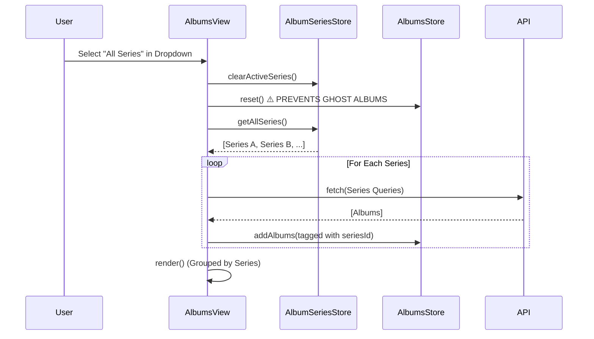

# Feature Specification: AlbumsView Series Filter & Architecture

**Feature Branch**: `feature/albums-view-series-filter`  
**Created**: 2025-12-14  
**Status**: APPROVED  
**Input**: User feedback on V1 spec (button alignment, expanded view behavior, default "All Series", UI grouping).

---

## Technical Architecture & Data Flow

### Core Principle: "Scope-Based Data Loading"
To prevent "Ghost Albums" (Issue #22), the `AlbumsStore` will always reflect the **current scope** (Selected Series or All Series). Switching scopes triggers a `store.reset()` followed by a fresh load. We will **not** load "All" and client-side filter for specific series views, as this risks state pollution.

### Architecture Diagrams

#### 1. Data Flow State Machine
```mermaid
stateDiagram-v2
    [*] --> Initializing
    
    state "Scope: All Series" as AllScope
    state "Scope: Single Series" as SingleScope
    
    Initializing --> AllScope: Default Route (/albums)
    Initializing --> SingleScope: Series Route (/albums?seriesId=xyz)
    
    AllScope --> SingleScope: User selects Specific Series
    note on link
        1. store.reset()
        2. Load ONLY specific series queries
    end note
    
    SingleScope --> AllScope: User selects "All Series"
    note on link
        1. store.reset()
        2. Load queries from ALL series
    end note
```

#### 2. Sequence: Switching to "All Series"


---

## User Scenarios & functional Requirements

### User Story 1 - Series Dropdown & Navigation (Priority: P1)

**User Journey**:
- **Default**: Clicking "Albums" in TopNav loads **"All Series"** view by default.
- **Contextual**: Coming from "Recent Series" (Home) or "Series Manager" (Playlists) loads that specific series.
- **Switching**: User uses the dropdown to switch between "All Series" and specific series.

**Requirements**:
- **FR-001**: Dropdown MUST default to "All Series" when no ID is present in URL.
- **FR-002**: Switching series MUST trigger a full store reset and reload (Architecture constraint).
- **FR-003**: Dropdown UI MUST follow Tech Theme (Neon/Glass).

### User Story 2 - "All Series" Visual Grouping (Priority: P1)

**Visual Requirement**:
- When in "All Series" mode, albums MUST be visually grouped by their series.
- Each group MUST be separated by a **bordered area** (Tech Theme) with the Series Name clearly visible.

**Requirements**:
- **FR-004**: "All Series" render mode MUST iterate through available series and render a "Series Section" for each.
- **FR-005**: Each section MUST contain the grid of albums belonging to that series.

### User Story 3 - Album Interaction & Button Positioning (Priority: P2)

**Visual & Interaction Requirements**:
- **View Tracks**: "View Ranked" button label renamed to "View Tracks".
- **Modal**:
    - **Compact View**: Clicking album cover -> Opens "View Tracks" Modal (Same modal as Inventory/Ranked).
    - **Expanded View**: Clicking album cover -> **NO ACTION** (maintains current behavior).
- **Action Buttons** (Edit, Delete, Inventory):
    - **Position**: Justified **RIGHT** in the action bar, below the cover.
    - **Constraint**: Must NOT interfere with metadata (Artist, Year, Track Count) on the left.

**Requirements**:
- **FR-006**: Compact cards action bar layout: `[Left: Metadata] <spacer> [Right: Actions]`.
- **FR-007**: Album Modal MUST reuse existing `InventoryModals` or `RankingView` modal logic.

---

## Implementation Plan

### 1. Store & Router Updates
- Update `AlbumSeriesStore` to handle "No Active Series" as a valid state for "All Series".
- Ensure `AlbumsView.loadAlbumsFromQueries` can handle batch loading for multiple series.

### 2. UI Components
- **Series Dropdown**: Create `components/SeriesDropdown.js` (or inline in View).
    - *Style*: Glass panel, neon borders.
- **Series Grouping**: Create `renderSeriesGroup(series, albums)` helper in `AlbumsView`.
    - *Style*: `border-t border-b border-white/10` or distinct panel background.

### 3. Card Styling Updates
- **Compact Card**:
    - Update click handler for cover art.
    - Adjust footer flexbox: `justify-between` -> ensure Right alignment of buttons.
- **Expanded Card**:
    - Verify button positioning.

---

## Edge Cases

- **Empty Series**: If a series has no albums, it should still appear in "All Series" view as an empty group (or be hidden? -> *Decision: Show empty group to indicate existence*).
- **Orphaned Albums**: Albums not in any series (should not happen in current architecture).

## Success Metrics

- **Performance**: Switching to "All Series" should render under 1s for < 5 series.
- **Correctness**: No "Ghost Albums" (albums from Series A appearing in Series B group).
