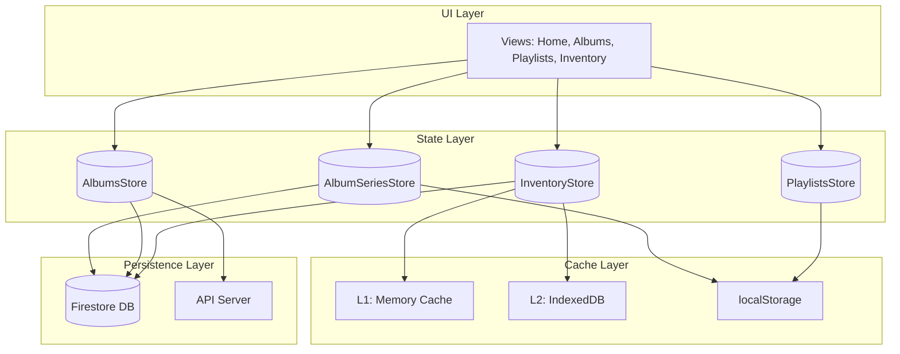
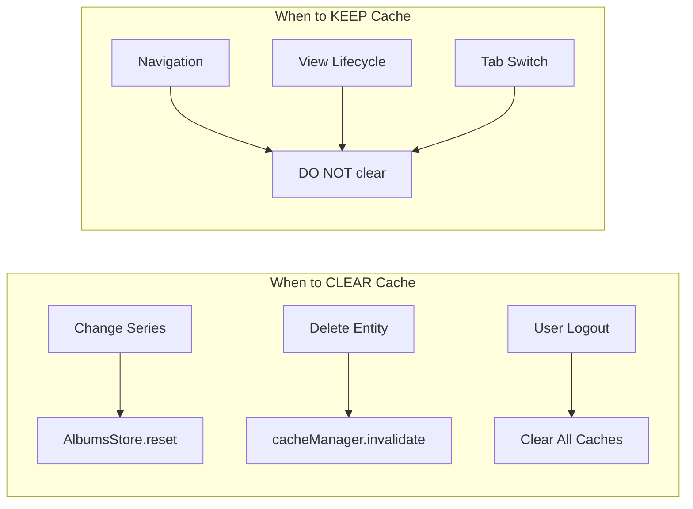
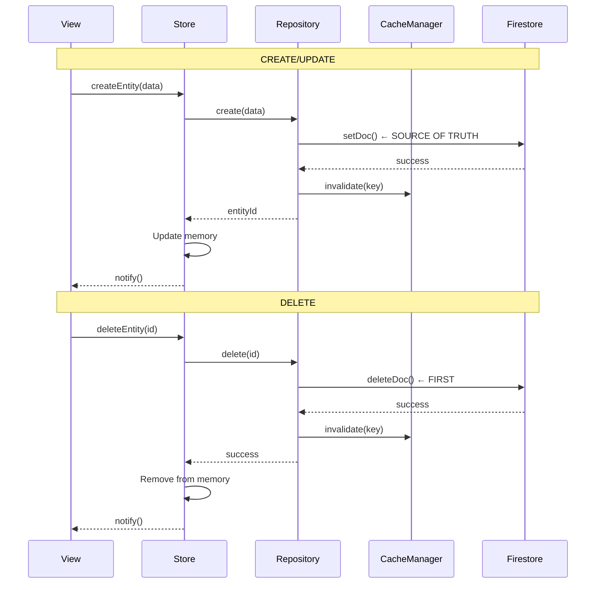

# Cache & Persistence Architecture Analysis

**Date:** 2025-12-08T17:30  
**Status:** Analysis Complete - Issues Found

---

## Current Architecture Layers



---

## Store-by-Store Analysis

### 1. AlbumSeriesStore
| Aspect | Implementation | Issue? |
|--------|---------------|--------|
| **Memory** | `this.series = []` | ✅ OK |
| **localStorage** | `mjrp_series` | ✅ OK |
| **Firestore** | `getSeriesCollectionPath()` | ⚠️ Just fixed |
| **Load** | `loadFromLocalStorage()` on constructor | ✅ OK |
| **Save** | `saveToLocalStorage()` + `saveToFirestore()` | ⚠️ Order was wrong |
| **Delete** | `deleteSeries()` | ⚠️ Just fixed |

**UPDATE/DELETE Flow:**
```
1. Firestore (source of truth) ← FIRST
2. Memory (this.series)
3. localStorage ← CACHE
4. notify()
```

---

### 2. AlbumsStore
| Aspect | Implementation | Issue? |
|--------|---------------|--------|
| **Memory** | `albumsByAlbumSeriesId = Map<string, Album[]>` | ✅ Per-series keying |
| **localStorage** | ❌ NOT USED | Could restore Ghost Albums |
| **Firestore** | `saveToFirestore()` → `/albums/{id}` | 🔴 Wrong path! |
| **Load** | From API via `fetchAlbum()` | ✅ OK |
| **Save** | Only via EditAlbumModal | ⚠️ Missing serialization |
| **Delete** | `removeAlbum()` | 🔴 Only in-memory! |

**CRITICAL ISSUE:**
- Albums are NOT persisted to Firestore consistently
- `removeAlbum()` only removes from memory → comes back on reload
- Path `/albums/{id}` doesn't match security rules

---

### 3. PlaylistsStore
| Aspect | Implementation | Issue? |
|--------|---------------|--------|
| **Memory** | `this.playlists = []` | ✅ OK |
| **localStorage** | `mjrp_current_playlists` | ✅ OK |
| **Firestore** | ❌ NOT IMPLEMENTED | 🔴 Missing! |
| **Load** | `loadFromLocalStorage()` | ✅ OK |
| **Save** | `saveToLocalStorage()` | ⚠️ No Firestore |
| **Delete** | Not implemented | - |

**ISSUE:** Playlists don't persist to Firestore → lost on different device

---

### 4. InventoryStore (via Repository)
| Aspect | Implementation | Issue? |
|--------|---------------|--------|
| **Memory** | `this.albums = []` | ✅ OK |
| **Cache** | CacheManager (L1+L2) | ✅ OK |
| **Firestore** | via InventoryRepository | ✅ Correct pattern |
| **Load** | `repository.findAll()` | ✅ OK |
| **Save** | `repository.addAlbum()` | ✅ With serialization |
| **Delete** | `repository.removeAlbum()` | ✅ Firestore first |

**This is the CORRECT pattern** - other stores should follow it.

---

## Data Invalidation Points



---

## Identified Gaps (Root Cause of Bugs)

### Gap 1: Inconsistent Persistence Patterns
| Store | Pattern | Should Be |
|-------|---------|-----------|
| AlbumSeriesStore | Mixed (localStorage + Firestore) | Repository Pattern |
| AlbumsStore | API only, no persistence | Repository Pattern |
| PlaylistsStore | localStorage only | Repository Pattern |
| InventoryStore | ✅ Repository Pattern | ✅ Correct |

### Gap 2: Missing Firestore Paths
| Store | Current Path | Correct Path |
|-------|-------------|--------------|
| AlbumSeriesStore | `/series/{id}` | ✅ Fixed: `getSeriesCollectionPath()` |
| AlbumsStore | `/albums/{id}` | ❌ Should be: `/artifacts/mjrp-albums/users/{userId}/curator/albums` |
| PlaylistsStore | ❌ None | Should be: `/artifacts/mjrp-albums/users/{userId}/curator/playlists` |

### Gap 3: Delete Not Reaching Firestore
| Entity | Memory Delete | localStorage Delete | Firestore Delete |
|--------|--------------|--------------------|--------------------|
| Series | ✅ | ✅ | ⚠️ Just fixed |
| Album in Series | ✅ | ❌ No persistence | ❌ No persistence |
| Playlist | ✅ | ✅ | ❌ Not implemented |
| Inventory Album | ✅ | ✅ (cache) | ✅ via Repository |

---

## Recommended Fix Architecture



---

## Action Items

1. ⏳ **AlbumsStore** - Create `AlbumRepository` following InventoryRepository pattern
2. ⏳ **PlaylistsStore** - Create `PlaylistRepository` (code exists, needs integration)
3. ⏳ **AlbumSeriesStore** - Refactor to use `SeriesRepository` (code exists, needs integration)
4. ⏳ **All Stores** - Ensure JSON serialization before Firestore writes
5. ⏳ **All Deletes** - Firestore first, then memory/localStorage
