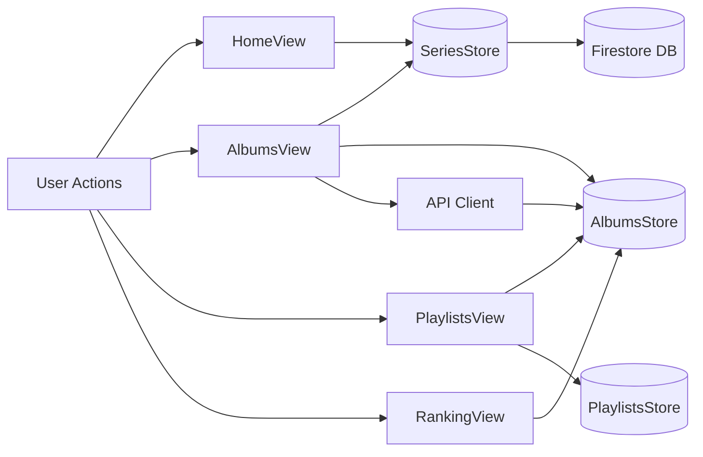
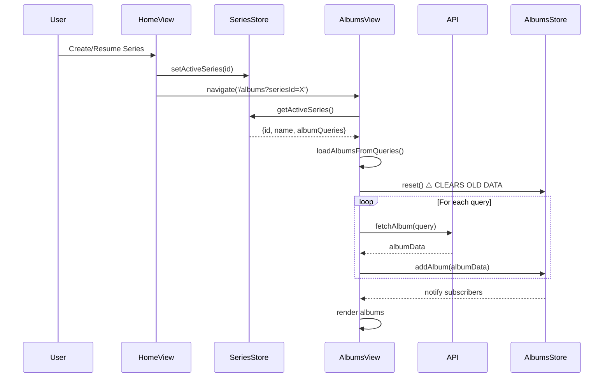
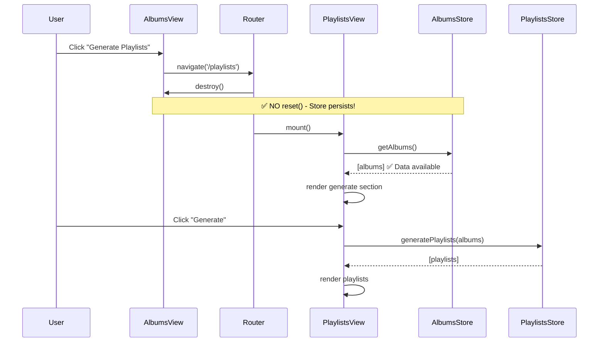
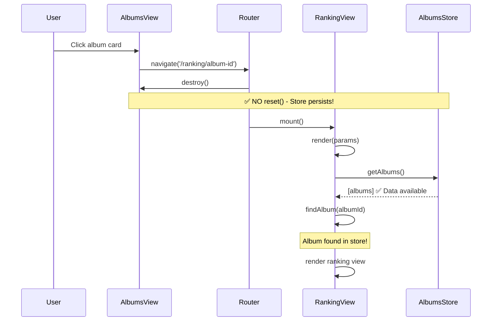
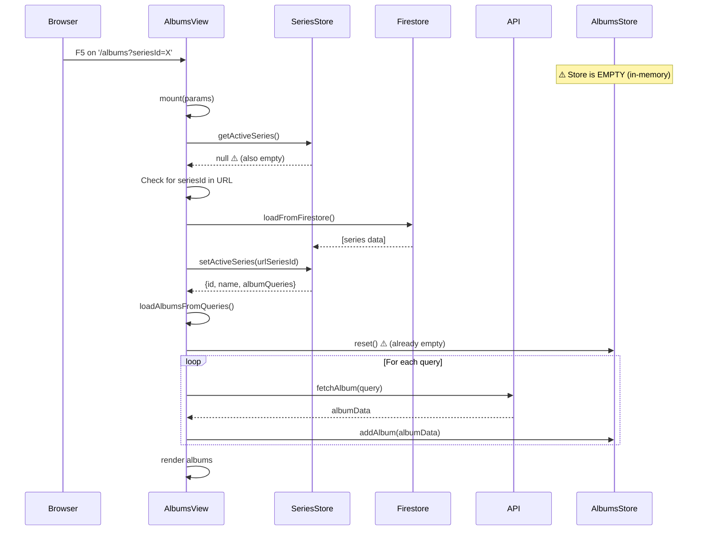
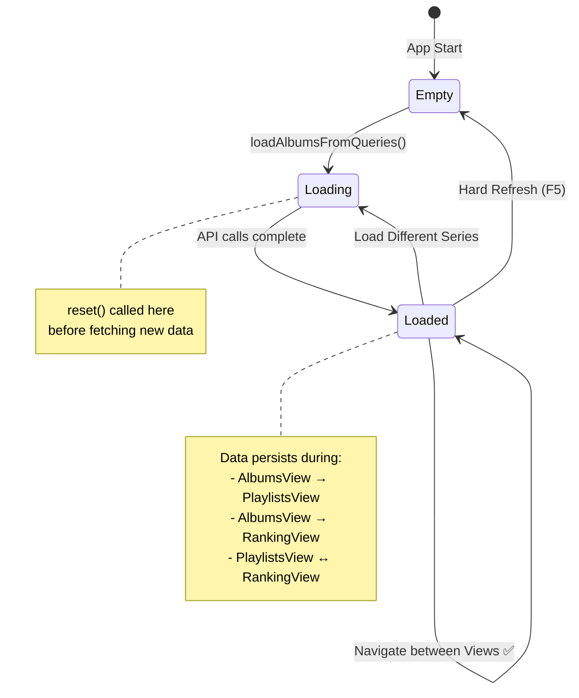

# Album Data Flow Architecture

## Overview
This document maps the **Data Flow Diagram (DFD)** and **Sequence Diagrams** for album data through the application's views and store.

---

## System Components



---

## Scenario 1: Load Series (Normal Flow)



**Key Points:**
- ⚠️ `reset()` called ONLY in `loadAlbumsFromQueries()` before loading new series
- Data persists in store after loading
- All subsequent navigations use cached data

---

## Scenario 2: Navigate to Playlists (Proposed Fix)



**Key Points:**
- ✅ AlbumsView.destroy() does NOT call reset()
- ✅ Store data persists across navigation
- ✅ PlaylistsView directly accesses store data
- ❌ NO recovery logic needed

---

## Scenario 3: Navigate to Album Ranking (Proposed Fix)



**Key Points:**
- ✅ AlbumsView.destroy() does NOT call reset()
- ✅ Store data persists across navigation
- ✅ RankingView finds album in store
- ❌ NO recovery logic needed

---

## Scenario 4: Hard Refresh (Edge Case)



**Key Points:**
- ⚠️ Hard refresh = new browser session = empty store
- ✅ AlbumsView has fallback: load from Firestore
- ✅ This is ONLY for hard refresh, not navigation
- ❌ PlaylistsView/RankingView do NOT need this (user navigates from Albums)

---

## Store State Lifecycle



---

## Data Flow Summary

### ✅ Store Resets (Clear Data)
1. **Loading New Series**: `loadAlbumsFromQueries()` calls `reset()` before fetching
2. **Hard Refresh**: Browser clears memory, store starts empty

### ✅ Store Persists (Keep Data)
1. **View Navigation**: AlbumsView → PlaylistsView → RankingView
2. **Back/Forward**: Browser history navigation
3. **View Lifecycle**: constructor/destroy do NOT reset

### Current vs Proposed

| Event | Current Behavior | Proposed Behavior |
|-------|------------------|-------------------|
| AlbumsView.constructor() | ❌ reset() | ✅ No reset() |
| AlbumsView.destroy() | ❌ reset() | ✅ No reset() |
| loadAlbumsFromQueries() | ✅ reset() | ✅ reset() (keep!) |
| Navigate to Playlists | ❌ Empty store → recovery | ✅ Store has data |
| Navigate to Ranking | ❌ Empty store → recovery | ✅ Store has data |
| Hard Refresh | ✅ Fallback to Firestore | ✅ Same (keep!) |

---

## Architecture Benefits

### Before (Band-Aid Approach)
```
AlbumsView loads data
  → destroy() resets store
    → PlaylistsView needs recovery
    → RankingView needs recovery
      → Code duplication
      → Race conditions
      → Ghost albums
```

### After (Proposed)
```
AlbumsView loads data ONCE
  → Store persists while series active
    → PlaylistsView reads store
    → RankingView reads store
      → ✅ No duplication
      → ✅ No race conditions
      → ✅ No ghost albums
```
