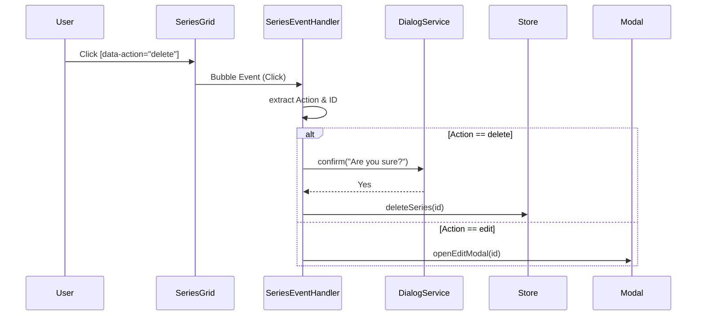

# Frontend Components Analysis (Complex Systems)

## Series & Navigation (`series/`, `navigation/`)
**Status**: `[ACTIVE]`

-   **`series/SeriesToolbar.js` & `SeriesFilterBar.js`**:
    -   **Role**: UI components for filtering albums/series.
    -   **Logic**: `SeriesToolbar` is a high-level container combining Search, Filter Dropdowns, and View Toggles. `SeriesFilterBar` appears to be a smaller, alternative implementation (possibly for the Inventory view?).
-   **`series/ArtistScanner.js`**:
    -   **Role**: Scans Apple Music for albums to add to a series.
    -   **Logic**: Interactive form with immediate Apple Music API feedback.
-   **`series/SeriesGridRenderer.js`**:
    -   **Role**: Adapter that delegates rendering to `AlbumsGridRenderer` and `AlbumsScopedRenderer`.
    -   **Pattern**: Supports both 'ALL' setup (grouped by series) and 'SINGLE' setup (flat grid).
-   **`series/SeriesEventHandler.js`**:
    -   **Role**: centralized event delegation for Series actions (Edit, Delete, Remove Album).
    -   **Logic**: Intercepts clicks, identifies actions via `data-action`, and delegates to `DialogService` or Stores.

### Command Delegation Flow

-   **`navigation/SeriesDropdown.js`**:
    -   **Role**: Top navigation dropdown for switching entity modes (Albums, Playlists, etc.).
    -   **Logic**: Checks `window.location.pathname` to highlight active route.

## Playlists System (`playlists/`)
**Status**: `[ACTIVE]`

Detailed controller-view logic for the Playlists feature.

-   **`playlists/SavedPlaylistsController.js`**:
    -   **Role**: The brain of the Playlists View.
    -   **Logic**: Loads Series & Playlists from `SeriesRepository`/`PlaylistRepository`. Groups playlists into "Batches" based on creation time/name. Handles batch deletion and preloads thumbnails.
-   **`playlists/PlaylistsGridRenderer.js`**:
    -   **Role**: Static HTML generator for the playlist grid.
    -   **Logic**: Renders the `RegeneratePanel`, Empty States, and delegates the actual Grid rendering to `PlaylistGrid`.
-   **`playlists/PlaylistGrid.js`**:
    -   **Role**: Renders the responsive grid of `PlaylistCard`s containing `TrackRow`s.
-   **`playlists/PlaylistsDragBoard.js` & `PlaylistsDragHandler.js`**:
    -   **Role**: Drag-and-drop management.
    -   **Logic**: `DragBoard` provides a Kanban-style layout (horizontal columns). `DragHandler` wraps `SortableJS` to manage track movement between playlists (drag-and-drop across lists).
-   **`playlists/RegeneratePanel.js`**:
    -   **Role**: "Reconfigure" UI letting users change algorithms on an existing batch.
    -   **Reuse**: Reuses `BlendFlavorCard` and `BlendIngredientsPanel` from the Blend Wizard.

## Ranking System (`ranking/`)
**Status**: `[ACTIVE]`

-   **`ranking/TracksRankingComparison.js`**:
    -   **Role**: Smart container for comparing "Original Order", "Critic Rank" (BEA), and "Popularity" (Spotify).
    -   **Logic**: 
        -   Normalizes track data from multiple sources.
        -   Calculates averages (Avg Rank, Avg Popularity).
        -   Handles "Enrich Data" flow (connecting to Spotify API).
-   **`ranking/TracksTable.js`**:
    -   **Role**: Desktop component for the comparison table.
    -   **Visuals**: Renders composite badges (Rank # + Stars) and Popularity Bars (Green progress bar).
