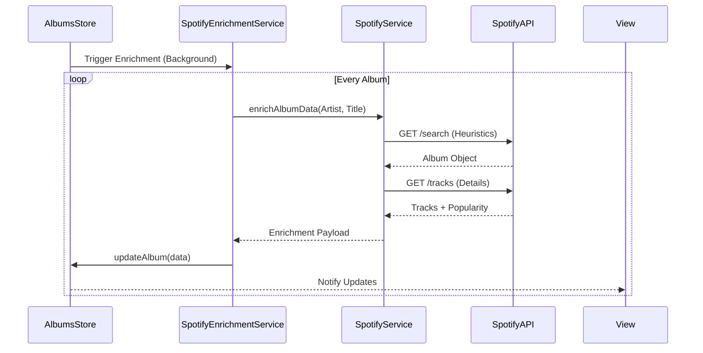

# Frontend Data Layer Analysis

> **Deep Dive Enrichment**: This document details the Store-Service architecture, focusing on State Management patterns, Sync logic, and External Integrations.

## 1. Store Architecture
**Status**: `[ACTIVE]`
**Pattern**: Singleton Observables (Flux-like)

### 1.1 `stores/albums.js` (AlbumsStore)
**Purpose**: Manages album entities, handling caching, persistence (Firestore), and Series context validation.

*   **Key Logic: Ghost Album Prevention**:
    *   **Problem**: Albums from Series A showing up when viewing Series B.
    *   **Solution (`addAlbumToSeries`)**:
        1.  Checks internal `activeAlbumSeriesId`.
        2.  *Validation*: If `albumSeriesId` != `activeAlbumSeriesId`, **REJECTS** the addition and logs warning.
        3.  *Storage*: Uses a `Map<SeriesId, Album[]>` instead of a flat array, enforcing strict separation.

*   **Sync Flow**:
    1.  **Load**: `loadFromFirestore(db)` -> Fetch All -> Filter into `albumsByAlbumSeriesId`.
    2.  **Save**: `saveToFirestore(db, album)` -> Uses `setDoc` with `{merge: true}` to support hydrated-but-unsaved entities.
    3.  **Notify**: Triggers generic `notify()` to all subscribers (Views).

---

## 2. Service Layer

### 2.1 `services/SpotifyService.js`
**Status**: `[ACTIVE]`
**Type**: API Gateway / Adapter
**Dependencies**: `SpotifyAuthService` (Tokens)

**Purpose**: Handles all interactions with Spotify Web API, including complex search heuristics and data normalization.

#### A. Smart Search (`searchAlbum`)
*   **Goal**: reliably find a specific album given potentially dirty metadata (e.g., "The Dark Side (2011 Remaster)").
*   **Logic Trace**:
    1.  **Cleaning**: Removes common suffixes like `(Remastered)`, `(Deluxe Edition)`, `(Anniversary)`.
    2.  **Attempt 1: Structured Query**:
        *   `q=artist:Pink Floyd album:Dark Side`
        *   *Validation*: Checks if returned Artist & Album title contain target keywords.
    3.  **Attempt 2: Direct Search**:
        *   Tries original string if cleaning failed.
    4.  **Attempt 3: Fuzzy Artist Fallback** (Last Resort):
        *   Searches `artist:Pink Floyd` (limit 20).
        *   **Fuzzy Match**: Calculates Levenshtein Distance / Similarity Score (0-1) between target album name and results.
        *   *Threshold*: Accepts match if Score > 0.5.

#### B. Enrichment Flow (`enrichAlbumData`)
*   **Goal**: Add Metadata, Artwork, and Track Popularity to an existing Album.
*   **Logic Trace**:
    1.  **Find**: Calls `searchAlbum()`.
    2.  **Validate**: Double checks Artist name match to prevent false positives.
    3.  **Details**:
        *   Fetches Album Tracks (Simplified Objects).
        *   **Batch Fetch**: Calls `/tracks?ids=...` to get Full Objects (needed for `popularity` field).
    4.  **Aggregate**: Calculates `Average Popularity` (0-100).
    5.  **Map**: Returns normalized artifact with `trackPopularityMap`.

*   **Architecture Diagram (Enrichment Loop)**:

### 2.2 Other Services
*   **`AuthService.js`**:
    *   Wraps Firebase Auth.
    *   Exposes `waitForAuth()` Promise for safe bootstrapping.
*   **`SpotifyAuthService.js`**:
    *   Handles OAuth 2.0 PKCE flow.
    *   Manages Token Refresh logic automatically.

---

## 3. Models (`models/`)
**Status**: `[ACTIVE]`
**Type**: Domain Entities

-   **`Album.js`**: Core entity. Aggregates tracks, manages `original` vs `acclaim` order.
-   **`AlbumIdentity.js`**: Defines the "Identity" (Artist + Title hash) to prevent duplicate lookups in caching layers.
