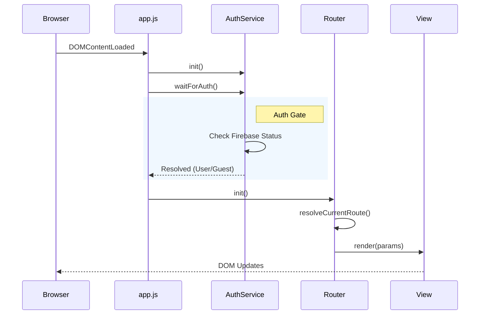

# Frontend JavaScript Root Analysis

## 1. Bootstrap: `public/js/app.js`
**Status**: `[ACTIVE]`
**Type**: Application Entry Point

### Logic
-   **Initialization**: `bootstrap()` function called on `DOMContentLoaded`.
-   **Auth Gate**: Waits for `AuthService.waitForAuth()` before handling routes (critical for protected views).
-   **UI Setup**: Initializes `TopNav` and `Footer` immediately (independent of auth).
-   **Event Listeners**:
    -   `spotify-auth-success`: Triggers background enrichment via `SpotifyEnrichmentService`.
-   **Router**: Registers all application routes (`/home`, `/albums`, `/playlists`, etc.).

### Boot Sequence Diagram

---

## 2. Router: `public/js/router.js`
**Status**: `[ACTIVE]`
**Type**: Client-Side Router

### Logic
-   **Mechanism**: History API (`pushState`, `popstate` event).
-   **Features**:
    -   **Navigation Hooks**: `beforeNavigate` and `afterNavigate`.
    -   **SafeDOM Support**: Renders Views that return DOM Nodes (recommended) or HTML strings (legacy).
    -   **Phantom Click Prevention**: Logic to avoid duplicate navigation or accidental clicks during renders.
    -   **Error Handling**: Catches render errors and displays a fallback UI in `#app`.

---

## 3. Client API: `public/js/api.js`
**Status**: `[ACTIVE]`
**Type**: API Client

### Logic
-   **Endpoints**: Proxies calls to `/api/generate` (Node.js backend).
-   **Features**:
    -   `fetchAlbumMetadata(query)`: Single album fetch.
    -   `fetchMultipleAlbumMetadata(queries)`: Concurrent batch fetching with retry mechanism (exponential backoff) and progress callbacks.
-   **Config**: logic to detect `window.__api_base` or fallback to same-origin.

---

## 4. Firebase: `public/js/firebase-init.js`
**Status**: `[ACTIVE]`
**Type**: Infrastructure

### Logic
-   **SDK**: Uses Firebase v9 Modular SDK (`firebase/app`, `firebase/auth`, `firebase/firestore`).
-   **Config**: Reads from `window.__firebase_config` (injected by build/env) or falls back to placeholders.
-   **Exports**: `app`, `auth`, `db` instances.
