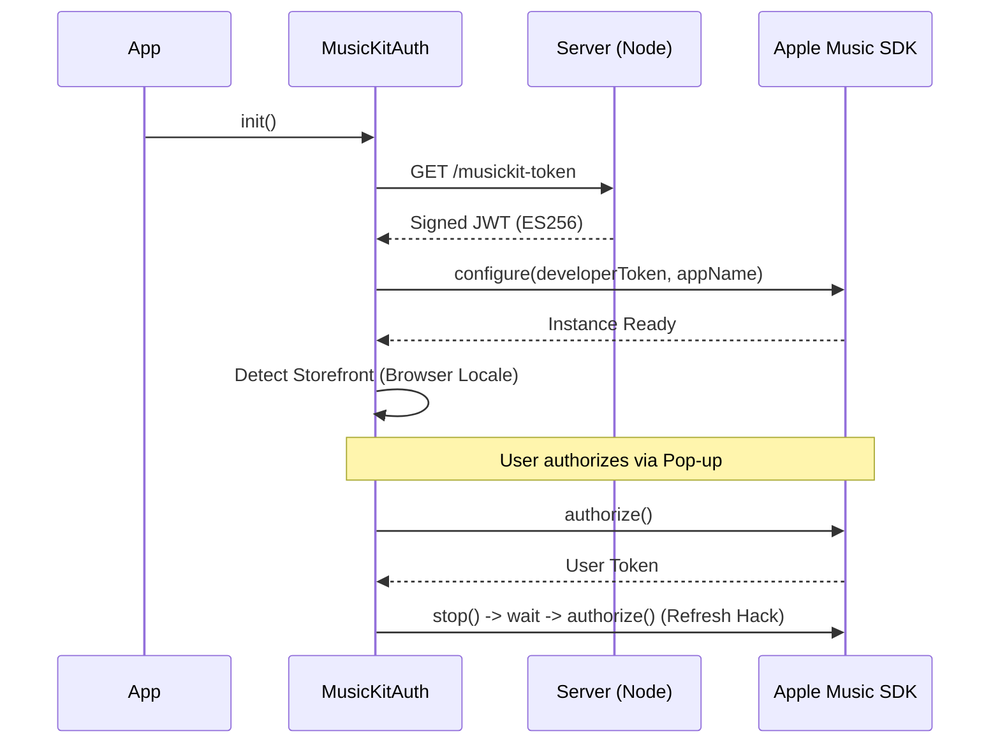

# Deep Dive: MusicKit Internals & Data Persistence (Batch 12)

This document covers the Apple Music integration layer (`MusicKit`) and the specialized services for data synchronization and persistence.

## 1. MusicKit Integration Layer (`public/js/services/musickit/`)
This folder contains the core logic for interacting with the Apple Music API on the client side.

### MusicKit Auth (`MusicKitAuth.js`)
*   **Role**: Handles the initialization lifecycle and user authorization.
*   **Key Features**:
    *   **Developer Token**: Fetches the signed JWT from `/api/musickit-token` (Server).
    *   **Lazy Loading**: Dynamically injects the `musickit.js` script tag only when needed.
    *   **Storefront Detection**:
        *   Primary: Uses the authenticated user's account storefront.
        *   Fallback: Uses browser locale (e.g., `navigator.language` "pt-BR" -> "br") for guests.
    *   **Validation**: Checks for mismatches between the Browser Storefront (what we guessed) and Account Storefront (what they actually have) to warn about catalog availability issues.

### Auth Sequence Diagram

### MusicKit Catalog (`MusicKitCatalog.js`)
*   **Role**: The "Read" interface for Apple Music.
*   **Capabilities**:
    *   `searchAlbums`: Performs catalog searches with ranking logic.
    *   `getAlbumDetails`: Fetches full metadata + tracks.
    *   `getArtistAlbums`: Handles pagination (looping until 404/empty) to fetch full discographies (up to 500 cap).
    *   `findTrackFromAlbum`: Fuzzy logic to find a specific track on a specific album (critical for "Replacement" logic during playlist generation).

### MusicKit Library (`MusicKitLibrary.js`)
*   **Role**: The "Write" interface for Apple Music.
*   **Capabilities**:
    *   `createPlaylist`: Creates standard playlists.
    *   `createOrGetFolder`: Manages folder structures (e.g., creating a "VibeCoding" folder).
    *   `createPlaylistInFolder`: Places generated playlists inside a specific folder to keep the user's library clean.

## 2. Infrastructure Services

### Data Sync Service (`public/js/services/DataSyncService.js`)
*   **Role**: Handles data migration between contexts.
*   **Use Case**: When a user starts as a "Guest" (local data) and then logs in, this service migrates their temporary Inventory and Series to their persistent Firestore account.
*   **Logic**: Iterates through arrays and calls Repository methods (`targetRepository.addAlbum`, `targetRepository.create`).

### Playlist Persistence Service (`public/js/services/PlaylistPersistenceService.js`)
*   **Role**: The bridge between the **Generation Engine** and the **Database**.
*   **Pattern**: **Service Facade** over Repositories.
*   **Key Logic**:
    *   **Batch Management**: Can overwrite previous batches (delete old -> save new) or append to them based on `preserveIds` flag.
    *   **Series Upsert**: Ensures the parent Series exists before saving children playlists.
    *   **Repository Usage**: Instantiates `PlaylistRepository` and `SeriesRepository` on the fly with the current user context.
