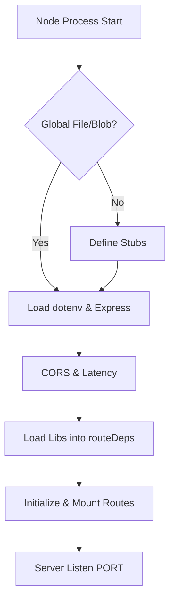
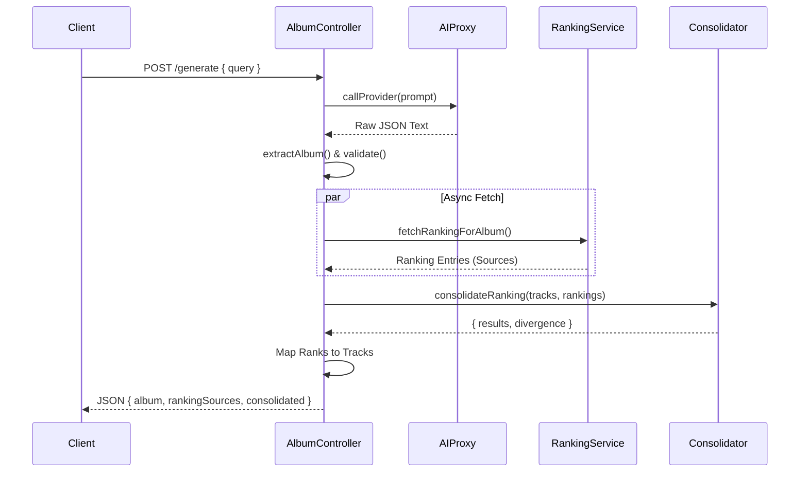
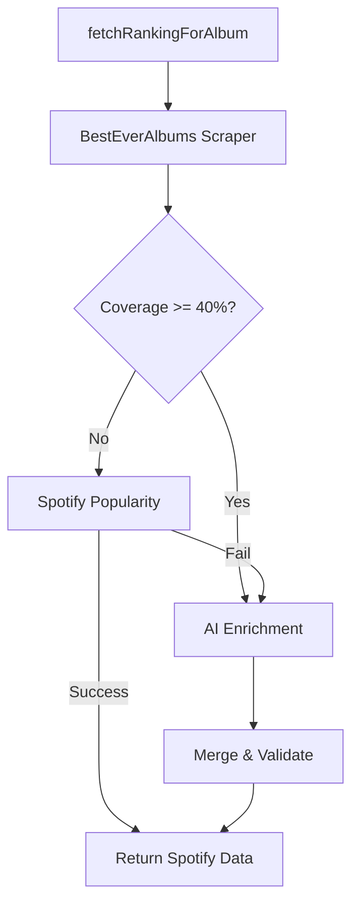

# Server Core Analysis

> **Deep Dive Enrichment**: This document details the logic flow, dependencies, and side effects of the Server Core components.

## 1. Entry Point: `server/index.js`
**Status**: `[ACTIVE]`
**Type**: Express Application Entry Point

### 1.1 Global Polyfills (Lines 1-40)
*   **Logical Trace**:
    1.  **CheckGlobals**: Checks if `File` or `Blob` are undefined in the global scope (Node.js < 20 often lacks these).
    2.  **TryImport**: Attempts to require `fetch-blob` if available.
    3.  **FallbackStub**:
        *   `_Blob` class: Stubs `size`, `type`, `text()`, `arrayBuffer()`. Side Effect: Sets `global.Blob`.
        *   `_File` class: Extends `_Blob` with `name`, `lastModified`. Side Effect: Sets `global.File`.
*   **Why**: Required by `undici` or `node-fetch` when importing libraries that expect browser-like File APIs.

### 1.2 Configuration & Middleware (Lines 42-87)
*   **Environment**: Loading `.env` via `dotenv`.
*   **CORS Logic**:
    *   **Input**: `process.env.ALLOWED_ORIGIN`.
    *   **Prod Logic**: Splitting comma-separated origins. Custom `origin` function allows non-browser requests (no origin header) and whitelisted domains.
    *   **Dev Logic**: `origin: true` (Matches any request).
*   **Latency Metric**: Middleware injects `req._startTime = Date.now()` for performance logging in downstream controllers.
*   **Health Check**: `GET /_health` -> Returns JSON `{ ok: true }`. Used by deployment platforms (Render/Heroku) for liveness checks.

### 1.3 Dependency Injection (Lines 90-114)
*   **Pattern**: Manual Dependency Injection.
*   **Components Loaded**:
    *   `lib/prompts`: `loadPrompts`, `renderPrompt`
    *   `lib/aiClient`: `callProvider`
    *   `lib/normalize`: `extractAlbum`
    *   `lib/schema`: `validateAlbum` (AJV)
    *   `lib/scrapers/besteveralbums`: `getBestEverRanking`
    *   `lib/fetchRanking`: `fetchRankingForAlbum`
    *   `lib/ranking`: `consolidateRanking`
*   **Injection Object**: `routeDeps` bundle passed to route configurators. This facilitates testing by allowing mock injections.

### 1.4 Route Mounting (Lines 120-141)
*   `api/` -> `routes/musickit.js` (Apple Music Token)
*   `api/` -> `routes/albums.js` (Generation & Enrichment) -> *Initialized with `routeDeps`*
*   `api/` -> `routes/playlists.js` (Curation)
*   `api/` -> `routes/debug.js` (System Tools) -> *Initialized with `routeDeps`*
*   `api/ai` -> `routes/ai.js` (Direct AI Proxy)

### 1.5 Architecture Diagram

---

## 2. API Routes: `server/routes/albums.js`
**Status**: `[ACTIVE]`
**Type**: Controller / Route Handler
**Dependencies**: Injected via `initAlbumRoutes(deps)`

### 2.1 `POST /api/enrich-album` (Lines 39-111)
**Purpose**: Enhances a raw album tracklist with "BestEverAlbums" community ratings.

*   **Logic Trace**:
    1.  **Validation**: checks `AI_API_KEY` (503 if missing) and `albumData` structure.
    2.  **Scraping**: Calls `getBestEverRanking(title, artist)`.
        *   *Failure Handling*: Logs warning, continues with `bestEver = null`.
    3.  **Indexing**:
        *   If evidence found: Normalizes all track titles in evidence using `normalizeRankingKey`.
        *   Creates `evidenceIndex` Map: `NormalizedKey -> Rating`.
    4.  **Mapping**:
        *   Iterates input `tracks`.
        *   Normalizes each track title.
        *   Lookups into `evidenceIndex`.
        *   Constructs `ratingsMap`: `[{ title, rating }]`.
    5.  **Fallback**: If no ratings, fills `ratingsMap` with `null`.
    6.  **Response**: Returns `{ data: { bestEverInfo, trackRatings } }`.

*   **Side Effects**: External HTTP request to BestEverAlbums. Console logs for debugging match rates.

### 2.2 `POST /api/generate` (Lines 117-285)
**Purpose**: Core endpoint. Generates album structure via AI, then enriches with rankings.

*   **Logic Trace**:
    1.  **AI Generation**:
        *   Loads prompt template `albumSearchPrompt`.
        *   Calls `callProvider` (AI Proxy).
        *   Logs Latency & Token Usage.
    2.  **Extraction & Validation**:
        *   `extractAlbum(response)` parses JSON from AI text.
        *   `validateAlbum(album)` checks against Schema (Draft-07). Returns 422 if invalid.
    3.  **Ranking Fetch (Deep Logic)**:
        *   Calls `fetchRankingForAlbum(album, query)`.
        *   *Logic*: This service attempts to find rankings from multiple sources (Spotify, BEA, etc.).
    4.  **Consolidation**:
        *   Calls `consolidateRanking(tracks, acclaim)`.
        *   *Logic*: Merges external ranking lists with the AI-generated tracklist to compute a "Consolidated Score" and "Divergence" metrics.
    5.  **Mapping**:
        *   Maps `finalPosition` and `rating` back to the specific `track` objects in the album.
    6.  **Sorting**:
        *   Creates `tracksByAcclaim` array (sorted clone of tracks).
    7.  **Response**: Returns `{ data: albumPayload }`.

*   **Architecture Diagram**:

---

## 3. API Routes: `server/routes/playlists.js`
**Status**: `[ACTIVE]`
**Type**: Controller / Route Handler

### 3.1 `POST /api/playlists` (Lines 14-71)
**Purpose**: Splits an album into curated playlists (e.g., "Greatest Hits", "Deep Cuts").

*   **Logic Trace**:
    1.  **Validation**: Requires `albums` array.
    2.  **Dynamic Import**: Imports `shared/curation.js` (ES Module).
        *   *Note*: Used dynamic import because `shared/` is outside CommonJS scope or treated as ESM.
    3.  **Option Parsing**:
        *   Calculates `targetSeconds`. supports `min/max` (average) or explicit `targetDuration`. Default: 45 min.
    4.  **Execution**: Calls `curateAlbums(albums, { targetSeconds })`.
    5.  **Formatting**: Maps internal domain objects to API response structure (id, name, tracks).
    6.  **Response**: Returns `{ playlists, summary, sources }`.

*   **Dependencies**: `shared/curation.js` (Pure business logic).

---

## 3.2 Services: `server/services/MusicKitTokenService.js`
**Status**: `[ACTIVE]`
**Type**: Service / Singleton

**Purpose**: Generates JWT tokens for Apple MusicKit JS on the frontend to authenticate with Apple Music using the developer credentials.

*   **Logic Trace**:
    1.  **Inputs**: `APPLE_TEAM_ID`, `APPLE_KEY_ID`, `APPLE_MUSIC_PRIVATE_KEY` (from Env).
    2.  **Algorithm**: ES256 (ECDSA P-256 + SHA-256).
    3.  **Caching**:
        *   Checks `tokenCache.token` and `tokenCache.expiresAt`.
        *   If valid (expiration > 1 hour away), return cached token.
    4.  **Generation**:
        *   Signs new JWT with `jwt.sign`.
        *   Sets TTL to 180 days (max allowed by Apple).
        *   Updates cache.
    5.  **Output**: Returns `{ token, expiresAt }`.

---

## 4. Libraries & Business Logic

### 4.1 `server/lib/fetchRanking.js` (Ranking Orchestrator)
**Status**: `[ACTIVE]`
**Type**: Service Facade

**Purpose**: Orchestrates the multi-source strategy to find "acclaim" rating for tracks.

*   **Logic Trace (`fetchRankingForAlbum`)**:
    1.  **Preparation**: Loads prompt templates and gets `normalizeKey` function.
    2.  **Strategy 1 (BestEverAlbums)**:
        *   Calls `getBestEverRanking`.
        *   Checks `quality`: If track count < 40% of album, considers it "insufficient".
    3.  **Strategy 2 (Spotify Popularity Fallback)**:
        *   *Trigger*: If BEA has < 40% coverage and < 3 total ratings.
        *   Calls `getSpotifyPopularityRanking`.
        *   *Decision*: If Spotify returns valid data >= 50% coverage, **returns immediately** (Short-circuit).
    4.  **Strategy 3 (AI Enrichment)**:
        *   *Trigger*: If BEA logic continues (coverage was okay OR Spotify failed).
        *   Calls `callProvider` with `rankingPrompt`.
        *   *Merges*: Merges AI results with scraped results using fuzzy title matching.
    5.  **Output**: Returns `{ entries, sources, debugTrace }`.

*   **Architecture Diagram**:

### 4.2 `server/lib/ranking.js` (Consolidation Logic)
**Status**: `[ACTIVE]`
**Type**: Domain Logic (Pure Function)

**Purpose**: Merges an unordered set of "Acclaim" ratings onto the official tracklist.

*   **Algorithm (Borda Count Variant)**:
    1.  **Normalization**: Creates a map of official tracks using `normalizeKey`.
    2.  **Matching**:
        *   Iterates through external `acclaim` entries.
        *   First pass: Exact normalized key match.
        *   Second pass: Fuzzy token overlap (requires > 40% overlap).
    3.  **Scoring**:
        *   `Score = N - Position + 1`.
        *   Accumulates scores if multiple sources cite the same track.
    4.  **Sorting**:
        *   Primary Sort: Explicit Rating (if available).
        *   Secondary Sort: Calculated Borda Score.
    5.  **Divergence**: Captures "Unmatched Mentions" (tracks in valid Ranking sources that aren't in the official album).

---

## 5. Scrapers: `server/lib/scrapers/besteveralbums.js`
**Status**: `[ACTIVE]`
**Type**: External Adapter / Scraper

**Purpose**: Extracts track-level ratings from besteveralbums.com.

*   **Logic Trace**:
    1.  **Discovery (`findAlbumId`)**:
        *   Queries `suggest.php` or `search.php`.
        *   **Heuristics**: Checks URL patterns (`thechart.php`, `album.php`) and verifies Title/Artist match in HTML.
    2.  **Parsing (`parseChartRankingById`)**:
        *   Uses `cheerio` to find specific Table rows.
        *   Extracts `Text` (Track Title) and `(Rating: XX)` patterns.
        *   Check columns for 'Track' and 'Rating' headers to adapt to different layouts.
    3.  **Resilience**:
        *   Handles multiple HTML layouts (Table-based vs Flex-divs).
        *   Ignores tribute albums/remixes via "Bad Keywords" list (e.g. 'tribute', 'live', 'string quartet').

*   **Key Dependencies**:
    *   `axios` (HTTP Client)
    *   `cheerio` (DOM Parser)

---

## 6. Schemas: `server/schema/album.schema.json`
**Status**: `[ACTIVE]`
**Type**: JSON Schema (Draft-07)

### Structure
*   **Root**: Object
*   **Required**: `title`, `artist`, `tracks`.
*   **Tracks**: Array of objects.
    -   Each track MUST have: `id`, `rank` (1-based index), `title`.
    -   Optional: `duration` (string or number).

### Usage
Used by `server/lib/schema.js` (via `ajv`) to validate data coming from AI generation or external APIs before processing.
