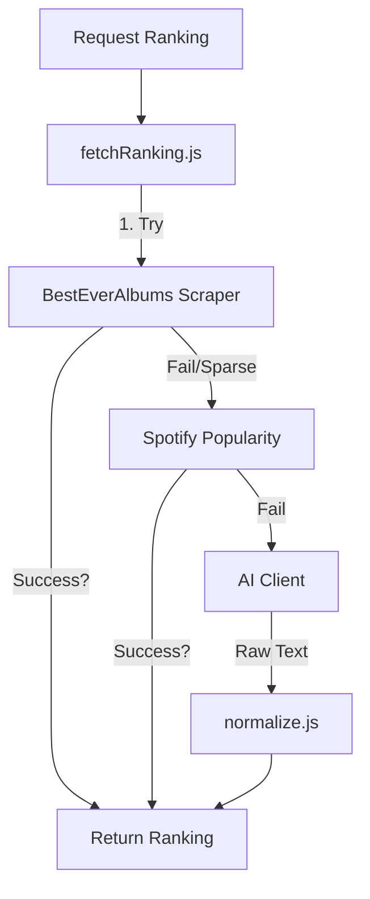

# Deep Dive: Server Logic & Utilities

This document audits the backend logic layer located in `server/lib/` and `server/services/`. This layer handles data acquisition, normalization, and intelligence (AI/Ranking).

## 1. Intelligence Orchestration

The backend uses a **waterfall strategy** to determine the best ranking for an album. This is orchestrated by `fetchRanking.js`.

### Ranking Strategy (`fetchRanking.js`)
The `fetchRankingForAlbum` function implements a specific priority chain (The "Sprint 9 Pivot"):

1.  **BestEverAlbums (Community)**: First tries to scrape community rankings.
    *   *Quality Threshold*: Requires **>= 3 rated tracks** or **40% of the album** to have ratings.
    *   *Logic*: If this threshold isn't met, the data is considered "sparse" and the system falls back to Spotify.
2.  **Spotify Popularity (Fallback 1)**: If community data is sparse/missing, it fetches track popularity from Spotify.
    *   *Logic*: Sorts tracks by popularity index (0-100).
    *   *Condition*: This fallback **exclusively wins** if it finds data for >= 50% of the tracks. It does not merge with sparse BestEver data to avoid polluting the ranking.
3.  **AI (Fallback 2)**: Last resort. Uses LLM (Gemini) to retrieve a critical ranking based on its training data.
    *   *Method*: Injects the `rankingPrompt` into the AI Provider.
    *   *Anti-Hallucination*: Strictly instructed to set `referenceUrl` to `null` if it cannot verify a source.

### Ranking Services

| Service | Location | Responsibility |
| :--- | :--- | :--- |
| **`scrapers/besteveralbums.js`** | `server/lib/` | **Primary Source**. Scrapes HTML from besteveralbums.com to extract user-generated track content/ratings. |
| **`spotifyPopularity.js`** | `server/lib/services/` | **Secondary Source**. Queries Spotify API for track popularity. Implements caching and rate-limiting. |
| **`aiClient.js`** | `server/lib/` | **Tertiary Source**. Wrapper around the AI Provider (Gemini). Handles prompt injection (`prompts.js`) and response parsing. |

---

## 2. Core Utilities

These files provide the foundational logic for data processing and safety.

| File | Type | Details |
| :--- | :--- | :--- |
| **`normalize.js`** | **Data Cleaning** | **Heavy Logic**. Contains regex and parsing logic to clean "dirty" JSON/Markdown from AI responses. Handles specific edge cases like "Thriller Bug" (forcing tracks array) and numbered list parsing. |
| **`schema.js`** | **Validation** | Uses **Ajv** to validate album objects against `album.schema.json`. Ensures database integrity. |
| **`validateSource.js`** | **Security** | Verifies metadata URLs. Performs HEAD/GET requests to ensure reference links provided by AI/Scrapers are valid (status < 400). |
| **`logger.js`** | **Observability** | A lightweight structured logger (JSON format) replacing standard `console.log` for better ingestion in production. |

---

## 3. Data Flow Diagram

### Ranking Acquisition Flow

### Folder Structure Anomalies
> [!NOTE]
> *   `MusicKitTokenService.js` is in `server/services/`.
> *   `spotifyPopularity.js` is in `server/lib/services/`.
> *   Recommendation: Consolidate all third-party integration services into `server/services/` in a future refactor.

---

## 4. AI Prompts & Configuration

The application uses externalized JSON configuration for AI prompts, located in `config/prompts.json`.

### `rankingPrompt`
Used by `fetchRanking.js` (Fallback 2).
*   **Goal**: "What are the most acclaimed tracks and the ranking for all tracks... considering BestEverAlbums ratings?"
*   **Rules**:
    1.  **Primary Evidence**: Use BestEverAlbums if available.
    2.  **Fallback Sources**: Use `defaultRankingProviders` (e.g., Rolling Stone, NME, Pitchfork) if BEA is missing.
    3.  **Anti-Hallucination**: "Do NOT invent URLs. If you cannot verify a URL, set `referenceUrl` to null."
*   **Output Format**: Strictly enforces a dual-format response:
    1.  Compact JSON (`ranking` array + `sources` array).
    2.  Numbered plain-text list (for human readability/debugging).

### `defaultRankingProviders`
A curated list of 11 reliable music journalism sources injected into the prompt context to guide the AI's search/hallucination:
*   Ultimate Classic Rock
*   Tenho Mais Discos Que Amigos (TMDQA!)
*   Reddit (Fan Subreddits)
*   TheTopTens.com
*   Wikipedia
*   Billboard
*   Rolling Stone
*   NME
*   AllMusic
*   Rate Your Music
*   Pitchfork
