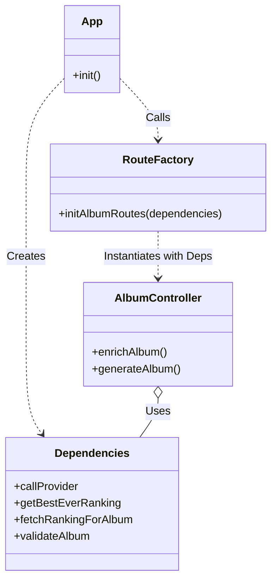
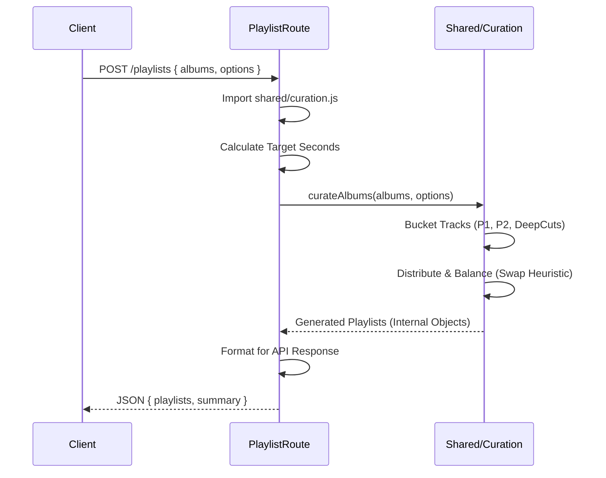

# Server Routes Analysis

## 1. AI Routes: `server/routes/ai.js`
**Status**: `[ACTIVE]`
**Type**: Express Router
**Mount Path**: `/api/ai`

### Endpoints
-   `POST /studio-albums`:
    -   **Input**: `{ artistName }`
    -   **Logic**: Uses Google Gemini to generate a strict JSON list of "original studio albums" for the artist, excluding complications.
    -   **Features**: Includes robust JSON parsing fallback (regex extraction) to handle AI formatting errors.

---

## 2. Album Routes: `server/routes/albums.js`
**Status**: `[ACTIVE]`
**Type**: Express Router / Factory
**Mount Path**: `/api`

### Architecture
Uses a **Factory Pattern** (`initAlbumRoutes`) to inject dependencies (`callProvider`, `scrapers`, etc.) instead of requiring them directly. This facilitates testing and decoupling.

### Endpoints
-   `POST /enrich-album`:
    -   **Input**: `{ albumData: { title, artist, tracks } }`
    -   **Logic**: Scrapes BestEverAlbums for the album to get community ratings/rankings. Maps these ratings to the provided tracklist using fuzzy string normalization.
    -   **Response**: `{ data: { bestEverInfo, trackRatings } }`
-   `POST /generate`:
    -   **Input**: `{ albumQuery, model, maxTokens }`
    -   **Logic**:
        1.  Calls AI to search/generate album metadata.
        2.  Validates response against `album.schema.json`.
        3.  Fetches external rankings (BestEverAlbums) via `fetchRankingForAlbum`.
        4.  Consolidates AI + External data to rank tracks (`consolidateRanking`).
        5.  Sorts tracks by acclaim (`tracksByAcclaim`).

---

## 3. Debug Routes: `server/routes/debug.js`
**Status**: `[ACTIVE]` (Development/Diagnostics)
**Type**: Express Router / Factory
**Mount Path**: `/api`

### Endpoints
-   `GET /list-models`: Proxies call to Google Gemini API to list available models.
-   `POST /debug/raw-ranking`: Returns the raw AI and Scraper responses without normalization, for debugging pipeline issues.
-   `GET /debug/files`: Lists server file system (allow-list restricted) to verify container structure in Cloud Run.
-   `GET /debug/import`: Tests dynamic import of ES modules (specifically `shared/normalize.js`).

---

## 4. MusicKit Routes: `server/routes/musickit.js`
**Status**: `[ACTIVE]`
**Type**: Express Router
**Mount Path**: `/api`

### Endpoints
-   `GET /musickit-token`:
    -   **Logic**: Calls `MusicKitTokenService` to get/generate a signed JWT for Apple Music.
    -   **Caching**: Returns cached token if valid.
-   `GET /musickit-status`:
    -   **Logic**: Checks if all required Env Vars (Team ID, Key ID, Private Key) are present.

---

## 5. Playlist Routes: `server/routes/playlists.js`
**Status**: `[ACTIVE]`
**Type**: Express Router
**Mount Path**: `/api`

### Dependencies
-   **Dynamic Import**: Imports `../../shared/curation.js` at runtime.

### Endpoints
-   `POST /playlists`:
    -   **Input**: `{ albums: [], options: { minDuration, maxDuration, ... } }`
    -   **Logic**: Converts duration targets to seconds and delegates to `curateAlbums` (shared logic) to generate balanced playlists.
    -   **Response**: `{ playlists: [...], summary, sources }`

### Playlist Logic Flow

