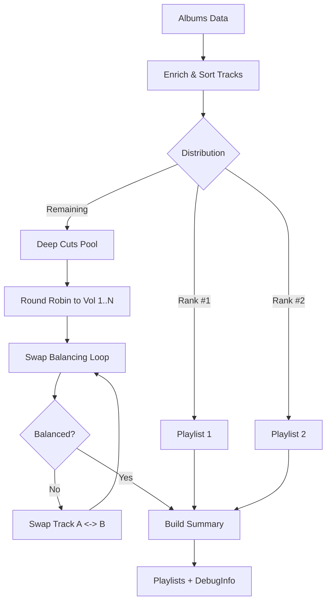

# Shared Code Analysis

> **Deep Dive Enrichment**: This document details the platform-agnostic business logic shared between Server and Frontend (if applicable), focusing on the Core Curation Engine.

## 1. Utilities: `shared/normalize.js`
**Status**: `[ACTIVE]`
**Type**: Utility / String Manipulation

**Purpose**: Provides standard canonicalization for fuzzy matching of track titles and artist names.

*   **Logic Trace**:
    1.  **Input**: Raw string (e.g., "Money (2023 Remaster)").
    2.  **Transformations**:
        *   Lowercase.
        *   Remove parentheticals `(...)`, `[...]`, `{...}`.
        *   Remove specific suffixes: `- 20xx Remaster`, `- 20xx Mix`.
        *   Remove all non-alphanumeric characters (punctuation).
        *   Collapse whitespace.
    3.  **Output**: Clean token string (e.g., "money").

---

## 2. Core Logic: `shared/curation.js` (The Curation Engine)
**Status**: `[ACTIVE]`
**Type**: Domain Logic / Algorithm
**Dependencies**: `normalize.js`

**Purpose**: The "Brain" of the playlist generation. Takes enriched albums and distributes tracks into balanced playlists (Greatest Hits, Deep Cuts).

### 2.1 Class `CurationEngine`

#### A. Track Enrichment (`enrichTracks`)
*   **Goal**: Merge multiple data sources onto the Track object before curation.
*   **Logic Trace**:
    1.  **Index Creation**: Builds maps for `Consolidated`, `BestEver`, and `Acclaim` data using `normalizeKey`.
    2.  **Resolution (Per Track)**:
        *   **Rating**: Checks `rating` > `Consolidated.rating` > `BestEver.rating` > `Acclaim.rating`.
        *   **Score**: Checks `acclaimScore` > `normalizedScore`.
        *   **Rank**: Checks `acclaimRank` > `Consolidated.position` > index (1-based).
    3.  **Sorting**:
        *   Sorts tracks by `Rating (desc)` -> `Score (desc)` -> `Rank (asc)`.
    4.  **Assignment**: Assigns a new `acclaimRank` (1..N) based on this final sort order to ensure "Rank #1" is truly the highest valued track.

#### B. Playlist Distribution (`curate`)
*   **Goal**: Distribute tracks into buckets.
*   **Logic Trace**:
    1.  **P1 (Hits Vol 1)**: Takes the track with `acclaimRank === 1` from EVERY album.
    2.  **P2 (Hits Vol 2)**: Takes the track with `acclaimRank === 2` from EVERY album.
    3.  **Deep Cuts**:
        *   Collects all remaining tracks.
        *   Calculates `TotalDuration`.
        *   Determines `N` playlists needed (`Total / TargetDuration`).
        *   **Round Robin Distribution**: Distributes tracks into `N` buckets to ensure even spread of albums across volumes.
    4.  **Fill Heuristic**: If P1/P2 are too short, "steals" best remaining tracks from Deep Cuts to fill them up.

#### C. Balancing Algorithm (`runFase4SwapBalancing`)
*   **Goal**: Ensure all Deep Cuts playlists are close to `TargetDuration` (e.g., 45m).
*   **Logic Trace**:
    1.  **Detection**: Identifies `pOver` (Longest) and `pUnder` (Shortest).
    2.  **Check**: If both are within tolerance (`FLEXIBILITY = 7m`), stop.
    3.  **Swap Search**:
        *   Iterates every track in `pOver` vs every track in `pUnder`.
        *   **Constraint**: Cannot swap if it breaks "Album Continuity" (last track of an album must stay with its peers if possible) - *Note: This logic is strict.*
        *   **Optimization**: Finds the pair `(tOver, tUnder)` that minimizes the duration gap.
    4.  **Execute**: Performs swap and repeats (Max 100 iterations).

### 2.2 Visual Logic Flow

