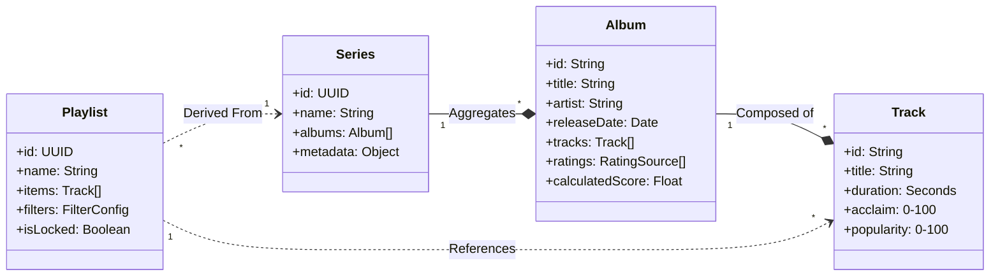
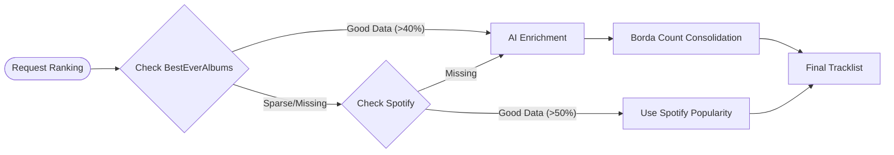
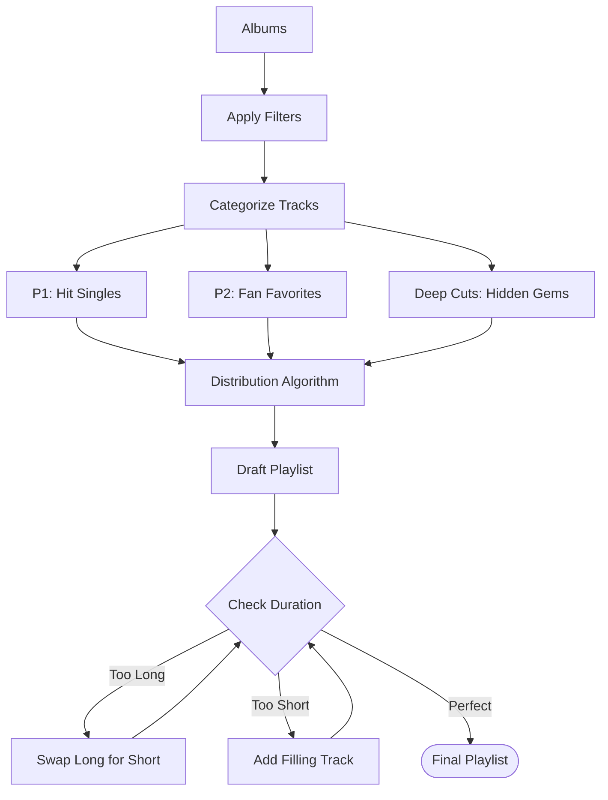

# System Architecture & Design Patterns

> **[⬅️ Back to Reference Guide Index](00_MJRP_Album_Blender_Ref_Guide_Index.md)**

> **Master Map**: This document provides the holistic "Big Picture" of the MJRP codebase. It consolidates architectural decisions, design patterns, data flows, and project structure into a single source of truth.

## 1. High-Level Architecture
**Type**: Hybrid SPA/SSR (Single Page Application with rich Server-Side Intelligence).

The system splits responsibilities into two distinct layers:
1.  **Frontend (The Client)**: A Vanilla JS SPA (Model-View-Controller) responsible for user interaction, state management, and final playlist curation.
2.  **Backend (The Brain)**: A Node.js/Express server responsible for AI orchestration, HTML scraping, and "Truth" application (Ranking verification).

```mermaid
graph TD
    Client[Frontend Client] <-->|JSON API| Server[Node.js Server]
    
    subgraph "Frontend Layer (Browser)"
        Router[SPA Router]
        Store[State Store (MobX-like)]
        View[MVC Views]
        Controller[Controllers]
    end
    
    subgraph "Server Layer (Node.js)"
        API[Express API]
        Orchestrator[Ranking Engine]
        Scraper[HTML Scrapers]
        AI_Proxy[Google Gemini Client]
    end
    
    subgraph "Persistence Layer"
        Firebase[Firestore DB]
        Cache[IndexedDB / LocalStorage]
    end

    subgraph "External Ecosystem"
        Spotify[Spotify API]
        Apple[Apple MusicKit]
        BEA[BestEverAlbums.com]
    end

    View --> Controller
    Controller --> Store
    Store --> Router
    
    API --> Orchestrator
    Orchestrator --> Scraper
    Orchestrator --> AI_Proxy
    
    Store <--> Firebase
    Client <--> Spotify
    Server <--> BEA
```

---

## 2. Domain & Data Architecture (ERD)
The application models a "Music Curator" domain, focusing on the relationship between **Series** (Artist Discographies) and **Playlists** (Curated Outputs).



---

## 3. Design Patterns Registry
Top-level architectural patterns chosen to solve specific problems.

| Pattern | Where It's Used | Why It Was Chosen |
| :--- | :--- | :--- |
| **Model-View-Controller (MVC)** | `js/views/`, `js/controllers/`, `js/stores/` | **Separation of Concerns**. Keeps UI rendering (`Views`) separate from Business Logic (`Controllers`) and State (`Stores`). Essential for maintainability in Vanilla JS. |
| **Observer/PubSub** | `js/stores/*.js`, `BaseView.js` | **Reactivity**. Stores (Subject) notify Views (Observer) when state changes (e.g., `inventoryStore.subscribe(this.render)`). Decouples data updates from UI updates. |
| **Strategy Pattern** | `ranking/*Strategy.js`, `album-search/classification/` | **Flexibility**. Allows hot-swapping algorithms (e.g., switching between `BestEverRanking` and `SpotifyPopularity`) without changing the consuming code. |
| **Factory Pattern** | `server/routes/albums.js` | **Dependency Injection**. Routes are initialized (`initAlbumRoutes`) by injecting Services (`EnrichmentService`, `GenerationService`). Makes testing significantly easier by allowing mocks. |
| **Singleton Pattern** | `js/services/*.js`, `js/stores/*.js` | **State Consistency**. Services like `AuthService`, `SpotifyExportService` and Stores must have only one instance. |
| **Service Layer** | `server/lib/services/`, `public/js/services/` | **Logic Decoupling**. Extracts complex business logic (Scraping, AI, State Machines) from Routes and Components into testable, reusable classes. |
| **Command Pattern** | `js/controllers/InventoryController.js` | **Action Encapsulation**. User actions (Delete, Update) are encapsulated as methods in controllers, allowing Views to simply "Delegate" commands without knowing internal logic. |
| **Facade Pattern** | `server/lib/fetchRanking.js` | **Simplification**. Hides the complex complexity of Scraping + AI + Fallbacks behind a single simple function call (`fetchRankingForAlbum`). |

---

## 4. Core Logic Architectures

### 4.1 Server-Side: The "Acclaim" Waterfall
How the system determines the "Truth" about a song's quality.



### 4.2 Client-Side: The "Balanced Cascade" Generator
How the system constructs a playlist that flows well.



---

## 5. Comprehensive Directory Structure
The physical layout of the codebase, annotated with purpose.

```text
/
├── .github/                # CI/CD Workflows
├── config/
│   └── prompts.json        # Externalized AI Prompts (Configuration as Code)
├── docs/                   # Documentation & Analysis
├── public/                 # FRONTEND (Hosted Static Assets)
│   ├── css/                # Vanilla CSS (Split by Domain: animations, modals, etc.)
│   ├── js/
│   │   ├── algorithms/     # Core Logic (Pure Functions, e.g., TopN)
│   │   ├── cache/          # Persistence Layers (IndexedDB, Memory)
│   │   ├── components/     # UI Web Components (Reusable Blocks)
│   │   ├── controllers/    # MVC Controllers (User Input -> Logic)
│   │   ├── models/         # Domain Objects (Album, Track)
│   │   ├── ranking/        # Ranking Strategies (BEA, Spotify)
│   │   ├── repositories/   # Data Access Layer (Abstracts Stores/Cache)
│   │   ├── services/       # External Integrations (Spotify, Auth)
│   │   ├── stores/         # State Management (The "Truth")
│   │   ├── utils/          # Helpers (SafeDOM, Formatting)
│   │   ├── views/          # MVC Views (DOM Manipulation)
│   │   ├── workers/        # Web Workers (Off-main-thread Search)
│   │   ├── app.js          # App Entry Point
│   │   └── router.js       # Client-Side Router
│   └── index.html          # Single Page Application Shell
├── server/                 # BACKEND (Node.js API)
│   ├── lib/
│   │   ├── scrapers/       # HTML Scrapers (BestEverAlbums)
│   │   ├── services/       # Core Services (Enrichment, Generation)
│   │   ├── fetchRanking.js # Orchestrator Facade
│   │   └── ranking.js      # Consolidation Math
│   ├── routes/             # Express Route Definitions (Thin Routes)
│   ├── schema/             # JSON Schemas (Validation)
│   ├── services/           # Backend Auth Services (Tokens)
│   └── index.js            # Server Entry Point
├── shared/                 # ISOMORPHIC CODE (Runs on Client & Server)
│   ├── curation.js         # Playlist Generation Logic
│   └── normalize.js        # Data Sanitization
└── test/                   # VERIFICATION
    ├── e2e/                # End-to-End Tests (Puppeteer)
    └── unit/               # Unit Tests (Jest/Vitest)
```
