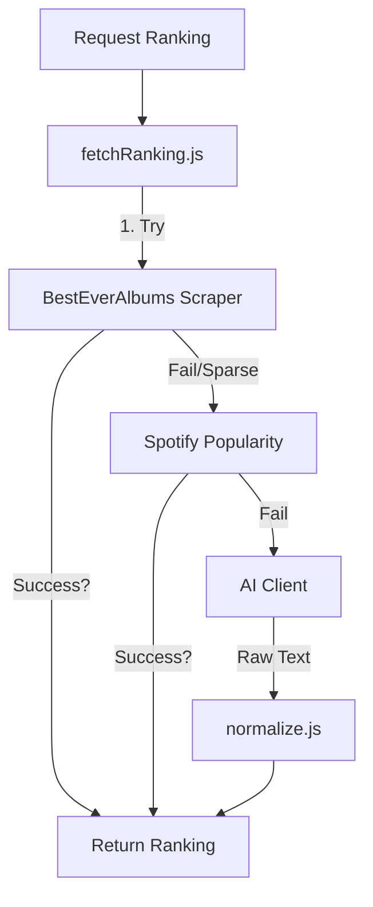
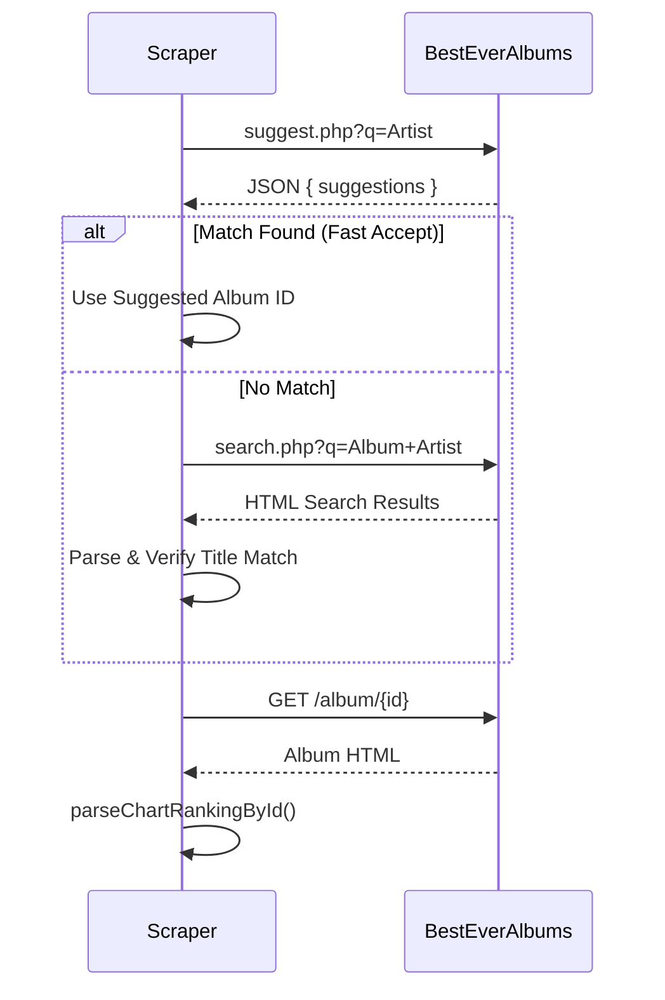

# Deep Dive: Server Logic & Utilities

This document audits the backend logic layer located in `server/lib/` and `server/services/`. This layer handles data acquisition, normalization, and intelligence (AI/Ranking).

## 1. Intelligence Orchestration

The backend uses a **waterfall strategy** to determine the best ranking for an album. This is orchestrated by `fetchRanking.js`.

### Ranking Strategy (`fetchRanking.js`)
The `fetchRankingForAlbum` function implements a specific priority chain (The "Sprint 9 Pivot"):

1.  **BestEverAlbums (Community)**: First tries to scrape community rankings.
    *   *Quality Threshold*: Requires **>= 3 rated tracks** or **40% of the album** to have ratings.
    *   *Logic*: If this threshold isn't met, the data is considered "sparse" and the system falls back to Spotify.
2.  **Spotify Popularity (Fallback 1)**: If community data is sparse/missing, it fetches track popularity from Spotify.
    *   *Logic*: Sorts tracks by popularity index (0-100).
    *   *Condition*: This fallback **exclusively wins** if it finds data for >= 50% of the tracks. It does not merge with sparse BestEver data to avoid polluting the ranking.
3.  **AI (Fallback 2)**: Last resort. Uses LLM (Gemini) to retrieve a critical ranking based on its training data.
    *   *Method*: Injects the `rankingPrompt` into the AI Provider.
    *   *Anti-Hallucination*: Strictly instructed to set `referenceUrl` to `null` if it cannot verify a source.

### Ranking Services

| Service | Location | Responsibility |
| :--- | :--- | :--- |
| **`scrapers/besteveralbums.js`** | `server/lib/` | **Primary Source**. Scrapes HTML from besteveralbums.com to extract user-generated track content/ratings. |
| **`spotifyPopularity.js`** | `server/lib/services/` | **Secondary Source**. Queries Spotify API for track popularity. Implements caching and rate-limiting. |
| **`aiClient.js`** | `server/lib/` | **Tertiary Source**. Wrapper around the AI Provider (Gemini). Handles prompt injection (`prompts.js`) and response parsing. |

---

## 2. Core Utilities

These files provide the foundational logic for data processing and safety.

| File | Type | Details |
| :--- | :--- | :--- |
| **`normalize.js`** | **Data Cleaning** | **Heavy Logic**. Contains regex and parsing logic to clean "dirty" JSON/Markdown from AI responses. Handles specific edge cases like "Thriller Bug" (forcing tracks array) and numbered list parsing. |
| **`schema.js`** | **Validation** | Uses **Ajv** to validate album objects against `album.schema.json`. Ensures database integrity. |
| **`validateSource.js`** | **Security** | Verifies metadata URLs. Performs HEAD/GET requests to ensure reference links provided by AI/Scrapers are valid (status < 400). |
| **`logger.js`** | **Observability** | A lightweight structured logger (JSON format) replacing standard `console.log` for better ingestion in production. |

---

## 3. Data Flow Diagram

### Ranking Acquisition Flow


### Folder Structure Anomalies
> [!NOTE]
> *   `MusicKitTokenService.js` is in `server/services/`.
> *   `spotifyPopularity.js` is in `server/lib/services/`.
> *   Recommendation: Consolidate all third-party integration services into `server/services/` in a future refactor.

### Consolidation Logic (Borda Count)
This diagram details the `consolidateRanking` function logic in `server/lib/ranking.js`.

```mermaid
flowchart TD
    Input[Sources: BEA, Spotify, AI] --> Norm[Normalize Keys]
    Norm --> Match{Match Official Tracks?}
    
    Match -- Exact Match --> Score[Assign Score (N - Rank)]
    Match -- Fuzzy > 40% --> Score
    Match -- No Match --> Div[Add to Divergence List]
    
    Score --> Accum[Accumulate Scores per Track]
    Accum --> Sort[Sort Tracks]
    Sort --> Rule1{Has Explicit Rating?}
    Rule1 -- Yes --> Rank1[Primary Sort]
    Rule1 -- No --> Rank2[Secondary Sort (Borda Score)]
    
    Rank1 --> Final[Final Ordered Tracklist]
    Rank2 --> Final
```

---

# Server Libraries Analysis

## 1. AI Client: `server/lib/aiClient.js`
**Status**: `[ACTIVE]`
**Type**: Utility / Service wrapper

### Logic
-   Wraps calls to Google Gemini API (`generativelanguage.googleapis.com`).
-   **Features**:
    -   Supports `google_search` grounding tool.
    -   Configurable `temperature` (0.1) and `maxTokens`.
    -   Legacy fallback for proxied endpoints.

---

## 2. Ranking Fetcher: `server/lib/fetchRanking.js`
**Status**: `[ACTIVE]`
**Type**: Domain Logic (Complex)

### Core Workflow
1.  **Preparation**: Loads normalization keys and ranking prompts.
2.  **Primary Source**: Scrapes **BestEverAlbums** (Community ratings).
3.  **Fallback Logic** (Critical):
    -   If BestEver has insufficient data (few rated tracks), triggers **Spotify Popularity** fallback.
    -   If Spotify Popularity has good coverage (>=50% tracks), it **replaces** the weak BestEver data entirely.
4.  **Enrichment**:
    -   Consolidates AI results with scraper results.
5.  **Consolidation (Sprint 23)**:
    -   Merges all evidence (Community + Popularity + AI) into a single `evidence` array per track.
    -   Provides full provenance: `{ source: 'BestEverAlbums', score: 90, votes: 25 }`.

### Architecture Diagram
```mermaid
flowchart TD
    Start([Fetch Ranking]) --> BEA[BestEverAlbums Scraper]
    BEA --> Check{Suffient Data?}
    Check -- Yes --> AI_Check{Enrichment Needed?}
    Check -- No --> Spotify[Spotify Popularity Fallback]
    Spotify --> SpotCheck{Spotify Coverage >= 50%?}
    SpotCheck -- Yes --> UseSpotify[Use Spotify Data exclusively]
    SpotCheck -- No --> AI[AI Enrichment (Gemini)]
    AI_Check -- Yes --> AI
    AI_Check -- No --> Return
    AI --> Norm[Normalize & Merge]
    Norm --> Return([Return Ranking])
    UseSpotify --> Return
```

---

## 3. Logger: `server/lib/logger.js`
**Status**: `[ACTIVE]`
**Type**: Utility

### Logic
-   Simple structured logging (JSON output).
-   `info`, `warn`, `error` levels.
-   Designed for ingestion by cloud logging agents (Cloud Run).

---

## 4. Normalization: `server/lib/normalize.js`
**Status**: `[ACTIVE]`
**Type**: Utility / Data Cleaning

### Responsibilities
-   **Text Cleaning**: `cleanFencedMarkdown` removes Markdown code blocks from LLM responses.
-   **JSON Repair**: `tryParseJson` and `tryRecoverRankingFromText` attempt to extract valid JSON from broken AI text responses (e.g., finding the first valid `{}` block).
-   **Ranking Extraction**: Parsers for various list formats (Numbered lists, "ranking" keys).
-   **Album Normalization**: `extractAlbum` ensures fields like `tracks` are arrays and defaults are set.

---

## 5. Prompts Loader: `server/lib/prompts.js`
**Status**: `[ACTIVE]`
**Type**: Config Loader

### Logic
-   Loads `prompts.json` from either parent directory or container config path.
-   **Template Rendering**: `renderPrompt` handles `{{variable}}` substitution.

---

## 6. Ranking Logic: `server/lib/ranking.js`
**Status**: `[ACTIVE]`
**Type**: Algorithm

### Logic
-   **Consolidation**: Merges rankings from multiple sources.
-   **Matching**: Uses **Fuzzy Token Overlap** (`tokenOverlapRatio`) to match tracks (e.g., "Song (Live)" vs "Song").
-   **Scoring**:
    -   **Borda Count**: Points = `N - Position + 1`.
    -   **Prioritization**: Prefers explicit ratings (0-100) over calculated position scores when sorting.
-   **Output**: Returns consolidated `results` and `divergence` stats (unmatched tracks).

---

## 7. Schema Validator: `server/lib/schema.js`
**Status**: `[ACTIVE]`
**Type**: Validation

### Logic
-   Wraps `ajv` to compile `server/schema/album.schema.json`.
-   Gracefully handles missing `ajv` (logs warning instead of crashing).

---

## 8. Source Validator: `server/lib/validateSource.js`
**Status**: `[ACTIVE]`
**Type**: Validation / Network

### Logic
-   `verifyUrl(url)`: Performs a GET request (max 50KB) to ensure a URL is reachable (status < 400).
-   `isBestEverUrl(url)`: Whitelists `besteveralbums.com` (skips verification for known good domain).

---

## 9. Scraper: `server/lib/scrapers/besteveralbums.js`
**Status**: `[ACTIVE]`
**Type**: Web Scraper / Crawler

### Logic
-   **Target**: `besteveralbums.com`
-   **Heuristics**:
    -   **Smart Search**: Uses the site's `suggest.php` endpoint first for "fast accept" (avoiding full page loads if a "By [Artist]" match is found).
    -   **Fallback**: Standard HTML search via `search.php`.
    -   **Verification**: Checks page HTML (`h1`, `title`) to ensure the album matches the requested Artist/Title (prevents tribute/cover album mix-ups).
-   **Parsers**:
    -   `parseChartRankingById`: Extracts ratings from chart tables (looking for "Rating: 84 (398 votes)").
    -   `parseAlbumRanking`: HTML fallback if no chart table found.

    -   `parseAlbumRanking`: HTML fallback if no chart table found.

### Scraper Discovery Sequence


---

## 10. Service: `server/lib/services/spotifyPopularity.js`
**Status**: `[ACTIVE]`
**Type**: External API Client

### Logic
-   **Auth**: Client Credentials Flow (`grant_type: client_credentials`) to get a server-side Access Token.
-   **Workflow**:
    1.  Search `album:{title} artist:{name}` to get Album ID.
    2.  Get Album Tracks (IDs only).
    3.  **Batch Request**: Query `/v1/tracks` with up to 50 IDs to get the full track objects (which contain the `popularity` field).
    4.  **Output**: Maps `popularity` (0-100) directly to `rating`.


---

## 4. AI Prompts & Configuration

The application uses externalized JSON configuration for AI prompts, located in `config/prompts.json`.

### `rankingPrompt`
Used by `fetchRanking.js` (Fallback 2).
*   **Goal**: "What are the most acclaimed tracks and the ranking for all tracks... considering BestEverAlbums ratings?"
*   **Rules**:
    1.  **Primary Evidence**: Use BestEverAlbums if available.
    2.  **Fallback Sources**: Use `defaultRankingProviders` (e.g., Rolling Stone, NME, Pitchfork) if BEA is missing.
    3.  **Anti-Hallucination**: "Do NOT invent URLs. If you cannot verify a URL, set `referenceUrl` to null."
*   **Output Format**: Strictly enforces a dual-format response:
    1.  Compact JSON (`ranking` array + `sources` array).
    2.  Numbered plain-text list (for human readability/debugging).

### `defaultRankingProviders`
A curated list of 11 reliable music journalism sources injected into the prompt context to guide the AI's search/hallucination:
*   Ultimate Classic Rock
*   Tenho Mais Discos Que Amigos (TMDQA!)
*   Reddit (Fan Subreddits)
*   TheTopTens.com
*   Wikipedia
*   Billboard
*   Rolling Stone
*   NME
*   AllMusic
*   Rate Your Music
*   Pitchfork
