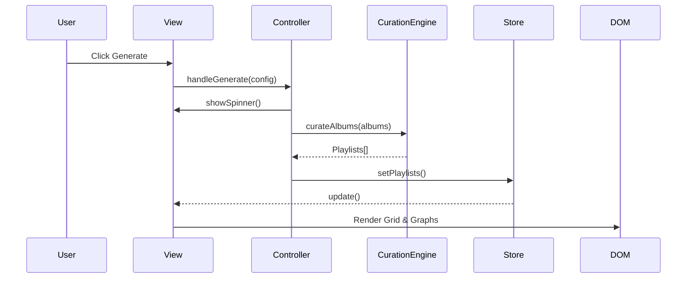
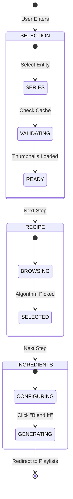

# Frontend Views Analysis

> **Deep Dive Enrichment**: This document details the View Layer architecture, specifically the MVC patterns, Renderers, and Helper strategies used to build the UI.

## 1. Core Architecture
**Status**: `[ACTIVE]`

*   **`BaseView.js`**:
    *   **Role**: Abstract Base Class.
    *   **Key Behavior**:
        *   `mount()`: Called after DOM insertion.
        *   `destroy()`: Called before removal. Auto-cleans up event listeners registered via `this.on()`.
        *   `$delegate`: Utility for efficient event delegation (e.g., clicking items in a large grid).

---

## 2. Main Views (Deep Dive)

### 2.1 Inventory System: `views/InventoryView.js`
**Status**: `[ACTIVE]`
**Pattern**: MVC (View + Controller + Store)
**Dependencies**: `InventoryController`, `inventoryStore`, `InventoryGridRenderer`

*   **Purpose**: Manages the user's collection, providing filtering, searching, and CRUD status updates.

*   **Logic Trace**:
    1.  **Mounting**:
        *   Subscribes to `inventoryStore` updates -> triggers `render(state)`.
        *   Calls `controller.initialize()` to fetch initial data.
    2.  **Rendering (`render`)**:
        *   Calculates Header Stats (Total Value in USD/BRL, Owned Count).
        *   Renders Filters (Search, Format, Ownership).
        *   Delegates Grid rendering to `InventoryGridRenderer` (Pure HTML String generation for performance).
    3.  **Event Handling**:
        *   Uses **Event Delegation** on `#inventory-grid-container`.
        *   Intercepts clicks on `.view-album-btn`, `.edit-album-btn`, `.delete-album-btn`.
        *   Routes logic to `controller.handleDelete`, `controller.handleUpdate`, etc.

*   **Architecture Diagram**:
```mermaid
flowchart Trip
    Store[InventoryStore] -- Notify --> View[InventoryView]
    View -- Render --> DOM
    DOM -- Click Event --> View
    View -- Delegate --> Controller[InventoryController]
    Controller -- CRUD --> API
    API -- Success --> Store
```

### 2.2 Playlist Generator: `views/PlaylistsView.js`
**Status**: `[ACTIVE]`
**Pattern**: Complex Interactive/Stateful View
**Dependencies**: `PlaylistsController`, `playlistsStore`, `PlaylistsGridRenderer`

*   **Purpose**: The "Workbench" for creating, viewing, and editing playlists. Handles both "New Batch" and "Edit Batch" modes.

*   **Logic Trace**:
    1.  **Initialization**:
        *   Checks `playlistsStore.isEditingExistingBatch()` to determine mode.
        *   `Mount`: Sets up `PlaylistsDragHandler` for drag-and-drop song reordering.
    2.  **Generation Flow**:
        *   User selects `Algorithm` (e.g., Balanced Cascade) and `RankingStrategy`.
        *   Click `Generate` -> `controller.handleGenerate()`.
        *   **Overlay**: Shows "Generating..." spinner during async work.
    3.  **Edit Mode**:
        *   If editing, header shows "Edit Playlist Batch" and locks series selection.
        *   "Regenerate Panel" allows tweaking settings for the *current* batch without losing context.
    4.  **Export**:
        *   Provides integrations for Spotify (OAuth), JSON, and Apple Music.

*   **Visual Logic**:


### 2.3 Series Browser: `views/SeriesView.js` (V3)
**Status**: `[ACTIVE]`
**Pattern**: "Thin View" / Orchestrator
**LOC**: ~350 (Refactored Sprint 19)

*   **purpose**: Browse albums grouped by Series.
*   **Refactor Note**: This view delegates logic to specialized components and helpers to maintain a thin orchestrator role.
*   **Sub-Components**:
    *   `SeriesHeader`: Page title and action button.
    *   `SeriesToolbar`: Filters (Artist, Year, Source), Search, and View Toggles (Grid/List Icons).
        *   **Sorting**: Supports "Name (A-Z)", "Name (Z-A)", "Album Count (Lowest)", "Album Count (Highest)", and "Recently Added". Sorting logic is handled by `SeriesController`.
    *   ~~`SeriesProgressBar`~~: Removed (Sprint 21.5) - Skeletons provide visual feedback.
    *   `SeriesEmptyState`: Renders when no albums match the current scope.
    *   `SeriesGridRenderer`: Responsible for the main content layout (Grid/List).
*   **Helpers**:
    *   `SeriesViewUpdater` [NEW]: Handles DOM updates (Header, Grid, Toolbar) based on Controller state.
    *   `SeriesComponentFactory` [NEW]: Abstract Factory for instantiating Header, Toolbar, and Grid components with correct props.
    *   `SeriesModalsManager` [NEW]: Encapsulates logic for opening Edit/Delete modals and handling "Soft Reloads".

### 2.4 Playlists History: `views/SavedPlaylistsView.js`
**Status**: `[ACTIVE]`
**Pattern**: Component-Driven View
**LOC**: ~270 (Refactored Sprint 19)

*   **Purpose**: Display saved playlists grouped by Series and Batches.
*   **Key Behavior**:
    1.  **Iterative Rendering**: Delegates rendering of complex data structures (Series -> Batches -> Playlists) to components.
    2.  **Lazy Hydration**: Playlist tracks are rendered into hidden containers and toggled via safe DOM manipulation.
*   **Sub-Components**:
    *   `SavedSeriesGroup` [NEW]: Standalone component for rendering a Series header and its batch container.
    *   `PlaylistDetailsModal` [NEW]: Reusable modal logic for viewing playlist track details.
    *   `SavedPlaylistCard`: Renders a full batch with cascade thumbnails and batch-level actions.
    *   `SavedPlaylistRow`: Renders individual playlists with track lists.
    *   `SavedPlaylistActions`: Centralizes action buttons for series, batches, and rows.


---

## 3. Strategies & Renderers

### Blending Wizard State Machine


### 3.1 `strategies/ViewModeStrategy.js`
**Purpose**: Toggles between specific rendering layouts (Compact Card vs Expanded Row) based on user preference, persisting to LocalStorage.

### 3.2 `views/renderers/InventoryGridRenderer.js`
**Purpose**: Pure function that takes `state` and returns HTML strings.
**Why**: Performance. Generating thousands of DOM nodes individually is slower than `innerHTML` for large grids.
**Features**:
*   `formatPrice(value, currency)`: Handles currency conversion display.
*   `renderCard(album)`: Generates the main card HTML with Status badges.
