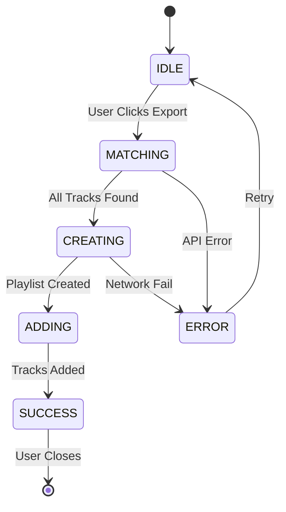

# Root Components Analysis

> **Scope**: Shared UI components located in `public/js/components/`.
> **Status**: All components in this directory are `[ACTIVE]` and use `SafeDOM` or native DOM methods (Legacy `innerHTML` usage is minimal/isolated).

## 1. App Shell & Navigation

### 1.1 `TopNav.js`
**Role**: Main Application Controller & App Shell.
**Dependencies**: `UserStore`, `AlbumSeriesStore`, `AuthService`, `MigrationUtility`.

*   **Logic Trace**:
    1.  **Auth Subscription**: Subscribes to `UserStore` to toggle between "Guest", "User", and "Admin" views.
    2.  **Mobile Drawer**: Manages a hidden sliding drawer (`translate-x-full`) for mobile viewports (< 768px).
    3.  **Data Sync**: Checks `MigrationUtility.needsMigration()` to optionally show the "Data Sync" button.
    4.  **Routing**: Uses `data-link` delegation for client-side navigation via `Router.js`.

### 1.2 `Footer.js`
**Role**: Static Footer & Debug Tools.
**Logic**:
*   Displays dynamic Year and Last Updated timestamp.
*   **Clear Cache**: Hidden functionality to purge `localStorage` for debugging.

### 1.3 `Breadcrumb.js`
**Role**: Dynamic Path Visualizer.
**Logic**:
*   Parses valid URL segments (`/albums`, `/ranking`, `/playlists`) to build a breadcrumb trail.
*   **UX**: Clicking a previous crumb triggers `Router.navigate()` (Back navigation).

---

## 2. Interactive Widgets

### 2.1 `Autocomplete.js`
**Role**: Generic Typeahead Search.
**Props**: `{ loader, onSelect, placeholder }`
**Logic**:
*   **Debounce**: Waits 300ms after keystroke before querying.
*   **Dynamic Loader**: Delegates search logic to the provided `loader` object (Dependency Injection pattern).
*   **Artwork Handling**: Supports template strings (`{w}x{h}`) for responsive image fetching.

### 2.2 `SpotifyConnectButton.js`
**Role**: Standalone Auth Toggle.
**Logic**:
*   **Event Listener**: Listens to custom window event `spotify-auth-change` to update its own state decoupled from the parent view.
*   **Dual State**: Renders a "Connect" pill (Disconnected) or a "User Badge + Logout X" (Connected).

### 2.3 `Icons.js`
**Role**: Centralized SVG Registry (Lucide-style).
**Why**: Replaces inconsistent emojis/images with scalable, recolorable vectors.
**Usage**: `getIcon('Name', 'classes')` returns an SVG string.

### 2.4 `FilterToolbar.js` [NEW]
**Role**: Generic, Reusable Filter Bar.
**Used By**: `SeriesView` and `SavedPlaylistsView`.
**Features**:
*   **Search**: Fuzzy text search.
*   **Filters**: Supports multiple dropdown slots (render props pattern). Includes standardized options like "**All Albums Series**" and "**All Playlist Series**".
*   **Sort**: Standardized sort dropdown. Supports bidirectional sorting (e.g., "**# of Albums (↑/↓)**", "**Newest/Oldest**").
*   **View Toggles**: Integrated Grid/List view switching.
---

## 3. Feedback Systems

### 3.1 `Toast.js`
**Role**: Global Notification System.
**Replacements**: `alert()`, `console.warn()`.
**Logic**:
*   **Singleton Container**: Lazily creates `#toast-container` on first use.
*   **Animation**: CSS Transforms (`translate-x`) for slide-in/out effects.
*   **Auto-Dismiss**: Uses `setTimeout(4000)` with cleanup handles.

### 3.2 `GlobalProgress.js`
**Role**: "YouTube-style" Top Loading Bar.
**Logic**:
*   **Reference Counting**: Tracks `activeLoaders` count. Only hides when count reaches 0.
*   **Z-Index**: `z-[9999]` ensures visibility over all modals and overlays.

### 3.3 `InlineProgress.js`
**Role**: In-flow Progress Bar for Batch Operations.
**Usage**: Used by `PlaylistsView` during generation.
**Logic**: Updateable `width` + `label`.

---

## 4. Modal Dialogs (SafeDOM)

### 4.1 `LoginModal.js`
**Purpose**: Auth Provider Selection.
**Providers**: Google (Firebase), Apple (Firebase), Guest (Anonymous).
**Error Handling**: Maps Firebase error codes (e.g., `auth/popup-closed-by-user`) to user-friendly Toast messages.

### 4.2 `SpotifyExportModal.js`
**Purpose**: Complex Workflow for exporting playlists.
**State Machine**:
1.  **IDLE**: User selects Name & Mode (Merge vs Separate).
2.  **MATCHING**: Iterates tracks -> Calls `SpotifyService.searchTrack`. Builds `notFoundTracks` list.
3.  **CREATING**: Calls `SpotifyService.createPlaylist`.
4.  **ADDING**: Calls `SpotifyService.addTracks`.
6.  **ERROR**: Displays specific failure reason.

### Export State Machine

### 4.3 `ViewAlbumModal.js`
**Purpose**: Detailed Read-Only View.
**Features**:
*   **Badges**: Shows Year, Format, Owned/Wishlist status.
*   **Comparison**: Embeds `TracksRankingComparison` component to show discrepancies between "Original Album Order" and "Acclaim Order".

### 4.4 `EditAlbumModal.js`
**Purpose**: Metadata Editor.
**Features**: Validates required fields (Title, Artist). Updates via callback.

### 4.5 `InventoryAddModal.js` & `InventoryEditModal.js`
**Purpose**: CRUD operations for User Collection.
**Fields**:
*   `Format`: CD, Vinyl, Cassette, Digital, etc.
*   `Currency`: USD vs BRL (Dynamic symbol switching).
*   `Price`: Decimal input.
*   `Notes`: Textarea for condition/edition details.
