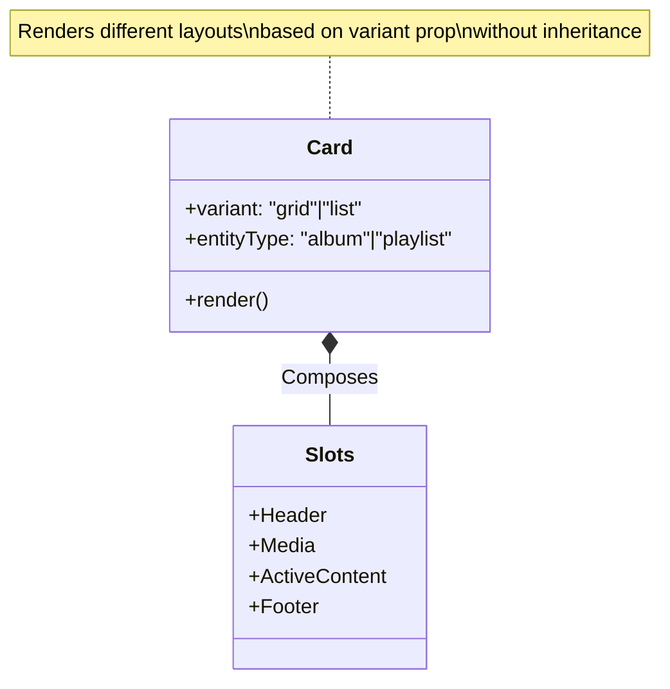

# Frontend Components Analysis (Core UI)

## Base Architecture
**Status**: `[ACTIVE]`

-   **`base/Component.js`**: Abstract Base Class.
    -   **Pattern**: Enforces standard lifecycle (`mount`, `update`, `unmount`) for vanilla JS components.

## Universal UI Elements (`ui/`)
**Status**: `[ACTIVE]`
**Note**: These components are heavily refactored to use `SafeDOM` (zero `innerHTML`) for security.

-   **`ui/BaseModal.js`**: Standardized Modal Shell.
    -   **Features**: Glass-morphism style, size presets (`sm`, `md`, `lg`, `xl`), footer generator.
-   **`ui/Card.js`**: Universal Entity Card.
    -   **Variants**: `Grid` (Compact) and `List` (Expanded).
    -   **Logic**: Handles ranking badges (Spotify/BestEverAlbums) and generic action buttons.
    -*   **Old Way**: `AlbumCard.js` for albums, `PlaylistCard.js` for playlists, `SeriesCard.js` for series.
*   **New Way**: `Card.js` handles all of these via `props.variant` and flexible content slots.

### Universal Card Diagram

-   **`ui/TrackRow.js`**: Universal Track List Item.
    -   **Variants**: `Compact`, `Detailed`, `Ranking`.
    -   **Logic**: Handles Drag & Drop handles, ranking medals (🥇, 🥈, 🥉), rating stars, and duration formatting.
-   **`ui/modals/ConfirmModal.js`**: Generic Confirmation Dialog (Yes/No).
-   **`ui/modals/InputModal.js`**: Generic Single-Input Dialog.

## Shared & Common (`shared/`, `common/`)
**Status**: `[ACTIVE]`

-   **`shared/ContextMenu.js`**: Floating "Three-dot" action menu.
-   **`shared/SkeletonLoader.js`**: Loading placeholders (`card`, `list` variants).
-   **`common/AlbumCascade.js`**: Visual component rendering a diagonal stack of album thumbnails. Used in Blend and Playlist views.
