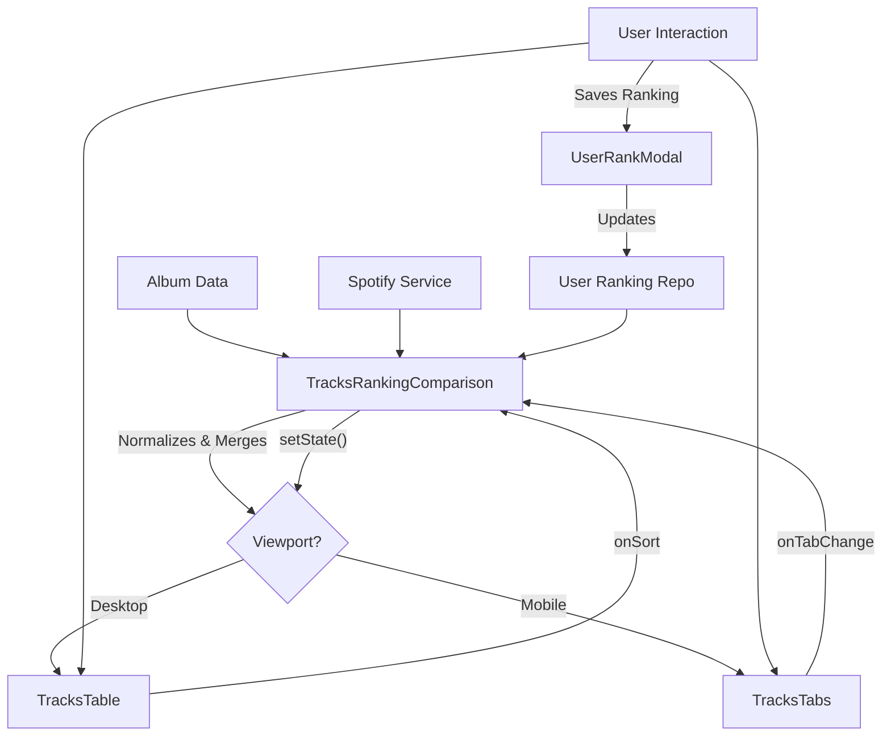

# Deep Dive: Search, Ranking & Home Components

This document audits the components responsible for the core "Discovery" loop: Searching for artists, filtering their discography, selecting albums, and analyzing track rankings.

## 1. Search & Discovery System

Located in `components/search/` and `components/home/`, these components manage the user's initial interaction with the application.

| Component | Role | Architecture & Patterns |
| :--- | :--- | :--- |
| **`SearchController.js`** | **Orchestrator**. Manages the flow: Input -> API -> Sort -> Filter -> Render. | • **State Management**: Tracks `isScanning` and `filterState`. • **Logic**: Enforces "Newest -> Oldest" sorting by default. • **Integration**: directly couples with `AlbumSearchService` and `HomeView`. |
| **`DiscographyToolbar.js`** | **Filter UI**. The control bar for toggling Album Types (EP, Single, etc.) and Editions. | • **Global Events**: Uses `window.handleDiscographyType` for simplicity (Legacy/V3 Hybrid pattern). • **Counts**: reactive UI that updates badges based on filtered results. • **Visuals**: Matches the "Flame Gradient" active state of the main nav. |
| **`StagingAreaController.js`** | **Selection Manager**. Manages the "Stack" of albums waiting to be turned into a playlist. | • **SortableJS**: Integrates 3rd-party lib for drag-and-drop reordering. • **State Sync**: Manually synchronizes the internal `selectedAlbums` array with DOM changes on drag end. |
| **`VariantPickerModal.js`** | **Decision UI**. A functional component invoked when adding an album group with multiple versions. | • **Functional Style**: Exported as a standalone function `showVariantPickerModal`. • **Pattern**: "Check-the-box" UI with "Select All" capability. • **Security**: Uses `escapeHtml` to prevent XSS in dynamic titles. |

---

## 2. Ranking Comparison System

Located in `components/ranking/`, this is one of the most complex UI features, allowing users to compare "Original Tracklist" vs "Critical Acclaim" vs "Spotify Popularity".

### Architecture: Smart Container vs Dumb Presenters

The ranking system strictly follows the Container/Presenter pattern.

#### The Container: `TracksRankingComparison.js`
*   **Responsibility**: Data Normalization & State.
*   **Key Logic**:
    *   **Enrichment**: Merges sparse local track data with rich metadata (Spotify Popularity, BEA Rankings) on the fly.
    *   **Normalization**: Maps tracks by name/fuzzy-match to handle slight spelling differences between services.
    *   **Responsive Switching**: Decides whether to mount `TracksTable` (Desktop) or `TracksTabs` (Mobile).

#### The Presenters

| Component | Viewport | Details |
| :--- | :--- | :--- |
| **`TracksRankingComparison.js`** | **Universal** | **Smart Container**. Handling logic, API enrichment (Spotify/BEA), and state management for the comparison view. |
| **`TracksTabs.js`** | **Mobile** | • **Adaptive UI**: Instead of squeezing columns, it uses Tabs to toggle the *context*. • **Tab 1 (Original)**: Shows standard track numbers. • **Tab 2 (Acclaim)**: Highlights critical ranking badges. • **Tab 3 (Spotify)**: Visualizes popularity bars next to track names. |
| **`UserRankModal.js`** | **Universal** | • **Interactive State**: Glass-morphism modal for drag-and-drop ranking. • **SortableJS**: Powers the reordering logic. • **Persistence**: Saves directly to `UserRankingRepository`. |

### Updated `TracksTable.js` (Sprint 20 & 22.6)
*   **Columns**: Position, Title, **My Rank** (User), Rank (BEA), Popularity (Spotify), Duration.
*   **Decoupling Logic**: Ratings (★88) are now displayed independently of ranking badges (#5). A track can be rated without being ranked in the top chart.
*   **Stats Header**: Displays Average Acclaim, Spotify Popularity, and **My Average** (User) statistics at the top.

### Data Flow Diagram

