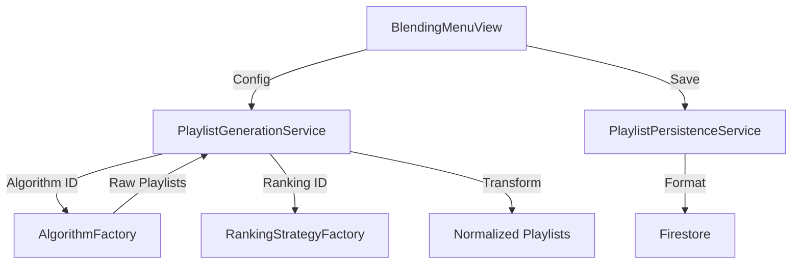
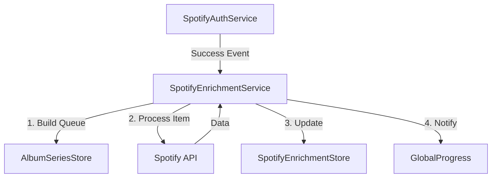

# Deep Dive: Client Services & Adapters

This document audits the service layer located in `public/js/services/`. This layer houses the core business logic, API integrations, and background processing mechanisms of the frontend.

## 1. Core Services Architecture

The application uses a mix of **Singleton Classes**, **Functional Modules**, and **Facade Patterns** to manage complexity.

| Service | Pattern | Responsibility |
| :--- | :--- | :--- |
| **`PlaylistGenerationService`** | **Logic Engine** | The "Brain" of the app. Orchestrates algorithms (`createAlgorithm`) and ranking strategies (`createRankingStrategy`) to produce `Playlist[]` objects from raw `Album[]` data. Pure logic, no side effects. |
| **`PlaylistsService`** [REFAC] | **State Orchestrator** | **Thin Orchestrator**. Delegates logic to `PlaylistHistoryService` (Undo/Redo) and `StorageService` (Persistence). Manages `playlistsStore` state updates. |
| **`SeriesService`** [REFAC] | **Context Provider** | **Thin Orchestrator**. Delegates logic to `UserSyncService` (Auth Migration) and `StorageService` (Persistence). Manages `albumSeriesStore`. Implements **Surgical Cache Injection** (Sprint 21.5) to prevent UI flashes. **Refetch Metadata**: Orchestrates on-demand re-enrichment of albums via `enrichAlbumMetadata` (Sprint 22). |
| **`PlaylistPersistenceService`** | **Repository Wrapper** | Handles the **CRUD** lifecycle of generated playlists. Manages batch overwrites, Series synchronization, and interacts with `PlaylistRepository`/`Firestore`. |
| **`SeriesFilterService`** | **Functional Module** | A collection of **pure functions** (`filterAlbums`, `getUniqueArtists`) used by `SeriesView` and wrapped by `FilterUtils`. |
| **`SavedPlaylistsFilterService`** [NEW] | **Functional Module** | Provides filtering logic for Saved Playlists (Series/Batch names) using `FilterUtils`. |
| **`StorageService`** [NEW] | **Infrastructure** | Centralized `localStorage` wrapper with error handling and namespacing. Used by all services for local persistence. |
| **`PlaylistHistoryService`** [NEW] | **Feature Service** | Manages the Undo/Redo stack and snapshot versioning for playlists. Pure logic, injected into `PlaylistsService`. |
| **`UserSyncService`** [NEW] | **Feature Service** | Handles complexity of migrating Guest data to User account upon authentication. Injected into `SeriesService`. |
| **`BEAEnrichmentHelper`** [NEW] | **Helper Module** | Encapsulates BestEverAlbums enrichment logic (fetching, parsing scores) to keep `SeriesService` clean. |
| **`DialogService`** | **Singleton** | Manages global modal state. Provides a simple imperative API (`.alert()`, `.confirm()`, `.prompt()`) over the declarative `BaseModal` system. |

---

## 2. API Integrations & Adapters

### Apple Music (MusicKit)
The integration follows a **Facade Pattern** to hide the complexity of the Apple SDK.

*   **`MusicKitService.js`**: The main entry point. It delegates actual work to sub-modules (`musicKitAuth`, `musicKitCatalog`, `musicKitLibrary`) but exposes a unified API surface to the rest of the app.
*   **`MusicKitSearchAdapter.js`**: An **Adapter** that makes the Apple Music Catalog search compatible with the generic `Autocomplete` component interface. It normalizes Apple's JSON response into the app's standard `{ id, title, artist, coverUrl }` format.

### Spotify
*   **`SpotifyAuthService.js`**: Implements **PKCE** (Proof Key for Code Exchange) flow for secure client-side authentication. Manages token lifecycle (storage, refresh).
*   **`SpotifyEnrichmentService.js`**: A **Background Worker**. It manages a queue of albums to enrich with Spotify data (Popularity, Spotify ID).
    *   **Rate Limiting**: Enforces a strict delay (100ms) between requests to respect API limits.
    *   **Reactivity**: Uses a subscription model (`subscribe()`, `notify()`) to broadcast progress to the UI without coupling.

---

## 3. Data Loading & Optimization

| Component | Strategy | Details |
| :--- | :--- | :--- |
| **`OptimizedAlbumLoader.js`** | **Web Worker** | Offloads large dataset search (30k+ albums) to a background thread (`search.worker.js`). Uses **uFuzzy** for high-performance fuzzy matching during autocomplete. |
| **`DataSyncService.js`** | **Migration** | A utility service for migrating data between contexts (e.g., Guest -> Authenticated user), ensuring inventory integrity during transition. |

### Legacy Notes
*   **`AlbumLoader.js`**: Retained as a fallback mechanism. It parses the legacy generic CSV dataset if the optimized JSON payload fails to load.

## 4. Key Data Flows

### Playlist Generation Loop

### Background Enrichment

