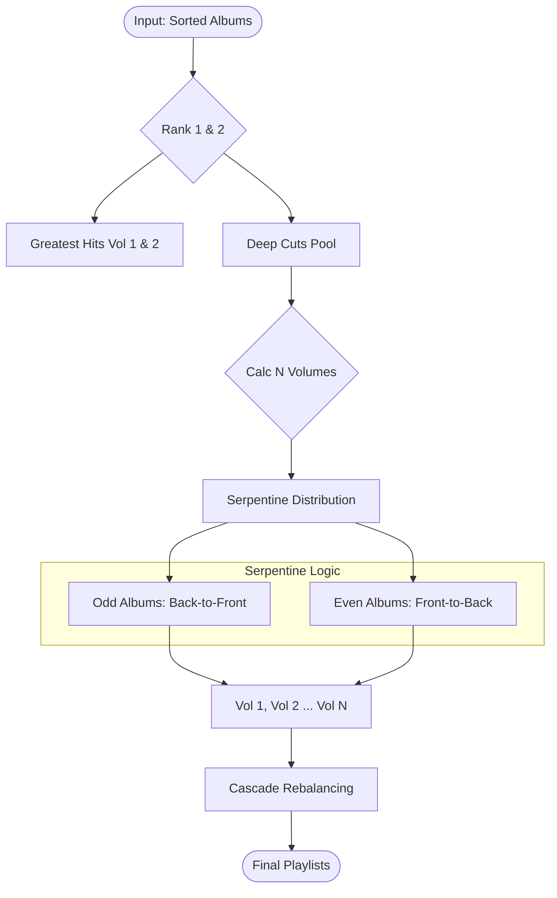

# Deep Dive: Core Logic & Algorithms

This document analyzes the "Brain" of the application: the Algorithms that generate playlists and the Strategies that rank tracks.

## 1. Architecture Overview
The application uses a **Strategy Pattern** for both Playlist Generation and Track Ranking.
*   **Algorithms (`public/js/algorithms/`)**: Determine *which* tracks go into *which* playlist (Distribution Logic).
*   **Strategies (`public/js/ranking/`)**: Determine the *order* and *value* of tracks within an album (Sorting Logic).

### The Logic Pipeline
1.  **Input**: Selected Albums (Inventory/Series).
2.  **Ranking (Strategy)**: Each album's tracks are sorted/scored (e.g., by Acclaim or Popularity).
3.  **Generation (Algorithm)**: Ranked tracks are distributed into playlists (e.g., Greatest Hits, Deep Cuts).
4.  **Output**: `GenerationResult` containing playlist objects and traceability logs.

---

## 2. Algorithms (Distribution Layer)

### Base Class (`BaseAlgorithm.js`)
*   **Role**: Abstract base ensuring consistent API (`generate()`).
*   **Key Features**:
    *   `annotateTrack()`: Adds provenance data (Source, Score, Description) to every track for the "Why is this here?" UI tooltip.
    *   `registerRankingSource()`: Centralizes metadata for ranking providers.

### MJRP Balanced Cascade (`MJRPBalancedCascadeAlgorithm.js`)
*   **Status**: **RECOMMENDED** (Default).
*   **Philosophy**: A hybrid approach combining "Greatest Hits" segregation with a "Serpentine" distribution for Deep Cuts to ensure flow and balance.
*   **Step-by-Step Logic**:
    1.  **Preparation (Ranking)**:
        *   Accepts `albums` array.
        *   Applies the injected **Strategy** (e.g., `BalancedRankingStrategy`) to sort tracks within *each* album from #1 to #N.
    2.  **Phase 1: The "Greatest Hits" Extraction**:
        *   Iterates every album.
        *   Extracts **Rank #1** and **Rank #2** tracks.
        *   *Decision*: If total duration > 60min, splits into "Greatest Hits Vol. 1" (Rank #1s) and "Greatest Hits Vol. 2" (Rank #2s). Otherwise, combines them.
    3.  **Phase 2: The "Deep Cuts" Setup**:
        *   Calculates `numDeepCutsPlaylists` based on the album with the *fewest* tracks (logic: `minTracks - 2`).
        *   Creates empty "Deep Cuts Vol. 1...N" playlists.
    4.  **Phase 3: Serpentine Distribution (The Core Innovation)**:
        *   Distributes Tracks #3 to ~(#3 + N) across the Deep Cuts playlists.
        *   **Odd Indexed Albums**: Distributed **Back-to-Front** (Vol N &rarr; Vol 1).
        *   **Even Indexed Albums**: Distributed **Front-to-Back** (Vol 1 &rarr; Vol N).
        *   *Why?* This prevents "front-loading" the best deep cuts into Vol 1. It ensures Vol N isn't just "junk tracks" but has early material from odd albums.
    5.  **Phase 4: Cascade Rebalancing**:
        *   Any "Excess Tracks" (Rank #10+) that didn't fit the first pass are distributed in a "Ping-Pong" fashion starting from the last playlist.
    6.  **Phase 5: Cleanup**:
        *   **Merge**: Combines adjacent small playlists (e.g., Vol 4 + Vol 5) if their combined length < 48min.
        *   **Trim**: Moves tracks exceeding the 48min (LP) or 80min (CD) limit to "Orphan Tracks".

### Algorithm Flowchart


### Top N Algorithm (`TopNAlgorithm.js`)
*   **Status**: **Flexible** (Used for "Recipes").
*   **Logic**: Simpler selection of Top 1-10 tracks per album.
*   **Last Updated**: 2026-01-11

#### Playlist Title Format (Sprint 20)
Generated playlists use a standardized title format:
```
{SOURCE} Top {N} {GROUPING} [Vol. X]
```
*   **{SOURCE}**: `SPFY` (Spotify Popularity) or `BEA` (BestEverAlbums).
*   **{N}**: Track count selected (1-10).
*   **{GROUPING}**: `By Album`, `By Rank`, `By Artist`, `Bal.Intv.`, or `Shuffle`.
*   **[Vol. X]**: Appended for multiple playlists mode.

| Recipe | Top N | Grouping | Title |
| :--- | :--- | :--- | :--- |
| Spotify Popular | 6 | By Album | `SPFY Top 6 By Album` |
| BEA Acclaimed | 5 | Bal.Intv. | `BEA Top 5 Bal.Intv. Vol. 1` |

#### Grouping Modes
| Mode | Internal Value | Description |
| :--- | :--- | :--- |
| By Album | `by_album` | Preserves album order. |
| By Ranking | `flat_ranked` | Interleaves #1s (Energy Wave), then #2s. |
| By Artist | `artist_rank` | Clusters by Artist. |
| Balanced Interleave | `ranked_interleave` | Round Robin by Rank. |
| Shuffle | `shuffle` | Randomizes. |

---

## 3. Strategies (Ranking Layer)

### Balanced Ranking Strategy (`BalancedRankingStrategy.js`)
*   **Role**: The client-side consumer of server-side data.
*   **Waterfall Logic (The Decision Tree)**:
    1.  **Acclaim Rank** (Primary): Checks `acclaimRank` (derived from BestEverAlbums `finalPosition`). Smallest is best.
    2.  **Rating** (Secondary): Checks `rating` (User/Community stars). Highest is best.
    3.  **Score** (Tertiary): Checks `acclaimScore`.
    4.  **Spotify Popularity** (Fallback): Used if no acclaim data exists.
    5.  **Original Order** (Last Resort).

### Spotify Ranking Strategy
*   **Role**: Pure popularity-based sorting.
*   **Logic**: Sorts exclusively by `spotifyPopularity` (Desc). Useful for "Modern Appeal" playlists.

---

## 4. Key Mixins & Helpers
*   **`DurationTrimmingMixin`**: Logic to strictly enforce playlist time limits (e.g., 80min CD limit or 48min LP limit), moving overflow to an "Overflow" playlist.
*   **`TrackTransformer`**: A Data Transfer Object (DTO) factory that normalizes raw JSON from various APIs into a standard `Track` object with `acclaimRank`, `spotifyPopularity`, etc.

## 5. The "Logic Bridge": Server to Client
How `server_logic.md` connects to this document.

| Layer | Component | Responsibility | Data Shape |
| :--- | :--- | :--- | :--- |
| **SERVER** | `fetchRanking.js` | **Acquisition**. Scrapes BEA, calls Spotify, queries AI. Aggregates data into the Album object. | `album.bestEverEvidence`, `album.rankingAcclaim` (Raw Arrays) |
| **CLIENT** | `TrackTransformer` | **Normalization**. Maps raw server arrays to canonical properties on the `Track` object. | `track.acclaimRank`, `track.spotifyPopularity` (Unified Properties) |
| **CLIENT** | `RankingStrategy` | **Sorting**. Uses the normalized properties to decide `track._rank`. | `track._rank = 1` |
| **CLIENT** | `BaseAlgorithm` | **Distribution**. Uses `_rank` to move tracks into Playlists. | `playlist.tracks.push(track)` |

**Key Insight**: The Server *provides the evidence* (e.g., "BEA says this is #5"), but the Client *makes the decision* (e.g., "I value BEA #5 more than Spotify #1"). This Separation of Concerns allows us to change ranking rules (Strategy) without re-scraping data.

---

## 6. The Configuration Layer: From UI to Logic
The application uses a **"Restaurant Metaphor"** in the UI to simplify complex algorithm configuration. This section maps the user-facing concepts to the underlying code.

### The Metaphor Translation Table
| Metaphor | UI Component | Code Concept | Implementation |
| :--- | :--- | :--- | :--- |
| **Blend** | `BlendSeriesSelector` | **Input Data** | Selection of `Series` or Inventory Albums. |
| **Recipe** | `BlendRecipeCard` | **Algorithm Class** | Selects the `algorithmId` (e.g., `top-n-popular` -> `TopNAlgorithm`). |
| **Ingredients** | `BlendIngredientsPanel` | **Configuration** | Constructs the `options` object passed to `algorithm.generate()`. |

### Parameter Connectivity
The connection is primarily managed by `BlendIngredientsPanel.js` and `PlaylistGenerationService.js`.

1.  **Visibility Matrix** (`BlendIngredientsPanel.js`):
    *   Defining `ALGORITHM_RECIPES` constant controls which options are shown for which recipe.
    *   *Example*: `mjrp-balanced-cascade` shows `Target Duration` but hides `Output Mode` (because it auto-calculates splits).
    *   *Example*: `top-n-popular` shows `Top N Count` but hides `Ranking Source` (because it's locked to Spotify).

2.  **Normalization** (`BlendIngredientsPanel.getConfig()`):
    *   Transforms UI values into Logic values.
    *   `Duration (mins)` &rarr; `targetDuration (seconds)`.
    *   `Ranking Type ('combined')` &rarr; `rankingId ('balanced')`.

3.  **Orchestration** (`PlaylistGenerationService.js`):
    *   Receives the normalized config.
    *   Instantiates the **Algorithm** via `createAlgorithm(config.algorithmId)`.
    *   Instantiates the **Strategy** via `createRankingStrategy(config.rankingId)`.
    *   Executes `algorithm.generate(albums, { ...options })`.
