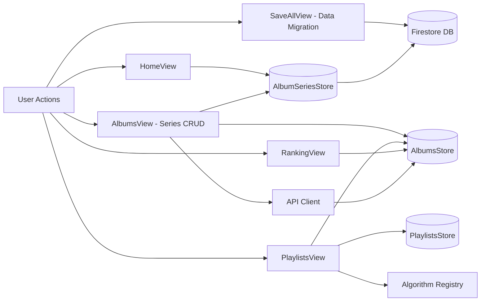
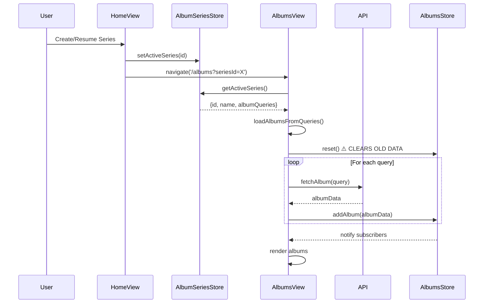
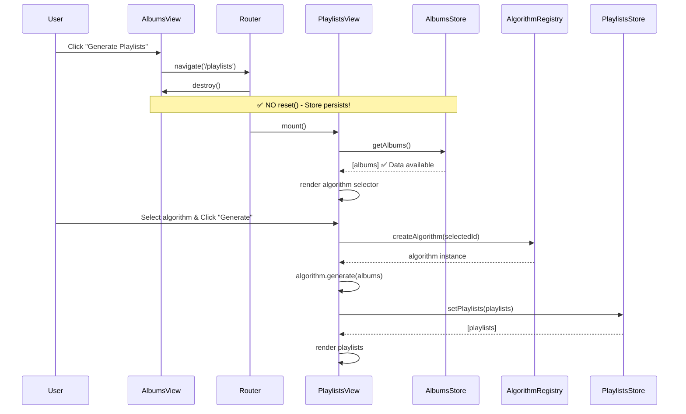
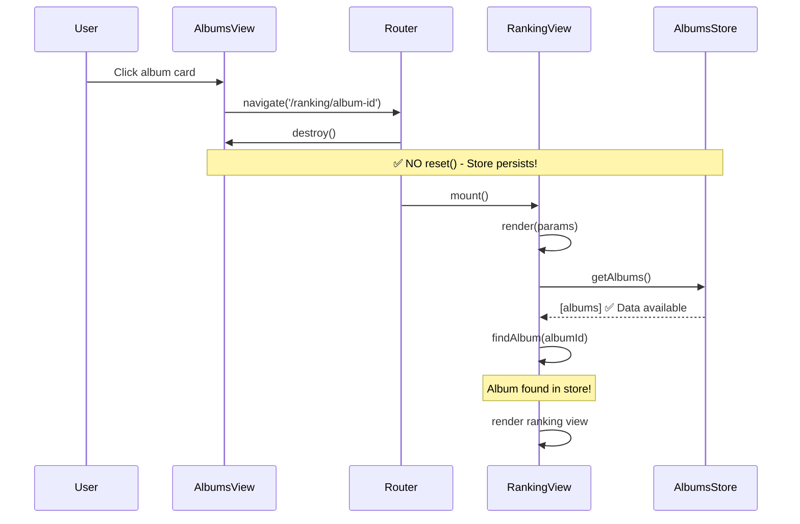
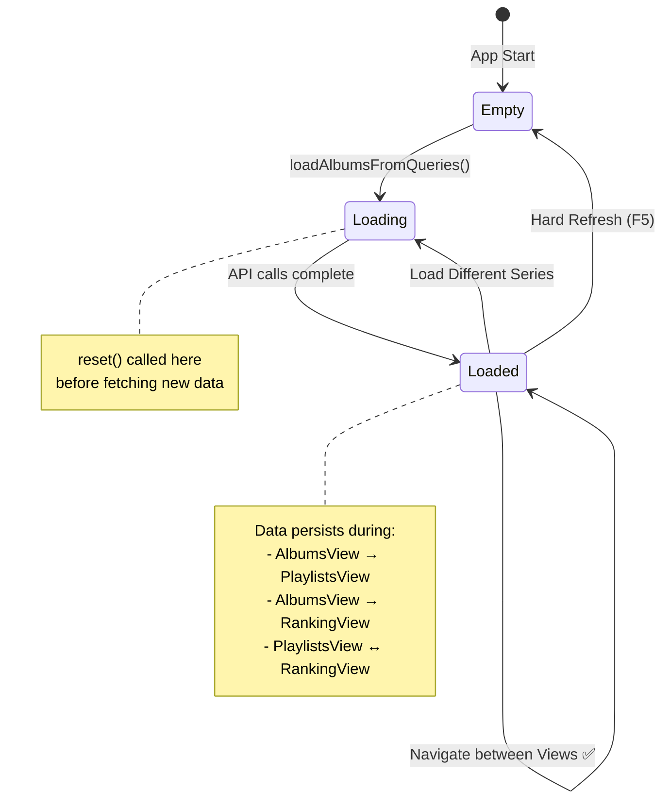

# Album Data Flow Architecture

**Updated**: 2025-12-16

## Overview
This document maps the **Data Flow Diagram (DFD)** and **Sequence Diagrams** for album data through the application's views and store.

> **Note (v2.7.1)**: `AlbumSeriesListView` has been deprecated. Series management (Edit/Delete) is now consolidated into `AlbumsView`.

> **Note (v2.8.0)**: Playlist generation now uses the **Algorithm Strategy Pattern**. See [ALGORITHM_MENU.md](specs/ALGORITHM_MENU.md).

---

## System Components



---

## Scenario 1: Load Series (Normal Flow)



**Key Points:**
- ⚠️ `reset()` called ONLY in `loadAlbumsFromQueries()` before loading new series
- Data persists in store after loading
- All subsequent navigations use cached data

---

## Scenario 2: Navigate to Playlists & Generate



---

## Scenario 3: Navigate to Album Ranking



---

## Scenario 4: Hard Refresh (Edge Case)


---

## Store State Lifecycle



---

## Data Flow Summary

### ✅ Store Resets (Clear Data)
1. **Loading New Series**: `loadAlbumsFromQueries()` calls `reset()` before fetching
2. **Hard Refresh**: Browser clears memory, store starts empty

### ✅ Store Persists (Keep Data)
1. **View Navigation**: AlbumsView → PlaylistsView → RankingView
2. **Back/Forward**: Browser history navigation
3. **View Lifecycle**: destroy() does NOT reset

### Current Implementation

| Event | Behavior |
|-------|----------|
| AlbumsView.constructor() | ✅ No reset() |
| AlbumsView.destroy() | ✅ No reset() |
| loadAlbumsFromQueries() | ✅ reset() before fetch |
| Navigate to Playlists | ✅ Store has data |
| Navigate to Ranking | ✅ Store has data |
| Hard Refresh | ✅ Fallback to Firestore |

---

## Architecture Benefits

```
AlbumsView loads data ONCE
  → Store persists while series active
    → PlaylistsView reads store
    → RankingView reads store
      → ✅ No duplication
      → ✅ No race conditions
      → ✅ No ghost albums
```
