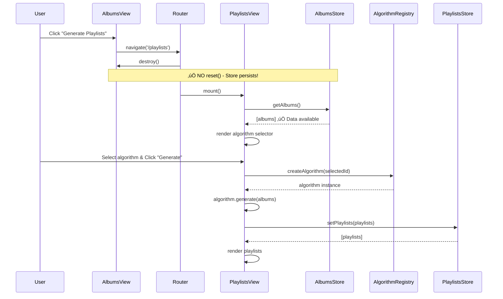
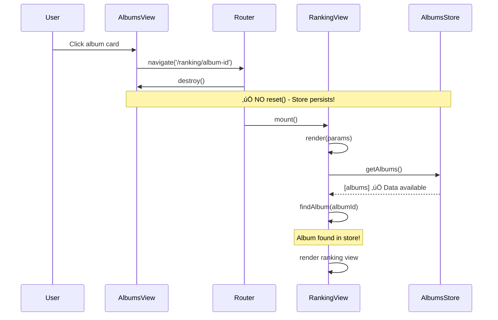
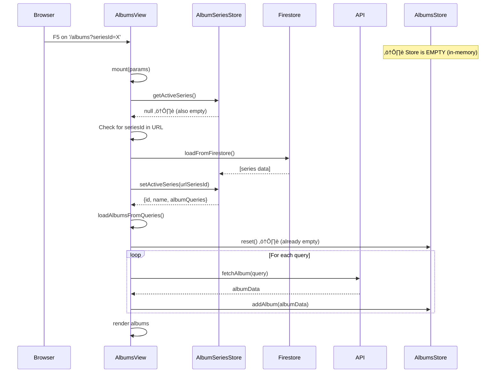
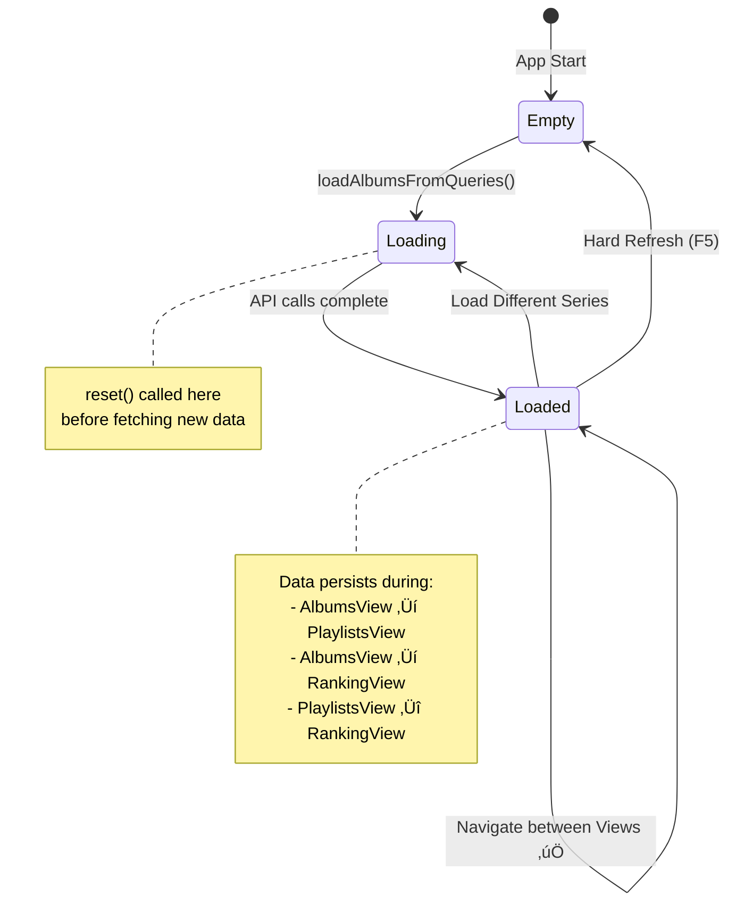
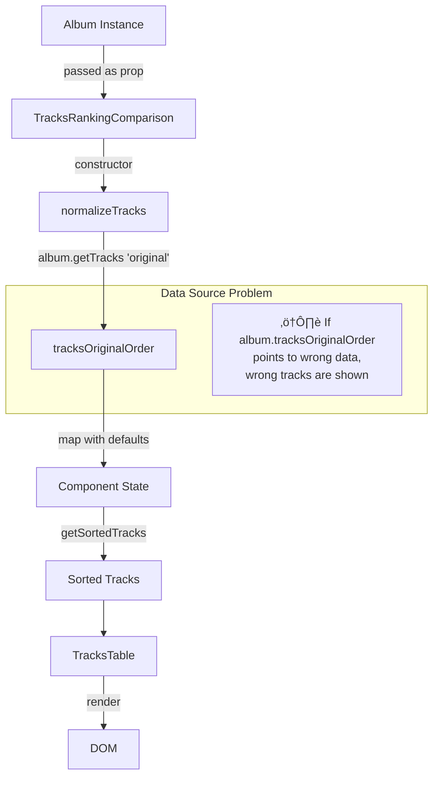
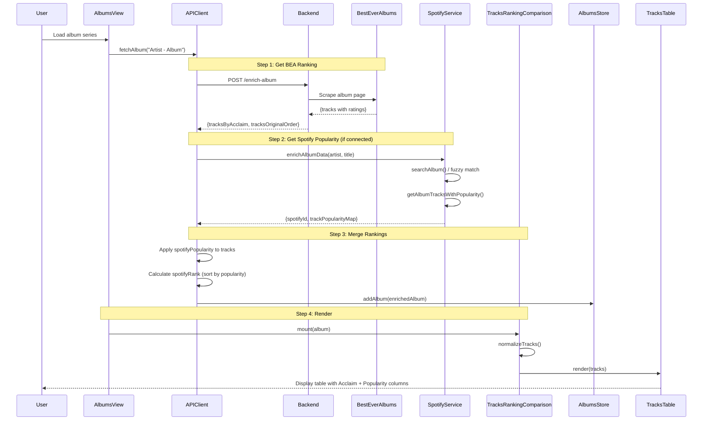
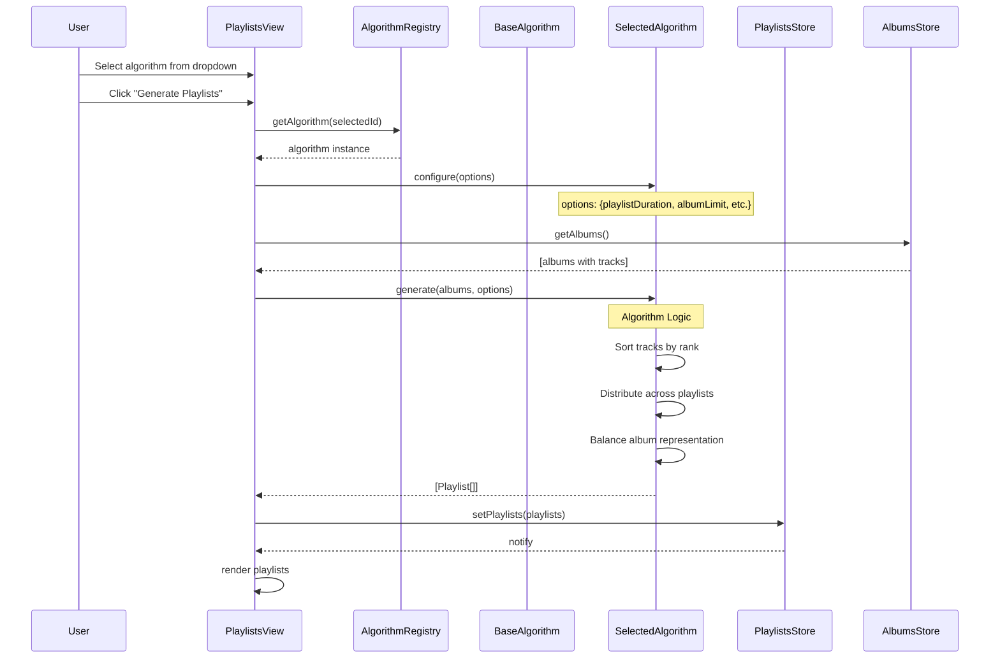
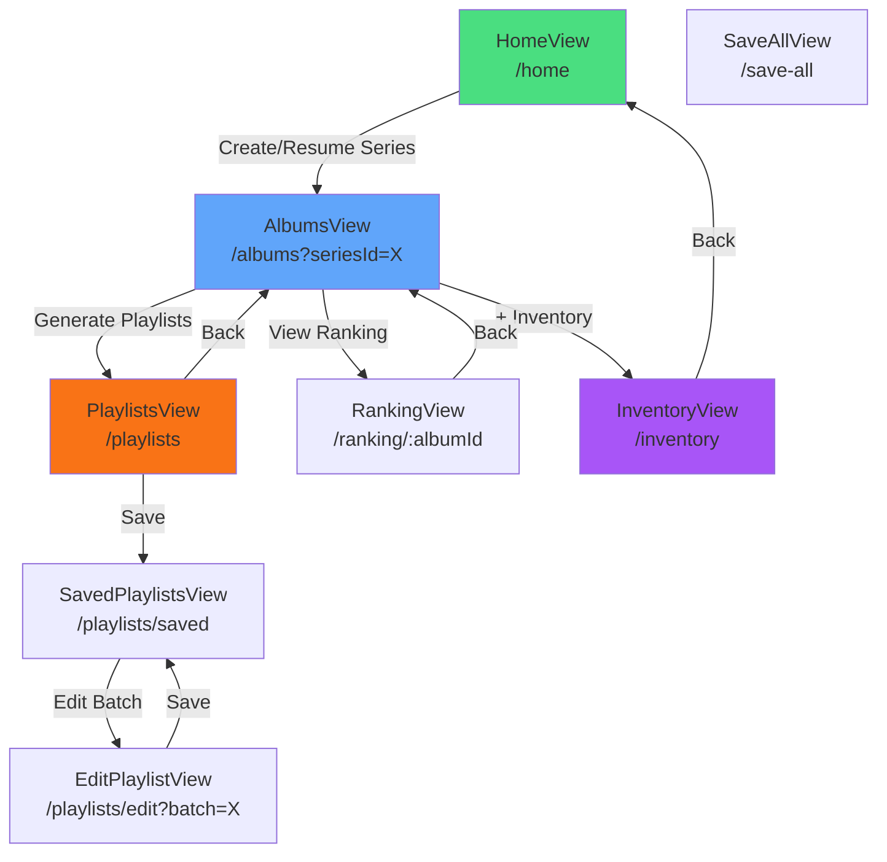
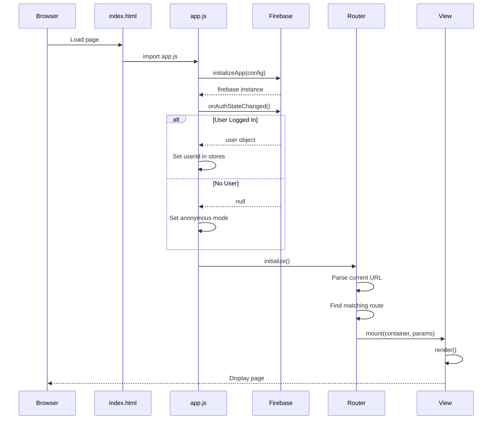

# Album Data Flow Architecture

**Updated**: 2025-12-19
**Version**: 2.0 (Full System Inventory)

## Overview
This document maps the **Data Flow Diagram (DFD)** and **Sequence Diagrams** for album data through the application's views and store.

> **Note (v2.7.1)**: `AlbumSeriesListView` has been deprecated. Series management (Edit/Delete) is now consolidated into `AlbumsView`.

> **Note (v2.8.0)**: Playlist generation now uses the **Algorithm Strategy Pattern**. See [ALGORITHM_MENU.md](specs/ALGORITHM_MENU.md).

> **Note (Sprint 11)**: Spotify integration added. Auto-enrichment with popularity data.

---

## System Components Inventory

### Frontend Components

#### Views (10 files)
| View | Purpose | Size | Documented? |
|------|---------|------|-------------|
| `AlbumsView.js` | Series CRUD, Album grid | 52KB | ✅ |
| `HomeView.js` | Dashboard, Series list | 31KB | ✅ |
| `PlaylistsView.js` | Generate playlists | 31KB | ✅ |
| `SavedPlaylistsView.js` | View saved batches | 31KB | ❌ NEW |
| `InventoryView.js` | Personal collection | 30KB | ❌ NEW |
| `EditPlaylistView.js` | Edit existing batch | 22KB | ❌ NEW |
| `ConsolidatedRankingView.js` | Cross-album ranking | 11KB | ❌ NEW |
| `RankingView.js` | Single album ranking | 8KB | ✅ |
| `SaveAllView.js` | Data migration | 6KB | ✅ |
| `BaseView.js` | View base class | 3KB | ✅ |

#### Stores (5 files)
| Store | Purpose | Documented? |
|-------|---------|-------------|
| `playlists.js` | Playlist state | ✅ |
| `albumSeries.js` | Series CRUD | ✅ |
| `inventory.js` | Personal collection | ❌ NEW |
| `albums.js` | Album data by series | ✅ |
| `UserStore.js` | Auth state | ❌ NEW |

#### Services (6 files)
| Service | Purpose | Documented? |
|---------|---------|-------------|
| `MusicKitService.js` | Apple Music API | ⚠️ Partial |
| `SpotifyService.js` | Spotify API (S11) | ✅ NEW |
| `SpotifyAuthService.js` | OAuth PKCE (S11) | ✅ NEW |
| `AlbumLoader.js` | Load album data | ❌ |
| `OptimizedAlbumLoader.js` | Worker-based search | ❌ |
| `DataSyncService.js` | Firestore sync | ❌ |

#### Algorithms (7 files)
| Algorithm | Purpose | Documented? |
|-----------|---------|-------------|
| `index.js` | Algorithm Registry | ⚠️ Partial |
| `BaseAlgorithm.js` | Base class | ⚠️ Partial |
| `MJRPBalancedCascadeAlgorithm.js` | Main algorithm | ⚠️ Partial |
| `MJRPBalancedCascadeV0Algorithm.js` | Legacy version | ❌ |
| `SDraftBalancedAlgorithm.js` | S-Draft variant | ❌ |
| `SDraftOriginalAlgorithm.js` | S-Draft original | ❌ |
| `LegacyRoundRobinAlgorithm.js` | Round-robin | ⚠️ Partial |

#### Models (4 files)
| Model | Purpose | Documented? |
|-------|---------|-------------|
| `Album.js` | Album entity | ❌ |
| `Track.js` | Track entity | ❌ |
| `Playlist.js` | Playlist entity | ❌ |
| `Series.js` | Series entity | ❌ |

#### Repositories (5 files)
| Repository | Purpose | Documented? |
|------------|---------|-------------|
| `BaseRepository.js` | CRUD base | ❌ |
| `InventoryRepository.js` | Inventory CRUD | ❌ |
| `SeriesRepository.js` | Series CRUD | ❌ |
| `PlaylistRepository.js` | Playlist CRUD | ❌ |
| `AlbumRepository.js` | Album CRUD | ❌ |

#### Components - Ranking (3 files)
| Component | Purpose | Documented? |
|-----------|---------|-------------|
| `TracksRankingComparison.js` | Multi-source comparison | ✅ NEW |
| `TracksTable.js` | Desktop table UI | ✅ NEW |
| `TracksTabs.js` | Mobile tabs UI | ✅ NEW |

---

### Backend Components

#### Routes (4 files)
| Route | Endpoints | Documented? |
|-------|-----------|-------------|
| `albums.js` | `/generate`, `/enrich-album` | ⚠️ Partial |
| `playlists.js` | `/playlists/*` | ❌ |
| `musickit.js` | `/token` | ⚠️ Partial |
| `debug.js` | `/list-models`, `/raw-ranking` | ❌ |

#### Libraries (10 files)
| Library | Purpose | Documented? |
|---------|---------|-------------|
| `fetchRanking.js` | BestEverAlbums scraping | ⚠️ Partial |
| `ranking.js` | Consolidate rankings | ❌ |
| `normalize.js` | Data normalization | ❌ |
| `scrapers/besteveralbums.js` | BEA scraper | ⚠️ Partial |
| `aiClient.js` | AI provider | ❌ |
| `prompts.js` | Prompt templates | ❌ |
| `schema.js` | AJV validation | ❌ |
| `logger.js` | Logging | ❌ |
| `validateSource.js` | Source validation | ❌ |

---

## System High-Level Architecture

```mermaid
graph LR
    User[User Actions]
    HomeView[HomeView]
    AlbumsView[AlbumsView - Series CRUD]
    PlaylistsView[PlaylistsView]
    EditPlaylistView[EditPlaylistView]
    SavedPlaylistsView[SavedPlaylistsView]
    RankingView[RankingView]
    InventoryView[InventoryView]
    SaveAllView[SaveAllView - Data Migration]
    
    AlbumSeriesStore[(AlbumSeriesStore)]
    AlbumsStore[(AlbumsStore)]
    PlaylistsStore[(PlaylistsStore)]
    InventoryStore[(InventoryStore)]
    AlgorithmRegistry[Algorithm Registry]
    
    API[API Client]
    SpotifyService[Spotify Service]
    MusicKitService[MusicKit Service]
    Firestore[(Firestore DB)]
    
    User --> HomeView
    User --> AlbumsView
    User --> PlaylistsView
    User --> EditPlaylistView
    User --> SavedPlaylistsView
    User --> RankingView
    User --> InventoryView
    User --> SaveAllView
    
    HomeView --> AlbumSeriesStore
    AlbumsView --> AlbumSeriesStore
    AlbumsView --> AlbumsStore
    AlbumsView --> API
    
    PlaylistsView --> AlbumsStore
    PlaylistsView --> PlaylistsStore
    PlaylistsView --> AlgorithmRegistry
    EditPlaylistView --> PlaylistsStore
    SavedPlaylistsView --> PlaylistsStore
    
    RankingView --> AlbumsStore
    InventoryView --> InventoryStore
    SaveAllView --> Firestore
    
    API --> AlbumsStore
    API --> SpotifyService
    API --> MusicKitService
    AlbumSeriesStore --> Firestore
    InventoryStore --> Firestore

---

## Scenario 1: Load Series (Normal Flow)

```mermaid
sequenceDiagram
    participant User
    participant HomeView
    participant AlbumSeriesStore
    participant AlbumsView
    participant API
    participant AlbumsStore
    
    User->>HomeView: Create/Resume Series
    HomeView->>AlbumSeriesStore: setActiveSeries(id)
    HomeView->>AlbumsView: navigate('/albums?seriesId=X')
    
    AlbumsView->>AlbumSeriesStore: getActiveSeries()
    AlbumSeriesStore-->>AlbumsView: {id, name, albumQueries}
    
    AlbumsView->>AlbumsView: loadAlbumsFromQueries()
    AlbumsView->>AlbumsStore: reset() ⚠️ CLEARS OLD DATA
    
    loop For each query
        AlbumsView->>API: fetchAlbum(query)
        API-->>AlbumsView: albumData
        AlbumsView->>AlbumsStore: addAlbum(albumData)
    end
    
    AlbumsStore-->>AlbumsView: notify subscribers
    AlbumsView->>AlbumsView: render albums
```

**Key Points:**
- ⚠️ `reset()` called ONLY in `loadAlbumsFromQueries()` before loading new series
- Data persists in store after loading
- All subsequent navigations use cached data

---

## Scenario 2: Navigate to Playlists & Generate



---

## Scenario 3: Navigate to Album Ranking



---

## Scenario 4: Hard Refresh (Edge Case)



---

## Store State Lifecycle



---

## Data Flow Summary

### ✅ Store Resets (Clear Data)
1. **Loading New Series**: `loadAlbumsFromQueries()` calls `reset()` before fetching
2. **Hard Refresh**: Browser clears memory, store starts empty

### ✅ Store Persists (Keep Data)
1. **View Navigation**: AlbumsView → PlaylistsView → RankingView
2. **Back/Forward**: Browser history navigation
3. **View Lifecycle**: destroy() does NOT reset

### Current Implementation

| Event | Behavior |
|-------|----------|
| AlbumsView.constructor() | ✅ No reset() |
| AlbumsView.destroy() | ✅ No reset() |
| loadAlbumsFromQueries() | ✅ reset() before fetch |
| Navigate to Playlists | ✅ Store has data |
| Navigate to Ranking | ✅ Store has data |
| Hard Refresh | ✅ Fallback to Firestore |

---

## Architecture Benefits

```
AlbumsView loads data ONCE
  → Store persists while series active
    → PlaylistsView reads store
    → RankingView reads store
      → ✅ No duplication
      → ✅ No race conditions
      → ✅ No ghost albums
```

---

## Playlist Data Model

### Firestore Schema

```
Firestore Path:
users/{userId}/albumSeries/{seriesId}/playlists/{playlistId}
```

### Playlist Document Structure

| Field | Type | Description |
|-------|------|-------------|
| `id` | string | Firestore document ID (auto-generated) |
| `batchName` | string | Grupo de playlists (ex: "Greatest Hits") |
| `name` | string | Nome individual da playlist (ex: "DC1", "DC2") |
| `tracks` | array | Lista de tracks com title, artist, duration, rating |
| `order` | number | Ordem da playlist no batch (0, 1, 2...) |
| `createdAt` | timestamp | Data de criação |
| `savedAt` | timestamp | Data da última atualização |

### Conceito: Batch vs Playlist

```
Batch "Greatest Hits" (batchName)
├── Playlist id="abc", name="DC1", order=0
├── Playlist id="def", name="DC2", order=1
└── Playlist id="ghi", name="DC3", order=2
```

Um **batch** é um grupo de playlists com o mesmo `batchName`. 
Cada **playlist** tem seu próprio `id` no Firestore.

### Problema: Regenerate Muda IDs

Quando o usuário regenera playlists, o algoritmo cria **novos objetos** com **novos IDs**:

```
Antes:                        Após Regenerate:
id="abc" batchName="V1"  →   id="xyz" batchName="V1" (ID NOVO!)
```

### Solução: Save por batchName (Delete + Save)

Na EditPlaylistView, o Save deve:
1. **Deletar** todos documentos onde `batchName === currentBatchName`
2. **Salvar** as novas playlists com o mesmo `batchName`

```javascript
// Pseudo-código
async function saveEditedBatch(batchName, newPlaylists) {
  // 1. Deletar batch antigo
  const oldPlaylists = await repo.findByBatchName(batchName)
  for (const p of oldPlaylists) {
    await repo.delete(p.id)
  }
  
  // 2. Salvar novas playlists
  for (const p of newPlaylists) {
    p.batchName = batchName // garantir mesmo batchName
    await repo.save(p)
  }
}
```

### Diferença: CREATE vs EDIT Mode

| Aspecto | CREATE Mode | EDIT Mode |
|---------|-------------|-----------|
| **Entrada** | `/playlists` | `/playlists?edit=batchName` |
| **Carregar** | Store vazio | Firestore (fresh) |
| **Regenerate** | IDs novos | IDs novos, mas batchName mantido |
| **Save** | Cria batch NOVO | Deleta antigo + Salva novo |

### Suporte a Renomear Batch

Para permitir que o usuário renomeie o batch (ex: "Greatest Hits" → "Best of 2024"):

```javascript
// EditPlaylistView
class EditPlaylistView {
  mount(params) {
    this.originalBatchName = params.edit  // Guardar nome original da URL
    this.currentBatchName = params.edit   // Nome atual (pode mudar)
  }
  
  async save() {
    // 1. Deletar pelo nome ORIGINAL (não o atual)
    await deleteByBatchName(this.originalBatchName)
    
    // 2. Salvar com o novo nome
    for (const p of playlists) {
      p.batchName = this.currentBatchName  // Novo nome se mudou
      await repo.save(p)
    }
  }
}
```

Isso permite:
- ✅ Editar sem mudar nome
- ✅ Editar E renomear batch
- ✅ Regenerar e salvar

---

## Sprint 11: Spotify Integration Flow

**Added**: 2025-12-19

### Spotify OAuth Flow


### Spotify Auto-Enrichment Flow (New in Sprint 11)


### Spotify Export Flow


---

## View Mode Toggle Flow (BUG INVESTIGATION)

**Issue**: Tracks from wrong album showing after toggle


### Potential Bug Causes

| Cause | Likelihood | Evidence |
|-------|------------|----------|
| Album ID mismatch | Medium | Tracks from different album shown |
| Shared reference mutation | High | Same tracks array shared between albums |
| Cache returning wrong album | High | Problem reappears after cache clear |
| Store state pollution | Medium | Multiple series data mixing |

---

## Cache Strategy (3-Level)


### Cache Key Generation

```javascript
// albumCache.js
getStorageKey(query) {
    return `album_cache_${this.normalizeQuery(query)}`
}

normalizeQuery(query) {
    return query.toLowerCase().replace(/\s+/g, '_').replace(/[^a-z0-9_-]/g, '')
}
```

**⚠️ Potential Issue**: Similar queries might generate same key!
- "The Beatles - Rubber Soul" → `the_beatles_-_rubber_soul`
- "Beatles - Rubber Soul" → `beatles_-_rubber_soul` (different)

---

## TracksRankingComparison Component Data Flow



### Debug Checklist

- [ ] Album.id matches container data-album-id?
- [ ] album.tracksOriginalOrder has correct tracks?
- [ ] Track.album field matches Album.title?
- [ ] Cache is storing correct album → tracks mapping?

---

## Known Issues (Sprint 11)

| ID | Issue | Root Cause | Status |
|----|-------|------------|--------|
| BUG-1 | Wrong tracks in ranking table | TBD - investigating | 🔍 INVESTIGATING |
| BUG-2 | Table disappears on view toggle | Missing updateAlbumsGrid call | ✅ FIXED |
| BUG-3 | Spotify not enriching (0 tracks matched) | Title mismatch | ✅ FIXED |
| BUG-4 | Led Zeppelin not found on Spotify | Fuzzy search needed | ✅ FIXED |

---

## CRUD Flows by Entity

### Album Series CRUD


### Playlist CRUD


### Inventory CRUD


---

## Ranking Generation Flow



### Ranking Data Model

```javascript
// Track object with ranking data
{
    title: "Norwegian Wood",
    artist: "The Beatles",
    position: 2,           // Original album order (1-indexed)
    
    // BestEverAlbums.com ranking
    rank: 1,               // 1 = best rated track (from BEA)
    rating: 85,            // BEA rating (0-100)
    
    // Spotify ranking
    spotifyPopularity: 71, // 0-100 from Spotify API
    spotifyRank: 3,        // Derived: sorted by popularity desc
    spotifyId: "xxx",
    spotifyUri: "spotify:track:xxx"
}
```

---

## Algorithm Generation Flow



### Algorithm Registry

```javascript
// algorithms/index.js
const algorithms = {
    'mjrp-balanced-cascade': MJRPBalancedCascadeAlgorithm,
    'mjrp-balanced-v0': MJRPBalancedCascadeV0Algorithm,
    'sdraft-balanced': SDraftBalancedAlgorithm,
    'sdraft-original': SDraftOriginalAlgorithm,
    'legacy-round-robin': LegacyRoundRobinAlgorithm
}

export function getAlgorithmById(id) {
    return new algorithms[id]()
}

export function listAlgorithms() {
    return Object.keys(algorithms).map(id => ({
        id,
        name: algorithms[id].displayName,
        description: algorithms[id].description
    }))
}
```

---

## Navigation Map



---

## App Initialization Flow




