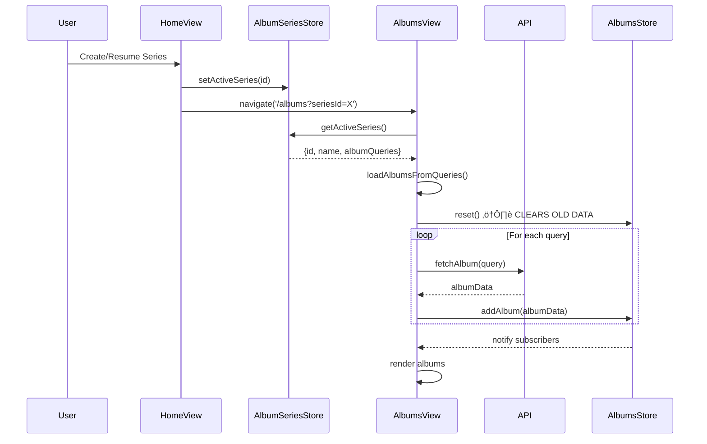
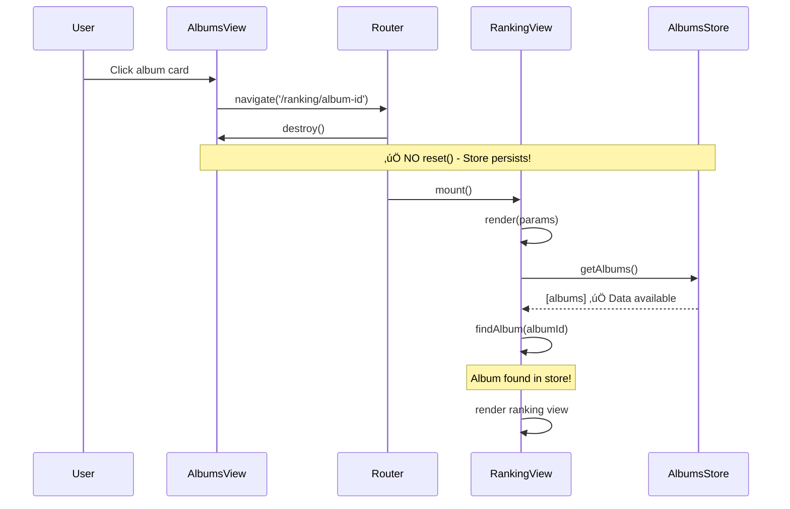
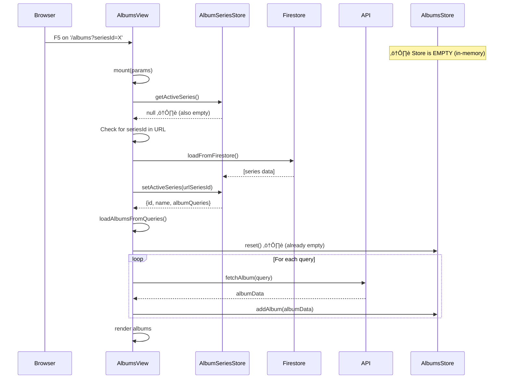
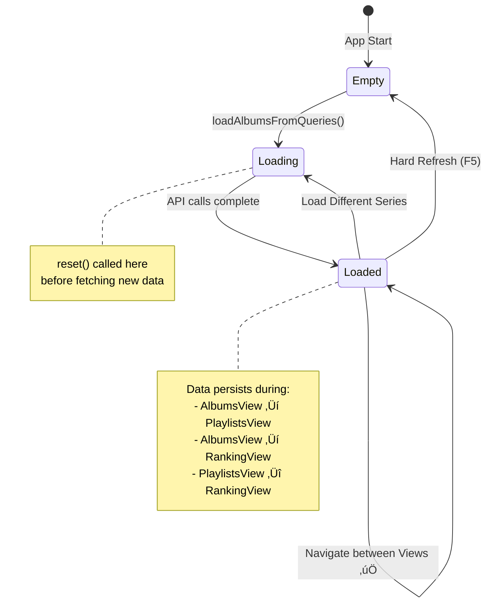
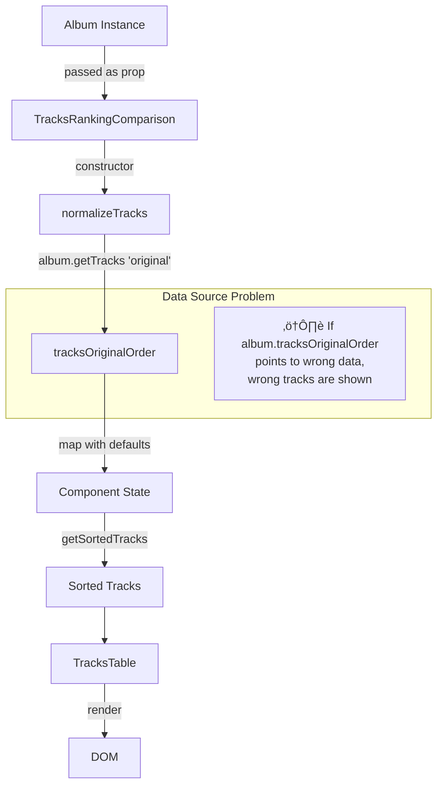

# Album Data Flow Architecture

**Updated**: 2025-12-25
**Version**: 2.7 (PlaylistsView V3 + Sprint 13 Documentation)

## Overview

This document maps the **Data Flow Diagrams (DFD)** and **Sequence Diagrams** for data flows through the application.

> For component inventory and API reference, see [component_reference.md](component_reference.md)
> For bug tracking, see [DEBUG_LOG.md](../debug/DEBUG_LOG.md)

### Version Notes
- **v2.7.1**: `AlbumSeriesListView` deprecated → Series management consolidated into `AlbumsView`
- **v2.8.0**: Playlist generation uses **Algorithm Strategy Pattern** (see [ALGORITHM_MENU.md](specs/ALGORITHM_MENU.md))
- **Sprint 11**: Spotify integration with auto-enrichment
- **Sprint 11.5**: **Event-Driven Persistence** for enrichment (Fix #58) & `AlbumsStateController` introduction.
- **Sprint 11.5**: **Ranking Strategy Pattern** fully implemented (Balanced, Spotify, BEA).
- **Sprint 12**: **SeriesView V3 Architecture** - Componentized thin orchestrator pattern.
- **Sprint 12**: **Blending Menu** - 4-step wizard UI + TopN algorithms + Mixin pattern (see below).
- **Sprint 12**: **Conditional Ingredients Panel** - Parameters show/hide based on selected algorithm.
- **Sprint 12**: **Spotify Enrichment Modularization** - SpotifyEnrichmentStore, SpotifyEnrichmentService, SpotifyEnrichmentHelper with cache-first pattern.
- **Sprint 13**: **PlaylistsView V3 Architecture** - Thin orchestrator with PlaylistsController, PlaylistsGridRenderer, PlaylistsDragHandler. Atomic saves with WriteBatch.

---

## Table of Contents

1. [System Architecture](#system-high-level-architecture)
2. [SeriesView V3 Architecture](#seriesview-v3-architecture) ← Sprint 12
3. [PlaylistsView V3 Architecture](#playlistsview-v3-architecture) ← **NEW (Sprint 13)**
4. [Blending Menu Architecture](#blending-menu-architecture) ← Sprint 12
4. [App Initialization](#app-initialization-flow)
5. [View Lifecycle & Navigation](#view-lifecycle--navigation)
6. [Navigation Map](#navigation-map)
7. [Core Data Flows](#core-data-flows)
   - Load Series
   - Navigate to Playlists
   - Navigate to Ranking
   - Hard Refresh
8. [CRUD Flows](#crud-flows-by-entity)
   - Album Series
   - Playlists
   - Inventory
9. [Special Flows](#special-flows)
   - Ranking Generation
   - Algorithm Generation
   - Spotify Integration

---

## SeriesView V3 Architecture

> **Added**: Sprint 12 (2025-12-23)
> **Pattern**: Thin Orchestrator + Focused Components

### Component Hierarchy

```
SeriesView (575 LOC - Thin Orchestrator)
    │
    ├── SeriesController (313 LOC - 0 DOM refs, pure logic)
    │
    ├── Components (public/js/components/series/)
    │   ├── SeriesHeader.js (56 LOC) - Title, count, generate button
    │   ├── SeriesToolbar.js (162 LOC) - Filters, search, view toggle
    │   ├── SeriesGridRenderer.js (131 LOC) - Delegates to production renders
    │   ├── SeriesEventHandler.js (183 LOC) - CRUD event delegation
    │   ├── EntityCard.js (68 LOC) - Card wrapper (delegates to AlbumCard)
    │   ├── SeriesFilterBar.js (77 LOC) - Filter dropdowns
    │   ├── SeriesDragDrop.js (66 LOC) - Drag functionality
    │   └── SeriesModals.js - Modal management
    │
    └── Stores
        ├── AlbumSeriesStore
        └── AlbumsStore
```

### Data Flow Pattern


### Key Patterns

| Pattern | Implementation |
|---------|----------------|
| **Thin Orchestrator** | SeriesView reduced from ~1200 to 575 lines |
| **Controller Decoupling** | SeriesController has 0 DOM references |
| **Prop-Based Components** | Components receive data via props |
| **Lifecycle Methods** | All components implement `mount/unmount/update` |

---

## PlaylistsView V3 Architecture

> **Added**: Sprint 13 (2025-12-25)
> **Pattern**: Thin Orchestrator + Controller + Renderer
> **Status**: ✅ IMPLEMENTED

### Component Hierarchy

```
PlaylistsView.js (~300 LOC - Orchestrator)
    │
    ├── PlaylistsController.js (338 LOC - Pure Business Logic)
    │   ├── initialize()         → Detect CREATE/EDIT mode, load data
    │   ├── handleGenerate()     → Algorithm execution
    │   ├── handleSave()         → Persistence (atomic batch)
    │   ├── loadAlbumsForSeries()→ API pipeline album loading
    │   └── loadEditBatch()      → Load from Firestore for edit
    │
    ├── PlaylistsGridRenderer.js (HTML Generation)
    │   ├── renderControls()
    │   ├── renderSettings()
    │   └── renderEmptyState()
    │
    ├── PlaylistsDragHandler.js (SortableJS)
    │   ├── setup(container)
    │   ├── destroy()
    │   └── onMove/onReorder callbacks
    │
    └── Services
        ├── PlaylistGenerationService    → Algorithm + Track Transform
        └── PlaylistPersistenceService   → Firestore CRUD

```

### Data Flow Pattern


### Album Loading Pipeline (Edit Mode)


### Key Patterns

| Pattern | Implementation |
|---------|----------------|
| **Thin Orchestrator** | PlaylistsView reduced from 960 to ~300 LOC |
| **Controller Decoupling** | PlaylistsController has 0 DOM references |
| **Service Layer** | PlaylistGenerationService, PlaylistPersistenceService |
| **Atomic Saves** | WriteBatch for transactional playlist saves |

### Mode Detection

| Entry Point | Mode | Data Source |
|-------------|------|-------------|
| `/playlists` | CREATE | In-memory generation |
| `/playlists/edit?edit=X&seriesId=Y` | EDIT | Firestore → API reload |

---


> **Added**: Sprint 12 (2025-12-23)
> **Route**: `/blend`
> **Pattern**: 4-Step Wizard + Algorithm Strategy + Mixin Pattern

### Component Hierarchy

```
BlendingMenuView.js (Main Wizard)
    │
    ├── Step 1: BlendSeriesSelector.js
    │       └── Entity type dropdown → Series loader
    │
    ├── Step 2: BlendFlavorCard.js
    │       └── Algorithm selection cards (TopN + Legacy)
    │
    ├── Step 3: BlendIngredientsPanel.js (Conditional per algorithm)
    │       └── Duration, Output mode, Ranking Type, Discovery Mode
    │       └── Shows/hides params based on ALGORITHM_INGREDIENTS config
    │
    └── Step 4: "Blend It!" CTA
            └── → CurationEngine → PlaylistSeries
```

---

## Spotify Enrichment Architecture

> **Added**: Sprint 12 (2025-12-23)
> **Status**: ✅ IMPLEMENTED
> **Pattern**: Background Service + Cache-First Helper

### Component Hierarchy

```
SpotifyEnrichmentHelper (Single Source of Truth)
    │
    ├── applyEnrichmentToAlbum()     → Enrich single album
    └── applyEnrichmentToAlbums()    → Batch enrichment
           │
           ├── SpotifyEnrichmentStore (Firestore CRUD)
           │   ├── normalizeKey()     → Deterministic keys
           │   ├── get()              → With lazy cleanup + TTL
           │   ├── save()             → With schema versioning
           │   └── Path: artifacts/mjrp-albums/users/{uid}/curator/data/spotify_enrichment
           │
           └── SpotifyService.enrichAlbumData()
               └── Spotify API → Search → Tracks → Popularity
```

### Data Flow Diagram


### Consumers

| Consumer | When | Cache First? | Fallback |
|----------|------|--------------|----------|
| `client.js.fetchAlbum()` | New album loaded | ✅ Yes | Fetch live |
| `SeriesView.refreshGrid()` | Grid renders | ✅ Yes | None (cache only) |
| `BlendingMenuView` | Before blend | ✅ Yes | Use unenriched |

### Anti-Ghost Strategies

| Strategy | Implementation |
|----------|----------------|
| **Deterministic Keys** | `normalizeKey()` → `artist-album` without special chars |
| **Lazy Cleanup** | `get()` checks `albumExistsCheck()` → deletes orphans |
| **TTL Validation** | Data expires after 30 days (`MAX_AGE_MS`) |
| **Schema Versioning** | `CURRENT_SCHEMA_VERSION = 1` → auto-invalidate on schema change |

### Algorithm Layer (with Mixins)

```
algorithms/
├── mixins/
│   ├── PlaylistBalancingMixin.js   (Swap balancing)
│   ├── DurationTrimmingMixin.js    (Duration enforcement)
│   └── TrackEnrichmentMixin.js     (Metadata enrichment)
│
├── TopNAlgorithm.js                (Base for Top 3/5)
│   ├── Top3PopularAlgorithm.js     ("Crowd Favorites" - Spotify)
│   ├── Top3AcclaimedAlgorithm.js   ("Critics' Choice" - BEA)
│   ├── Top5PopularAlgorithm.js     ("Greatest Hits" - Spotify)
│   └── Top5AcclaimedAlgorithm.js   ("Deep Cuts" - BEA)
│
└── (Legacy: MJRP, SDraft, LegacyRoundRobin)
```

### Data Flow


---

## System High-Level Architecture

```mermaid
graph LR
    User[User Actions]
    HomeView[HomeView]
    AlbumsView[AlbumsView - Series CRUD]
    PlaylistsView[PlaylistsView]
    EditPlaylistView[EditPlaylistView]
    SavedPlaylistsView[SavedPlaylistsView]
    RankingView[RankingView]
    InventoryView[InventoryView]
    SaveAllView[SaveAllView - Data Migration]
    
    AlbumSeriesStore[(AlbumSeriesStore)]
    AlbumsStore[(AlbumsStore)]
    PlaylistsStore[(PlaylistsStore)]
    InventoryStore[(InventoryStore)]
    AlgorithmRegistry[Algorithm Registry]
    
    API[API Client]
    SpotifyService[Spotify Service]
    MusicKitService[MusicKit Service]
    Firestore[(Firestore DB)]
    
    User --> HomeView
    User --> AlbumsView
    User --> PlaylistsView
    User --> EditPlaylistView
    User --> SavedPlaylistsView
    User --> RankingView
    User --> InventoryView
    User --> SaveAllView
    
    HomeView --> AlbumSeriesStore
    AlbumsView --> AlbumSeriesStore
    AlbumsView --> AlbumsStore
    AlbumsView --> API
    
    PlaylistsView --> AlbumsStore
    PlaylistsView --> PlaylistsStore
    PlaylistsView --> AlgorithmRegistry
    EditPlaylistView --> PlaylistsStore
    SavedPlaylistsView --> PlaylistsStore
    
    RankingView --> AlbumsStore
    InventoryView --> InventoryStore
    SaveAllView --> Firestore
    
    API --> AlbumsStore
    API --> SpotifyService
    API --> MusicKitService
    AlbumSeriesStore --> Firestore
    InventoryStore --> Firestore

---

## View Lifecycle & Navigation

The application uses a custom client-side router built on the History API (`pushState`). Views follow a standard lifecycle managed by the router.

### Sequence Diagram

```mermaid
sequenceDiagram
    participant User
    participant Router
    participant CurrentView
    participant NewView
    participant DOM
    
    User->>Router: navigate('/albums')
    Router->>Router: beforeNavigateHooks()
    Router->>CurrentView: destroy()
    CurrentView->>CurrentView: cleanup subscriptions
    
    Router->>NewView: viewFactory()
    Router->>NewView: render(params)
    NewView-->>Router: HTML string
    Router->>DOM: container.innerHTML = html
    
    Router->>NewView: mount(params)
    NewView->>NewView: setup event listeners
    NewView->>NewView: subscribe to stores
    
    Router->>Router: afterNavigateHooks()
```

### Lifecycle Methods (BaseView)

| Method | When Called | Purpose |
|--------|-------------|---------|
| `render(params)` | After factory, before DOM | Returns HTML string |
| `mount(params)` | After HTML injected | Setup listeners, subscriptions |
| `destroy()` | Before navigation away | Cleanup listeners, subscriptions |
| `update()` | On store notification | Re-render parts of UI |

### Navigation API

```javascript
import { router } from './router.js'

// Navigate with history push
router.navigate('/albums?seriesId=123')

// Force reload current route (same view)
await router.loadRoute(window.location.pathname)
```

### Link Handling

The router intercepts all `<a href="/...">` clicks on the page and uses `pushState` instead of full page reload.

```html
<!-- These are automatically intercepted -->
<a href="/albums">View Albums</a>
<a href="/inventory">Inventory</a>
```


---

## Scenario 1: Load Series (Normal Flow)



**Key Points:**
- ⚠️ `reset()` called ONLY in `loadAlbumsFromQueries()` before loading new series
- Data persists in store after loading
- All subsequent navigations use cached data

---


## Scenario 2: Navigate to Playlists & Generate (with Ranking Strategy)


---

## Scenario 3: Navigate to Album Ranking



---

## Scenario 4: Hard Refresh (Edge Case)



---

## Store State Lifecycle



---

## Data Flow Summary

### ✅ Store Resets (Clear Data)
1. **Loading New Series**: `loadAlbumsFromQueries()` calls `reset()` before fetching
2. **Hard Refresh**: Browser clears memory, store starts empty

### ✅ Store Persists (Keep Data)
1. **View Navigation**: AlbumsView → PlaylistsView → RankingView
2. **Back/Forward**: Browser history navigation
3. **View Lifecycle**: destroy() does NOT reset

### Current Implementation

| Event | Behavior |
|-------|----------|
| AlbumsView.constructor() | ✅ No reset() |
| AlbumsView.destroy() | ✅ No reset() |
| loadAlbumsFromQueries() | ✅ reset() before fetch |
| Navigate to Playlists | ✅ Store has data |
| Navigate to Ranking | ✅ Store has data |
| Hard Refresh | ✅ Fallback to Firestore |

---

## Architecture Benefits

```
AlbumsView loads data ONCE
  → Store persists while series active
    → PlaylistsView reads store
    → RankingView reads store
      → ✅ No duplication
      → ✅ No race conditions
      → ✅ No ghost albums
```

---

## Playlist Data Model

### Firestore Schema

```
Firestore Path:
users/{userId}/albumSeries/{seriesId}/playlists/{playlistId}
```

### Playlist Document Structure

| Field | Type | Description |
|-------|------|-------------|
| `id` | string | Firestore document ID (auto-generated) |
| `batchName` | string | Grupo de playlists (ex: "Greatest Hits") |
| `name` | string | Nome individual da playlist (ex: "DC1", "DC2") |
| `tracks` | array | Lista de tracks com title, artist, duration, rating |
| `order` | number | Ordem da playlist no batch (0, 1, 2...) |
| `createdAt` | timestamp | Data de criação |
| `savedAt` | timestamp | Data da última atualização |

### Conceito: Batch vs Playlist

```
Batch "Greatest Hits" (batchName)
├── Playlist id="abc", name="DC1", order=0
├── Playlist id="def", name="DC2", order=1
└── Playlist id="ghi", name="DC3", order=2
```

Um **batch** é um grupo de playlists com o mesmo `batchName`. 
Cada **playlist** tem seu próprio `id` no Firestore.

### Problema: Regenerate Muda IDs

Quando o usuário regenera playlists, o algoritmo cria **novos objetos** com **novos IDs**:

```
Antes:                        Após Regenerate:
id="abc" batchName="V1"  →   id="xyz" batchName="V1" (ID NOVO!)
```

### Solução: Save por batchName (Delete + Save)

Na EditPlaylistView, o Save deve:
1. **Deletar** todos documentos onde `batchName === currentBatchName`
2. **Salvar** as novas playlists com o mesmo `batchName`

```javascript
// Pseudo-código
async function saveEditedBatch(batchName, newPlaylists) {
  // 1. Deletar batch antigo
  const oldPlaylists = await repo.findByBatchName(batchName)
  for (const p of oldPlaylists) {
    await repo.delete(p.id)
  }
  
  // 2. Salvar novas playlists
  for (const p of newPlaylists) {
    p.batchName = batchName // garantir mesmo batchName
    await repo.save(p)
  }
}
```

### Diferença: CREATE vs EDIT Mode

| Aspecto | CREATE Mode | EDIT Mode |
|---------|-------------|-----------|
| **Entrada** | `/playlists` | `/playlists?edit=batchName` |
| **Carregar** | Store vazio | Firestore (fresh) |
| **Regenerate** | IDs novos | IDs novos, mas batchName mantido |
| **Save** | Cria batch NOVO | Deleta antigo + Salva novo |

### Suporte a Renomear Batch

Para permitir que o usuário renomeie o batch (ex: "Greatest Hits" → "Best of 2024"):

```javascript
// EditPlaylistView
class EditPlaylistView {
  mount(params) {
    this.originalBatchName = params.edit  // Guardar nome original da URL
    this.currentBatchName = params.edit   // Nome atual (pode mudar)
  }
  
  async save() {
    // 1. Deletar pelo nome ORIGINAL (não o atual)
    await deleteByBatchName(this.originalBatchName)
    
    // 2. Salvar com o novo nome
    for (const p of playlists) {
      p.batchName = this.currentBatchName  // Novo nome se mudou
      await repo.save(p)
    }
  }
}
```

Isso permite:
- ✅ Editar sem mudar nome
- ✅ Editar E renomear batch
- ✅ Regenerar e salvar

---

## Sprint 11: Spotify Integration Flow

**Added**: 2025-12-19

### Spotify OAuth Flow


### Spotify Auto-Enrichment Flow (Refactored Sprint 11.5)


### Spotify Export Flow


---


---

## Technical Strategies

### Playlist Persistence Strategy (Batch Management)

When editing or regenerating playlists, the system treats the batch as a unit. Since regeneration creates new playlist objects with new IDs, the save process handles versioning and renaming:

1. **Delete** all existing playlists where `batchName === originalBatchName`
2. **Save** all current playlists with `batchName = newBatchName`

This strategy prevents "ghost playlists" (orphaned tracks from previous generations) and supports batch renaming in a single atomic-like operation.

### Cache Strategy (2-Level + Source of Truth)

The system uses a unified `CacheManager` with a 2-level architecture, falling back to Firestore/API only when necessary.

```mermaid
graph TD
    Request[Data Request] --> L1{L1: Memory?}
    L1 -- Yes --> ReturnL1[Return Data (Fastest)]
    L1 -- No --> L2{L2: IndexedDB?}
    L2 -- Yes --> ReturnL2[Return Data (Fast)]
    L2 -- No --> Source{Source: Firestore/API}
    Source --> Cache[Update Cache L1+L2]
    Cache --> ReturnSource[Return Data]
```

1. **L1: Memory Cache** (Session-only, Map-based)
2. **L2: IndexedDB** (Persistent, 7-day TTL default)
3. **Source of Truth**: Firestore (User Data) or Apple/Spotify APIs (Metadata)


---

## TracksRankingComparison Component Data Flow



### Debug Checklist

- [ ] Album.id matches container data-album-id?
- [ ] album.tracksOriginalOrder has correct tracks?
- [ ] Track.album field matches Album.title?
- [ ] Cache is storing correct album → tracks mapping?

---

> **Note**: For bug tracking and known issues, see [DEBUG_LOG.md](../debug/DEBUG_LOG.md)

---

## CRUD Flows by Entity

### Album Series CRUD


### Playlist CRUD


### Inventory CRUD


---

## Ranking Generation Flow

```mermaid
sequenceDiagram
    participant User
    participant AlbumsView
    participant APIClient
    participant Backend
    participant BestEverAlbums
    participant SpotifyService
    participant TracksRankingComparison

    User->>AlbumsView: Load album series
    AlbumsView->>APIClient: fetchAlbum("Artist - Album")
    
    Note over APIClient,BestEverAlbums: Step 1: Get BEA Ranking
    APIClient->>Backend: POST /enrich-album
    Backend->>BestEverAlbums: Scrape album page
    BestEverAlbums-->>Backend: {tracks with ratings}
    Backend-->>APIClient: {tracksByAcclaim, tracksOriginalOrder}
    
    Note over APIClient,SpotifyService: Step 2: Get Spotify Popularity (if connected)
    APIClient->>SpotifyService: enrichAlbumData(artist, title)
    SpotifyService->>SpotifyService: searchAlbum() / fuzzy match
    SpotifyService->>SpotifyService: getAlbumTracksWithPopularity()
    SpotifyService-->>APIClient: {spotifyId, trackPopularityMap}
    
    Note over APIClient,TracksRankingComparison: Step 3: Merge Rankings
    APIClient->>APIClient: Apply spotifyPopularity to tracks
    APIClient->>APIClient: Calculate spotifyRank (sort by popularity)
    APIClient->>AlbumsStore: addAlbum(enrichedAlbum)
    
    Note over AlbumsView,TracksRankingComparison: Step 4: Render
    AlbumsView->>TracksRankingComparison: mount(album)
    TracksRankingComparison->>TracksRankingComparison: normalizeTracks()
    TracksRankingComparison->>TracksTable: render(tracks)
    TracksTable-->>User: Display table with Acclaim + Popularity columns
```

### Ranking Data Model

```javascript
// Track object with ranking data
{
    title: "Norwegian Wood",
    artist: "The Beatles",
    position: 2,           // Original album order (1-indexed)
    
    // BestEverAlbums.com ranking
    rank: 1,               // 1 = best rated track (from BEA)
    rating: 85,            // BEA rating (0-100)
    
    // Spotify ranking
    spotifyPopularity: 71, // 0-100 from Spotify API
    spotifyRank: 3,        // Derived: sorted by popularity desc
    spotifyId: "xxx",
    spotifyUri: "spotify:track:xxx"
}
```

---

## Algorithm Generation Flow

```mermaid
sequenceDiagram
    participant User
    participant PlaylistsView
    participant AlgorithmRegistry
    participant BaseAlgorithm
    participant SelectedAlgorithm
    participant PlaylistsStore

    User->>PlaylistsView: Select algorithm from dropdown
    User->>PlaylistsView: Click "Generate Playlists"
    
    PlaylistsView->>AlgorithmRegistry: getAlgorithm(selectedId)
    AlgorithmRegistry-->>PlaylistsView: algorithm instance
    
    PlaylistsView->>SelectedAlgorithm: configure(options)
    Note over SelectedAlgorithm: options: {playlistDuration, albumLimit, etc.}
    
    PlaylistsView->>AlbumsStore: getAlbums()
    AlbumsStore-->>PlaylistsView: [albums with tracks]
    
    PlaylistsView->>SelectedAlgorithm: generate(albums, options)
    
    Note over SelectedAlgorithm: Algorithm Logic
    SelectedAlgorithm->>SelectedAlgorithm: Sort tracks by rank
    SelectedAlgorithm->>SelectedAlgorithm: Distribute across playlists
    SelectedAlgorithm->>SelectedAlgorithm: Balance album representation
    SelectedAlgorithm-->>PlaylistsView: [Playlist[]]
    
    PlaylistsView->>PlaylistsStore: setPlaylists(playlists)
    PlaylistsStore-->>PlaylistsView: notify
    PlaylistsView->>PlaylistsView: render playlists
```

### Algorithm Registry

```javascript
// algorithms/index.js
const algorithms = {
    'mjrp-balanced-cascade': MJRPBalancedCascadeAlgorithm,
    'mjrp-balanced-v0': MJRPBalancedCascadeV0Algorithm,
    'sdraft-balanced': SDraftBalancedAlgorithm,
    'sdraft-original': SDraftOriginalAlgorithm,
    'legacy-round-robin': LegacyRoundRobinAlgorithm
}

export function getAlgorithmById(id) {
    return new algorithms[id]()
}

export function listAlgorithms() {
    return Object.keys(algorithms).map(id => ({
        id,
        name: algorithms[id].displayName,
        description: algorithms[id].description
    }))
}
```

---

## Navigation Map

```mermaid
graph TD
    Home[HomeView<br/>/home]
    Albums[AlbumsView<br/>/albums?seriesId=X]
    Playlists[PlaylistsView<br/>/playlists]
    EditPlaylist[EditPlaylistView<br/>/playlists/edit?batch=X]
    SavedPlaylists[SavedPlaylistsView<br/>/playlists/saved]
    Ranking[RankingView<br/>/ranking/:albumId]
    Inventory[InventoryView<br/>/inventory]
    SaveAll[SaveAllView<br/>/save-all]
    
    Home -->|"Create/Resume Series"| Albums
    Albums -->|"Generate Playlists"| Playlists
    Albums -->|"View Ranking"| Ranking
    Albums -->|"+ Inventory"| Inventory
    
    Playlists -->|"Save"| SavedPlaylists
    Playlists -->|"Back"| Albums
    
    SavedPlaylists -->|"Edit Batch"| EditPlaylist
    EditPlaylist -->|"Save"| SavedPlaylists
    
    Ranking -->|"Back"| Albums
    Inventory -->|"Back"| Home
    
    style Home fill:#4ade80
    style Albums fill:#60a5fa
    style Playlists fill:#f97316
    style Inventory fill:#a855f7
```

---

## App Initialization Flow

```mermaid
sequenceDiagram
    participant Browser
    participant index.html
    participant app.js
    participant Firebase
    participant Router
    participant View

    Browser->>index.html: Load page
    index.html->>app.js: import app.js
    
    app.js->>Firebase: initializeApp(config)
    Firebase-->>app.js: firebase instance
    
    app.js->>Firebase: onAuthStateChanged()
    
    alt User Logged In
        Firebase-->>app.js: user object
        app.js->>app.js: Set userId in stores
    else No User
        Firebase-->>app.js: null
        app.js->>app.js: Set anonymous mode
    end
    
    app.js->>Router: initialize()
    Router->>Router: Parse current URL
    Router->>Router: Find matching route
    Router->>View: mount(container, params)
    View->>View: render()
    View-->>Browser: Display page
```


