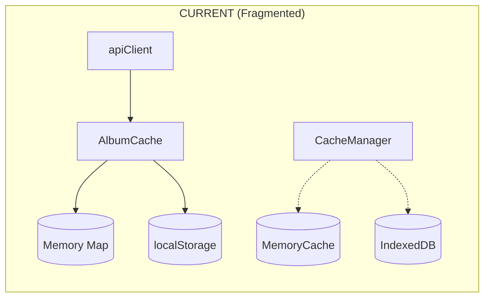
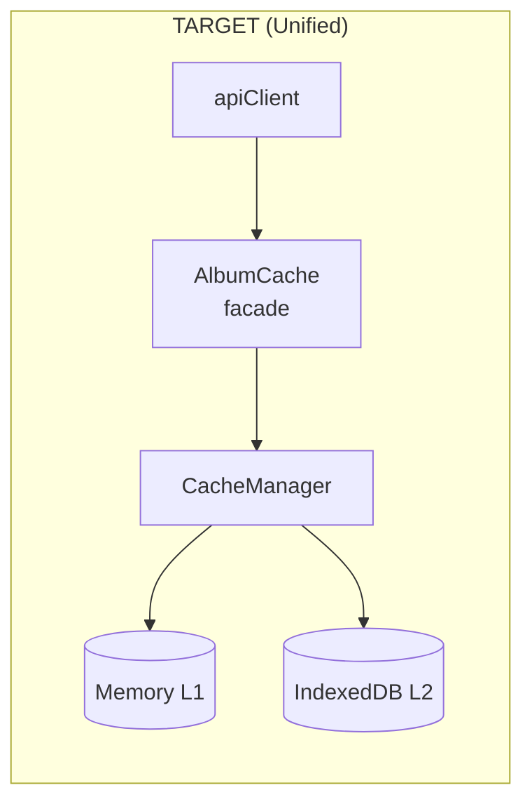
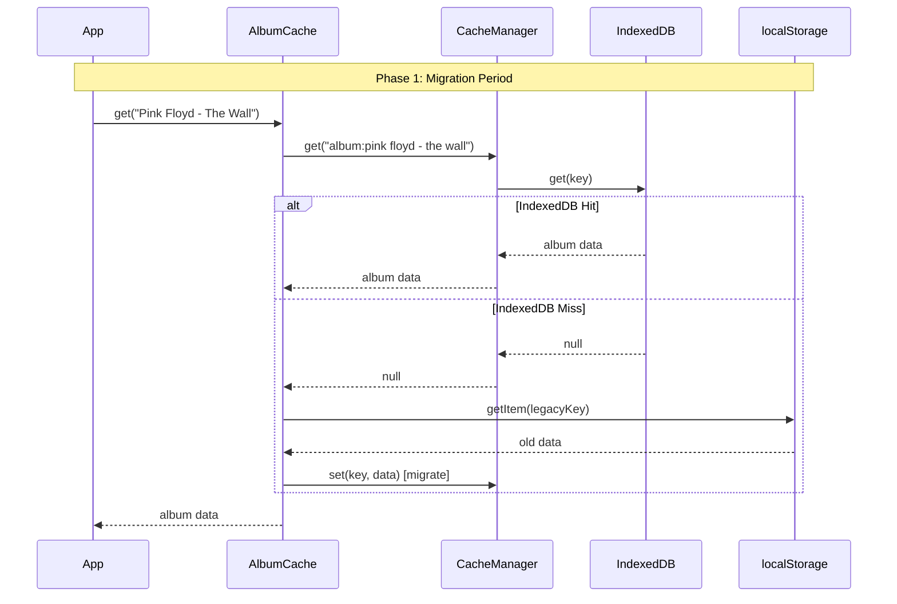

# ARCH-5: Cache Consolidation - Implementation Plan
**Status**: 📋 DRAFT - Awaiting Review  
**Date**: 2025-12-26  
**Spec**: [arch-5-cache-consolidation_spec.md](./arch-5-cache-consolidation_spec.md)

---

## 1. Architecture Overview

### Current vs Target State





---

## 2. Component Strategy

### Files to Modify

| File | Change Type | Description |
|------|-------------|-------------|
| `cache/albumCache.js` | **REFACTOR** | Use CacheManager as backend instead of localStorage |
| `cache/CacheManager.js` | **MINOR** | Add key normalization helper |
| `cache/MemoryCache.js` | **DELETE** | Replace with native Map in CacheManager |
| `api/client.js` | **NONE** | Already uses albumCache.get/set API |

### New Code Structure

```javascript
// albumCache.js (refactored)
import { cacheManager } from './CacheManager.js'

class AlbumCache {
    constructor() {
        this.ttl = 7 * 24 * 60 * 60 * 1000 // 7 days
        this.version = '4.0' // Bump for IndexedDB migration
        this.migrationDone = false
    }
    
    normalizeKey(query) {
        return `album:${query.toLowerCase().trim().replace(/\s+/g, ' ')}`
    }
    
    async get(query) {
        const key = this.normalizeKey(query)
        
        // Try new cache first
        let data = await cacheManager.get(key)
        
        // Fallback to localStorage (migration period)
        if (!data && !this.migrationDone) {
            data = this.legacyGet(query)
            if (data) {
                // Migrate to new cache
                await cacheManager.set(key, data, this.ttl)
            }
        }
        
        return data
    }
    
    async set(query, album) {
        const key = this.normalizeKey(query)
        await cacheManager.set(key, album, this.ttl)
    }
    
    // Legacy localStorage access (for migration only)
    legacyGet(query) { ... }
}
```

---

## 3. Migration Strategy

### Phase 1: Dual-Read (Day 1-7)
```
READ:  new IndexedDB → if miss → old localStorage
WRITE: new IndexedDB only
```

### Phase 2: Cleanup (Day 8+)
```
READ:  new IndexedDB only
WRITE: new IndexedDB only
DELETE: localStorage entries with 'album_cache_' prefix
```



---

## 4. Key Normalization

### Before (Problem)
```javascript
// Different queries = different cache entries
"Pink Floyd - The Wall"   → cache key: "album_cache_v3.1_Pink Floyd - The Wall"
"pink floyd - the wall"   → cache key: "album_cache_v3.1_pink floyd - the wall"
"Pink Floyd-The Wall"     → cache key: "album_cache_v3.1_Pink Floyd-The Wall"
```

### After (Normalized)
```javascript
// All normalize to same key
"Pink Floyd - The Wall"   → "album:pink floyd - the wall"
"pink floyd - the wall"   → "album:pink floyd - the wall"  
"Pink Floyd-The Wall"     → "album:pink floyd - the wall"
```

---

## 5. Implementation Steps

### Step 1: Prepare CacheManager (30 min)
- [ ] Add `normalizeKey()` method if needed
- [ ] Verify IndexedDB init works in all browsers
- [ ] Add migration cleanup method

### Step 2: Refactor AlbumCache (1h)
- [ ] Convert class to async (all methods return Promise)
- [ ] Replace localStorage with cacheManager calls  
- [ ] Add `normalizeKey()` function
- [ ] Implement `legacyGet()` for migration

### Step 3: Update Consumers (30 min)
- [ ] Update `apiClient` to await cache methods
- [ ] Test API flow end-to-end

### Step 4: Cleanup (30 min)
- [ ] Delete `MemoryCache.js`
- [ ] Remove unused localStorage legacy code after 7 days
- [ ] Update CACHE_ARCHITECTURE.md

---

## 6. Testing Plan

| Test | Expected Result |
|------|-----------------|
| Fresh load (no cache) | Album fetched from API, saved to IndexedDB |
| Refresh page | Album loaded from IndexedDB L2, promoted to L1 |
| DevTools → IndexedDB | See `mjrp-cache` DB with album entries |
| DevTools → localStorage | No new `album_cache_` entries |
| Case variation query | Same cache entry returned |

---

## 7. Rollback Plan

If issues found:
1. Revert `albumCache.js` to use localStorage
2. IndexedDB data remains (not lost)
3. Users continue with localStorage cache

---

## Approval

- [ ] **USER APPROVAL REQUIRED** to proceed to Implementation
