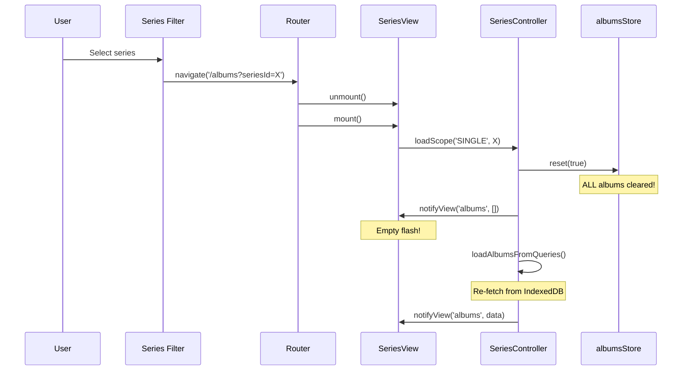
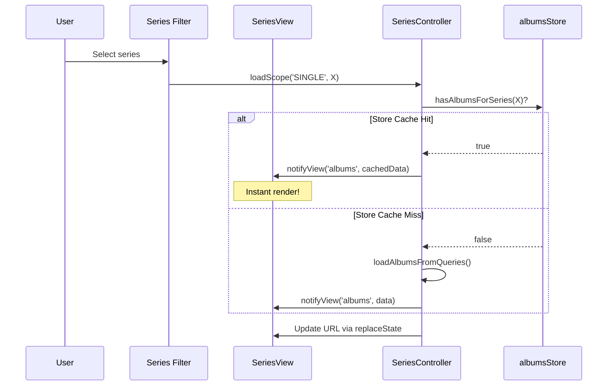

# ARCH-6: SeriesView Loading Optimization - Implementation Plan
**Status**: 📋 DRAFT - Awaiting Review  
**Date**: 2025-12-26  
**Spec**: [arch-6-series-loading-optimization_spec.md](./arch-6-series-loading-optimization_spec.md)

---

## 1. Architecture Overview

### Current Flow (Problematic)



### Target Flow (Optimized)



---

## 2. Component Changes

### File 1: SeriesView.js

#### Change: `handleSeriesChange()`

```diff
 handleSeriesChange(value) {
-    if (value === 'all') {
-        router.navigate('/albums');
-    } else {
-        router.navigate(`/albums?seriesId=${value}`);
-    }
+    const seriesId = value === 'all' ? null : value;
+    const scopeType = seriesId ? 'SINGLE' : 'ALL';
+    
+    // Load directly without router navigation
+    this.controller.loadScope(scopeType, seriesId);
+    
+    // Update URL without triggering navigation
+    const url = seriesId ? `/albums?seriesId=${seriesId}` : '/albums';
+    window.history.replaceState({}, '', url);
 }
```

---

### File 2: SeriesController.js

#### Change: `loadScope()` - Add store cache check

```diff
 async loadScope(scopeType, seriesId = null, skipCache = false) {
     console.log(`[SeriesController] loadScope: ${scopeType}, seriesId=${seriesId}`);

     this.state.currentScope = scopeType;
     this.state.targetSeriesId = seriesId;
-    this.state.isLoading = true;
-    this.notifyView('loading', true);

     // Update URL without reload
     const newUrl = seriesId ? `/albums?seriesId=${seriesId}` : '/albums';
     if (window.location.pathname + window.location.search !== newUrl) {
         window.history.pushState({}, '', newUrl);
     }

     try {
         const storeContextId = scopeType === 'ALL' ? 'ALL_SERIES_VIEW' : seriesId;
+        
+        // ARCH-6: Check store cache BEFORE reset
+        if (!skipCache && albumsStore.hasAlbumsForSeries(storeContextId)) {
+            console.log('[SeriesController] ✅ Using cached albums from store');
+            albumsStore.setActiveAlbumSeriesId(storeContextId);
+            this.notifyView('header', this.getHeaderData());
+            this.notifyView('albums', albumsStore.getAlbumsForSeries(storeContextId));
+            this.notifyView('loading', false);
+            return;
+        }

+        this.state.isLoading = true;
+        this.notifyView('loading', true);
+
         albumsStore.setActiveAlbumSeriesId(storeContextId);
-        albumsStore.reset(true);
-
-        this.notifyView('albums', []);
+        // Don't reset - just clear current series if needed
+        albumsStore.clearAlbumSeries(storeContextId);

         // ... rest of the method
```

---

### File 3: albums.js (store)

#### Change: `reset()` - Don't clear albumsByAlbumSeriesId

```diff
 reset(preserveAlbumSeriesContext = false) {
     const seriesId = preserveAlbumSeriesContext ? this.activeAlbumSeriesId : null

-    // ALWAYS clear all albums to prevent ghost albums
-    this.albumsByAlbumSeriesId.clear()
+    // ARCH-6: Preserve album cache for navigation back
+    // Only clear if explicitly requested
+    if (!preserveAlbumSeriesContext) {
+        this.albumsByAlbumSeriesId.clear()
+    }

     this.currentAlbum = null
     this.loading = false
     this.error = null
     this.activeAlbumSeriesId = seriesId
     this.notify()
 }
```

---

## 3. Implementation Steps

| Step | File | Estimated Time |
|------|------|----------------|
| 1 | `SeriesView.js` - handleSeriesChange | 10 min |
| 2 | `SeriesController.js` - loadScope cache check | 15 min |
| 3 | `albums.js` - reset behavior | 10 min |
| 4 | CRUD handlers - add cache invalidation | 5 min |
| 5 | Test & verify all scenarios | 15 min |

**Total**: ~55 min

---

## 4. Testing Plan

### Scenario 1: Filter Change
1. Navigate to `/albums`
2. Wait for albums to load
3. Change filter to specific series
4. **Expected**: No flash, instant update, console shows "Using cached albums"

### Scenario 2: Navigation Back
1. Navigate to `/albums?seriesId=X`
2. Wait for albums to load
3. Navigate to `/playlists`
4. Navigate back to `/albums`
5. **Expected**: Albums appear instantly, no loading indicator

### Scenario 3: Force Refresh Still Works
1. Load a series
2. Press F5
3. **Expected**: Full reload from URL params (skipCache behavior preserved)

---

## 5. Rollback Plan

If issues found:
1. Revert `handleSeriesChange` to use router.navigate
2. Revert `reset()` to clear Map
3. Store cache doesn't affect IndexedDB cache (ARCH-5)

---

## Approval

- [x] **IMPLEMENTED & VERIFIED** - 2025-12-26 11:00
