# ARCH-6: SeriesView Loading Optimization - Implementation Plan

**Status**: 📋 REVISED - Ready for Implementation  
**Date**: 2025-12-26  
**Spec**: [arch-6-series-loading-optimization_spec.md](./arch-6-series-loading-optimization_spec.md)  
**Previous Attempt**: Reverted in `29875ef`

---

## 1. Architecture Overview

### Current Flow (Problems)


### Target Flow (Fixed)

```mermaid
sequenceDiagram
    participant U as User
    participant Filter
    participant SV as SeriesView
    participant SC as SeriesController
    participant AS as albumsStore

    U->>Filter: Select series
    Filter->>SC: loadScope() [direct call]
    SC->>AS: hasAlbumsForSeries()?
    
    alt Cache HIT
        AS-->>SC: true
        SC->>SV: notifyView('albums', cached)
        Note over SV: INSTANT! ✅
    else Cache MISS
        SC->>SV: notifyView('loading', true)
        loop Each album
            SC->>AS: addAlbum()
            SC->>SV: notifyView('albums', current)
            Note over SV: Renders 1 by 1 ✅
        end
    end
    
    SC->>SV: replaceState(url)
```



---

## 2. Changes by File

### File 1: SeriesController.js

#### Change A: Incremental Render in Callback

```diff
// In loadAlbumsFromQueries callback
(current, total, result) => {
    if (this.abortController.signal.aborted) return;

    this.state.loadProgress = { current, total };
    const progressLabel = result.album
        ? `Loading: ${result.album.artist} - ${result.album.title}`
        : `Processing... (${Math.round((current / total) * 100)}%)`;

    this.notifyView('progress', { current, total, label: progressLabel });

    if (result.status === 'success' && result.album) {
        this.hydrateAndAddAlbum(result.album);
+       // ARCH-6: Incremental render - sync with progress bar
+       this.notifyView('albums', albumsStore.getAlbums());
    }
}
```

#### Change B: Store Cache Check in loadScope

```diff
async loadScope(scopeType, seriesId = null, skipCache = false) {
    this.state.currentScope = scopeType;
    this.state.targetSeriesId = seriesId;

    const storeContextId = scopeType === 'ALL' ? 'ALL_SERIES_VIEW' : seriesId;

+   // ARCH-6: Check store cache BEFORE loading
+   if (!skipCache && albumsStore.hasAlbumsForSeries(storeContextId)) {
+       console.log('[SeriesController] ✅ Cache HIT - instant render');
+       albumsStore.setActiveAlbumSeriesId(storeContextId);
+       albumSeriesStore.setActiveSeries(scopeType === 'ALL' ? null : seriesId);
+       this.notifyView('header', this.getHeaderData());
+       this.notifyView('albums', albumsStore.getAlbumsForSeries(storeContextId));
+       this.notifyView('loading', false);
+       return;
+   }

    // Cache MISS - proceed with loading
    this.state.isLoading = true;
    this.notifyView('loading', true);
    // ... rest
```

#### Change C: Remove reset(true) in loadAlbumsFromQueries

```diff
async loadAlbumsFromQueries(queries, skipCache = false) {
    // Cancel previous
    if (this.abortController) {
        this.abortController.abort();
    }
    this.abortController = new AbortController();

-   albumsStore.reset(true);
-   this.notifyView('albums', []);
+   // ARCH-6: Don't reset - just clear current series
+   albumsStore.clearAlbumSeries(albumsStore.getActiveAlbumSeriesId());

    this.state.isLoading = true;
    // ... rest
```

---

### File 2: SeriesView.js

#### Change A: handleSeriesChange - Direct loadScope

```diff
handleSeriesChange(value) {
-   if (value === 'all') {
-       router.navigate('/albums');
-   } else {
-       router.navigate(`/albums?seriesId=${value}`);
-   }
+   const seriesId = value === 'all' ? null : value;
+   const scopeType = seriesId ? 'SINGLE' : 'ALL';
+   
+   // ARCH-6: Direct call, no router remount
+   if (this.controller) {
+       this.controller.loadScope(scopeType, seriesId);
+   }
+   
+   // Update URL without navigation
+   const url = seriesId ? `/albums?seriesId=${seriesId}` : '/albums';
+   window.history.replaceState({}, '', url);
+   
+   // Update internal state
+   this.currentScope = scopeType;
+   this.targetSeriesId = seriesId;
}
```

---

### File 3: albums.js (store)

#### Change: reset() Preserves Map

```diff
reset(preserveAlbumSeriesContext = false) {
    const seriesId = preserveAlbumSeriesContext ? this.activeAlbumSeriesId : null;

-   // ALWAYS clear all albums
-   this.albumsByAlbumSeriesId.clear();
+   // ARCH-6: Only clear if full reset
+   if (!preserveAlbumSeriesContext) {
+       this.albumsByAlbumSeriesId.clear();
+   }

    this.currentAlbum = null;
    this.loading = false;
    this.error = null;
    this.activeAlbumSeriesId = seriesId;
    this.notify();
}
```

---

### File 4: SeriesView.js (CRUD handlers)

#### Change: Cache Invalidation

```diff
// In mountSeriesModals()
this.components.modals = new SeriesModals({
    onSeriesUpdated: (seriesId) => {
+       // ARCH-6: Invalidate cache
+       albumsStore.clearAlbumSeries(seriesId);
+       albumsStore.clearAlbumSeries('ALL_SERIES_VIEW');
        this.updateHeader();
        if (this.controller) {
            this.controller.loadScope(this.currentScope, this.targetSeriesId, true);
        }
    },
    onSeriesDeleted: (seriesId) => {
+       // ARCH-6: Invalidate cache
+       albumsStore.clearAlbumSeries(seriesId);
+       albumsStore.clearAlbumSeries('ALL_SERIES_VIEW');
        if (this.targetSeriesId === seriesId) {
            router.navigate('/albums');
        } else {
            this.refreshGrid();
        }
    },
```

---

## 3. Implementation Order

| Step | Change | Time |
|------|--------|------|
| 1 | Incremental render (callback) | 5 min |
| 2 | Store cache check (loadScope) | 10 min |
| 3 | Remove reset() in loadAlbumsFromQueries | 5 min |
| 4 | handleSeriesChange (no router) | 5 min |
| 5 | reset() preserves Map | 5 min |
| 6 | CRUD cache invalidation | 5 min |
| 7 | Test all 3 scenarios | 15 min |

**Total**: ~50 min

---

## 4. Testing Plan

### Test 1: Incremental Render
1. Clear IndexedDB cache
2. Navigate to `/albums`
3. **Expected**: Albums appear 1 by 1 as progress bar advances

### Test 2: Filter Change Cache Hit
1. Load "All Series"
2. Change filter to "LED SERIES"
3. Change back to "All Series"
4. **Expected**: Instant switch, console shows "Cache HIT"

### Test 3: Navigate Away/Back
1. Load `/albums`
2. Go to `/playlists`
3. Return to `/albums`
4. **Expected**: Albums appear instantly

### Test 4: Refresh Button
1. Load a series
2. Click Refresh
3. **Expected**: Full reload (skipCache=true)

---

## 5. Rollback Plan

If critical issues:
```bash
git revert HEAD  # Reverts ARCH-6 changes
```

---

## Approval

- [x] **IMPLEMENTED & VERIFIED** - 2025-12-26 12:15
