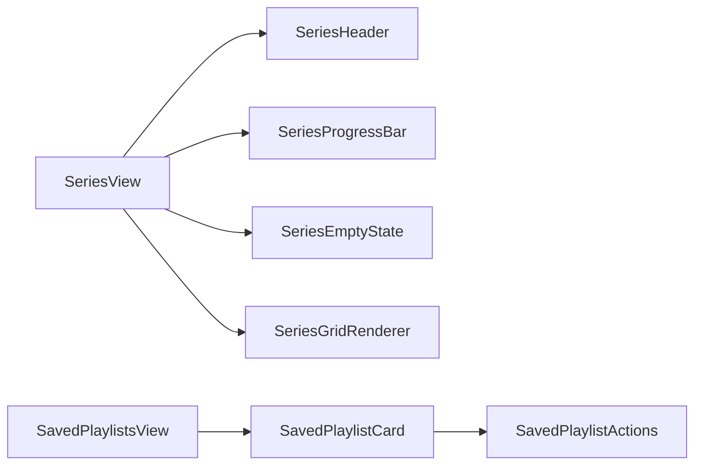

# Implementation Plan - Sprint 19 Track A: Views Refactoring
**Status**: 📋 PENDING REVIEW
**Agent**: Agent 1 (Views Specialist)
**Branch**: `feature/sprint-19-track-a-views`

---

## Goal
Extract child components from `SeriesView.js` and `SavedPlaylistsView.js` to achieve < 200 LOC per file.

## Proposed Changes

### 1. SeriesView Componentization

#### [NEW] `components/series/SeriesHeader.js`
**Responsibility**: Render series title, breadcrumb, edit/delete actions.
```javascript
// Props: { series, onEdit, onDelete }
// Renders: Title, Breadcrumb, Action Buttons
```

#### [NEW] `components/series/SeriesProgressBar.js`
**Responsibility**: Render loading progress during album enrichment.
```javascript
// Props: { current, total, isLoading }
// Renders: Progress bar with percentage
```

#### [NEW] `components/series/SeriesEmptyState.js`
**Responsibility**: Render empty state when no albums exist.
```javascript
// Props: { seriesName, onAddAlbums }
// Renders: Empty illustration, CTA button
```

#### [MODIFY] `views/SeriesView.js`
- Remove inline rendering logic for header, progress, empty state.
- Import and use new child components.
- Keep orchestration logic (data fetching, event handling).

---

### 2. SavedPlaylistsView Componentization

#### [NEW] `components/playlists/SavedPlaylistCard.js`
**Responsibility**: Render a single saved playlist batch card.
```javascript
// Props: { batch, isExpanded, onToggle, onEdit, onDelete }
// Renders: Card with header, track list (collapsible)
```

#### [NEW] `components/playlists/SavedPlaylistActions.js`
**Responsibility**: Render action buttons (Edit, Delete, Export).
```javascript
// Props: { batchId, onEdit, onDelete, onExport }
// Renders: Button group
```

#### [MODIFY] `views/SavedPlaylistsView.js`
- Remove inline card rendering logic.
- Import and use new child components.
- Keep data fetching and grouping logic.

---

## UI/UX Mockups

> No visual changes planned. Components are structural extractions only.

---

## Logic Flow



---

## Verification Plan

1. **Build**: `npm run build` must pass.
2. **Browser Regression**: Run `[SERIES]` and `[HISTORY]` checklists via Agent Browser.
3. **LOC Check**: `SeriesView.js` < 200, `SavedPlaylistsView.js` < 200.

---

## Dependencies

- **Waits For**: Track B (Stores) to merge first (if Views consume new Services).
- **Blocked By**: None (Views can use existing store APIs initially).

---

## Files Owned (Do Not Touch Track B Files)
- `public/js/views/SeriesView.js`
- `public/js/views/SavedPlaylistsView.js`
- `public/js/components/series/*.js`
- `public/js/components/playlists/SavedPlaylist*.js`
