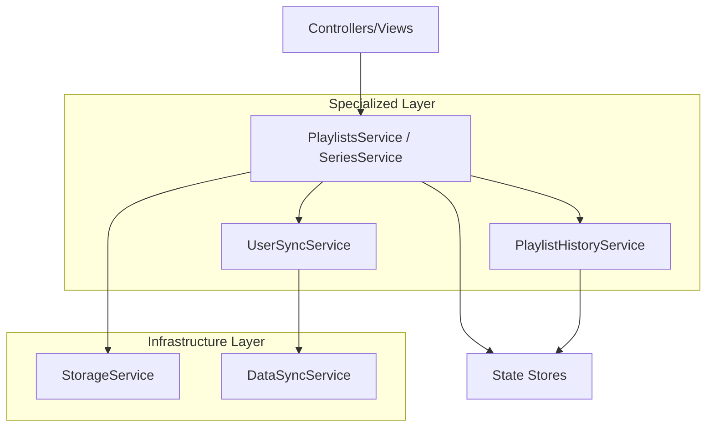

# Implementation Plan - Sprint 19 Track C: Service Layer Refinement

**Status**: 📋 PENDING REVIEW
**Agent**: Antigravity
**Branch**: `feature/sprint-19-track-a-views` (Continuing on current active branch)

## Goal
Further modularize the Service Layer by extracting specialized logic into sub-services, keeping the main Orchestrators (Playlists & Series) scannable and under 200 LOC.

---

## Proposed Architecture

### 1. New Sub-Services

#### `public/js/services/infra/StorageService.js` [NEW]
- **Responsibility**: Abstract `localStorage`.
- **API**:
  - `save(key, data)`: JSON stringify + try/catch.
  - `load(key)`: JSON parse + try/catch.
  - `remove(key)`

#### `public/js/services/playlists/PlaylistHistoryService.js` [NEW]
- **Responsibility**: Undo/Redo/Versioning.
- **API**:
  - `createSnapshot(playlists, seriesId, description)`
  - `undo()`: Return state or null.
  - `redo()`: Return state or null.
  - `getUndoState()`: Boolean flags.

#### `public/js/services/auth/UserSyncService.js` [NEW]
- **Responsibility**: User auth events & guest-to-user migration.
- **API**:
  - `handleUserChange(newUser, currentUserId)`
  - `migrate(series)`: Orchestrate with `DataSyncService`.

---

## 2. Refactored Orchestrators

### `public/js/services/PlaylistsService.js` [MODIFY]
- **DELETE**: `versions`, `currentVersionIndex`, `undo()`, `redo()`, `saveToLocalStorage()`, `loadFromLocalStorage()`.
- **ADD**: Dependency injection of `StorageService` and `PlaylistHistoryService`.
- **Delegation**:
  - `moveTrack` calls `history.createSnapshot()` then `storage.save()`.
  - `undo()` delegates to `history.undo()`.

### `public/js/services/SeriesService.js` [MODIFY]
- **DELETE**: `handleUserChange()`, `saveToLocalStorage()`, `loadFromLocalStorage()`.
- **ADD**: Dependency injection of `StorageService` and `UserSyncService`.

---

## 3. Logic Flow (Dependency Graph)



---

## 4. Initialization Logic
We will maintain the Singleton Factory pattern but update it to wire dependencies:

```javascript
// Example in getPlaylistsService
export function getPlaylistsService(db, cacheManager) {
    if (!_instance && db) {
        const storage = new StorageService();
        const history = new PlaylistHistoryService();
        _instance = new PlaylistsService(db, cacheManager, storage, history);
    }
    return _instance;
}
```

---

## 5. Verification Plan
- **Pre-Implementation Check**: Ensure current Track B work is backed up (verified in previous step).
- **Step-by-Step Refactor**: 
    1. Infrastructure first (`StorageService`).
    2. Infrastructure integration in `PlaylistsService`.
    3. Feature extraction (`History`).
    4. Repeat for `SeriesService`.
- **Regression**: Run `[BLEND]` and `[HISTORY]` checklists.
