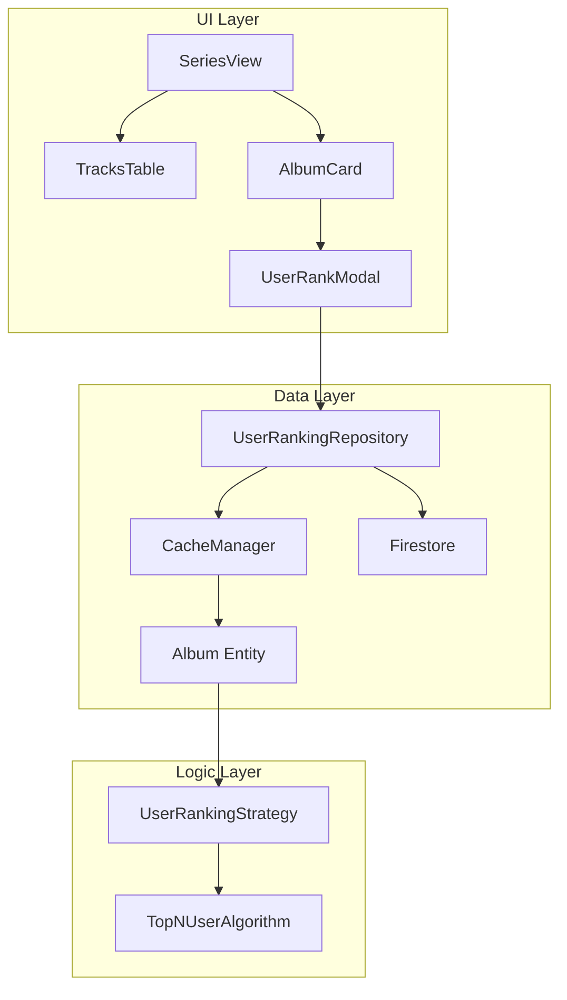

# User-Generated Track Ranking - Implementation Plan

**Sprint**: 20
**Status**: 🟡 DRAFT
**Spec**: [spec.md](./spec.md)
**Last Updated**: 2026-01-11

---

## 0. Documentation References

> [!NOTE]
> This plan aligns with existing architecture documented in:

| Document | Relevance |
|----------|-----------|
| [01_System_Architecture.md](../../manual/01_System_Architecture.md) | MVC pattern, data flow |
| [07_Frontend_Data_Infra.md](../../manual/07_Frontend_Data_Infra.md) | Repository pattern, CacheManager |
| [18_Frontend_Logic_Core.md](../../manual/18_Frontend_Logic_Core.md) | Algorithms, Strategies |
| [31_UI_Style_Guide.md](../../manual/31_UI_Style_Guide.md) | Color tokens, button system |

---

## 1. Architecture Overview



---

## 2. Component Strategy

### 2.1 New Files

| File | Type | Purpose | Reference |
|------|------|---------|-----------|
| `ranking/UserRankingStrategy.js` | Strategy | Sort tracks by user-defined rank | [18_Frontend_Logic_Core](../../manual/18_Frontend_Logic_Core.md) |
| `algorithms/TopNUserAlgorithm.js` | Algorithm | TopN using UserRankingStrategy | Pattern: TopNPopularAlgorithm |
| `components/ranking/UserRankModal.js` | Component | Drag-and-drop ranking UI | - |
| `repositories/UserRankingRepository.js` | Repository | Firestore CRUD for rankings | [07_Frontend_Data_Infra](../../manual/07_Frontend_Data_Infra.md) |

### 2.2 Modified Files

| File | Changes |
|------|---------|
| `ranking/index.js` | Register `UserRankingStrategy` |
| `algorithms/index.js` | Register `TopNUserAlgorithm` |
| `components/ranking/TracksTable.js` | Add MY RANK column, fix sorting |
| `components/blend/BlendRecipeCard.js` | Add "My Ranking" recipe card |
| `views/helpers/SeriesViewUpdater.js` | Add "Rank It" button to cards |
| `docs/manual/31_UI_Style_Guide.md` | Add User Ranking color token |

---

## 3. Implementation Phases

### Phase 1: Data Layer (2-3h)

#### 3.1.1 UserRankingRepository.js

Following **BaseRepository pattern** from [07_Frontend_Data_Infra](../../manual/07_Frontend_Data_Infra.md):

```javascript
// Extends BaseRepository with CacheManager integration
export class UserRankingRepository extends BaseRepository {
    constructor() {
        super('users/{userId}/albumRankings')
    }
    
    async getRanking(userId, albumId) {
        return this.findById(`${userId}/albumRankings/${albumId}`)
    }
    
    async saveRanking(userId, albumId, rankings) {
        return this.save(`${userId}/albumRankings/${albumId}`, {
            albumId, rankings, updatedAt: serverTimestamp()
        })
    }
}
```

#### 3.1.2 Album Entity Extension

```javascript
// Add to album runtime object (models/Album.js)
album.userRanking = [{ trackTitle, userRank }, ...]
album.hasUserRanking = true/false
```

---

### Phase 2: Ranking Strategy (1-2h)

#### 3.2.1 UserRankingStrategy.js

Following **Strategy Pattern** from [18_Frontend_Logic_Core](../../manual/18_Frontend_Logic_Core.md):

```javascript
import { RankingStrategy } from './RankingStrategy.js'

export class UserRankingStrategy extends RankingStrategy {
    static metadata = {
        id: 'user',
        name: 'My Ranking',
        description: 'Your personal track order'
    }

    rank(album) {
        if (!album.userRanking?.length) {
            // Fallback: original album position
            return album.tracks.map((t, i) => ({ ...t, _rank: i + 1 }))
        }
        
        const userIndex = new Map(
            album.userRanking.map(r => [this.normalizeKey(r.trackTitle), r.userRank])
        )
        
        return album.tracks
            .map(t => ({ ...t, _rank: userIndex.get(this.normalizeKey(t.title)) || 999 }))
            .sort((a, b) => a._rank - b._rank)
    }
}
```

---

### Phase 3: Algorithm (1h)

#### 3.3.1 TopNUserAlgorithm.js

Following **TopNPopularAlgorithm pattern**:

```javascript
import { TopNAlgorithm } from './TopNAlgorithm.js'
import { UserRankingStrategy } from '../ranking/UserRankingStrategy.js'

export class TopNUserAlgorithm extends TopNAlgorithm {
    static metadata = {
        id: 'top-n-user',
        name: 'Top Tracks by My Own Ranking',
        badge: 'USER',
        description: 'Create playlists from your personal rankings.',
        isRecommended: false
    }

    constructor(opts = {}) {
        super({
            ...opts,
            rankingStrategy: opts.rankingStrategy || new UserRankingStrategy()
        })
    }

    getPlaylistTitle() {
        const n = this._currentTrackCount || this.trackCount
        const grouping = this.getGroupingSuffix()
        return `UGR Top ${n}${grouping ? ' ' + grouping : ''}`
    }
}
```

---

### Phase 4: UI - TracksTable (3-4h)

#### 3.4.1 Column Order (after TRACK NAME, before BESTEVERALBUMS)

```javascript
const headers = [
    { id: 'position', label: '#', icon: 'Hash', width: 'w-16' },
    { id: 'title', label: 'Track Name', width: 'flex-1' },
    { id: 'userRank', label: 'My Rank', icon: 'Star', width: 'w-24', align: 'center' }, // NEW
    { id: 'rank', label: 'BestEverAlbums', icon: 'Award', width: 'w-32', align: 'center' },
    { id: 'spotifyPopularity', label: 'Popularity', icon: 'SpotifyConfig', width: 'w-48', align: 'left' },
    { id: 'duration', label: 'Time', icon: 'Clock', width: 'w-20', align: 'right' }
]
```

#### 3.4.2 Default Sort

```javascript
// Default to original album position (spec requirement)
this.sortField = 'position'
this.sortDirection = 'asc'
```

#### 3.4.3 Badge Rendering (Incandescent Blue per spec)

```javascript
// Incandescent blue badge (#0EA5E9 / sky-500)
const renderUserRankBadge = (track) => {
    const hasUserRank = track.userRank && track.userRank < 999
    if (hasUserRank) {
        return SafeDOM.span({
            className: 'inline-flex items-center justify-center w-8 h-8 rounded-full ' +
                       'bg-sky-500/10 text-sky-500 text-sm font-bold border border-sky-500/20 ' +
                       'shadow-lg shadow-sky-500/5',
            title: 'Your Rank'
        }, `#${track.userRank}`)
    }
    return SafeDOM.span({ className: 'text-white/30 text-xs' }, '-')
}
```

---

### Phase 5: UI - UserRankModal (4-5h)

#### 3.5.1 Modal UI Mockup (from spec.md)

```
┌─────────────────────────────────────────────────────────────────┐
│  ← Back                                    💾 Save   ↺ Reset   │
├─────────────────────────────────────────────────────────────────┤
│                                                                 │
│  🎵 Rank Your Album                                            │
│     When the Pawn... - Fiona Apple                             │
│                                                                 │
│  Drag tracks to set your personal ranking:                     │
│                                                                 │
│  ┌──────────────────────────────────────────────────────────┐   │
│  │ ⋮⋮  1.  Fast As You Can       #1 BEA  #4 SPFY    4:23   │   │
│  ├──────────────────────────────────────────────────────────┤   │
│  │ ⋮⋮  2.  On the Bound          #2 BEA  #7 SPFY    3:45   │   │
│  ├──────────────────────────────────────────────────────────┤   │
│  │ ⋮⋮  3.  Limp                  #3 BEA  #5 SPFY    5:01   │   │
│  └──────────────────────────────────────────────────────────┘   │
│                                                                 │
│  ⋮⋮ = Drag handle (partial ranking allowed)                   │
│                                                                 │
└─────────────────────────────────────────────────────────────────┘
```

#### 3.5.2 Component Structure

```javascript
export class UserRankModal {
    constructor({ album, onSave, onClose }) {
        this.album = album
        this.tracks = [...album.tracks].sort((a, b) => a.position - b.position)
        this.onSave = onSave
        this.onClose = onClose
    }

    render() { /* Modal with glass-panel styling per Style Guide */ }
    initDragDrop() { /* Sortable.js integration */ }
    save() { /* UserRankingRepository.saveRanking() */ }
    reset() { /* Restore original order */ }
}
```

---

### Phase 6: Integration (2-3h)

#### 3.6.1 SeriesView - "Rank It" Button

Following **tech-btn pattern** from [31_UI_Style_Guide](../../manual/31_UI_Style_Guide.md):

```javascript
// Add to album card buttons (SeriesViewUpdater.js)
SafeDOM.button({
    className: 'tech-btn text-xs px-3 py-1.5 bg-sky-500/10 text-sky-500 border border-sky-500/20',
    onClick: () => openRankModal(album)
}, '⭐ Rank It')
```

#### 3.6.2 Blending Menu - Recipe Card

```javascript
// Add to algorithms/index.js registry
algorithms.set('top-n-user', TopNUserAlgorithm)

// Add to BlendRecipeCard options
{
    id: 'top-n-user',
    name: 'Top Tracks by My Own Ranking',
    badge: 'USER',
    badgeColor: 'sky'
}
```

---

## 4. Style Guide Updates

Add to [31_UI_Style_Guide.md](../../manual/31_UI_Style_Guide.md) **Data Source Color Coding** table:

| Source | Color Name | Hex | Tailwind Class | Usage |
|--------|------------|-----|----------------|-------|
| **User Ranking** (NEW) | Incandescent Blue | `#0EA5E9` | `text-sky-500`, `bg-sky-500` | User rank badges, "Rank It" button |

---

## 5. Sorting Fix (Critical Bug)

> [!WARNING]
> **Known Issue**: Sorting is broken in List/Expanded mode.

**Root Cause Analysis**:
- `onSort` callback not wired correctly when TracksTable is used in List mode
- Possibly missing re-render trigger after sort

**Fix Location**: `TracksTable.js` + parent component that instantiates it

**Verification**: Test ALL columns in BOTH Grid and List modes.

---

## 6. Verification Plan

### Automated Tests
```bash
npm run test -- --grep "UserRankingStrategy"
npm run build
```

### Manual Tests
| # | Test Case | Expected |
|---|-----------|----------|
| 1 | Click "Rank It" on album card | Modal opens with all tracks |
| 2 | Drag tracks to reorder | Visual reorder reflects immediately |
| 3 | Click Save | Modal closes, MY RANK column shows values |
| 4 | Click column headers (all 6) | Table sorts asc/desc |
| 5 | Switch Grid ↔ List mode | Sorting persists, works in both |
| 6 | Select "My Ranking" recipe | Recipe card visible, selectable |
| 7 | Generate playlist | Title = "UGR Top N ..." |

---

## 7. Dependencies

| Dependency | Version | Purpose | Install |
|------------|---------|---------|---------|
| SortableJS | ^1.15.0 | Drag-and-drop | `npm install sortablejs` |
