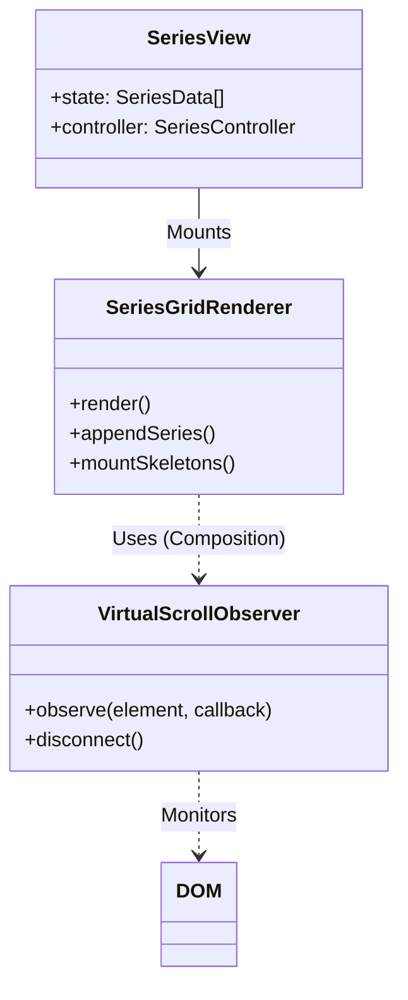
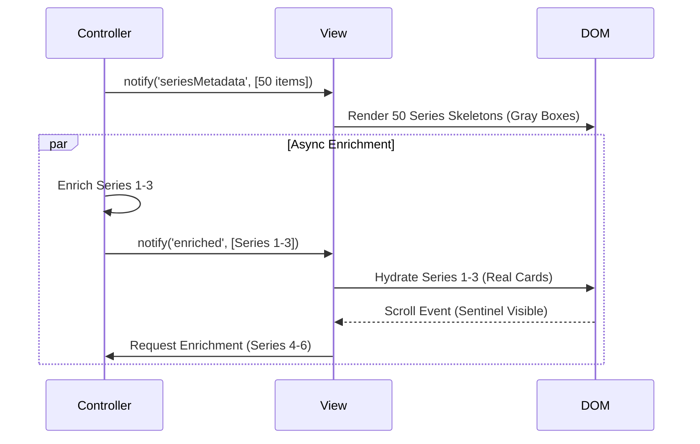

# Plan: Sprint 21 - Mobile UX & Layout Refresh

## 1. Architectural Strategy

### 1.1. Responsive Component Strategy (Factory Pattern)
We will utilize the **Factory Pattern** (`SeriesComponentFactory`) combined with a **Strategy Pattern** for rendering to support distinct mobile/desktop experiences without duplicating business logic.

- **`SeriesView` (Orchestrator)**: Remains the thin controller.
- **`SeriesGridRenderer` (Facade)**: Upgraded to support "Virtualization Strategy".
- **`LayoutStrategy`**: New utility to determine `isMobile`.

### 1.2. Two-Level Lazy Loading (Modular Strategy)
To avoid "God Class" complexity, we will separate **Render Logic** from **Scroll Logic**.

- **`VirtualScrollObserver.js` (New Utility)**: A generic class that wraps `IntersectionObserver`. It emits events when specific "sentinels" enter the viewport.
- **`SeriesGridRenderer.js` (Component)**: Consumes `VirtualScrollObserver`. It focuses purely on DOM updates (appending items, toggle skeletons).
- **`SeriesView.js` (Controller)**: Manages the data state (which series are loaded in memory).

### 1.3. Component Architecture


## 2. Component Updates

### 2.1. `SeriesGridRenderer.js` (Major Refactor)
- **Role**: Will now manage the virtualization state (which series are in DOM).
- **New Method**: `renderSkeletonGroups(count)` - Renders lightweight placeholders.
- **Logic**: 
  1. Receive 50 series.
  2. Render Skeletons for all 50 (super cheap DOM).
  3. Replace Skeletons 0-2 with Real Components.
  4. On Scroll -> Replace Skeletons 3-5 with Real Components.

### 2.2. `TracksTable.js` (Responsive Variant)
- **Role**: Present track data.
- **Mobile Mode**: Uses CSS Grid/Flex to stack columns vertically.
  - *Desktop*: Row [ # | Title | User | BEA | Pop | Time ]
  - *Mobile*: 
    ```
    [ # ]  [ Title        ] [ Time ]
           [ Artist       ]
           [ UserBadge ] [ BEA Badge ] [ Pop Bar ]
    ```

### 2.3. `UserRankModal.js` (Full-Screen Variant)
- **Role**: Drag and drop ranking.
- **Mobile Mode**: Adds `.fullscreen-modal` class which forces:
  - `position: fixed; inset: 0;` (Full viewport)
  - Larger touch targets (48px min height).
  - "Save/Cancel" buttons moved to a sticky bottom bar (thumb zone).

## 3. UI Mockups & Flows

### 3.1. Skeleton Loading Flow


### 3.2. Mobile Tracks Card Layout
An ASCII representation of the new CSS Grid layout for `TracksTable` row on mobile.

```text
+------------------------------------------------------+
|  01  |  Come Together                     |  04:19   |
|      |  The Beatles (Abbey Road)                     |
+------------------------------------------------------+
|  (My Rank #1)   (BEA #3)   (Pop 85%)                 |
+------------------------------------------------------+
```

## 4. Implementation Steps

### Phase 1: Core Layout & Logic (Home)
1. **HomeView CSS**: Add media query to reorder Flex/Grid items (Scan before Staging).

### Phase 2: Series View Performance
2. **Skeleton Components**: Create `SeriesSkeleton` and `AlbumSkeleton`.
3. **Lazy Logic**: Update `SeriesGridRenderer` with IntersectionObserver.
4. **Load More**: Implement `ShowMoreButton` component and logic in `AlbumsScopedRenderer`.

### Phase 3: Mobile Interactions
5. **Responsive Table**: Update `TracksTable.js` with `md:hidden` classes for column toggling.
6. **Mobile Modal**: Update `UserRankModal.js` styling for fullscreen mode.
