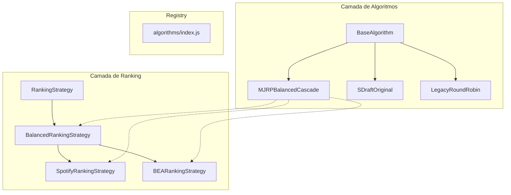
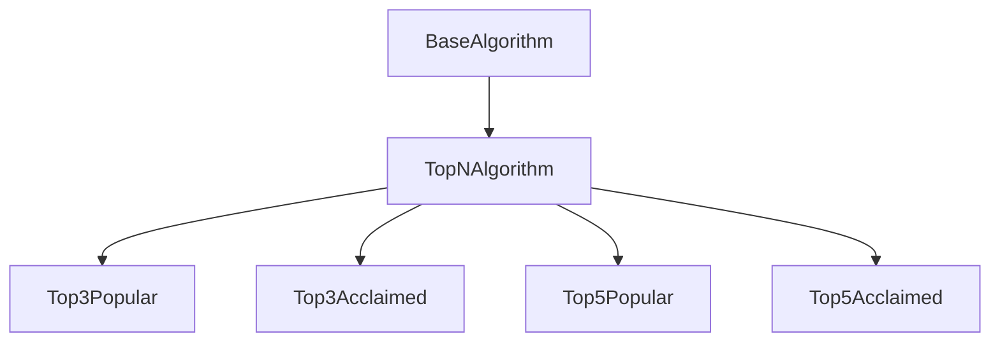

# Phase 1.1 Algorithm Analysis Report

**Date**: 2025-12-22  
**Analyst**: Gemini Agent  
**Status**: Analysis Complete

---

## 1. Documentação Encontrada

### ALGORITHM_MENU.md
- **Localização**: `docs/technical/specs/algorithm-strategy/ALGORITHM_MENU.md`
- **Conteúdo**: Especificações completas dos 3 algoritmos existentes
- **Última Atualização**: 2025-12-16 (Sprint 8)

---

## 2. Algoritmos Existentes

| ID | Nome | Status | LOC |
|----|------|--------|-----|
| `legacy-roundrobin` | Legacy Round-Robin | ✅ Implemented | ~130 |
| `s-draft-original` | S-Draft Hybrid Curator Original | ✅ Implemented | ~200 |
| `mjrp-balanced-cascade` | MJRP Balanced Cascade | ⭐ RECOMMENDED | 390 |

---

## 3. Análise do MJRPBalancedCascadeAlgorithm (Recomendado)

### 3.1 Parâmetros Atuais (Hardcoded)

| Parâmetro | Valor | Localização |
|-----------|-------|-------------|
| `GREATEST_HITS_MAX` | 60 min | Linha 18 |
| `DEEP_CUTS_MAX` | 48 min | Linha 19 |
| `MINIMUM_DURATION` | 30 min | Linha 20 |

### 3.2 Regras do Algoritmo (ALGORITHM_MENU.md)

| Regra | Descrição | Impacto da Mudança |
|-------|-----------|-------------------|
| GH Content | **SOMENTE rank #1 e #2** | ❌ Quebraria a lógica core |
| GH Max | 60 min | ✅ Já é parâmetro no constructor |
| DC Max | 48 min strict | ✅ Já é parâmetro no constructor |
| numDC | minTracksInAnyAlbum - 2 | ⚠️ Hardcoded na lógica |
| Serpentine | Odd→reverse, Even→forward | ❌ Core do algoritmo |

### 3.3 Potencial de Parametrização

**VIÁVEL PARAMETRIZAR:**
- ✅ `greatestHitsMax` (já aceita no constructor)
- ✅ `deepCutsMax` (já aceita no constructor)
- ✅ `minimumDuration` (já aceita no constructor)
- ✅ `rankingStrategy` (já aceita no constructor via opts)

**NÃO VIÁVEL PARAMETRIZAR (Quebraria regras):**
- ❌ Quantidade de tracks por álbum (hardcoded #1 e #2 para GH)
- ❌ Lógica Serpentine (core do algoritmo)
- ❌ Fórmula numDC = minTracks - 2

---

## 4. Ranking Strategies Existentes

### Infraestrutura JÁ EXISTE!

| Strategy | Localização | Sorting |
|----------|-------------|---------|
| `BalancedRankingStrategy` | ranking/BalancedRankingStrategy.js | Multi-factor |
| `SpotifyRankingStrategy` | ranking/SpotifyRankingStrategy.js | **spotifyPopularity DESC** |
| `BEARankingStrategy` | ranking/BEARankingStrategy.js | **rating DESC (BEA)** |

### Uso no MJRP Algorithm

```javascript
// Linha 51 do MJRPBalancedCascadeAlgorithm.js
const strategy = opts.rankingStrategy || new BalancedRankingStrategy()
```

**Conclusão**: O algoritmo JÁ suporta injeção de ranking strategy!

---

## 5. Conclusão e Recomendação

### O que NÃO precisa de refactor:
- ✅ Ranking strategies (Spotify e BEA já existem)
- ✅ Injeção de strategy no algoritmo (já funciona)
- ✅ Parâmetros de duração (já configuráveis)

### O que PRECISA ser criado (Option B):

Os novos algoritmos para o Blending Menu são FUNDAMENTALMENTE DIFERENTES do MJRP:

| Aspecto | MJRP Balanced Cascade | Novos Algoritmos |
|---------|----------------------|------------------|
| Tracks por álbum | Todos (#1 a #N) | **Apenas Top 3 ou Top 5** |
| Ranking source | Balanced (multi-factor) | **Spotify OU BEA** |
| Playlists | GH + Deep Cuts | **Única ou Múltiplas** |
| Complexidade | Alta (Serpentine, Cascade) | **Simples (top N por álbum)** |

### Recomendação Final

> **Option B é a escolha correta.**
>
> Não é viável parametrizar o MJRPBalancedCascadeAlgorithm para os novos casos de uso porque:
> 1. A lógica "Top 3/5 por álbum" é fundamentalmente diferente de "todos os tracks"
> 2. O MJRP foi projetado para usar TODOS os tracks dos álbuns
> 3. Os novos algoritmos devem ser simples (50-100 LOC cada)
>
> **Próximo passo**: Criar 4 novos algoritmos simples que:
> - Estendem BaseAlgorithm
> - Usam SpotifyRankingStrategy ou BEARankingStrategy existentes
> - Selecionam apenas Top 3 ou Top 5 tracks
> - Suportam duração e output configuráveis

---

## 6. Arquivos para Criação

```
public/js/algorithms/
├── Top3PopularAlgorithm.js     [NEW - ~80 LOC]
├── Top3AcclaimedAlgorithm.js   [NEW - ~80 LOC]
├── Top5PopularAlgorithm.js     [NEW - ~80 LOC]
└── Top5AcclaimedAlgorithm.js   [NEW - ~80 LOC]
```

---

## 7. Análise de Modularização

### Arquitetura Atual



### Oportunidade de Modularização

**PROPOSTA: Criar `TopNAlgorithm` como classe intermediária**

Em vez de criar 4 algoritmos separados com código duplicado, podemos criar:



### TopNAlgorithm - Classe Base Modular

```javascript
// public/js/algorithms/TopNAlgorithm.js (~100 LOC)
export class TopNAlgorithm extends BaseAlgorithm {
    constructor(opts = {}) {
        super(opts)
        this.trackCount = opts.trackCount || 3  // 3 or 5
        this.rankingStrategy = opts.rankingStrategy  // Injected
        this.targetDuration = opts.targetDuration || 45 * 60  // 30m/45m/60m
        this.outputMode = opts.outputMode || 'auto'  // 'single' | 'multiple' | 'auto'
    }

    generate(albums, opts = {}) {
        // 1. Rank tracks using injected strategy
        // 2. Select top N from each album
        // 3. Collect all tracks
        // 4. Divide into playlists based on duration/outputMode
        // 5. Return { playlists, rankingSummary, rankingSources }
    }
    
    // Shared helper methods...
}
```

### Subclasses Mínimas (~20 LOC cada)

```javascript
// Top3PopularAlgorithm.js
export class Top3PopularAlgorithm extends TopNAlgorithm {
    static metadata = {
        id: 'top-3-popular',
        name: 'Crowd Favorites',
        badge: 'TOP 3',
        description: 'Top 3 most-played tracks per album',
        isRecommended: false
    }

    constructor(opts = {}) {
        super({
            ...opts,
            trackCount: 3,
            rankingStrategy: new SpotifyRankingStrategy()
        })
    }
}
```

### Benefícios da Modularização

| Aspecto | Sem Modularização | Com Modularização |
|---------|------------------|-------------------|
| LOC Total | ~320 (4 × 80) | ~180 (100 + 4 × 20) |
| Manutenção | Alta duplicação | Centralizada em TopNAlgorithm |
| Novos algoritmos | Copiar e colar | Apenas metadata + constructor |
| Testes | 4 arquivos de teste | 1 arquivo core + 4 mínimos |

### Estrutura Final Proposta

```
public/js/algorithms/
├── BaseAlgorithm.js              # Abstract base (existente)
├── TopNAlgorithm.js              # [NEW] Base para Top 3/5
├── Top3PopularAlgorithm.js       # [NEW] ~20 LOC
├── Top3AcclaimedAlgorithm.js     # [NEW] ~20 LOC
├── Top5PopularAlgorithm.js       # [NEW] ~20 LOC
├── Top5AcclaimedAlgorithm.js     # [NEW] ~20 LOC
├── MJRPBalancedCascadeAlgorithm.js  # (existente)
├── SDraftOriginalAlgorithm.js       # (existente)
├── LegacyRoundRobinAlgorithm.js     # (existente)
└── index.js                          # Registry (atualizar)
```

---

## 8. Análise Completa de Modularização (Todos os Algoritmos)

### Inventário de Algoritmos Existentes

| Algoritmo | LOC | Métodos | Herda de |
|-----------|-----|---------|----------|
| `LegacyRoundRobinAlgorithm` | **519** | 6 métodos | BaseAlgorithm |
| `SDraftOriginalAlgorithm` | **277** | 4 métodos | BaseAlgorithm |
| `MJRPBalancedCascadeV0Algorithm` | **317** | 3 métodos | BaseAlgorithm |
| `MJRPBalancedCascadeAlgorithm` | **390** | 4 métodos | BaseAlgorithm |
| **Total** | **1503** | | |

---

### Lógica Compartilhada Identificada (DUPLICADA)

#### 1. `enrichTracks()` - 185 LOC
**Localização**: `LegacyRoundRobinAlgorithm.js` (linhas 211-396)

**Uso atual**:
- `Legacy` → definição original (185 LOC)
- `SDraft` → usa via `this._legacyHelper.enrichTracks(album)` (linha 60)
- `MJRPv0` → usa via `this._legacyHelper.enrichTracks(album)`
- `MJRP` → **NÃO USA** (usa RankingStrategy injetada)

**Problema**: SDraft e MJRPv0 instanciam `LegacyRoundRobinAlgorithm` INTEIRO apenas para usar 1 método.

**Recomendação**: ✅ Extrair para módulo utilitário `trackEnrichment.js`

---

#### 2. `runSwapBalancing()` - ~55 LOC
**Localização**: Duplicado em 2 arquivos

| Arquivo | Linhas |
|---------|--------|
| `LegacyRoundRobinAlgorithm.js` | 460-515 (55 LOC) |
| `SDraftOriginalAlgorithm.js` | 207-261 (54 LOC) |

**Problema**: Código praticamente IDÊNTICO em 2 lugares.

**Recomendação**: ✅ Mover para `BaseAlgorithm.js` ou criar `utils/playlistBalancing.js`

---

#### 3. `isSwapValid()` - ~15 LOC
**Localização**: Duplicado em 2 arquivos

| Arquivo | Linhas |
|---------|--------|
| `LegacyRoundRobinAlgorithm.js` | 436-458 (22 LOC) |
| `SDraftOriginalAlgorithm.js` | 263-273 (10 LOC) |

**Problema**: Lógica similar com pequenas variações.

**Recomendação**: ✅ Mover para `BaseAlgorithm.js` como método protegido

---

#### 4. `distributeSerpentine()` - ~30 LOC
**Localização**: `SDraftOriginalAlgorithm.js` (linhas 169-205)

**Uso atual**:
- `SDraft` → usa diretamente
- `MJRP` e `MJRPv0` → implementam lógica similar inline

**Problema**: MJRP tem serpentine inline em vez de reutilizar.

**Recomendação**: ⚠️ Considerar extrair para `BaseAlgorithm` se mais algoritmos precisarem

---

#### 5. `trimOverDurationPlaylists()` - ~35 LOC
**Localização**: Duplicado em 2 arquivos

| Arquivo | Linhas |
|---------|--------|
| `MJRPBalancedCascadeAlgorithm.js` | 350-385 (35 LOC) |
| `MJRPBalancedCascadeV0Algorithm.js` | 278-313 (35 LOC) |

**Problema**: Código IDÊNTICO.

**Recomendação**: ✅ Extrair para `BaseAlgorithm.js`

---

### Mapa de Duplicação

```
┌─────────────────────────────────────────────────────────────────────────┐
│                         DUPLICAÇÃO IDENTIFICADA                          │
├─────────────────────────────────────────────────────────────────────────┤
│                                                                          │
│  enrichTracks (185 LOC)          runSwapBalancing (~55 LOC)             │
│  ┌────────────────┐              ┌────────────────┐                     │
│  │   Legacy ✓     │──────────────│   Legacy ✓     │                     │
│  │   SDraft →refs │              │   SDraft ✓     │ ← DUPLICADO         │
│  │   MJRPv0 →refs │              │   MJRPv0 ✗     │                     │
│  │   MJRP ✗       │              │   MJRP ✗       │                     │
│  └────────────────┘              └────────────────┘                     │
│                                                                          │
│  trimOverDuration (~35 LOC)      isSwapValid (~15 LOC)                  │
│  ┌────────────────┐              ┌────────────────┐                     │
│  │   Legacy ✗     │              │   Legacy ✓     │                     │
│  │   SDraft ✗     │              │   SDraft ✓     │ ← DUPLICADO         │
│  │   MJRPv0 ✓     │ ← DUPLICADO  │   MJRPv0 ✗     │                     │
│  │   MJRP ✓       │ ← DUPLICADO  │   MJRP ✗       │                     │
│  └────────────────┘              └────────────────┘                     │
│                                                                          │
│  TOTAL DUPLICADO: ~160 LOC (10.6% do código total)                      │
└─────────────────────────────────────────────────────────────────────────┘
```

---

### Proposta de Refatoração

#### Fase 1: Modularização Imediata (Alta Prioridade)

| Ação | De | Para | Economia |
|------|-----|------|----------|
| Extrair `enrichTracks` | Legacy | `utils/trackEnrichment.js` | Elimina instância desnecessária |
| Mover `runSwapBalancing` | Legacy/SDraft | `BaseAlgorithm.js` | ~55 LOC |
| Mover `isSwapValid` | Legacy/SDraft | `BaseAlgorithm.js` | ~15 LOC |
| Mover `trimOverDurationPlaylists` | MJRP/MJRPv0 | `BaseAlgorithm.js` | ~35 LOC |

**Economia Total**: ~105 LOC removidos + código mais maintainable

#### Fase 2: Arquitetura Proposta

```
public/js/
├── algorithms/
│   ├── BaseAlgorithm.js           # +runSwapBalancing, +isSwapValid, +trimOverDurationPlaylists
│   ├── LegacyRoundRobinAlgorithm.js   # Reduzido ~100 LOC
│   ├── SDraftOriginalAlgorithm.js     # Reduzido ~55 LOC, remove _legacyHelper
│   ├── MJRPBalancedCascadeAlgorithm.js    # Reduzido ~35 LOC
│   ├── MJRPBalancedCascadeV0Algorithm.js  # Reduzido ~35 LOC
│   └── index.js
├── utils/
│   └── trackEnrichment.js         # [NEW] enrichTracks extraído (~185 LOC)
└── ranking/
    └── (existentes)
```

---

### Precisa Refatorar Agora?

| Questão | Resposta |
|---------|----------|
| Algoritmos existentes funcionam? | ✅ Sim |
| Código duplicado causa bugs? | ❌ Não atualmente |
| Novo desenvolvimento bloqueado? | ❌ Não |
| Vale refatorar para novos algoritmos? | ⚠️ **Decisão do usuário** |

> [!IMPORTANT]
> **Pergunta para o usuário:**
> 
> Antes de criar os 4 novos algoritmos, você quer que eu:
> 1. **Opção A**: Refatore primeiro os existentes (modularização) e depois crie os novos?
> 2. **Opção B**: Crie os novos algoritmos usando a arquitetura atual e deixe refatoração como task futura?
> 1. Criar `TopNAlgorithm.js` (~100 LOC) com lógica compartilhada
> 2. Criar 4 subclasses mínimas (~20 LOC cada)
> 3. Registrar no `algorithms/index.js`
> 4. Total: ~180 LOC vs ~320 LOC (economia de 44%)
