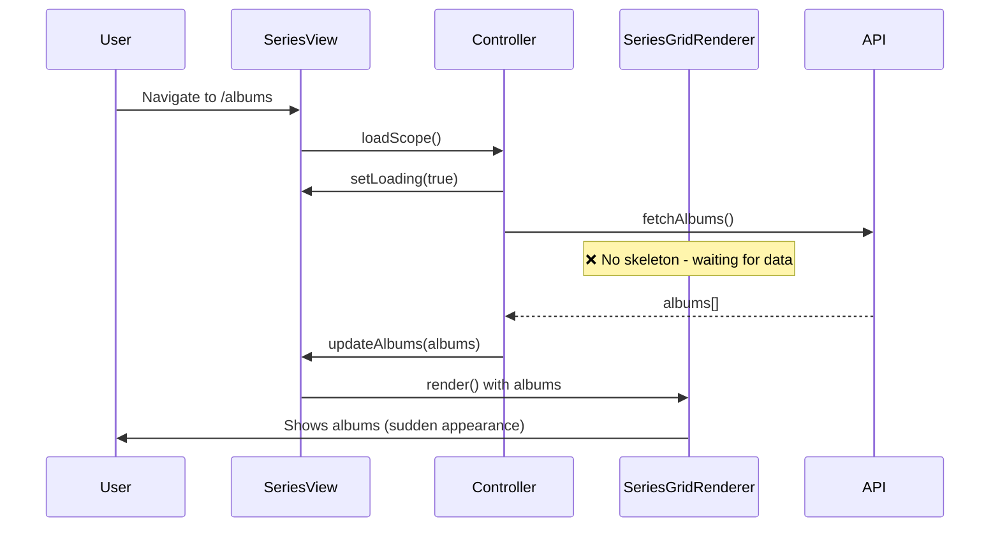
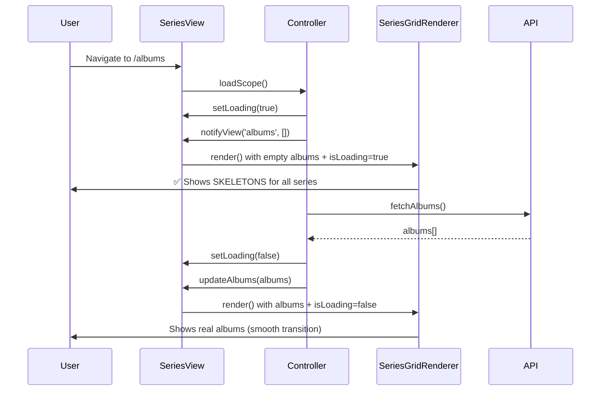

# Issue #152 - Implementation Plan

## Plan Document (SDD Phase 2)

**Issue**: #152  
**Sprint**: 21.5 Bug Fixing  
**Status**: DRAFT - Awaiting Review  
**Date**: 2026-01-15

---

## Documentation Consulted

| Document | Key Information Used |
|----------|---------------------|
| `CONSTITUTION.md` | User-Centric Quality, UI must feel "alive", micro-animations |
| `01_System_Architecture.md` | MVC pattern, Observer pattern, View delegates to Controller |
| `09_Frontend_Views.md` | SeriesView as "Thin Orchestrator", SeriesGridRenderer handles rendering |

---

## 1. Architecture Overview

### Current Flow (Broken)


### Desired Flow (Fixed)


---

## 2. Key Insight: Clean Re-Application Strategy

> **Note**: Previous fixes for cache invalidation (#155, #156, #158) and data issues (#154) were working. They were reverted to ensure a **clean codebase** without residual code from debugging attempts. These will be re-applied cleanly.

The skeleton fix requires distinguishing between:

| State | `albums.length` | `isLoading` | Expected UI |
|-------|----------------|-------------|-------------|
| Loading (initial) | 0 | true | Show Skeleton |
| Loading (incremental) | > 0 | true | Show real albums already loaded |
| Filtered (no matches) | 0 | false | **HIDE series completely** |
| Loaded (has data) | > 0 | false | Show real albums |

**Critical Logic**:
```javascript
if (group.albums.length === 0) {
    if (isLoading) {
        return renderSkeleton(); // Loading - show placeholder
    } else {
        return null; // Filtered out - hide series
    }
}
```

---

## 3. Component Changes

### 3.1 `SeriesGridRenderer.js`

**Current Bug (line 112)**:
```javascript
if (group.albums.length === 0) return; // Always hides - broken for loading state
```

**Fix**:
```javascript
_renderVirtualScopedGrid(albums, seriesList, context) {
    const { isLoading = false } = this.props;
    const { seriesGroups, otherAlbums } = groupAlbumsBySeries(albums, seriesList);
    
    seriesGroups.forEach(group => {
        // NEW: Distinguish loading vs filtered
        if (group.albums.length === 0) {
            if (isLoading) {
                // Series exists but albums haven't loaded yet → Skeleton
                html += SeriesSkeleton.render(group.series.id);
            }
            // else: No albums after filtering → Skip entirely
            return;
        }
        // ... rest of render logic
    });
}
```

### 3.2 `SeriesViewUpdater.js`

Pass `isLoading` to grid:
```javascript
updateGrid(albums, viewMode, currentScope, filters, searchQuery, sortedSeriesList, isLoading) {
    this.components.grid.update({
        items: albums,
        // ... other props
        isLoading: isLoading
    });
}
```

### 3.3 `SeriesView.js`

Pass `isLoading` when calling updater:
```javascript
updateAlbums(albums) {
    this.updater.updateGrid(
        albums,
        viewMode,
        scope,
        filters,
        searchQuery,
        seriesList,
        this.isLoading  // ← NEW
    );
}
```

### 3.4 `SeriesController.js`

Trigger empty render BEFORE fetching to show skeletons:
```javascript
async loadScope(seriesId, skipCache) {
    this.state.isLoading = true;
    this.notifyView('loading', true);
    
    // NEW: Trigger skeleton render BEFORE fetch
    this.notifyView('albums', []);
    
    const albums = await this.loadAlbumsFromQueries(...);
    // ...
}
```

---

## 4. Cleanup: Remove Progress Bar

**Files to Remove/Modify**:

| File | Action |
|------|--------|
| `components/series/SeriesProgressBar.js` | DELETE entire file |
| `views/helpers/SeriesViewUpdater.js` | Remove `inlineProgress` references |
| `views/SeriesView.js` | Remove progress bar mounting/updates |
| `controllers/SeriesController.js` | Remove `notifyView('progress', ...)` calls |

---

## 5. CSS Changes

Ensure `.animate-pulse` exists in `animations.css`:
```css
.animate-pulse {
    animation: pulse 2s cubic-bezier(0.4, 0, 0.6, 1) infinite;
}
```

---

## 6. Files to Modify Summary

| File | Change Type | Description |
|------|-------------|-------------|
| `SeriesGridRenderer.js` | MODIFY | Add `isLoading` distinction logic |
| `SeriesViewUpdater.js` | MODIFY | Pass `isLoading` to grid, remove progress bar |
| `SeriesView.js` | MODIFY | Pass `isLoading` to updater, remove progress bar |
| `SeriesController.js` | MODIFY | Trigger early empty render, remove progress calls |
| `SeriesProgressBar.js` | DELETE | Cleanup |
| `animations.css` | MODIFY | Ensure `.animate-pulse` class exists |

---

## 7. Verification Plan

### Manual Tests
1. Navigate to `/albums` → Skeletons appear → Albums load smoothly
2. Filter by "1980s" → Only matching series visible, empty ones hidden
3. Network throttle (Slow 3G) → Skeletons persist longer

### Regression
1. Existing filter functionality works
2. Series CRUD operations unaffected

---

## 8. Open Question Resolution

**Q**: Should skeletons show series NAME during loading?  
**A**: No. Use generic skeleton header (gray placeholder). Series names require metadata which may not be loaded yet.

---

## 9. Approval

- [ ] User Review
- [ ] Approved to proceed to TASK phase

---

**Next Step**: User review and approval before creating task list
