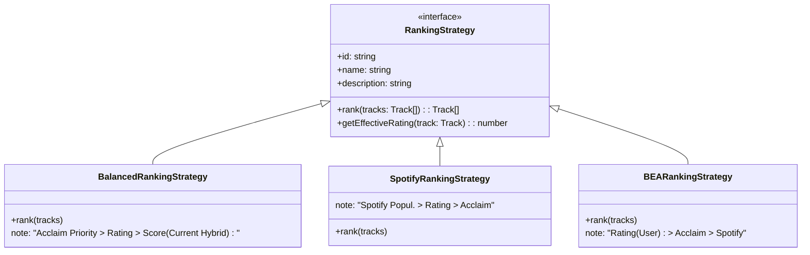

# Plan: Ranking Strategy Selection

**Status**: DRAFT
**Sprint**: 11.5
**Depends On**: `AlgorithmStrategy` (Sprint 8)

---

## 1. Architecture: The Ranking Strategy Pattern

We will implement a Strategy Pattern to encapsulate "How tracks are ranked". This decouples the **Sorting Criteria** (Input) from the **Distribution Logic** (Output Algorithm like Cascade).

### Class Hierarchy
**Location**: `public/js/ranking/`



### Data Flow
1.  **UI**: User selects Ranking Strategy (e.g., "Spotify Priority").
2.  **Controller**: `AlbumsStateController` or `PlaylistsView` captures preference.
3.  **Generation**: 
    - `BaseAlgorithm.generate(albums, { rankingStrategy: 'spotify' })` called.
    - Inside Algorithm:
      - `StrategyFactory.get('spotify').rank(album.tracks)` is called *before* any distribution logic.
      - Tracks are returned with `_rank` property (1 to N) based on that strategy.
    - Algorithm distributes tracks based on `_rank`.

---

## 2. Key Strategies Logic

| Strategy | Primary Key | Secondary Key | Fallback | Description |
| :--- | :--- | :--- | :--- | :--- |
| **Balanced** (Default) | `acclaimRank` (Explicit) | `rating` (Hybrid) | `score` | Best for "Canon" lists. Uses BEA data heavily. |
| **Spotify** | `spotifyPopularity` | `rating` | `acclaimRank` | Best for "Modern" listeners. Popular tracks get S-Tier. |
| **BEA Rating** | `rating` (User/Avg) | `acclaimRank` | `spotifyPopularity` | Best for "Quality" lists. Highest rated tracks first. |

---

## 3. UI/UX Design

**File**: `public/js/views/PlaylistsView.js`

We will add a new dropdown selector next to the Algorithm Selector.

### Mockup
```
┌─────────────────────────────────────────────────────────────┐
│  Generate Playlists                                         │
│                                                             │
│  [ Step 1: Settings ]                                       │
│                                                             │
│  Ranking Source (Input)            Algorithm (Output)       │
│  ┌────────────────────────┐       ┌───────────────────────┐ │
│  │ 🌿 Balanced (Default)  │       │ 🐍 MJRP Cascade       │ │
│  └────────────────────────┘       └───────────────────────┘ │
│   * Acclaim > Rating > Pop         * Balanced Deep Cuts     │
│                                                             │
│  [ Generate Playlists ]                                     │
└─────────────────────────────────────────────────────────────┘
```

### Strategy Selector Options
*   `🌿 Balanced` (Default)
*   `🎧 Spotify Popularity`
*   `⭐ BEA Rating`

---

### 3. Algorithm Adaptation (Integration Point) (Updated)

**Target Algorithm**: `MJRPBalancedCascadeAlgorithm.js`

We will **remove** the dependency on `LegacyRoundRobinAlgorithm`.

**Current Code**:
```javascript
this._legacyHelper = new LegacyRoundRobinAlgorithm(opts)
// ...
tracks: this._legacyHelper.enrichTracks(album)
```

**New Code**:
```javascript
generate(albums, opts = {}) {
    // 1. Get Strategy (Default to Balanced if not provided)
    const strategy = opts.rankingStrategy || new BalancedRankingStrategy();
    
    // 2. Rank Tracks (Input Adaptation)
    // The Strategy returns tracks with a standardized `_rank` property (1..N)
    const workingAlbums = albums.map(album => {
        const rankedTracks = strategy.rank(album);
        return { ...album, tracks: rankedTracks };
    });
    
    // 3. Distribution (Existing Logic)
    // The algorithm now uses `track._rank` which was populated by the Strategy.
    // ...
}
```

---

## 4. Implementation Steps

1.  **Scaffold**: Create `public/js/ranking/` and base `RankingStrategy.js`.
2.  **Strategies Implementation**:
    *   **Balanced**: COPY logic from Legacy (do not touch Legacy file) to ensure `LegacyRoundRobin` remains frozen/safe.
    *   **Spotify & BEA**: Implement new logic.
3.  **Refactor Algorithm**: 
    *   Update `MJRPBalancedCascadeAlgorithm` to accept `opts.rankingStrategy`.
    *   Remove `this._legacyHelper`.
    *   Use `strategy.rank(album)` to prepare tracks.
4.  **UI**: Update `PlaylistsView.js` to pass the selected strategy instance (or ID) to the generator.

---

## 5. Risk Assessment

*   **Risk**: Logic Drift between Legacy and Balanced Strategy.
    *   *Mitigation*: We accept this. Legacy is "frozen". Balanced Strategy becomes the new standard for modern algorithms.
*   **Risk**: Missing Data for specific strategies.
    *   *Mitigation*: Strategies must always return *some* list. Fallbacks are internal to the Strategy (e.g., SpotifyStrategy falls back to Rating if no popularity).


## User Review Required
**Does this plan align with your vision?** 
*   Separation of "Ranking Source" vs. "Algorithm".
*   The UI placement.
*   The 3 proposed strategies.
