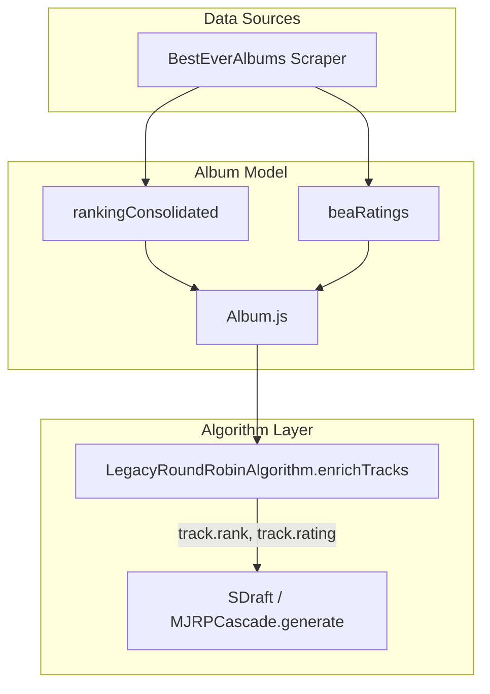

# Sprint 11: Spotify Integration & Multi-Source Ranking

## Specification Document

**Version**: 1.0  
**Date**: 2025-12-18  
**Branch**: `feature/sprint11-spotify-integration`  
**Status**: 📋 PLANNING

---

## 1. Executive Summary

Sprint 11 introduces Spotify integration as both a **ranking fallback** and **export destination**, creating a more robust and complete playlist generation experience.

### Goals
1. **Multi-Source Ranking**: Spotify popularity as fallback when BestEver fails
2. **Spotify Album Links**: Direct links to Spotify albums in UI
3. **Export to Spotify**: Create playlists directly in user's Spotify account

---

## 2. Problem Statement

### Current Pain Points

| Issue | Impact |
|-------|--------|
| BestEver scraping unreliable | 30%+ albums show "PENDING" badge |
| No ranking fallback | Users see unranked tracks |
| Only Apple Music export | Spotify users excluded |
| No external album links | Users can't quickly open albums in streaming apps |

### User Request
> "Estou pensando em parar de insistir por enquanto no fix do BestEver e utilizar o ranking de popularidade de faixas por album do Spotify... precisamos ter um indicativo visual na UI pra saber de onde veio o ranking."

---

## 3. Functional Requirements

### FR-1: Spotify OAuth Integration

| Requirement | Description |
|-------------|-------------|
| FR-1.1 | Register app in Spotify Developer Dashboard |
| FR-1.2 | Implement PKCE OAuth flow (frontend) |
| FR-1.3 | Store access/refresh tokens securely (localStorage) |
| FR-1.4 | Handle token refresh automatically |

### FR-2: Spotify Popularity Ranking

| Requirement | Description |
|-------------|-------------|
| FR-2.1 | Fetch album tracks from Spotify API |
| FR-2.2 | Extract `popularity` field (0-100) from each track |
| FR-2.3 | Generate ranking: most popular = rank 1 |
| FR-2.4 | Store as `spotifyPopularityRank` on track object |

### FR-3: Multi-Source Ranking Logic

| Requirement | Description |
|-------------|-------------|
| FR-3.1 | Priority: BestEver → Spotify → Original order |
| FR-3.2 | If BestEver has <50% track coverage → fallback to Spotify |
| FR-3.3 | Add `rankingSource` field: `"acclaim"`, `"popularity"`, `"original"` |
| FR-3.4 | Algorithms use final `rank` field (source-agnostic) |
| FR-3.5 | **Consolidated Averages**: Calculate & Display average Rating/Popularity per column |
| FR-3.6 | **Total Score**: Display a weighted or simple average of both sources |

### FR-4: Visual Headers & Badges

| Requirement | Description |
|-------------|-------------|
| FR-4.1 | "Track Name" header sorts by Original Album Order |
| FR-4.2 | "Acclaim BEA Rank" header sorts by Acclaim (Orange) |
| FR-4.3 | "Spotify Pop. Rank" header sorts by Popularity (Green) |
| FR-4.4 | Display BEA Link + Spotify Link in Album Header |

### FR-5: Spotify Album Links

| Requirement | Description |
|-------------|-------------|
| FR-5.1 | Add `spotifyUrl` to album data model |
| FR-5.2 | Display Spotify icon in album cards |
| FR-5.3 | Click opens Spotify album in new tab |

### FR-6: Export to Spotify

| Requirement | Description |
|-------------|-------------|
| FR-6.1 | "Connect to Spotify" button in PlaylistsView |
| FR-6.2 | Search matching tracks via Spotify API |
| FR-6.3 | Create new playlist in user's Spotify account |
| FR-6.4 | Add matched tracks to playlist |
| FR-6.5 | Show success with direct Spotify link |
| FR-6.6 | Handle unmatched tracks (show warnings) |

---

## 4. Non-Functional Requirements (UI Scope)

| NFR | Description |
|-----|-------------|
| NFR-1 | **Reuse**: ranking component used in Expanded, Inventory Modal, & Compact Modal |
| NFR-2 | **Consistency**: Same visual table structure across all views |
| NFR-3 | **Responsiveness**: Table on Desktop, Tabs on Mobile |

---

## 4. Non-Functional Requirements

| NFR | Description |
|-----|-------------|
| NFR-1 | Spotify API rate limits: Max 30 requests/second |
| NFR-2 | OAuth tokens stored in localStorage (not cookies) |
| NFR-3 | Graceful degradation if Spotify not connected |
| NFR-4 | Loading states for all Spotify operations |
| NFR-5 | Error handling for Spotify API failures |

---

## 5. Data Model Changes

> **Note**: These changes will be reflected in `docs/technical/album_data_schema.md`

### Album Object (Extended)

```javascript
{
  // Existing fields...
  
  // NEW: Spotify Integration
  spotifyId: "123abc",           // Spotify album ID
  spotifyUrl: "https://open.spotify.com/album/...",
  rankingSource: "acclaim" | "popularity" | "original",
  
  tracks: [
    {
      // Existing fields...
      
      // NEW: Multi-source ranking
      bestEverRank: 3,           // From BestEver (null if unavailable)
      spotifyPopularityRank: 5,  // From Spotify (null if unavailable)
      rank: 3,                   // Final rank used by algorithms
    }
  ]
}
```

### 5.1 Data Flow Architecture

> **Note**: This documents how Spotify data flows into the playlist generation algorithms.

#### Current Flow (BestEver Only)



**Key Files**:
| File | Role |
|------|------|
| `Album.js` | Stores `rankingConsolidated`, `beaRatings` |
| `LegacyRoundRobinAlgorithm.enrichTracks()` | Reads BEA data → sets `.rank` |
| `SDraftOriginalAlgorithm.generate()` | Uses `.rank` for playlist distribution |

#### Proposed Flow (With Spotify Integration)

```mermaid
flowchart TD
    subgraph "Data Sources"
        BEA[BestEverAlbums]
        SPF[Spotify API]
    end
    
    subgraph "Services"
        SS[SpotifyService.js]
        TRC[TracksRankingComparison.js]
    end
    
    subgraph "Album Model"
        AM[Album.js]
        SID[spotifyId]
        SPOP[spotifyPopularity]
        TPOP[tracks[].spotifyPopularity]
    end
    
    subgraph "Algorithm Layer"
        LR[enrichTracks - MODIFIED]
        ALG[Algorithms]
    end
    
    SPF --> SS
    SS -->|"On 'Enrich Data' click"| TRC
    TRC -->|"Updates album"| AM
    SID & SPOP & TPOP --> AM
    AM --> LR
    LR -->|"IF rankingSource=='popularity': use spotifyPopularity as rank"| ALG
```

**Integration Points**:
| File | Line | Change Required |
|------|------|-----------------|
| `TracksRankingComparison.js` | 205 | Connect "Enrich" button to `SpotifyService` |
| `LegacyRoundRobinAlgorithm.js` | `enrichTracks()` | Add conditional: if `rankingSource === 'popularity'`, use `spotifyPopularity` as `rank` |
| `AlbumsStore.js` | - | Add method to update album with Spotify data |

---

## 6. API Endpoints

### Spotify Web API (External)

| Endpoint | Purpose |
|----------|---------|
| `GET /v1/search` | Search for albums/tracks |
| `GET /v1/albums/{id}/tracks` | Get album tracks with popularity |
| `POST /v1/users/{id}/playlists` | Create new playlist |
| `POST /v1/playlists/{id}/tracks` | Add tracks to playlist |
| `GET /v1/me` | Get current user profile |

### Internal (Optional)

| Endpoint | Purpose |
|----------|---------|
| `POST /api/spotify/popularity` | Fetch and cache Spotify ranking (server-side) |

---

## 7. UI/UX Mockups

### Album Card with Spotify Badge

```
┌─────────────────────────────────┐
│ [Album Cover Image]             │
├─────────────────────────────────┤
│ Album Title                     │
│ Artist Name                     │
│ ──────────────────────────────  │
│ 🟢 POPULARITY    🔗 Spotify     │
└─────────────────────────────────┘
```

### Spotify Export Flow

```
1. [Connect to Spotify] button
      ↓
2. OAuth popup (Spotify login)
      ↓
3. [Export to Spotify] button enabled
      ↓
4. Progress modal: "Matching tracks... 15/45"
      ↓
5. Success: "Playlist created! [Open in Spotify]"
   Warning: "3 tracks not found"
```

---

## 8. Success Criteria

| Metric | Target |
|--------|--------|
| PENDING badges reduced | 0% (Eliminate Pending state) |
| Spotify export success rate | >90% tracks matched |
| OAuth flow completion | <30 seconds |
| User satisfaction | Qualitative feedback positive |

---

## 9. Out of Scope

- Spotify playback within app
- Spotify search for albums (use existing Apple Music search)
- Syncing existing Spotify playlists back to app
- Real-time popularity updates

---

## 10. Dependencies

| Dependency | Status |
|------------|--------|
| Spotify Developer Account | ✅ Already exists (see SPOTIFY_SETUP.md) |
| `spotifyPopularity.js` service | ✅ Already exists (136 lines) |
| Spotify Web API credentials | ✅ In `.env` / Cloud Secret Manager |

---

## 11. Risks & Mitigations

| Risk | Mitigation |
|------|------------|
| Spotify API changes | Use stable endpoints, version lock |
| Rate limiting | Batch requests, add delays |
| Token expiration mid-export | Auto-refresh before operations |
| User denies OAuth scopes | Clear error message, retry option |

---

## Cross-References

- [ROADMAP.md](../../../ROADMAP.md) - Sprint 11 planning
- [SPOTIFY_SETUP.md](../../../SPOTIFY_SETUP.md) - Existing Spotify docs
- [spotifyPopularity.js](../../../../server/lib/services/spotifyPopularity.js) - Existing service
