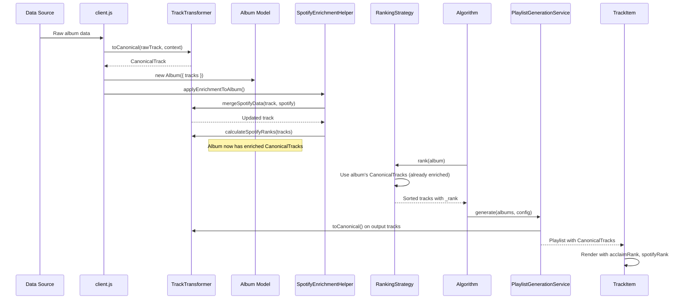

# Data Schema Canonical Refactor - Implementation Plan

**Created**: 2025-12-24
**Status**: 📋 DRAFT - Awaiting User Review  
**Sprint**: 12.5 (Sub-task of Playlist Hybrid Refactor)
**SDD Phase**: 2 - Planning
**Depends on**: spec.md (APPROVED)

---

## 1. ARCHITECTURE OVERVIEW

### Before: Fragmented Schema
```
┌─────────────────────────────────────────────────────────────────┐
│                    CURRENT STATE (Fragmented)                   │
├─────────────────────────────────────────────────────────────────┤
│                                                                 │
│  ┌─────────────┐    ┌─────────────┐    ┌─────────────────────┐ │
│  │ API Response│───→│ client.js   │───→│ Album/Track Model   │ │
│  │ (raw data)  │    │ normalize() │    │ (incomplete)        │ │
│  └─────────────┘    └──────┬──────┘    └──────────┬──────────┘ │
│                            │                       │            │
│                            ▼                       ▼            │
│  ┌─────────────────────────────────────────────────────────────┐│
│  │             ENRICHMENT (2 DIFFERENT PLACES)                 ││
│  │  ┌─────────────────────┐    ┌─────────────────────────────┐ ││
│  │  │SpotifyEnrichmentHelper│   │TrackEnrichmentMixin       │ ││
│  │  │ • spotifyPopularity  │   │ • acclaimRank              │ ││
│  │  │ • spotifyRank       │   │ • spotifyRank (duplicate!) │ ││
│  │  └─────────────────────┘    └─────────────────────────────┘ ││
│  └─────────────────────────────────────────────────────────────┘│
│                            │                                    │
│                            ▼                                    │
│  ┌─────────────────────────────────────────────────────────────┐│
│  │           CONSUMERS (expect different fields)                ││
│  │  PlaylistsView → rank, rating                               ││
│  │  RankingStrategy → acclaimRank, spotifyPopularity           ││
│  │  TrackItem → spotifyRank, rank                              ││
│  └─────────────────────────────────────────────────────────────┘│
└─────────────────────────────────────────────────────────────────┘
```

### After: Unified Schema
```
┌─────────────────────────────────────────────────────────────────┐
│                    TARGET STATE (Unified)                        │
├─────────────────────────────────────────────────────────────────┤
│                                                                 │
│  ┌─────────────┐    ┌─────────────────────────────────────────┐ │
│  │ ANY Source  │───→│        TrackTransformer.js              │ │
│  │ (API, Cache,│    │  • toCanonical(rawTrack, albumContext)  │ │
│  │  Firestore) │    │  • ALWAYS returns CanonicalTrack        │ │
│  └─────────────┘    └──────────────────┬──────────────────────┘ │
│                                        │                        │
│                                        ▼                        │
│  ┌─────────────────────────────────────────────────────────────┐│
│  │               CanonicalTrack (Single Schema)                ││
│  │  ┌───────────────┬───────────────┬───────────────────────┐  ││
│  │  │ IDENTITY      │ ACCLAIM       │ SPOTIFY               │  ││
│  │  │ id, title     │ acclaimRank   │ spotifyRank          │  ││
│  │  │ artist, album │ acclaimScore  │ spotifyPopularity    │  ││
│  │  │ duration      │ rating        │ spotifyId, spotifyUri│  ││
│  │  └───────────────┴───────────────┴───────────────────────┘  ││
│  └─────────────────────────────────────────────────────────────┘│
│                            │                                    │
│                            ▼                                    │
│  ┌─────────────────────────────────────────────────────────────┐│
│  │           ALL CONSUMERS (uniform expectations)               ││
│  │  PlaylistsView, RankingStrategy, TrackItem, Algorithms      ││
│  │  → ALL use same CanonicalTrack fields                       ││
│  └─────────────────────────────────────────────────────────────┘│
└─────────────────────────────────────────────────────────────────┘
```

---

## 2. APPLE MUSIC KIT INTEGRATION ANALYSIS

### Current Integration Points

| File | Usage | Critical Fields |
|------|-------|-----------------|
| `client.js:47-143` | Primary album fetch | artworkTemplate → coverUrl |
| `client.js:85-96` | mapTrack() | id, isrc, previewUrl, trackNumber |
| `HomeView.js:446-470` | Discography search | artworkTemplate → coverUrl |
| `PlaylistsExport.js:88` | findTrackFromAlbum | title, artist, album |

### Data Flow from Apple Music Kit

```
MusicKitService.getAlbumDetails(appleId)
    │
    ├── fullAlbum.title, fullAlbum.artist, fullAlbum.year
    ├── fullAlbum.artworkTemplate  → musicKitService.getArtworkUrl(template, 600) → coverUrl
    └── fullAlbum.tracks[]
            ├── t.id (Apple Music track ID)
            ├── t.title
            ├── t.trackNumber
            ├── t.duration
            ├── t.isrc (International Standard Recording Code)
            └── t.previewUrl (30s audio preview)
```

### Fields TrackTransformer MUST Preserve

| Field | Source | Purpose |
|-------|--------|---------|
| `appleMusicId` | t.id from Apple | Cross-platform matching |
| `isrc` | t.isrc from Apple | Universal track identifier |
| `previewUrl` | t.previewUrl from Apple | Audio preview |
| `trackNumber` | t.trackNumber | Original disc order |

### Fields Album Model MUST Preserve

| Field | Source | Purpose |
|-------|--------|---------|
| `coverUrl` | musicKitService.getArtworkUrl() | Album artwork display |
| `artworkTemplate` | fullAlbum.artworkTemplate | Resize artwork dynamically |
| `appleMusicId` | fullAlbum.id in metadata.sourceId | Export to Apple Music |

---

## 2.5 EXPORT FLOW ANALYSIS

### Export to Apple Music (`PlaylistsExport.js:39-145`)

**Fields Used Per Track** (lines 85-93):
| Field | Usage |
|-------|-------|
| `track.title` | Search query |
| `track.artist` | Search query |
| `track.album` | Album filter + live detection |

**No Changes Needed**: All fields are in CanonicalTrack schema.

### Export to Spotify (`PlaylistsExport.js:152-253`)

**Fields Used Per Track** (lines 195-200):
| Field | Usage |
|-------|-------|
| `track.title` ǀ `track.name` | Search query |
| `track.artist` | Search query |
| `track.album` | Search filter |

**No Changes Needed**: All fields are in CanonicalTrack schema. Code already handles fallback `track.title || track.name`.

### Export Safety Summary

✅ **Both exports use only basic identity fields**:
- `title` (with `name` fallback in Spotify)
- `artist`
- `album`

These are the CORE fields and will always be present in CanonicalTrack.

---

## 2.6 INITIAL ALBUM LOADING FLOW (HomeView)

### Flow Sequence

```
HomeView.handleAddAlbum()
    │
    ├── User enters "Artist - Album"
    │
    ▼
apiClient.fetchAlbum({ artist, album })
    │
    ├── MusicKitService.searchAlbums() → Find Apple Music match
    ├── MusicKitService.getAlbumDetails() → Get full album with tracks
    │
    ├── client.js mapTrack() (lines 85-96) ← TrackTransformer.toCanonical() HERE
    │   └── Creates track objects with: id, title, artist, album, isrc, previewUrl, rating
    │
    ├── new Album(albumData) → Model created
    │
    └── applyEnrichmentToAlbum() → Add Spotify data if available
            └── SpotifyEnrichmentHelper.applySpotifyData() ← TrackTransformer.mergeSpotifyData() HERE
```

### Refactor Impact

| Step | Current | After Refactor |
|------|---------|----------------|
| mapTrack (line 85) | Inline mapping | `TrackTransformer.toCanonical()` |
| Album model | Creates Track[] | Creates CanonicalTrack[] |
| Spotify enrichment | applySpotifyData | `TrackTransformer.mergeSpotifyData()` |

---

## 2.7 SPOTIFY BACKGROUND ENRICHMENT ANALYSIS

### Background Job: `SpotifyEnrichmentService` (`app.js:72-87`)

**Trigger**: After Spotify OAuth success
**Purpose**: Pre-enrich ALL albums in user's series with Spotify popularity data

```javascript
// app.js (lines 72-87)
const { spotifyEnrichmentService } = await import('./services/SpotifyEnrichmentService.js')
spotifyEnrichmentService.startEnrichment()
```

### `SpotifyEnrichmentService.enrichAlbum()` (lines 181-223)

**Data Saved to Firestore**:
```javascript
await spotifyEnrichmentStore.save(item.artist, item.album, {
    spotifyId: data.spotifyId,
    spotifyUrl: data.spotifyUrl,
    spotifyPopularity: data.spotifyPopularity,    // Album-level
    spotifyArtwork: data.spotifyArtwork,
    trackPopularity: data.spotifyTracks || []     // Track-level array
})
```

### Refactor Impact

| Component | Current | After Refactor |
|-----------|---------|----------------|
| `SpotifyEnrichmentService` | Stores raw data | NO CHANGE (stores to Firestore) |
| `SpotifyEnrichmentStore` | CRUD for enrichment | NO CHANGE |
| `SpotifyEnrichmentHelper` | Applies stored data to tracks | Use `TrackTransformer.mergeSpotifyData()` |

✅ **Background job is SAFE**: It only stores data to Firestore, doesn't create Track objects.
The refactor only affects the **consumer** (`SpotifyEnrichmentHelper`) that reads and applies this data.

---

## 3. PROPOSED CHANGES

### 2.1 New File: TrackTransformer.js

```
Path: public/js/transformers/TrackTransformer.js
```

```javascript
/**
 * TrackTransformer - Single Source of Truth for Track Normalization
 * 
 * Converts any raw track data to CanonicalTrack format.
 * Used by: client.js, RankingStrategies, Algorithms, Views
 */

export class TrackTransformer {
  /**
   * Convert raw track to canonical format
   * @param {Object} raw - Raw track from any source
   * @param {Object} context - Album context { artist, album, albumId }
   * @returns {CanonicalTrack}
   */
  static toCanonical(raw, context = {}) {
    return {
      // Identity
      id: raw.id || crypto.randomUUID(),
      title: (raw.title || raw.name || raw.trackTitle || 'Unknown').trim(),
      artist: raw.artist || context.artist || 'Unknown Artist',
      album: raw.album || context.album || context.title || 'Unknown Album',

      // Audio
      duration: Number(raw.duration) || 0,

      // Acclaim (BEA)
      acclaimRank: raw.acclaimRank ?? raw.rank ?? raw.finalPosition ?? null,
      acclaimScore: raw.acclaimScore ?? raw.normalizedScore ?? null,
      rating: raw.rating ?? null,

      // Spotify
      spotifyRank: raw.spotifyRank ?? null,
      spotifyPopularity: raw.spotifyPopularity ?? raw.popularity ?? null,
      spotifyId: raw.spotifyId ?? raw.metadata?.spotifyId ?? null,
      spotifyUri: raw.spotifyUri ?? null,

      // Original Order
      position: raw.position ?? raw.trackNumber ?? null,
      originAlbumId: raw.originAlbumId ?? context.albumId ?? null,

      // Preserve metadata
      metadata: { ...raw.metadata }
    }
  }

  /**
   * Merge Spotify enrichment into existing track
   */
  static mergeSpotifyData(track, spotifyData) {
    return {
      ...track,
      spotifyRank: spotifyData.spotifyRank ?? track.spotifyRank,
      spotifyPopularity: spotifyData.spotifyPopularity ?? track.spotifyPopularity,
      spotifyId: spotifyData.spotifyId ?? track.spotifyId,
      spotifyUri: spotifyData.spotifyUri ?? track.spotifyUri
    }
  }

  /**
   * Calculate spotifyRank for a list of tracks by popularity
   */
  static calculateSpotifyRanks(tracks) {
    const withPop = tracks.filter(t => t.spotifyPopularity != null)
    const sorted = [...withPop].sort((a, b) => b.spotifyPopularity - a.spotifyPopularity)
    
    sorted.forEach((track, idx) => {
      track.spotifyRank = idx + 1
    })
    
    return tracks
  }
}
```

---

### 2.2 Update: Track.js Model

#### [MODIFY] [Track.js](file:///c:/Users/Mauricio%20Pedroso/VibeCoding/MyProjects/MJRP_AlbumsBalancedPlaylists_v0/public/js/models/Track.js)

Add explicit Spotify and Acclaim fields with JSDoc:

```javascript
/**
 * @typedef {Object} Track
 * @property {string} id - Unique identifier
 * @property {string} title - Track title
 * @property {string} artist - Artist name (from album context)
 * @property {string} album - Album title (from album context)
 * @property {number} duration - Duration in seconds
 * 
 * @property {number|null} acclaimRank - Position by BEA/Acclaim (1-N)
 * @property {number|null} acclaimScore - Normalized score 0-100
 * @property {number|null} rating - Star rating (alias for display)
 * 
 * @property {number|null} spotifyRank - Position by Spotify popularity (1-N)
 * @property {number|null} spotifyPopularity - Spotify popularity 0-100
 * @property {string|null} spotifyId - Spotify track ID
 * @property {string|null} spotifyUri - spotify:track:...
 * 
 * @property {number|null} position - Original disc track number
 * @property {string|null} originAlbumId - Parent album ID
 */
```

---

### 2.3 Refactor: Integration Points

| File | Change | LOC Impact |
|------|--------|------------|
| `client.js` | Use `TrackTransformer.toCanonical()` in normalize | -20, +5 |
| `BalancedRankingStrategy.js` | Use `TrackTransformer` for enrichment | -30, +10 |
| `SpotifyRankingStrategy.js` | Inherit from updated Balanced | 0 |
| `BEARankingStrategy.js` | Inherit from updated Balanced | 0 |
| `TrackEnrichmentMixin.js` | Use `TrackTransformer.toCanonical()` | -40, +15 |
| `SpotifyEnrichmentHelper.js` | Use `TrackTransformer.mergeSpotifyData()` | -20, +5 |
| `PlaylistGenerationService.js` | Use `TrackTransformer.toCanonical()` | -10, +5 |
| `PlaylistsView.js` | No change (uses TrackItem) | 0 |
| `TrackItem.js` | No change (reads canonical fields) | 0 |

---

## 3. DATA FLOW (After Refactor)



---

## 4. VERIFICATION PLAN

### 4.1 Manual UAT Checklist (Full Regression)

After implementation, test ALL views:

| # | View | Test | Expected | Owner |
|---|------|------|----------|-------|
| 1 | HomeView | Add album "Artist - Album" | Album loads with cover | Agent (mock) |
| 2 | HomeView | Connect Spotify → Enrichment starts | Background job runs | User |
| 3 | BlendingMenuView | Generate with Balanced Cascade | Playlists created | Agent |
| 4 | BlendingMenuView | Generate with Crowd Favorites | Playlists ordered by Spotify | Agent |
| 5 | PlaylistsView | Verify dual badges | Orange Acclaim + Green Spotify | Agent |
| 6 | PlaylistsView | Save to History | Saves without error | Agent |
| 7 | PlaylistsView | Export to Spotify | Tracks found and exported | **User** |
| 8 | PlaylistsView | Export to Apple Music | Tracks found and exported | **User** |
| 9 | PlaylistsView | Download JSON | Valid JSON with all fields | Agent |
| 10 | SavedPlaylistsView | Load saved batch | Displays correctly | Agent |
| 11 | SavedPlaylistsView | Edit batch | Opens in edit mode | Agent |
| 12 | SavedPlaylistsView | Delete batch | Removes correctly | Agent |
| 13 | SeriesView | Album cards display | Correct artwork, tracks count | Agent |
| 14 | RankingView | Dual tracklist display | Original vs Ranked order | Agent |
| 15 | InventoryView | Album list | All albums with covers | Agent |

### 4.2 Agent Mock Tests

I can validate the following **without Spotify/Apple credentials**:

| Test | Method |
|------|--------|
| TrackTransformer produces canonical output | Console log validation |
| Dual badges render (with mock data) | DOM inspection |
| JSON export contains all fields | Download and parse |
| No console errors on navigation | Browser console check |

### 4.3 User-Required Tests (Real Credentials)

These tests require **you** to run them with real Spotify/Apple accounts:

| Test | Steps |
|------|-------|
| Export to Spotify | Click export → Check Spotify app |
| Export to Apple Music | Click export → Check Apple Music |
| Connect Spotify triggers enrichment | Connect → Check console for `[EnrichmentService]` logs |
| Spotify badges appear after enrichment | After enrichment completes, reload → Check green badges |

### 4.2 Console Verification

Run the app and verify:
- [ ] No console errors on any view
- [ ] `[TrackTransformer]` logs show consistent output

### 4.3 Build Verification

```bash
npm run dev
# Verify no build errors
```

---

## 5. IMPLEMENTATION ORDER

```
Phase 1: Create Foundation
├── 1.1 Create TrackTransformer.js
├── 1.2 Update Track.js with JSDoc
└── 1.3 Add barrel export

Phase 2: Refactor Consumers
├── 2.1 Refactor client.js normalize
├── 2.2 Refactor BalancedRankingStrategy
├── 2.3 Refactor TrackEnrichmentMixin
├── 2.4 Refactor SpotifyEnrichmentHelper
└── 2.5 Refactor PlaylistGenerationService.transformTracks

Phase 3: Verification
├── 3.1 Build verification
├── 3.2 Full regression UAT
└── 3.3 Document in walkthrough
```

---

## 6. APPROVAL

> [!IMPORTANT]
> **Gate**: Cannot proceed to Tasks Phase until Plan is APPROVED.

- [ ] User approves architecture diagrams
- [ ] User approves TrackTransformer design
- [ ] User approves integration points
- [ ] User approves verification plan
