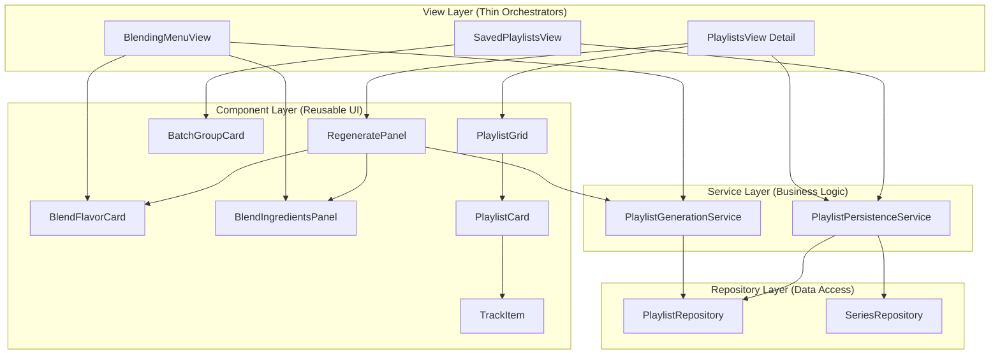

# Playlist Hybrid Refactor - SDD Plan

**Created**: 2025-12-23 22:30
**Status**: 📋 PLAN PHASE - Awaiting Approval
**Sprint**: 12.5
**Depends on**: spec.md (APPROVED)

---

## 1. ARCHITECTURE OVERVIEW

### 1.1 Target Architecture Diagram



### 1.2 File Structure

```
public/js/
├── services/
│   ├── PlaylistGenerationService.js   [NEW ~100 LOC]
│   └── PlaylistPersistenceService.js  [NEW ~120 LOC]
│
├── components/
│   ├── blending/                      [EXISTING - REUSE]
│   │   ├── BlendFlavorCard.js
│   │   └── BlendIngredientsPanel.js
│   │
│   └── playlists/                     [NEW]
│       ├── TrackItem.js               [NEW ~80 LOC]
│       ├── PlaylistCard.js            [NEW ~60 LOC]
│       ├── PlaylistGrid.js            [NEW ~40 LOC]
│       ├── BatchGroupCard.js          [NEW ~70 LOC]
│       └── RegeneratePanel.js         [NEW ~50 LOC]
│
├── views/
│   ├── BlendingMenuView.js            [REFACTOR: remove inline logic]
│   ├── PlaylistsView.js               [REFACTOR: add RegeneratePanel, use components]
│   └── SavedPlaylistsView.js          [REFACTOR: use components]
```

---

## 2. SERVICE LAYER DESIGN

### 2.1 PlaylistGenerationService.js

```javascript
/**
 * Centralized playlist generation logic
 * Extracted from BlendingMenuView + PlaylistsView
 */
export class PlaylistGenerationService {
  /**
   * Generate playlists from albums
   * @param {Album[]} albums - Source albums with tracks
   * @param {GenerationConfig} config - Algorithm, ranking, duration, etc.
   * @returns {GenerationResult} - Playlists with transformed tracks
   */
  generate(albums, config) {
    // 1. Validate config
    // 2. Create algorithm instance
    // 3. Create ranking strategy
    // 4. Generate playlists
    // 5. Transform tracks with spotifyRank, etc.
    // 6. Return result
  }

  /**
   * Transform raw tracks to normalized format
   * Single source of truth for track mapping
   */
  transformTracks(rawTracks) {
    return rawTracks.map(t => ({
      id: t.id,
      title: t.title,
      artist: t.artist,
      album: t.album,
      duration: t.duration,
      rating: t.rating,
      rank: t.rank || t.acclaimRank,
      spotifyRank: t.spotifyRank,
      spotifyPopularity: t.spotifyPopularity
    }))
  }

  /**
   * Validate generation config
   */
  validateConfig(config) {
    const errors = []
    if (!config.algorithmId) errors.push('Algorithm required')
    if (!config.rankingId) errors.push('Ranking strategy required')
    return { valid: errors.length === 0, errors }
  }
}
```

### 2.2 PlaylistPersistenceService.js

```javascript
/**
 * Centralized CRUD operations for playlists
 * Encapsulates PlaylistRepository + SeriesRepository
 */
export class PlaylistPersistenceService {
  constructor(db, cacheManager, userId) {
    this.db = db
    this.cacheManager = cacheManager
    this.userId = userId
  }

  /**
   * Save playlists to Firestore
   * @param {string} seriesId - Parent series ID
   * @param {Playlist[]} playlists - Playlists to save
   * @param {string} batchName - Batch grouping name
   * @param {boolean} preserveIds - If true, keep existing IDs (for regenerate)
   */
  async save(seriesId, playlists, batchName, preserveIds = false) {
    // 1. Ensure parent series exists
    // 2. If preserveIds, update existing docs
    // 3. If not, delete old batch + create new
    // 4. Save playlists with batchName
  }

  /**
   * Load playlists from Firestore
   * @param {string} seriesId
   * @param {string} [batchName] - Optional filter by batch
   */
  async load(seriesId, batchName) {
    const repo = new PlaylistRepository(this.db, this.cacheManager, this.userId, seriesId)
    const all = await repo.findAll()
    return batchName ? all.filter(p => p.batchName === batchName) : all
  }

  async delete(seriesId, playlistId) { /* ... */ }
  async deleteBatch(seriesId, batchName) { /* ... */ }
  async deleteAll(seriesId) { /* ... */ }
}
```

---

## 3. COMPONENT LAYER DESIGN

### 3.1 TrackItem.js

```
┌──────────────────────────────────────────────────────────────────┐
│ ≡ │ Track Title                    3:42 │ #1 ★92 │ #3 78% │     │
│   │ Artist Name • Album Name            │ CHOSEN │ ALT.   │     │
└──────────────────────────────────────────────────────────────────┘
  ↑     ↑                             ↑       ↑         ↑
 drag  info                        duration  LEFT     RIGHT
handle                                     (primary) (secondary)
```

> [!NOTE]
> **Badge Order Rule**: The **LEFT badge** is always the **CHOSEN ranking** (used for generation).
> The **RIGHT badge** is the **ALTERNATIVE ranking** (for reference).
> - If Spotify Popularity chosen → LEFT: Spotify (green), RIGHT: Acclaim (orange)
> - If Acclaim chosen → LEFT: Acclaim (orange), RIGHT: Spotify (green)

**Props:**
- `track`: Track object
- `primaryRanking`: 'spotify' | 'acclaim' (determines badge order)
- `draggable`: boolean (default: true)
- `onRemove`: optional callback

### 3.2 PlaylistCard.js

```
┌──────────────────────────────────────────────────────────────────┐
│ 1. Greatest Hits                     [8 tracks] [33:08]          │
├──────────────────────────────────────────────────────────────────┤
│ ≡ │ In My Life                    2:26 │ #1 ★93 │ #2 85% │       │
│ ≡ │ Black Dog                     4:55 │ #1     │ #1 92% │       │
│ ≡ │ Eleanor Rigby                 2:07 │ #1 ★93 │ #5 71% │       │
│ ...                                                               │
└──────────────────────────────────────────────────────────────────┘
```

**Props:**
- `playlist`: Playlist object
- `index`: number
- `editable`: boolean
- `onNameChange`: callback

### 3.3 RegeneratePanel.js (NEW)

```
┌──────────────────────────────────────────────────────────┐
│ ⚙️ Regenerate Settings                              [▼] │
├──────────────────────────────────────────────────────────┤
│ ┌───────────────────────────────────────────────────┐   │
│ │ [BlendFlavorCard - Algorithm Selector]            │   │
│ └───────────────────────────────────────────────────┘   │
│                                                          │
│ ┌───────────────────────────────────────────────────┐   │
│ │ [BlendIngredientsPanel - Duration/Ranking/Disc]   │   │
│ └───────────────────────────────────────────────────┘   │
│                                                          │
│           [ 🔄 Regenerate Playlists ]                   │
│                                                          │
│ ⚠️ This will replace all tracks but keep playlist IDs   │
└──────────────────────────────────────────────────────────┘
```

**Props:**
- `seriesId`: string
- `batchName`: string (for ID preservation)
- `existingPlaylistIds`: string[] (to preserve)
- `onRegenerate`: callback(playlists)

### 3.4 BatchGroupCard.js

```
┌──────────────────────────────────────────────────────────┐
│ Beatles Collection              [Created: Dec 23, 2024] │
│ ─────────────────────────────────────────────────────── │
│ 📋 Greatest Hits              [8 tracks] [33:08]    [✏️][🗑️]│
│ 📋 Deep Cuts Vol. 1           [8 tracks] [27:17]    [✏️][🗑️]│
│ 📋 Deep Cuts Vol. 2-3         [12 tracks] [40:46]   [✏️][🗑️]│
│ ─────────────────────────────────────────────────────── │
│ [Edit Batch]  [Delete Batch]                 [View All] │
└──────────────────────────────────────────────────────────┘
```

---

## 4. VIEW REFACTOR PLAN

### 4.1 PlaylistsView.js (Detail)

**Before (896 LOC):**
- Inline generation logic
- Inline track rendering
- Inline Firestore save

**After (~300 LOC):**
```javascript
// PlaylistsView.js
import { PlaylistGenerationService } from '../services/PlaylistGenerationService.js'
import { PlaylistPersistenceService } from '../services/PlaylistPersistenceService.js'
import { RegeneratePanel } from '../components/playlists/RegeneratePanel.js'
import { PlaylistGrid } from '../components/playlists/PlaylistGrid.js'

render() {
  return `
    ${RegeneratePanel.render({ ... })}
    ${PlaylistGrid.render({ playlists })}
    ${ExportSection.render()}
  `
}

async handleRegenerate(config) {
  const genService = new PlaylistGenerationService()
  const result = genService.generate(albums, config)
  
  // Preserve existing IDs
  result.playlists.forEach((p, i) => {
    p.id = this.existingPlaylistIds[i]
  })
  
  // Update store
  playlistsStore.setPlaylists(result.playlists, seriesId)
}

async handleSave() {
  const persistService = new PlaylistPersistenceService(db, cache, userId)
  await persistService.save(seriesId, playlists, batchName, true)
}
```

### 4.2 BlendingMenuView.js

**Before (515 LOC):** Inline generation logic
**After (~300 LOC):** Uses services, components already extracted

### 4.3 SavedPlaylistsView.js

**Before (667 LOC):** Inline rendering, repo calls
**After (~200 LOC):** Uses BatchGroupCard, PersistenceService

---

## 5. VERIFICATION PLAN

### 5.1 Manual UAT Tests

| Test | Steps | Expected |
|------|-------|----------|
| **Regenerate preserves IDs** | 1. Edit batch 2. Regenerate 3. Save 4. Check Firestore | Same playlist doc IDs |
| **TrackItem badges** | View any playlist | Orange Acclaim, Green Spotify badges |
| **Drag & Drop** | Drag track between playlists | Track moves, order persists |
| **Export Spotify** | Click Export to Spotify | Opens Spotify modal |
| **Export Apple** | Click Export to Apple | Downloads M3U file |
| **Delete Playlist** | Delete single playlist | Removed from view and Firestore |
| **Delete Batch** | Delete batch | All playlists in batch removed |

### 5.2 Code Review Checklist

- [ ] No inline repository instantiation in views
- [ ] All track rendering uses TrackItem component
- [ ] PlaylistsView < 350 LOC
- [ ] SavedPlaylistsView < 250 LOC
- [ ] BlendingMenuView < 350 LOC
- [ ] Services have JSDoc

---

## 6. IMPLEMENTATION ORDER

```
Phase 1: Services (Logic)
│
├── 1.1 Create PlaylistGenerationService.js
├── 1.2 Create PlaylistPersistenceService.js
├── 1.3 Refactor BlendingMenuView to use services
└── 1.4 Refactor PlaylistsView to use services

Phase 2: Components (UI)
│
├── 2.1 Create TrackItem.js
├── 2.2 Create PlaylistCard.js
├── 2.3 Create PlaylistGrid.js
├── 2.4 Create RegeneratePanel.js (reuses BlendFlavorCard, BlendIngredientsPanel)
├── 2.5 Create BatchGroupCard.js
└── 2.6 Migrate views to use components

Phase 3: Integration & Testing
│
├── 3.1 Update PlaylistsView with RegeneratePanel
├── 3.2 ID preservation logic
├── 3.3 Manual UAT all 13 FR
└── 3.4 LOC count verification (NFR)
```

---

## 7. RISKS & MITIGATIONS

| Risk | Mitigation |
|------|------------|
| Breaking exports | Test each export after refactor |
| ID mismatch on regenerate | Explicit ID mapping before save |
| Component props drift | TypeScript-like JSDoc for props |

---

## 8. APPROVAL

**Plan Status**: 📋 AWAITING USER APPROVAL

- [ ] User approves architecture
- [ ] User approves component design
- [ ] User approves implementation order

> [!IMPORTANT]
> After approval, we proceed to **Tasks Phase** (tasks.md) with granular implementation checklist.
